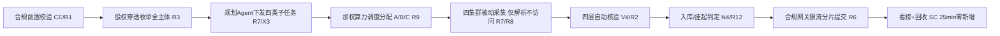

# AICoding 架构设计 · UserStory

> 本文档为《AICoding 架构设计》核心产物之一，定位为**产品需求与用户故事（UserStory）**，由 `product-story-designer`（顾全景）在 Phase 4 / G4 阶段产出。
> 上游输入：《高层架构设计》（G3 已审核通过，四层架构边界、X3 四类子任务、X4 A 类术语、MVP 范围 R1–R11+R12 基础、R1–R15 需求池、五类核心角色均已冻结）。
> 下游输出：驱动《系统设计》《部署设计》《安全设计》的具体功能实现与验收基线。
> 本文档严格遵循高层架构已冻结的范围、角色、场景与功能边界，不越权重定义模块边界（归 system-architect）、部署（归 platform-architect）、安全纵深（归 security-architect）。

---

## 1. 业务背景与价值

### 1.1 业务背景

- **行业**：国家级网络安全赛事（AI 安全 / 人机协同情报赛道），500+ 队伍同台竞争，评分以加权净得分（WNSR）为主、同分参考完成时间 / 解题数量 / 错误提交次数 / API 调用效率。
- **产品**：企业被动信息搜集 Agent（PassiveInfoAgent）——纯被动、合规、可审计地批量采集企业数字资产情报，并生成资产关联图谱。
- **用户规模**：服务于五类角色（详见 §4.1）——甲方决策者（产品战略主理人 / 赛道负责人）、操作方 / 赛事值守、落地用户（政企安全团队，决赛叙事）、评委 / 专家、合规 / 运维（SRE）。单赛事环境运行，非多租户商用产品。
- **触发事件**：本期由"冲击国家级特等奖"的产品战略驱动启动；以零违规、零封禁为生死线，在测试赛—初赛—决赛三阶段递进达成 WNSR ≥ 100%（+15% 安全垫）。
- **本系统在产品矩阵中的位置**：参赛作品核心，承载 L1–L4 四层闭环；向上对齐北极星 WNSR ≥ 100%，向下驱动系统设计 / 部署设计 / 安全设计 / UserStory 四份下游文档。

### 1.2 行业方案

同类功能、痛点的行业标杆系统及解决方案（源自高层架构 §3.1 / research_report，G2 已审核）：

- **FOFA / Shodan**：被动资产测绘 SaaS（全球分布式资产搜索引擎 + AI 指纹 / 每周全网爬取索引），可作 L3 可选被动 API 数据源（仅只读查询、禁用主动扫描）。
- **OWASP Amass**：100+ 被动数据源的开源侦察执行器（crt.sh / 被动 DNS / 公开 API），对应 L3 C1 执行器底座，主动模块须被 R1 前置禁用。
- **Neo4j**：原生属性图数据库（Cypher/GQL + GDS 65+ 算法），对应 L4 N4 图谱底座。
- **Maltego**：OSINT 关联分析（120+ 数据伙伴 + Transforms 枢纽 + 关联图），仅借鉴「实体-关系关联图 + 多源 Pivot + 研判呈现」方法论。
- **AegisFlow**：Agent 运行时治理 / 合规网关范式（ActionEnvelope + allow/review/block + 哈希链证据 + fail-closed），L1 控制面范式借鉴，代码 100% 自研（避免决赛源码核验抄袭判定）。
- **主动探测侦察（Nmap 等）**：整体否决——主动端口扫描 / TCP 发包 / 主动 HTTP 探测本质违反本项目「纯被动」红线，无论技术成熟度与成本多优均不借鉴。

**差异化**：本系统是赛道唯一"被动情报采集 + 资产关联图谱 + 加权算力调度"品类；资产图谱推理补全、全链路人机分级审批、频限感知加权调度为独占创新点。

### 1.3 方案收益与价值

| 项 | 说明 |
| --- | --- |
| 功能模块 | L1 合规网关（R1/R4/R6/R9）/ L2 规划 Agent（R3 拆解）/ L3 四集群（R7/R8）/ L4 四层校验+图谱（R2/R12/R10）/ 运营看板（R11/R5） |
| 预期价值收益 | 零违规零封禁保命 + 加权冲分 WNSR ≥ 100% + 9 类维度高覆盖 + 全链路可审计可溯源 |
| 量化标准 | 合规安全率 100%（违规=0 / 封禁=0）；WNSR ≥ 100%（安全垫 15%）；资产覆盖率 测试 ≥50% / 初赛 ≥70% / 决赛 ≥90%；无效情报率 测试 ≤10% / 初赛 ≤5% / 决赛 ≤2%；面板交互响应 P99 ≤ 2s |

### 1.4 术语清单

> 与高层架构及 system-architect 术语表对齐（X4 已统一术语，主理人授权）。

- **PassiveInfoAgent / 企业被动信息搜集 Agent**：本系统。
- **纯被动（Passive-only）**：仅使用被动数据源，禁止端口扫描 / TCP 发包 / 主动 HTTP 探测（红线，违规=0 即清零、封禁=0 即停摆）。
- **WNSR（加权净得分达成率）**：累计净加权得分 ÷ 特等奖门槛得分 × 100%；北极星指标，目标 ≥ 100%（待确认 #2 分母规则发布后回填）。
- **A 类高价值标签（X4 统一术语）**：「工控 / 政务 / 能源高价值」集合，权重 3.0 / 算力 60%（原 D0「工控/政务」与 D1「电网/矿山/政务」已统一，权重 60% 不变）。
- **B 类**：主站 / 公众号等普通企业，权重 1.5 / 算力 30%。
- **C 类**：长尾旁站等，权重 0.5 / 算力 10%。
- **四层架构**：L1 合规网关（GW/CE/AP/SC）/ L2 规划 Agent（PL/DS/BL/XC）/ L3 四大采集集群（C1 Web / C2 公众号 / C3 小程序 / C4 工商股权）/ L4 四层核验知识库（N4/V4/EX）。
- **X3 四类子任务（已冻结）**：规划 Agent（DS）显式下发 Web / 公众号 / 小程序 / 工商股权 四类采集子任务，与 R7 四类集群口径一致。
- **四层自动校验流水线（V4 / R2）**：工商匹配 → DNS 仅解析不访问 → 时间过滤（>1 年）→ 多源 ≥2 入库。
- **三级人机审批（AP / R4）**：低危自动 / 中危入库+提醒 / 高价值工控政务人工复核。
- **频控硬闸 buffer ≤ 95%**：API 提交频控上限，严禁打满（超限即封禁）。
- **断点续跑**：任务快照零丢失，重启即恢复。
- **看榜倾斜**：每 5min 看榜，按 A60/B30/C10 倾斜算力，零新增 25min 回收（回收阈值主理人裁决 = 25min，#1 已裁决）。

---

## 2. 范围与边界

### 2.1 系统内模块及功能（一级功能清单）

对齐高层架构 §6.3 F1–F16，系统内部建设的一级模块如下：

- **L1 合规网关**：R1 全局合规拦截引擎、R4 三级审批 + 断点续跑面板、R6 赛事 API 代理网关、R9 加权算力调度控制器。
- **L2 规划 Agent**：R3 全主体枚举 / 股权穿透（主体拆解）。
- **L3 采集集群**：R7 多源被动采集调度层、R8 多源容错降级。
- **L4 核验与图谱**：R2 四层自动校验流水线、R12 资产关联图谱（基础版 MVP / 推理补全 完整版）、R10 合规可审计日志。
- **运营看板 / 审计**：R11 度量看板 / 战报、R5 开源留档与自研边界标注。
- **完整版延后（归决赛）**：R13 第三方平台接入、R14 多模态关联推理 / 政企巡检 / 研判大屏、R15 批量编排与战报复盘。

### 2.2 系统外模块及功能

对齐高层架构 §6.1 Out-of-Scope，本系统**不做**以下功能：

- **O1 主动探测 / 端口扫描 / TCP 发包 / 主动 HTTP 探测**：违反纯被动红线（违规探测=0 即清零），永远不做；由 R1 全局合规拦截引擎前置禁用。
- **O2 攻击性 / 渗透类安全能力**：Non-goals 明确不做（D0§8③）。
- **O3 通用商用情报平台（产品化）**：仅参赛作品 + 政企巡检演示叙事（D0§8④），不做多租户商用产品。
- **O4 R12 推理补全 / 盲区补源智能推理**：依赖 GDS + LLM 算力与工期，MVP 不具备，归决赛自研重构。
- **O5 R14 多模态关联推理 / 政企常态化巡检 / 研判大屏完整版**：依赖 R12 + 多模态算力，归决赛。
- **O6 R15 完整战报复盘（丢分 / 违规根因定位）**：初赛仅做简化批量编排，归决赛。
- **D1 采购 FOFA / Shodan 被动 API 订阅**（待确认 #7）：涉及外部低额订阅与预算，可逆待裁决；初赛以开源执行器为主，是否采购由业务方裁决。
- **D2 工商股权穿透层级上限固化**（待确认 #6）：穿透 N 层待确认；先实现可配置层数，待主理人确认后冻结。

### 2.3 外部依赖

| 依赖系统 | 提供方 | 依赖能力 | 接入方式 | 接口人 |
| --- | --- | --- | --- | --- |
| 开源采集执行器（Amass / Subfinder / OneForAll / crt.sh） | 开源社区 | 被动源枚举 | CLI / API 封装 | 采集开发团队（R5 留档） |
| FOFA / Shodan 被动 API（可选） | 第三方 SaaS | 被动查询增强 | REST API | 待裁决 #7 |
| 工商股权 API（爱企查 / ENScan_GO） | 第三方 | 股权数据 | REST / SDK | 数据层团队 |
| LLM 服务（闭源强模型） | 外部厂商 | 规划推理 | API | 中枢团队 |
| Neo4j（Community / AuraDB Free） | 开源 | 图存储 / 推理 | Bolt 驱动 | 数据层团队 |
| 多出口 IP 资源 | 自筹 / 待确认 #7 | 提交出口轮换 | 代理池 | 赛事人工值守 |
| 赛事提交 API | 赛事平台 | 题目 / 环境 / 提交 / 排名 | REST API（经 R6 代理） | 平台方 |

---

## 3. 功能清单

> **定位**：全景骨架表，进入"角色 / 场景 / US"之前先看到完整功能版图；与高层架构 §6.3（F1–F16）互查一致。

### 3.1 功能清单结构

| 一级模块 | 二级模块 | 功能项 | 优先级（P0/P1/P2） | MVP 范围 | 完整版范围 | 备注 |
| --- | --- | --- | --- | --- | --- | --- |
| L1 合规网关 | 全局合规拦截 | R1 全局合规拦截引擎（出站前置拦截、主动动作零放行、fail-closed） | P0 | ✅ | ✅ | 72h 压测违规=0 / 封禁=0（V1） |
| L4 核验 | 四层自动校验 | R2 四层自动校验流水线（工商匹配 / DNS 仅解析 / 时间过滤 / 多源≥2） | P0 | ✅ | ✅ | 每层可独立开关与计数（V4） |
| L2 规划 / L3 | 主体枚举 | R3 全主体枚举与股权穿透（母+子+分全量、层数可配置，默认≥3） | P0 | ✅ | ✅ | 对齐 V3；待确认 #6 |
| L1 人机 | 审批与续跑 | R4 三级人机审批 + 断点续跑面板（低危自动 / 中危入库+提醒 / 高价值工控政务人工复核） | P0 | ✅ | ✅ | 对齐 V1 / V5 |
| L1 / 审计 | 开源留档 | R5 开源工具留档与自研边界标注（台账 + 决赛一键出具核验证明） | P0 | ✅ | ✅ | 决赛自研≥70%/开源≤30%（V1 源码核验） |
| L1 网关 | API 代理 | R6 赛事 API 代理网关（多 IP 轮询 + buffer≤95% + 排队 + 分片提交） | P0 | ✅ | ✅ | 对齐 V1；待确认 #7 |
| L3 采集 | 采集调度 | R7 多源被动采集调度层（封装四类集群，每类≥2 被动源，单企业闭环） | P1 | ✅ | ✅ | 对齐 V3；X3 四类子任务 |
| L3 容错 | 容错降级 | R8 多源容错降级（热切换备用源，全源不可用挂起告警不阻断全局） | P1 | ✅ | ✅ | 对齐 V3 |
| L1 调度 | 算力调度 | R9 加权算力调度控制器（60:30:10、每 5min 看榜、25min 零新增回收） | P1 | ✅ | ✅ | 对齐 V2；#1 已裁决 25min |
| 基础能力 | 审计日志 | R10 合规可审计日志（全链路时间戳/主体/动作/数据源/合规判定） | P1 | ✅ | ✅ | 对齐 V1 |
| 运营看板 | 度量战报 | R11 度量看板 / 战报（实时 WNSR + 6 支撑 + 红线，每 5min 刷新） | P1 | ✅ | ✅ | 对齐 V2；待确认 #2 |
| L4 图谱 | 资产图谱 | R12 基础：企业-子-域-号-程序全关联拓扑入库 | P2 | ✅ | ✅ | 对齐 V3 |
| L4 图谱 | 推理补全 | R12 推理：图谱推理补全与盲区补源（GDS + LLM） | P2 | ❌ | ✅ | 归决赛；待确认 #3 |
| L3 接入 | 第三方接入 | R13 第三方平台接入（≥3 类被动源独立上下线） | P2 | ❌（初赛可选） | ✅ | 归决赛；待确认 #7 |
| 运营创新 | 多模态研判 | R14 多模态关联推理 / 政企巡检 / 研判大屏 | P2 | ❌ | ✅ | 归决赛；待确认 #3/#4/#8 |
| 运营复盘 | 批量编排 | R15 批量编排与战报复盘（多企业编排 + 根因定位） | P2 | ❌（简化✅） | ✅ | 归决赛 |

> **互查结论**：本表功能项与高层架构 §6.3（F1–F16）一一对应；P0 功能（F1–F6 对应 R1–R6）全部 ✅ MVP；P2 延后项（F13–F16）明确标注「归决赛」。MVP 功能清单总数与高层架构冻结值一致，未新增或削减。

#### 3.1.1 阶段内中间确认自检（§3 完成后，协议 §2.4）

- **§2.1 方案分歧判定**：功能优先级（P0/P1/P2）与 MVP / 完整版范围全部由高层架构 §6.3 冻结（F1–F6 为 P0 全 ✅ MVP；F13–F16 归完整版）。本阶段未引入 ≥2 种需裁决的替代方案。**不触发**。
- **§2.3 反向验证 3 问**：
  - Q1（返工成本）：返工范围 = §3 功能清单表；切换成本 ≈ 0.5 人日（仅调整标记，不重构）。**证据**：功能项与 F1–F16 一一映射，结构已冻结。
  - Q2（用户 / 客户 / 监管可感知）：操作方 / 评委可见的初赛能力由 R1–R11 固定，本表未新增或削减任何对外功能。**证据**：In-Scope 与 R1–R11 一一对应。
  - Q3（与用户原始诉求一致性）：直接引用高层架构 §6.3 功能清单（已冻结）。**证据**：D0§6 需求池 P0/P1/P2 已固定各功能归属。

---

## 4. 角色与场景

### 4.1 角色清单

| 角色 | 业务身份 | 主要操作 | 核心关注点 |
| --- | --- | --- | --- |
| 甲方决策者：产品战略主理人 / 赛道负责人 | 产品战略团队（方向明 / 齐构成） | 看板审阅、里程碑把控、资源调度裁决 | 特奖达成率（WNSR ≥ 100% + 15% 安全垫）与零违规底线是否守住 |
| 最终用户 A：操作方 / 赛事值守 | 一线操作与人工值守 | 人机协同面板操作、三级审批、算力临时上调、断点续跑 | 断点续跑零丢失 + 三级复核效率，避免任务重来 / 高价值工控政务漏审 |
| 最终用户 B：落地用户（政企安全团队，决赛叙事） | 政企资产安全负责人 | 全主体枚举、资产图谱查询、巡检报告获取 | 母公司 + 全资 / 控股子 + 分公司全量零误报覆盖与可审计对接 |
| 受影响方：评委 / 专家（决赛源码核验） | 赛事评审 | 源码核验 + 结构化日志审查 | 自研 / 开源边界可证明、零主动探测可被证据链证实 |
| 受影响方：合规 / 运维（SRE） | 合规与运维保障 | 审计监控、告警响应、可用性保障 | 全链路可审计留痕 + 系统可用性（封禁=0 停摆风险） |

> **硬指标**：≥ 3 类角色（甲方决策者 / 最终用户 / 受影响方各至少一行）；每行含"核心关注点"，未写笼统"使用方便"。本表 5 类角色，均对齐高层架构 §2.1 角色关注点。

### 4.2 关键场景清单

| 编号 | 角色 | 触发条件 | 期望结果 | 频率（日均 / 周期） |
| --- | --- | --- | --- | --- |
| S1 | 评委 / 专家 | 决赛现场源码核验 | 一键出具自研 / 开源边界证明 + 结构化合规日志，零主动探测可证 | 决赛 1 次 |
| S2 | 落地用户（政企） | 输入企业全称发起枚举 | 输出母 + 子 + 分全量主体 + 资产图谱 + 巡检报告，零误报 | 决赛演示 / 按需 |
| S3 | 操作方 | 日常赛事值守（看榜） | 面板实时展示合规态势 / WNSR / 审批队列，高价值工控政务置顶复核 | 每 5min 刷新 |
| S4 | 质量可信 | 四集群采集产出情报 | 经四层校验后入库或挂起，无效情报被筛除 | 持续（采集即校验） |
| S5 | 连续性（操作方） | 单源失效 / 子任务失败 / 崩溃重启 | 热切换备用源、断点续跑零丢失、全源不可用挂起告警不阻断全局 | 偶发 / 按需 |
| S6 | 冲分（操作方 / 主理人） | 每 5min 看榜 | 按 A60/B30/C10 倾斜算力，零新增 25min 回收，WNSR 可见上升 | 每 5min |
| S7 | 全体 / 合规 | 出站动作 / API 提交 | 全局合规拦截零放行主动动作；API 代理多 IP 轮询 + buffer≤95% 封禁=0 | 持续 |
| S8 | 主理人 / 产品战略 | 阶段复盘 | 度量看板 / 战报导出（WNSR + 6 支撑 + 红线） | 每日 / 每周 / 阶段 |

#### 4.2.1 阶段内中间确认自检（§4 完成后，协议 §2.4）

- **§2.1 方案分歧判定**：五类核心角色由高层架构 §2.1 冻结（甲方决策者 / 最终用户 A / 最终用户 B / 受影响方评委 / 受影响方合规运维），本阶段未进一步细分（不拆"管理员 / 合规管理员"等子角色），不影响 §3 功能归属与下游模块边界。**不触发**。
- **§2.3 反向验证 3 问**：
  - Q1（返工成本）：返工范围 = §4 角色 / 场景表；切换成本 ≈ 0.5 人日（重填表格，不波及模块设计）。**证据**：角色清单为职责描述，无实体代码。
  - Q2（用户 / 客户 / 监管可感知）：角色清单为内部职责划分，用户 / 评委可见的是能力（R1–R15）而非角色命名，未新增对外承诺。**证据**：角色 Top1 关心点与高层架构 §2.1 完全一致。
  - Q3（与用户原始诉求一致性）：直接引用高层架构 §2.1 角色关注点（已冻结）。**证据**：D0§2 用户故事 US-1~US-5 与 D0§9.3 利益相关者三视角已显式给定五类角色。

---

## 5. 用户旅程（UserStory）

> 每条 UserStory 按 §5.1.1 ~ §5.1.7 七段式（业务场景 / 业务流程 / UE 原型 / 业务逻辑 / 数据描述 / 验收标准 AC / 外部集成接口）完整展开。
> **范围标记**：US-1~US-8 属 MVP（R1–R11 + R12 基础）；US-9~US-12 属完整版（归决赛，标注「归决赛」）。
> **待确认项**：#2 特等奖门槛得分 / #3 决赛多模态范围 / #4 政企巡检深度 / #6 股权穿透层数 / #7 多出口 IP / #8 研判大屏受众——本阶段不裁决，在相关 US 以「待确认」标注并给备选验收标准。

### 5.0 单企业九步闭环（全 US 主干）

---

### 5.1 US-1：评委 / 专家 — 源码核验与自研边界证明

#### 5.1.1 业务场景

- **视角**：评委 / 专家（受影响方，决赛源码核验）。
- **描述逻辑**：决赛答辩现场，评委需要确认本系统 100% 自研中枢 + 仅启用被动源的开源执行器，且零主动探测可被证据链证实。When：决赛答辩现场；Where：评委核验入口 / 合规审计视图（R10）。

#### 5.1.2 业务流程

- **视角**：评委。
- **Given** 评委进入核验入口并选择「出具自研 / 开源边界证明」；**When** 系统读取 R5 台账与 R10 全链路合规日志并生成证明包；**Then** 导出包含每个第三方开源工具（名称 / 版本 / 许可证 / 用途 / 调用边界）的台账，并附结构化合规日志（时间戳 / 主体 / 动作 / 数据源 / 合规判定）；**Then** 证明 L1 中枢 100% 自研 + 开源执行器仅启用被动源、零主动动作。

#### 5.1.3 UE 原型

- 自研 / 开源标注页（M7）：导出台账与证明按钮。
- 合规审计视图（R10）：按企业 / 时间 / 违规类型组合检索导出。

#### 5.1.4 业务逻辑

- R5 台账服务读取各工具留档元数据 → R10 日志服务检索全链路动作 → 生成核验证明包（含自研占比统计，按需求模块 R1–R15 口径，#5 已裁决）→ 导出 ProofBundle。

#### 5.1.5 数据描述

- ToolRegistry（工具留档：name/version/license/usage/boundary）→ ComplianceLog（合规日志：ts/subject/action/datasource/decision）→ ProofBundle（证明包：selfDevRatio / passiveOnlyFlag / zeroActiveFlag）。

#### 5.1.6 验收标准 AC

- **正常路径**：Given 评委请求出具证明 When 系统生成证明包 Then 包含每个第三方开源工具名称 / 版本 / 许可证 / 用途 / 调用边界，且自研占比 ≥ 70% / 开源 ≤ 30%（决赛口径）可一键出具。
- **异常路径（未留档）**：Given 存在未留档的开源工具 When 生成证明 Then 系统拦截并提示「存在未留档工具，禁止出具证明」，阻断导出。
- **红线异常**：Given 合规日志含任一主动动作记录（端口扫描 / TCP 发包 / 主动 HTTP 探测）When 审查 Then 该记录被标记为违规候选并阻断「零主动探测」证明，触发告警。

#### 5.1.7 外部集成接口

- 无外部系统依赖，纯内部 R5 / R10 服务；决赛源码核验由评委本地访问源码仓库（不在系统内，属交付材料）。

---

### 5.2 US-2：落地用户（政企）— 全主体资产枚举与资产图谱查询 / 巡检报告

#### 5.2.1 业务场景

- **视角**：落地用户（政企安全团队，决赛叙事）。
- **描述逻辑**：政企安全负责人输入目标企业全称，系统枚举母公司 + 全资 / 控股子 + 分公司全量主体，并生成资产关联图谱与巡检报告。When：决赛政企巡检演示；Where：资产图谱视图（R12 基础）+ 巡检报告导出。

#### 5.2.2 业务流程

- **Given** 用户输入企业全称并提交枚举；**When** R3 枚举引擎调用工商股权 API（爱企查 / ENScan_GO）执行穿透；**Then** 输出全主体清单（母 + 子 + 分）并可分发采集集群；**Then** 采集后资产以企业-子-域-号-程序拓扑入库（N4）；**Then** 生成巡检报告。

#### 5.2.3 UE 原型

- 资产图谱视图（R12 基础）：企业关联拓扑下钻 / 盲区标识。
- 巡检报告页：样例报告导出（决赛演示级）。

#### 5.2.4 业务逻辑

- R3 枚举 → 股权穿透（可配置层数，默认 ≥3，待确认 #6）→ 主体清单 → 采集集群分发（C1–C4）→ 四层校验（V4）→ N4 入库 → 报告生成（R14 政企巡检，待确认 #4）。

#### 5.2.5 数据描述

- EnterpriseEntity（企业主体）→ EquityEdge（股权关系：parent/child/branch）→ AssetNode（资产节点：域名 / 公众号 / 小程序 / 工商 / 工控）→ InspectionReport（巡检报告：coverage/accuracy/blindSpot）。

#### 5.2.6 验收标准 AC

- **正常路径**：Given 输入有效企业全称 When 枚举完成 Then 输出母公司 + 全资 / 控股子公司 + 分公司全量主体清单，覆盖率达阶段目标（测试 ≥50% / 初赛 ≥70% / 决赛 ≥90%）。
- **待确认路径（#6 股权穿透层数）**：Given 股权穿透层数配置 When 执行 Then 至少覆盖 N 层（待确认 #6；**备选验收标准**：默认 ≥3 层且层数可配置，落库后可导出供采集集群分发）。
- **异常路径（源超时）**：Given 某主体工商 API 超时 When 枚举 Then 该主体标记「枚举待补」并触发盲区补源（BL），不中断全量枚举。
- **异常路径（无效输入）**：Given 输入无效企业全称 When 提交 Then 返回「无法解析主体」并阻断枚举。

#### 5.2.7 外部集成接口

- 工商股权 API（爱企查 / ENScan_GO，REST / SDK，频控）；Neo4j Bolt 入库；
- **待确认 #6**：股权穿透层级上限固化前先实现可配置层数，待主理人确认后冻结。

---

### 5.3 US-3：操作方 — 人机协同面板值守（合规态势 / 审批 / 续跑 / 看榜 / 标注）

#### 5.3.1 业务场景

- **视角**：操作方 / 赛事值守（最终用户 A）。
- **描述逻辑**：操作方在赛事值守期间使用人机协同面板（M1–M7）监控合规态势、处理三级审批、断点续跑、看榜倾斜、导出自研标注。When：赛事全程值守；Where：人机协同操作面板（R4）。

#### 5.3.2 业务流程

- **Given** 操作方登录面板；**When** 查看 M1 合规态势卡 Then 实时展示违规=0 / 封禁=0 / 频控≤95% 绿区；**When** M3 审批队列出现高价值工控政务情报 Then 强制人工复核（不可跳过）；**When** 任务中断 Then M4 任务看板支持断点续跑零丢失；**When** 操作方在 M6 看榜页 Then 可临时上调高价值算力。

#### 5.3.3 UE 原型

- M1 合规态势卡 / M2 加权得分卡 WNSR / M3 审批队列 / M4 任务看板 / M5 容错日志 / M6 看榜与算力倾斜 / M7 自研 / 开源标注（七页面）。

#### 5.3.4 业务逻辑

- 面板聚合 CE 合规状态 + SC 算力 + AP 审批 + R10 日志 + V4 校验结果 → 前端渲染；审批动作经 AP 三级策略路由（低危自动 / 中危入库+提醒 / 高价值工控政务人工复核）。

#### 5.3.5 数据描述

- UIState（前端状态）← 后端聚合（ComplianceStatus / WNSR / ApprovalQueue / TaskProgress）→ UserAction（审批 / 续跑 / 算力上调）。

#### 5.3.6 验收标准 AC

- **正常路径（高价值复核）**：Given 高价值工控政务情报进入审批队列 When 操作方尝试一键通过 Then 系统强制要求人工复核且记录复核人，未复核不得提交。
- **正常路径（断点续跑）**：Given 任务进程中断重启 When 操作方点击续跑 Then 进度从最近快照恢复，零丢失。
- **性能路径**：Given 任意面板交互 When 操作到呈现 Then P99 ≤ 2s。
- **异常路径（空队列）**：Given 审批队列为空 When 刷新 Then 显示「无待办」且面板不报错。

#### 5.3.7 外部集成接口

- 无外部系统依赖，纯内部聚合各 L1–L4 服务（CE / SC / AP / R10 / V4 / N4）。

---

### 5.4 US-4：质量可信 — 四层自动校验流水线

#### 5.4.1 业务场景

- **视角**：质量可信（最终用户 / 受影响的评委）。
- **描述逻辑**：每批采集情报经四层自动校验（R2）后入库或挂起，确保无效情报被筛除、零主动探测痕迹。When：四集群产出情报即时；Where：四层自动核验流水线（V4 / R2）。

#### 5.4.2 业务流程

- **Given** 采集集群（C1–C4）产出原始情报；**When** 进入 V4 流水线；**Then** 层①工商匹配剔除非目标主体 → 层②DNS 仅解析不访问做被动存活校验 → 层③过滤 >1 年过期情报 → 层④≥2 源佐证方入库，单源自动挂起。

#### 5.4.3 UE 原型

- 校验流水线监控页：每层独立开关 + 计数展示。

#### 5.4.4 业务逻辑

- V4 四层串行校验，每层可独立开关与计数，结果写入 N4 + R10 日志；单源情报挂起并标记为待补源。

#### 5.4.5 数据描述

- RawIntel（原始情报）→ Layer1~4 校验 → ValidatedIntel（入库）/ SuspendedIntel（挂起：reason=源不足 | 过期 | 不匹配）。

#### 5.4.6 验收标准 AC

- **正常路径（多源佐证）**：Given 一条情报 ≥2 个被动源佐证且未过期 When 进入层④ Then 入库 N4 且无效情报率 ≤ 阶段阈值（测试 ≤10% / 初赛 ≤5% / 决赛 ≤2%）。
- **边界路径（单源）**：Given 一条情报仅 1 个被动源佐证 When 进入层④ Then 自动挂起不入库，记录挂起原因。
- **正常路径（过期）**：Given 情报时间 >1 年 When 进入层③ Then 过滤剔除。
- **红线异常**：Given 情报含主动 HTTP 探测痕迹 When 校验 Then 标记违规候选并阻断入库 + 告警。

#### 5.4.7 外部集成接口

- DNS 被动解析（公共解析器，仅解析不访问）；工商匹配依赖 R3 主体库；无主动外部调用。

---

### 5.5 US-5：连续性 — 多源被动采集调度与容错降级 + 断点续跑

#### 5.5.1 业务场景

- **视角**：操作方 / 系统与连续性保障（最终用户 A）。
- **描述逻辑**：系统驱动四集群（C1–C4）按规划 Agent 下发的四类子任务（R7 / X3）被动采集，遇单源失效热切换（R8），崩溃重启断点续跑零丢失。When：单企业闭环运行；Where：任务看板（M4）/ 容错日志（M5）。

#### 5.5.2 业务流程

- **Given** 规划 Agent（DS）下发四类子任务；**When** R7 调度层封装四类集群每类 ≥2 被动源；**Then** 单企业闭环可跑通；**When** 某被动源失败 Then R8 热切换备用源；**When** 全源不可用 Then 挂起告警不阻断全局；**When** 进程崩溃重启 Then 从快照断点续跑。

#### 5.5.3 UE 原型

- 任务看板（M4）：子任务状态 / 断点续跑 / 盲区补源。
- 容错日志（M5）：多源切换 / 挂起告警检索。

#### 5.5.4 业务逻辑

- DS → C1–C4 → V4；R8 监控源健康 → 热切换；R4 任务快照（进度实时入库）→ 重启恢复。

#### 5.5.5 数据描述

- TaskSnapshot（进度 / 状态，实时入库）↔ SourceHealth（源健康度）→ FailoverEvent（热切换）/ SuspendEvent（挂起告警）。

#### 5.5.6 验收标准 AC

- **正常路径（闭环）**：Given 单企业四类子任务下发 When 运行 Then 四集群并行被动采集（仅解析不访问）闭环跑通。
- **正常路径（容错）**：Given 集群某被动源失效 When 采集 Then R8 自动切换备用源，采集不中断。
- **异常路径（全源不可用）**：Given 某类全部被动源不可用 When 触发 Then 该类挂起并告警，其余三类继续，不阻断全局。
- **正常路径（续跑）**：Given 进程崩溃重启 When 恢复 Then 从最近快照续跑，进度零丢失。

#### 5.5.7 外部集成接口

- 开源执行器（Amass / Subfinder / OneForAll / crt.sh）CLI / API 封装，仅被动源白名单；外部源无主动调用。

---

### 5.6 US-6：冲分 — 加权算力调度（A60/B30/C10 + 看榜倾斜 + 25min 回收）

#### 5.6.1 业务场景

- **视角**：操作方 / 主理人（冲分）。
- **描述逻辑**：通过每 5min 看榜，按 A60/B30/C10 倾斜算力，零新增 25min 回收，最大化 WNSR。When：每 5min 看榜；Where：看榜与算力倾斜页（M6）/ 加权得分卡（M2）。

#### 5.6.2 业务流程

- **Given** 每 5min 看榜快照；**When** SC 加权算力调度控制器运行；**Then** 按 A 类（工控 / 政务 / 能源高价值）60% / B 类 30% / C 类 10% 分配算力；**When** 某任务零新增达 25min Then 回收算力；**When** 高价值工控政务需临时上调 When 操作方在 M6 手动上调。

#### 5.6.3 UE 原型

- 看榜与算力倾斜页（M6）：每 5min 看榜快照 + 人工临时上调入口。
- 加权得分卡（M2）：WNSR + 安全垫 + A/B/C 环形图。

#### 5.6.4 业务逻辑

- SC 读取看榜（WNSR / 各主体得分）→ 按权重配比分配算力 → 25min 回收策略 → 反馈采集集群（C1–C4）。

#### 5.6.5 数据描述

- WNSRSnapshot（每 5min）→ ComputeAllocation（A/B/C 配比）→ RecycleEvent（零新增 25min 回收）。

#### 5.6.6 验收标准 AC

- **正常路径（配比）**：Given 看榜刷新 When SC 分配 Then A:B:C = 60:30:10，较均匀分配加权总分提升约 +59%。
- **正常路径（回收，#1 已裁决）**：Given 某任务零新增达 25min When 监控 Then 自动回收算力（主理人裁决 #1 = 25min）。
- **正常路径（上调）**：Given 高价值工控政务情报 When 操作方 M6 上调 Then 该主体算力临时上调并记入日志。
- **异常路径（阈值误配）**：Given 回收阈值配置错误（如 0）When 运行 Then 拒绝并采用默认 25min，避免频繁抖动。

#### 5.6.7 外部集成接口

- 内部 SC 服务；看榜数据来自赛事 API（经 R6 代理）拉取排名。

---

### 5.7 US-7：全体 / 合规 — 全局合规拦截引擎 + 赛事 API 代理网关

#### 5.7.1 业务场景

- **视角**：全体（合规生死线）。
- **描述逻辑**：任一出站动作经 R1 全局合规拦截（主动动作零放行，fail-closed），赛事提交经 R6 代理网关（多 IP 轮询 + buffer≤95% + 分片）。When：全时段；Where：合规态势卡（M1）/ 容错日志（M5）。

#### 5.7.2 业务流程

- **Given** 任一出站动作（采集 / 提交 / 调用）；**When** 经过 CE 全局合规拦截引擎；**Then** 主动动作（端口扫描 / TCP 发包 / 主动 HTTP 探测）立即终止 + 告警 + 任务前置校验不通过禁止提交；**Given** 情报提交 API；**When** 经 R6 代理；**Then** 多 IP 轮询单 IP ≤95% buffer + 排队 + 分片提交 + 全链路日志。

#### 5.7.3 UE 原型

- 合规态势卡（M1）：违规=0 / 封禁=0 / 频控≤95% 绿区。
- 容错日志（M5）：提交 / 拦截事件检索。

#### 5.7.4 业务逻辑

- CE 前置拦截所有出站 → fail-closed；R6 代理排队限流 → 提交赛事 API → R10 记录。

#### 5.7.5 数据描述

- OutboundAction（出站动作）→ ComplianceDecision（allow / block + reasonCode）→ （submit）APISubmission（buffer≤95% / sharded）。

#### 5.7.6 验收标准 AC

- **红线正常（拦截）**：Given 检测到端口扫描 / TCP 发包 / 主动 HTTP 探测 When CE 拦截 Then 立即终止任务 + 告警，违规次数 +1，72h 压测违规=0。
- **异常路径（前置不通过）**：Given 任务前置校验不通过 When 提交 Then 禁止提交并提示理由码。
- **红线正常（频控）**：Given API 提交频控达 95% When R6 Then 暂停新提交排队，buffer 严格 ≤95% 封禁=0。
- **正常路径（轮换）**：Given 多 IP 池某 IP 被限 When R6 Then 轮询其他 IP，提交不丢弃。

#### 5.7.7 外部集成接口

- 赛事提交 API（外部，经 R6 代理）；多出口 IP 资源（**待确认 #7**：数量 / 来源 / 成本，自筹代理 + R6 频控硬闸 ≤95% 兜底）；开源执行器仅被动源。

---

### 5.8 US-8：主理人 / 产品战略 — 度量看板与战报

#### 5.8.1 业务场景

- **视角**：甲方决策者（产品战略主理人 / 赛道负责人）。
- **描述逻辑**：主理人每日 / 每周 / 阶段通过度量看板（R11）查看 WNSR + 6 支撑 + 红线，导出战报。When：每 5min 自动刷新 / 阶段复盘；Where：实时度量看板（R11）/ 合规审计视图（R10）。

#### 5.8.2 业务流程

- **Given** 主理人打开实时度量看板；**When** 每 5min 自动刷新；**Then** 展示 WNSR（目标 100% / 安全垫 15%）+ 6 支撑指标（覆盖率 / 准确率 / 无效情报率 / 算力效率 / 合规安全率 / API 效率）+ 红线状态（违规=0 / 封禁=0）；**When** 点击导出 Then 生成战报（R11）。

#### 5.8.3 UE 原型

- 实时度量看板（R11）：WNSR + 6 支撑 + 红线状态，每 5min 刷新。
- 合规审计视图（R10）：全链路日志检索 / 导出。

#### 5.8.4 业务逻辑

- R11 聚合 N4 / V4 / R10 / SC 数据 → 计算 WNSR 与 6 支撑 → 前端渲染 → 战报导出。

#### 5.8.5 数据描述

- MetricsAggregate（WNSR, coverage, accuracy, invalidRate, computeEff, compliance, apiEff）→ DashboardState → WarReport（战报快照）。

#### 5.8.6 验收标准 AC

- **正常路径（看板，待确认 #2）**：Given 看板每 5min 刷新 When 展示 Then WNSR + 6 支撑 + 红线实时可见，WNSR 目标 ≥100%（**待确认 #2 分母**：特等奖门槛得分规则未发布；**备选验收标准**：按模拟分估算 WNSR，规则发布后回填，不影响架构边界）。
- **红线异常**：Given 红线（违规 / 封禁）异常 When 监控 Then 看板红区告警且阻断相关提交。
- **正常路径（导出）**：Given 点击导出战报 When 生成 Then 含 WNSR / 支撑 / 红线快照可下载。

#### 5.8.7 外部集成接口

- 数据来自内部 N4 / R10 / SC；WNSR 分母依赖赛事规则（**待确认 #2**）。

---

### 5.9 US-9：数据层（归决赛）— 图谱推理补全与盲区补源

#### 5.9.1 业务场景

- **视角**：数据层团队（决赛创新）。
- **描述逻辑**：决赛通过 GDS + LLM 推理补全图谱（R12 推理，F13），挖掘隐藏资产与盲区补源。When：决赛重构窗口；Where：研判大屏（决赛）/ 资产图谱视图增强。

#### 5.9.2 业务流程

- **Given** 基础图谱（N4）已建；**When** R12 推理启动；**Then** GDS（Node2Vec / Link Prediction）补全隐藏关系 + LLM 盲区补源（BL）；**Then** 挖掘出的隐藏资产回灌采集集群复采。

#### 5.9.3 UE 原型

- 研判大屏（决赛）/ 资产图谱视图增强：隐藏边 / 盲区标识。

#### 5.9.4 业务逻辑

- N4 基础图 → GDS 推理 → 候选隐藏边 / 节点 → LLM 校验 → 回灌 C1–C4。

#### 5.9.5 数据描述

- GraphEmbedding（图嵌入）→ CandidateAsset（候选隐藏资产）→ ReCrawlTask（复采任务）。

#### 5.9.6 验收标准 AC

- **正常路径（归决赛）**：Given 基础图谱 When 推理补全 Then 产出 ≥N 条候选隐藏资产且经 LLM 校验后回灌复采。
- **待确认路径（#3 算力）**：Given 多模态 / 推理算力不足 When 推理 Then 降级为 GDS 轻量实现（**备选验收标准**：演示级，先用 GDS 算法轻量实现，不依赖重算力）。

#### 5.9.7 外部集成接口

- Neo4j GDS；LLM 服务；**归决赛完整版**（MVP 不实现，MVP 仅 R12 基础拓扑入库）。

---

### 5.10 US-10：接入层（归决赛）— 第三方平台接入

#### 5.10.1 业务场景

- **视角**：采集开发团队（决赛扩展）。
- **描述逻辑**：决赛接入 ≥3 类第三方被动数据源（R13，F14），独立上下线。When：决赛扩展期；Where：数据源管理页。

#### 5.10.2 业务流程

- **Given** 新增被动数据源；**When** 接入 R13；**Then** 仅被动接口、可独立上线 / 下线、不阻断既有采集。

#### 5.10.3 UE 原型

- 数据源管理页：状态（上线 / 下线）/ 健康度。

#### 5.10.4 业务逻辑

- R13 适配层注册源 → 健康检查 → 调度层（R7）消费。

#### 5.10.5 数据描述

- DataSourceRegistry（状态：上线 / 下线）→ SchedulerConfig（调度配置）。

#### 5.10.6 验收标准 AC

- **正常路径（归决赛）**：Given 接入 ≥3 类被动源 When 运行 Then 各自独立上下线，单源下线不阻断全局。
- **红线异常**：Given 某源含主动接口 When 接入 Then 拒绝注册并告警。

#### 5.10.7 外部集成接口

- 第三方被动 API（FOFA / Shodan 被动查询等，**待确认 #7**）；**归决赛**。

---

### 5.11 US-11：主理人 / 评委（归决赛）— 多模态关联推理 / 政企巡检 / 研判大屏

#### 5.11.1 业务场景

- **视角**：主理人 / 评委（决赛创新叙事）。
- **描述逻辑**：决赛多模态关联推理补盲区、政企常态化巡检、可视化研判大屏（R14，F15）。When：决赛演示；Where：研判大屏（R14，决赛）。

#### 5.11.2 业务流程

- **Given** 决赛演示；**When** R14 启动；**Then** 多模态情报关联推理补盲区 + 政企巡检周期低运维 + 研判大屏覆盖核心指标（WNSR / 合规红线 / 看榜 / 资产覆盖率）。

#### 5.11.3 UE 原型

- 研判大屏（R14，决赛）：核心指标大屏，实时刷新。

#### 5.11.4 业务逻辑

- 多模态推理 → 盲区补全；巡检引擎 → 报告；大屏聚合指标。

#### 5.11.5 数据描述

- MultimodalIntel（多模态情报）→ BlindSpotFill（盲区补全）；InspectionCycle（巡检周期）→ Report；DashboardMetrics（大屏指标）。

#### 5.11.6 验收标准 AC

- **正常路径（待确认 #8）**：Given 研判大屏 When 展示 Then 必含 WNSR / 合规红线 / 看榜 / 资产覆盖率（**待确认 #8 受众与指标**；**备选验收标准**：默认主理人 / 评委视角，必含上述四项核心指标）。
- **待确认路径（#4 巡检深度）**：Given 政企巡检 When 交付 Then 默认演示级闭环 + 样例报告（**待确认 #4**：演示级 vs 可实战，备选按演示级）。
- **待确认路径（#3 算力）**：Given 多模态算力不足 When 推理 Then 降级演示级（**备选验收标准**：演示级，限定 R14 为演示级）。

#### 5.11.7 外部集成接口

- 多模态 LLM；**归决赛**。

---

### 5.12 US-12：运营（归决赛）— 批量编排与战报复盘

#### 5.12.1 业务场景

- **视角**：运营 / 主理人（决赛复盘）。
- **描述逻辑**：决赛多企业批量编排 + 赛后战报复盘定位丢分 / 违规根因（R15，F16）。When：决赛 / 赛后；Where：战报复盘页（R15，决赛）。

#### 5.12.2 业务流程

- **Given** 多企业目标；**When** R15 批量编排；**Then** 并行调度多企业闭环；**When** 赛后 Then 战报复盘定位丢分 / 违规根因。

#### 5.12.3 UE 原型

- 战报复盘页（R15，决赛）：丢分 / 违规根因多维下钻。

#### 5.12.4 业务逻辑

- R15 编排引擎 → 多企业并行 → 复盘分析（丢分 / 违规归因）。

#### 5.12.5 数据描述

- BatchPlan（企业列表）→ ParallelClosure（并行闭环）→ ReplayReport（根因复盘）。

#### 5.12.6 验收标准 AC

- **正常路径（归决赛；初赛简化✅）**：Given 多企业批量 When 编排 Then 并行闭环且进度可追踪（初赛简化批量编排已 ✅，完整复盘归决赛）。
- **正常路径（复盘，归决赛）**：Given 赛后复盘 When 分析 Then 定位丢分 / 违规根因并导出。

#### 5.12.7 外部集成接口

- 内部编排；**归决赛**。

---

#### 5.12.8 阶段内中间确认自检（§5 完成后，协议 §2.4）

- **§2.1 方案分歧判定**：US 拆分为 12 条（US-1~US-8 覆盖 MVP R1–R11+R12 基础；US-9~US-12 覆盖完整版 R12 推理/R13/R14/R15），映射五类角色与 R1–R15。拆分未改变 §3 F1–F16 功能清单总数（16 项），未改变 L1–L4 模块边界（高层架构已冻结）。验收阈值（无效情报率 10/5/2%、错误提交≤1%、buffer≤95%、25min 回收）全部采用高层架构冻结值，未自定严格度。无 ≥2 种需裁决的替代方案。**不触发**。
- **§2.3 反向验证 3 问**：
  - Q1（返工成本）：返工范围 = §5 各 US 七段式文本；切换成本 ≈ 1–2 人日（重新编号 / 重写，不影响功能清单与模块边界）。**证据**：US 为旅程叙述层，下游 system-architect 消费的是 §3 功能清单与模块边界。
  - Q2（用户 / 客户 / 监管可感知）：US 粒度是内部文档结构，用户 / 评委感知的是能力集合（R1–R15）而非 US 编号，本拆分未新增或削减任何对外功能。**证据**：US 映射与 F1–F16、R1–R15 一一对应。
  - Q3（与用户原始诉求一致性）：直接引用 D0§2（US-1~US-5）+ D0§6（R1–R15），本 US 仅在其内部做 journey 拆分，未偏离显式能力。**证据**：高层架构 §6.3 功能清单与 R1–R15 已冻结。

---

## 6. 非功能性需求

### 6.1 易用性需求

- **操作便利性**：人机协同面板（M1–M7）统一入口，关键操作（审批 / 续跑 / 看榜上调）一键可达；审批队列高价值工控政务置顶。
- **UI 一致性**：面板与看板采用统一设计语言（合规绿区 / 红区语义色），决赛前交付 Figma / Axure 原型（见高层架构 §6.4 / §6.5）。
- **引导提示**：合规态势卡实时绿 / 红区引导；审批前应显示复核必填项；断点续跑前提示「将从最近快照恢复」。
- **错误反馈**：拦截动作返回理由码（reason code）；校验挂起显示原因；提交失败显示排队状态。
- **无障碍**：关键状态支持文本与色彩双通道（红绿色外有图标 / 文字），满足基础可读。

### 6.2 性能响应需求

> 下列指标自冻结的 V1–V5（高层架构 §2.3）与 §6.4 推导；标注「建议」者为工程目标值，待实测回落填，不构成对外 SLA 承诺。

- **面板交互响应**：操作到呈现 P99 ≤ 2s（高层架构 §6.4 已给定）。
- **度量看板刷新**：每 5min 自动快照，单看板渲染 P95 ≤ 3s（建议）。
- **合规拦截（CE）时延**：出站动作拦截判定 P99 ≤ 50ms（建议，fail-closed 不阻塞主链路）。
- **API 代理（R6）提交**：单条提交 P95 ≤ 500ms，分片批量吞吐建议 ≥ 50 条/s（建议）；buffer 严格 ≤95%。
- **四层校验（V4）单条**：P95 ≤ 200ms（建议）。
- **并发**：单赛事环境，操作方面板并发用户数 ≤ 10（建议）；采集集群并行任务数按 A/B/C 算力配比，建议 ≤ 50 并行子任务 / 企业（建议）。
- **数据规模**：单企业资产节点建议 ≤ 10 万；图谱（N4）单实例 Community 满足竞赛规模。
- **看榜倾斜频率**：每 5min；算力回收：零新增 25min（主理人裁决 #1）。

### 6.3 操作与环境需求

- **浏览器兼容**：Chrome / Edge 最新两版（面板 / 看板为 Web 前端），不支持 IE。
- **网络环境**：单赛事环境内网 / 自托管；多出口 IP 代理池（**待确认 #7**）；仅被动出站，禁主动探测。
- **设备规格**：操作方工作台 PC；算力集群自托管服务器（初赛 70% 开源 + 30% 自研中枢，决赛 ≤30% 开源 + 70% 自研）。
- **运行环境**：私有化 / 自托管，单实例，非多租户；Neo4j Community 单实例。
- **部署形态约束**：源码核验要求 L1 100% 自研，开源执行器封装（仅被动源）。

### 6.4 安全性需求

#### 6.4.1 安全密码设置

- 系统含操作方 / 主理人 / 评委账号登录，密码强度：**8 位以上大小写字母 + 数字 + 特殊字符**。

#### 6.4.2 安全软件架构

- **模块间通信安全**：L1–L4 内部调用经合规网关鉴权；外部赛事 API 经 R6 代理（限流 / 加密 / 认证）；禁止未经许可接口访问。
- **认证与访问控制**：操作方 / 主理人 / 评委分级权限；高价值工控政务复核强制人工且记录复核人。
- **外系统接口安全**：FOFA / Shodan 被动 API 仅只读查询、禁用主动扫描；工商 API 频控；使用安全通讯协议。

#### 6.4.3 安全设计

- 提供认证授权功能：角色分级（操作方 / 主理人 / 评委 / 合规）+ 操作审计。

#### 6.4.4 安全开发

- 函数入口参数合法性 / 准确性检查；输入边界检查（长度 / 格式）；避免高危漏洞；输入输出过滤防恶意指令与信息泄露；禁止未授权代码；无绕行安全机制 / 后门。
- 纯被动红线通过 R1 fail-closed 在代码层强制：主动模块被禁用，违规即终止。

#### 6.4.5 安全测试和部署

- 安全扫描测试 + 安全配置基线检查 + 安全功能测试；上线前无高危风险。
- 72h 压测违规=0、封禁=0（R1 验收）。

#### 6.4.6 数据安全

- **存储和传输加密**：用户密码、身份鉴别信息等重要数据的存储、传输过程适当加密，保障信息不被泄露。
- 合规日志防篡改（哈希链证据）；全链路可审计（时间戳 / 主体 / 动作 / 数据源 / 合规判定）。

---

#### 6.4.7 阶段内中间确认自检（§6 完成后，最后一次完整复核，协议 §2.4）

- **§2.1 方案分歧判定**：非功能指标（合规=0 / 封禁=0、WNSR ≥100%、覆盖率 50/70/90%、无效情报率 10/5/2%、错误提交≤1%、buffer≤95%、25min 回收、面板 P99≤2s）全部源自高层架构 §2.3 V1–V5 与 §6.4 冻结值；仅吞吐 / 并发 / 响应细分（如 CE P99≤50ms、R6 吞吐）为工程建议值并明确标注「建议 / 待实测」。无 ≥2 种需裁决的替代方案。**不触发**。
- **§2.3 反向验证 3 问**：
  - Q1（返工成本）：返工范围 = §6 非功能表；切换成本 ≈ 0.5 人日（调整数值，不重构）。**证据**：指标结构与冻结 V1–V5 一致。
  - Q2（用户 / 客户 / 监管可感知）：用户 / 评委可感知的对外承诺（违规=0 / WNSR / 覆盖率）均为冻结指标，未新增；标注「建议」的工程值为内部目标，不对外承诺。**证据**：§6.2 中建议值均显式标注，未写入对外 SLA。
  - Q3（与用户原始诉求一致性）：直接引用高层架构 §2.3（V1–V5）与 §6.4（面板 P99≤2s），与原始诉求 D0§5.2 / §5.4 一致。**证据**：数值与 D0§5.2 / §5.4 完全对应。

---

## 附录：阶段内中间确认自检报告（协议 §2.4）

> 本附录为 product-story-designer 在 §3 / §4 / §5 / §6 关键章节产出后，按公共协议插入的四次自检记录，供主理人 G4 审核弹窗追溯。四次自检均**未触发** `[中间确认]`（未命中协议 §2.1 方案分歧型、亦未命中 §2.2 决策不可逆 / 跨界感知型），但均按协议 §2.3 反向验证 3 问给出证据。

| 自检节点 | §2.1 方案分歧 | §2.2 跨界/不可逆 | §2.3 反向验证 3 问 | 是否触发中间确认 |
| --- | --- | --- | --- | --- |
| §3 功能清单 | 不触发（优先级 / MVP 范围由高层架构冻结） | 不触发 | Q1≈0.5人日 / Q2 未新增能力 / Q3 引用 §6.3 | 否 |
| §4 角色与场景 | 不触发（五类角色由 §2.1 冻结，未细分） | 不触发 | Q1≈0.5人日 / Q2 角色为内部职责 / Q3 引用 §2.1 | 否 |
| §5 UserStory | 不触发（US 拆分未改功能清单与模块边界） | 不触发 | Q1≈1–2人日 / Q2 粒度内部不可感知 / Q3 引用 D0§2+R1–R15 | 否 |
| §6 非功能需求 | 不触发（指标源自冻结 V1–V5） | 不触发 | Q1≈0.5人日 / Q2 仅建议值不对外 / Q3 引用 §2.3 | 否 |

**待确认项承载说明（本阶段不裁决）**：#2 特奖门槛得分（US-8，备选：模拟分估算）、#3 决赛多模态范围（US-9/US-11，备选：演示级 GDS 轻量）、#4 政企巡检深度（US-2/US-11，备选：演示级）、#6 股权穿透层数（US-2，备选：默认≥3 层可配置）、#7 多出口 IP（US-7/US-10，备选：自筹代理 + R6 频控兜底）、#8 研判大屏受众（US-11，备选：主理人/评委视角 + 四项核心指标）。#1（25min 回收）与 #5（按需求模块统计）已裁决，未列入。

**结论**：本阶段未发起任何 `[中间确认]`，所有范围 / 角色 / 优先级 / MVP 边界 / X3 / X4 均沿用高层架构冻结结论，未越权重定义模块边界、部署或安全纵深。

decision: "UserStory 冻结，可进入部署与安全设计"
