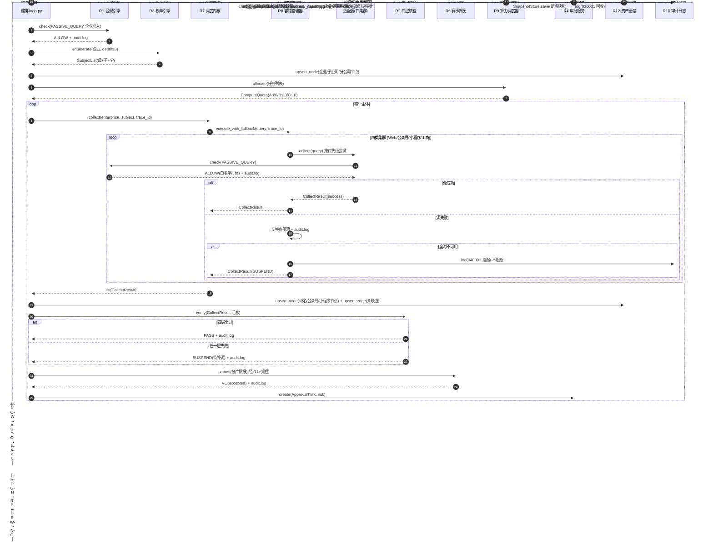
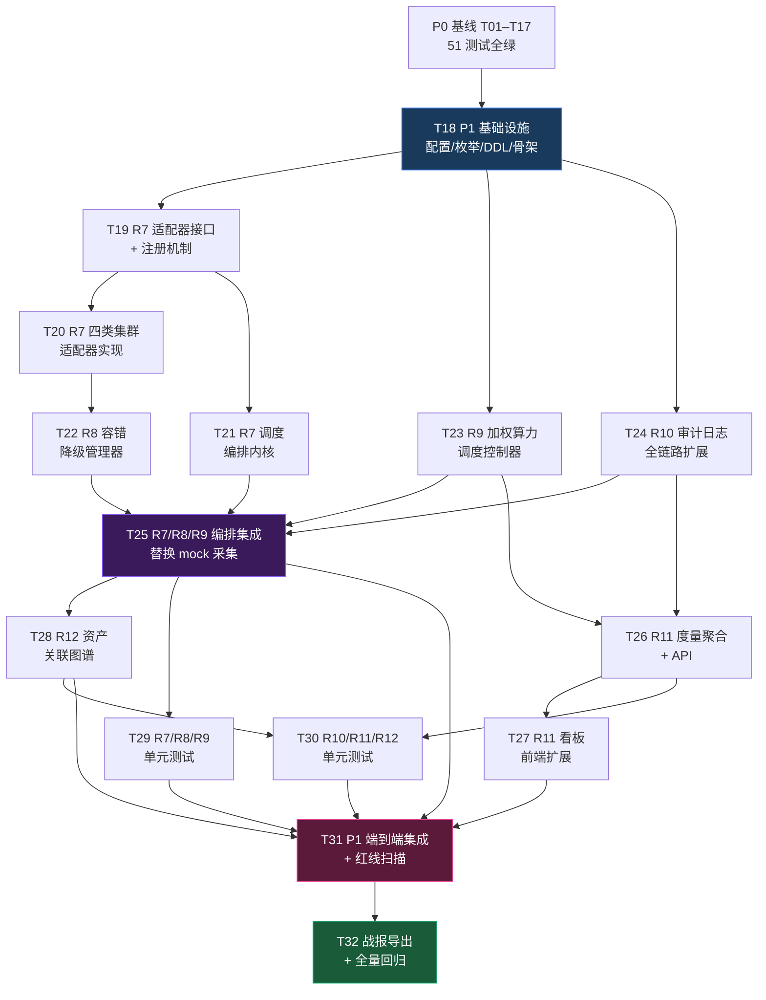

# 企业被动信息搜集 Agent · 第二战役增量施工蓝图（P1 · R7–R12 基础）

> 作者：高见远（system-architect）｜日期：2026-07-13｜受众：工程师寇豆码（直接照写）
> 上游基线：`prd-p1-increment-2026-07-13.md`（P1 增量 PRD）、`passive-agent-task-blueprint-2026-07-13.md`（P0 施工蓝图）、P0 已落地代码（`passive_agent/` 51 个 .py）
> 范围边界：**R7 多源采集调度 + R8 容错降级 + R9 算力调度 + R10 全链路审计 + R11 度量看板 + R12 资产图谱基础**，延续 P0 技术栈（Python + FastAPI + SQLite + JSON），不引入 Neo4j/MySQL/Redis/React。

---

## 0. TL;DR（一句话）

本蓝图在 P0 已落地的 SQLite+JSON / CLI+静态页技术基线上，以**最小变更衔接**方式给出 P1 六项增量（R7–R12 基础）的增量架构设计：新增 `collector/`（R7 调度内核+适配器+R8 容错）、`scheduler/`（R9 算力调度）、`graph/`（R12 图谱）、`metrics/`（R11 度量聚合）四个子包 + 扩展 `audit/`（R10 全链路日志）与 `static/`（R11 面板），拆成 **15 个有序开发任务（T18–T32）**，每个任务标注依赖、产出文件与验收要点，工程师可逐任务照写。

---

## 1. 增量实现方案

### 1.1 技术延续性

| 维度 | P0 选型（沿用） | P1 增量说明 |
|---|---|---|
| 语言 | Python 3.12+ | 不变 |
| Web/API | FastAPI + Uvicorn | 新增 `routes_metrics` / `routes_graph` 两个路由模块 |
| 存储 | SQLite + JSON | 新增 `t_asset_node` / `t_asset_relation` / `t_source_health` 三张表 |
| 配置 | pydantic-settings | 新增 R9 权重配比、回收阈值、源超时等配置项 |
| 被动查询 | dnspython（仅解析）+ httpx | R7 适配器复用 dnspython + httpx 调用 crt.sh 等免凭证源 |
| 前端 | CLI + 静态单页 | 在 `index.html`/`app.js` 上扩展 M2 深化 + M5 容错 + M6 算力模块 |
| 测试 | pytest | 新增 collector/scheduler/graph/metrics/audit 测试文件 |

### 1.2 R7 适配器架构（调度内核 + 适配器接口 + 四类集群实现）

**设计思路**：将 P0 `orchestrator/loop.py` 中的 mock 采集阶段（阶段 2 的 `dns_ok=True; src_cnt=2` 硬编码）替换为真实的调度内核 + 适配器调用。

```
                    ┌─────────────────────────────────┐
                    │     CollectionScheduler         │  ← 调度编排内核（100%自研）
                    │  · 任务分解（按集群拆子任务）     │
                    │  · 分发（调度适配器 collect()）   │
                    │  · 汇总（合并 CollectResult）     │
                    │  · 状态机（PENDING→RUNNING→DONE） │
                    └──────────┬──────────────────────┘
                               │ 调用
                    ┌──────────▼──────────────────────┐
                    │     SourceAdapter（抽象接口）     │  ← ACL 防腐层
                    │  · collect(query)→CollectResult  │
                    │  · 出站前 compliance_client.check │
                    │  · 可注册/发现/可插拔            │
                    └──────────┬──────────────────────┘
                               │ 实现
          ┌────────────┬───────┴────────┬─────────────┐
          ▼            ▼                ▼              ▼
    ┌──────────┐ ┌──────────┐  ┌──────────┐  ┌──────────┐
    │ Web集群   │ │公众号集群 │  │小程序集群 │  │工商股权  │
    │          │ │          │  │          │  │  集群    │
    │·crt.sh★  │ │·WeChat   │  │·MiniApp  │  │·Equity  │
    │  (真实)   │ │  Adapter │  │  Adapter │  │  Adapter│
    │·DNS★     │ │·MockWA   │  │·MockMA   │  │·MockEQ  │
    │  (真实)   │ │  (回退)   │  │  (回退)   │  │  (回退)  │
    │·FOFA     │ │          │  │          │  │         │
    │  (凭证)   │ │          │  │          │  │         │
    │·Subfinder│ │          │  │          │  │         │
    │  (凭证)   │ │          │  │          │  │         │
    └──────────┘ └──────────┘  └──────────┘  └──────────┘
         ★ = 真实免凭证源（crt.sh 公共 API + dnspython 被动解析）
```

- **调度内核 `CollectionScheduler`**：100% 自研，负责任务分解（按集群类型拆子任务）、分发（调用注册的适配器）、汇总（合并各集群的 `CollectResult`）、状态机管理。不依赖任何外部调度框架。
- **适配器接口 `SourceAdapter`**：抽象基类，定义 `collect(query: CollectQuery, trace_id: str) -> CollectResult` 统一契约。所有适配器出站前必须经 `compliance_client.check(PASSIVE_QUERY)`；白名单被动接口，可插拔。
- **四类集群适配器**：每类 ≥2 个适配器，其中 Web 集群含 ≥1 真实免凭证源（crt.sh / dnspython）。凭证源（FOFA/Subfinder 等）缺凭证时自动回退 `MockAdapter`，保证闭环不中断。

### 1.3 R8 容错策略

- **源健康检查**：`FaultToleranceManager` 维护各源健康状态（HEALTHY/DEGRADED/UNAVAILABLE），按连续失败计数自动降级。
- **热切换**：同一集群内适配器按优先级排序，主源失败自动切换备用源，切换对上层透明。
- **挂起告警**：某集群全部源不可用时，该任务置 `SUSPEND` + 写 `t_audit_log`（reason_code=040001）+ 不阻断其他集群/企业。
- **降级事件**：每次切换/挂起事件走 `audit.logger` 写日志，同步到 R11 M5 面板。
- **mock 回退不计挂起**：缺凭证适配器回退 mock 源时视为"源可用"，不触发全源不可用挂起（V-R8-4）。

### 1.4 R9 调度控制器设计

- **权重分配器**：A:B:C=60:30:10 配额（可配置 `COMPUTE_WEIGHTS`）。A=工控/政务/能源高价值，B=主站/公众号，C=长尾旁站。
- **看榜倾斜器**：每 5 分钟读取 R6 网关榜单快照（`ApiProxy.quota()`），计算各任务边际贡献，向高边际任务倾斜算力。
- **回收控制器**：单任务连续 25 分钟零新增（`IDLE_RECLAIM_MINUTES=25`）即回收算力；回收前调 `SnapshotStore.save()` 保存 R4 断点快照（进度零丢失）；回收事件写 `t_audit_log`（reason_code=030001）。

### 1.5 R10 日志扩展方案

P0 `audit/logger.py` 已有 `log()` + `search()` 两个函数。R10 扩展：
- **全链路覆盖**：在 R7 采集、R8 容错、R9 调度各调用点增加 `audit.log()` 调用，补全采集/校验/提交/调度四类事件。
- **检索扩展**：新增 `AuditQuery` 类，支持按企业/时间范围/违规类型三维组合检索（P0 `search()` 仅支持 subject/decision/reason_code）。
- **导出接口**：新增 `AuditExport` 类，支持导出 JSON / 结构化文件用于答辩溯源。
- **trace_id 透传**：所有新增调用点确保 `trace_id` 从 `run_company()` 透传到各适配器/调度器，串联同一任务的完整轨迹。
- **复用 P0 表结构**：`t_audit_log` 表结构不变，仅扩展写入量和检索维度。

### 1.6 R11 看板扩展方案

- **度量聚合**：新增 `MetricsAggregator`，从 R6 网关（频控/WNSR）、R9 调度器（算力占比/回收）、R10 日志（违规/降级计数）汇聚数据。
- **面板扩展**：在 P0 `static/index.html` 的 M1/M2/M3/M4/M7 基础上，深化 M2（WNSR 进度条 + A/B/C 环形占比）、新增 M5（容错降级日志流）、新增 M6（看榜快照 + 算力倾斜动作）。
- **自动刷新**：前端 `setInterval(refresh, 300000)` 每 5 分钟刷新（与 R9 看榜节奏对齐）。
- **战报导出**：新增 API `/api/v1/metrics/war-report`，导出 WNSR + 指标快照 + 红线状态 + 降级/回收事件摘要。
- **不引入 React/Node**：纯 `fetch` + DOM 渲染。

### 1.7 R12 关系表设计

- **两张表**：`t_asset_node`（节点表）+ `t_asset_relation`（边/关系表），用 SQLite 关系表存邻接拓扑，非图数据库。
- **节点类型**：ENTERPRISE（企业）/ SUBSIDIARY（子公司）/ BRANCH（分公司）/ DOMAIN（域名）/ WECHAT_ACCOUNT（公众号）/ MINI_PROGRAM（小程序）。
- **关系类型**：OWNS（持股）/ RESOLVES_TO（域名解析）/ BELONGS_TO（资产归属）/ PARENT_OF（母子公司）。
- **Neo4j 迁移兼容**：节点/边字段设计便于后续迁移（node_type→label, edge_type→relationship type, properties_json→properties）。
- **拓扑写入来源**：R3 枚举主体（企业/子公司/分公司节点）+ R7 采集资产（域名/公众号/小程序节点）+ R2 核验通过情报（关联边）。
- **查询**：按企业查询关联拓扑（节点列表 + 关联关系），面板基础展示。

### 1.8 与 P0 的最小变更衔接

| P0 文件 | P1 修改内容 | 变更性质 |
|---|---|---|
| `config.py` | 新增 `COMPUTE_WEIGHTS`、`IDLE_RECLAIM_MINUTES`、`SOURCE_TIMEOUT`、`FAULT_MAX_RETRIES` 等配置项 | 纯增量追加，不改已有项 |
| `common/enums.py` | 新增 `CollectorCluster`、`SourceHealth`、`TaskState` 枚举 | 纯增量追加 |
| `common/result.py` | 错误码注册表新增 `040001`(源不可用) | 纯增量追加 |
| `storage/db.py` | SCHEMA 末尾新增 `t_asset_node`/`t_asset_relation`/`t_source_health` 三张表 DDL | 纯增量追加，不改已有表 |
| `audit/logger.py` | 扩展 `search()` 支持时间范围 + 企业维度 | 兼容扩展，旧签名保留 |
| `orchestrator/loop.py` | 阶段 2 的 mock 采集替换为 `CollectionScheduler.collect()` 调用 | **核心替换点**，接口签名不变 |
| `main.py` | 注册 `routes_metrics` + `routes_graph` 路由 | 纯增量追加 |
| `static/index.html` | 新增 M5/M6 面板 DOM 区块 | 增量追加，不改已有区块 |
| `static/app.js` | 新增 M5/M6 渲染函数 + 5min 自动刷新 | 增量追加，不改已有函数 |
| `api/routes_console.py` | 新增度量/图谱概览端点 | 增量追加 |

> **关键原则**：所有 P0 已有文件的修改均为"增量追加"或"兼容扩展"，不破坏 P0 的 51 个测试。`orchestrator/loop.py` 是唯一的核心替换点（mock → 真实调度），但 `run_company()` 的函数签名与返回结构保持不变。

---

## 2. 增量文件列表及相对路径

### 2.1 新增文件

```
passive_agent/
├── collector/                          # 【R7/R8】多源被动采集调度层 + 容错
│   ├── __init__.py                     # 包导出
│   ├── model.py                        # CollectQuery, CollectItem, CollectResult, ClusterType
│   ├── adapter.py                      # SourceAdapter 抽象基类（ACL 防腐层接口）
│   ├── registry.py                     # AdapterRegistry 适配器注册/发现
│   ├── scheduler.py                    # CollectionScheduler 调度编排内核
│   ├── fault_tolerance.py              # FaultToleranceManager（R8 容错降级）
│   └── adapters/                       # 四类集群适配器实现
│       ├── __init__.py
│       ├── crtsh_adapter.py            # Web集群 - crt.sh 真实免凭证源
│       ├── dns_adapter.py              # Web集群 - dnspython 被动解析真实免凭证源
│       ├── fofa_adapter.py             # Web集群 - FOFA 凭证源（缺凭证回退 mock）
│       ├── subfinder_adapter.py         # Web集群 - Subfinder 凭证源
│       ├── wechat_adapter.py           # 公众号集群适配器
│       ├── miniapp_adapter.py          # 小程序集群适配器
│       ├── equity_adapter.py           # 工商股权集群适配器
│       └── mock_adapter.py             # 通用 mock 回退源（所有集群缺凭证/失败时回退）
├── scheduler/                          # 【R9】加权算力调度控制器
│   ├── __init__.py
│   ├── model.py                        # ComputeQuota, LeaderboardSnapshot, ReclaimEvent
│   └── compute_scheduler.py            # ComputeScheduler（权重+看榜倾斜+回收）
├── graph/                             # 【R12】资产关联图谱基础版
│   ├── __init__.py
│   ├── model.py                        # GraphNode, GraphEdge, AssetTopology
│   └── asset_graph.py                  # AssetGraph（节点/边 CRUD + 按企业查拓扑）
├── metrics/                           # 【R11】度量数据聚合
│   ├── __init__.py
│   └── aggregator.py                   # MetricsAggregator（WNSR/6指标/红线汇聚）
├── audit/                             # 【R10】扩展
│   ├── query.py                        # AuditQuery（企业/时间/违规三维组合检索）
│   └── export.py                       # AuditExport（JSON/结构化文件导出）
├── api/
│   ├── routes_metrics.py              # 【R11】度量看板 API
│   └── routes_graph.py                # 【R12】图谱查询 API

tests/
├── test_collector.py                  # R7 适配器/调度内核测试
├── test_fault_tolerance.py            # R8 容错降级测试
├── test_compute_scheduler.py          # R9 算力调度测试
├── test_audit_query.py                # R10 检索/导出测试
├── test_metrics.py                    # R11 度量聚合测试
├── test_graph.py                      # R12 图谱 CRUD/查询测试
├── test_p1_integration.py             # P1 端到端集成测试
└── test_p1_redline.py                 # P1 静态红线扫描 + 红线回归
```

### 2.2 修改文件（P0 已有）

| 文件 | 修改内容概要 |
|---|---|
| `passive_agent/config.py` | 新增 `COMPUTE_WEIGHTS`/`IDLE_RECLAIM_MINUTES`/`SOURCE_TIMEOUT`/`FAULT_MAX_RETRIES`/`CRTSH_API_URL`/`LEADERBOARD_INTERVAL` 配置项 |
| `passive_agent/common/enums.py` | 新增 `CollectorCluster`/`SourceHealth`/`TaskState`/`EdgeType`/`NodeType` 枚举 |
| `passive_agent/common/result.py` | 错误码注册表新增 `040001`(源不可用)、`040002`(源超时) |
| `passive_agent/storage/db.py` | SCHEMA 新增 `t_asset_node`/`t_asset_relation`/`t_source_health` 三张表 DDL |
| `passive_agent/audit/logger.py` | `search()` 扩展支持 `start_ts`/`end_ts`/`enterprise` 参数；新增 `log_chain()` 全链路日志辅助 |
| `passive_agent/orchestrator/loop.py` | 阶段 2 mock 采集替换为 `CollectionScheduler.collect()` 调用；R12 拓扑写入接入 |
| `passive_agent/main.py` | 注册 `routes_metrics` + `routes_graph` 路由 |
| `passive_agent/static/index.html` | 新增 M5（容错降级日志）/ M6（看榜与算力倾斜）/ M2 深化 DOM 区块 |
| `passive_agent/static/app.js` | 新增 `loadMetrics()`/`loadFaultLog()`/`loadLeaderboard()` + 5min 自动刷新 |
| `passive_agent/api/routes_console.py` | 新增 `/console/metrics-overview` 概览端点 |
| `tests/conftest.py` | 新增 P1 测试 fixture（collector/scheduler/graph 临时实例） |

---

## 3. 增量数据结构和接口（类图 / 接口契约）

### 3.1 R7 采集数据模型

```python
# collector/model.py
class CollectorCluster(str, Enum):
    WEB = "WEB"              # Web 域名/子域名集群
    WECHAT = "WECHAT"        # 公众号集群
    MINIAPP = "MINIAPP"      # 小程序集群
    EQUITY = "EQUITY"        # 工商股权集群

class CollectQuery(BaseModel):
    enterprise: str          # 目标企业全称
    subject_name: str         # 当前主体名称
    cluster: CollectorCluster # 目标集群
    trace_id: str             # 全链路追踪 ID

class CollectItem(BaseModel):
    item_type: str            # domain / wechat_account / mini_program / equity_relation
    value: str                # 采集值（域名/账号/小程序ID/股权关系）
    source_name: str          # 来源适配器名
    raw: dict = {}            # 原始数据

class CollectResult(BaseModel):
    query: CollectQuery
    items: list[CollectItem]  # 采集到的资产项
    source_name: str          # 实际使用的源
    success: bool             # 采集是否成功
    error: str = ""           # 失败原因（R8 用）
    collected_at: str         # ISO8601 UTC
```

### 3.2 R7 适配器接口

```python
# collector/adapter.py
class SourceAdapter(ABC):
    """被动源适配器抽象基类（ACL 防腐层）。

    所有适配器出站前必须经 compliance_client.check(PASSIVE_QUERY)。
    白名单被动接口，可注册/发现/可插拔。
    """
    name: str                          # 适配器唯一名
    cluster: CollectorCluster           # 所属集群
    requires_credential: bool = False  # 是否需要凭证
    priority: int = 100                # 优先级（小=高优先）

    @abstractmethod
    def collect(self, query: CollectQuery, trace_id: str) -> CollectResult:
        """采集入口。出站前必经 R1 关隘。"""
        ...

    def _check_compliance(self, trace_id: str) -> None:
        """出站前必经 R1 fail-closed 关隘。"""
        decision = check(ActionType.PASSIVE_QUERY, source_name=self.name, trace_id=trace_id)
        if not decision.allowed:
            raise PermissionError(f"R1 拦截：{decision.reason_code}")

    def is_available(self) -> bool:
        """检查凭证/配置是否就绪（缺凭证返回 False 以触发 mock 回退）。"""
        return True
```

### 3.3 R7 调度编排内核

```python
# collector/scheduler.py
class CollectionScheduler:
    """调度编排内核（100% 自研）。

    职责：任务分解（按集群拆子任务）→ 分发（调适配器 collect）→
         汇总（合并 CollectResult）→ 状态机管理。
    """
    def __init__(self, registry: AdapterRegistry, ftm: FaultToleranceManager):
        self.registry = registry
        self.ftm = ftm

    def collect(self, enterprise: str, subject_name: str, trace_id: str) -> list[CollectResult]:
        """对单个主体执行四集群采集，返回各集群结果列表。"""
        # 1) 任务分解：为四类集群各创建 CollectQuery
        # 2) 分发：对每个集群调用 ftm.execute_with_fallback()
        # 3) 汇总：合并结果返回
        ...

# collector/registry.py
class AdapterRegistry:
    """适配器注册/发现机制。按集群分组管理适配器，按优先级排序。"""
    def register(self, adapter: SourceAdapter) -> None: ...
    def get_adapters(self, cluster: CollectorCluster) -> list[SourceAdapter]: ...
    def get_clusters(self) -> list[CollectorCluster]: ...
```

### 3.4 R8 容错降级管理器

```python
# collector/fault_tolerance.py
class SourceHealth(str, Enum):
    HEALTHY = "HEALTHY"
    DEGRADED = "DEGRADED"        # 连续失败 1-2 次
    UNAVAILABLE = "UNAVAILABLE"  # 连续失败 ≥3 次

class FaultToleranceManager:
    """多源容错降级管理器（R8）。

    - 源健康检查：按连续失败计数维护 SourceHealth 状态。
    - 热切换：主源失败自动切换同集群备用源，对上层透明。
    - 挂起告警：全源不可用时任务 SUSPEND + 写 t_audit_log(040001) + 不阻断全局。
    """
    def __init__(self, registry: AdapterRegistry, max_retries: int = 3):
        self.registry = registry
        self.max_retries = max_retries
        self._health: dict[str, SourceHealth] = {}  # adapter.name → health

    def execute_with_fallback(self, query: CollectQuery, trace_id: str) -> CollectResult:
        """按优先级尝试各适配器，失败自动切换备用源。全源不可用则返回 SUSPEND 结果。"""
        ...

    def get_health_status(self) -> dict[str, str]:
        """返回所有源健康状态（供 R11 M5 面板展示）。"""
        ...

    def _record_failure(self, adapter_name: str, reason: str, trace_id: str) -> None:
        """记录失败 → 降级状态 → 写 audit.log。"""
        ...

    def _record_suspend(self, cluster: CollectorCluster, trace_id: str) -> None:
        """全源不可用 → SUSPEND + audit.log(040001)。"""
        ...
```

### 3.5 R9 加权算力调度控制器

```python
# scheduler/model.py
class ComputeQuota(BaseModel):
    cluster_a_pct: float = 60.0   # A 类算力占比
    cluster_b_pct: float = 30.0   # B 类算力占比
    cluster_c_pct: float = 10.0   # C 类算力占比
    total_slots: int = 100         # 总算力槽位

class LeaderboardSnapshot(BaseModel):
    snapshot_at: str               # 快照时间 ISO8601
    task_scores: list[dict]        # [{task_id, marginal_score, cluster, new_count}]

class ReclaimEvent(BaseModel):
    task_id: str
    enterprise: str
    idle_minutes: int              # 空闲时长
    reason_code: str = "030001"
    snapshot_saved: bool           # 回收前是否已存快照
    reclaimed_at: str

# scheduler/compute_scheduler.py
class ComputeScheduler:
    """加权算力调度控制器（R9）。

    - 权重分配器：A:B:C=60:30:10 配额（可配置 COMPUTE_WEIGHTS）。
    - 看榜倾斜器：每 5min 读榜单快照，向高边际贡献任务倾斜。
    - 回收控制器：25min 零新增回收，回收前存 R4 断点快照。
    """
    def __init__(self, snapshot_store: SnapshotStore):
        self.snapshot_store = snapshot_store
        self._task_idle: dict[str, float] = {}  # task_id → 首次零新增时间戳
        self._last_leaderboard: LeaderboardSnapshot | None = None

    def allocate(self, tasks: list[dict]) -> dict[str, ComputeQuota]:
        """按 A:B:C 权重分配算力配额。"""
        ...

    def tilt_by_leaderboard(self, leaderboard: LeaderboardSnapshot) -> dict[str, float]:
        """读榜单快照，计算各任务边际贡献，返回倾斜系数。"""
        ...

    def check_reclaim(self, task_id: str, enterprise: str, has_new: bool) -> ReclaimEvent | None:
        """检查是否需要回收（25min 零新增）。回收前存快照。"""
        ...

    def get_status(self) -> dict:
        """返回当前算力分配/倾斜/回收状态（供 R11 M6 面板）。"""
        ...
```

### 3.6 R10 审计日志扩展

```python
# audit/query.py
class AuditQuery:
    """全链路审计日志检索（企业/时间/违规三维组合）。"""
    def search(self, enterprise: str | None = None,
               start_ts: str | None = None, end_ts: str | None = None,
               decision: str | None = None, reason_code: str | None = None,
               trace_id: str | None = None, limit: int = 100) -> list[dict]:
        """按企业/时间范围/违规类型三维组合检索 t_audit_log。"""
        ...

    def count_by_type(self, start_ts: str | None = None) -> dict[str, int]:
        """按 action 维度统计计数（采集/校验/提交/调度）。"""
        ...

# audit/export.py
class AuditExport:
    """审计日志导出（答辩溯源）。"""
    def export_json(self, path: str, **filters) -> str:
        """导出检索结果为 JSON 文件。"""
        ...

    def export_trace(self, trace_id: str, path: str | None = None) -> dict:
        """按 trace_id 导出完整链路轨迹（采集→核验→提交→调度）。"""
        ...
```

### 3.7 R11 度量聚合

```python
# metrics/aggregator.py
class MetricsSnapshot(BaseModel):
    wnsr: float = 0.0               # 有效加权得分达成率
    compute_ratio: dict = {}         # {A: 60, B: 30, C: 10}
    coverage: dict = {}              # 资产覆盖率
    accuracy: float = 0.0            # 情报准确率
    invalid_rate: float = 0.0        # 无效情报率
    schedule_efficiency: float = 0.0 # 算力调度效率
    compliance_rate: float = 100.0   # 合规安全率（违规=0&封禁=0 → 100）
    api_efficiency: float = 0.0      # API 调用效率
    violations: int = 0             # 违规计数
    bans: int = 0                   # 封禁计数
    freq_buffer_pct: float = 0.0    # 频控 buffer
    fault_events: list = []         # 降级/回收事件摘要
    snapshot_at: str = ""

class MetricsAggregator:
    """度量数据聚合（从 R6/R9/R10 汇聚）。"""
    def snapshot(self) -> MetricsSnapshot:
        """汇聚当前度量快照。"""
        ...

    def war_report(self) -> dict:
        """阶段战报（WNSR + 指标快照 + 红线状态 + 降级/回收事件摘要）。"""
        ...
```

### 3.8 R12 资产关联图谱

```python
# graph/model.py
class NodeType(str, Enum):
    ENTERPRISE = "ENTERPRISE"
    SUBSIDIARY = "SUBSIDIARY"
    BRANCH = "BRANCH"
    DOMAIN = "DOMAIN"
    WECHAT_ACCOUNT = "WECHAT_ACCOUNT"
    MINI_PROGRAM = "MINI_PROGRAM"

class EdgeType(str, Enum):
    OWNS = "OWNS"                  # 持股关系
    RESOLVES_TO = "RESOLVES_TO"    # 域名解析
    BELONGS_TO = "BELONGS_TO"      # 资产归属
    PARENT_OF = "PARENT_OF"        # 母子公司

class GraphNode(BaseModel):
    node_id: str                   # 唯一 ID（type:name 哈希）
    node_type: NodeType
    name: str
    enterprise: str                 # 所属企业
    properties: dict = {}           # 扩展属性（credit_code 等）

class GraphEdge(BaseModel):
    edge_id: str
    from_node: str                  # 源节点 ID
    to_node: str                    # 目标节点 ID
    edge_type: EdgeType
    properties: dict = {}

class AssetTopology(BaseModel):
    enterprise: str
    nodes: list[GraphNode]
    edges: list[GraphEdge]

# graph/asset_graph.py
class AssetGraph:
    """资产关联图谱（SQLite 关系表，非图数据库）。"""
    def upsert_node(self, node: GraphNode) -> str: ...
    def upsert_edge(self, edge: GraphEdge) -> str: ...
    def query_topology(self, enterprise: str) -> AssetTopology: ...
    def node_count(self, enterprise: str | None = None) -> int: ...
    def edge_count(self, enterprise: str | None = None) -> int: ...
```

### 3.9 增量类关系图（Mermaid classDiagram）

```mermaid
classDiagram
    class SourceAdapter {
        <<abstract>>
        +name str
        +cluster CollectorCluster
        +requires_credential bool
        +priority int
        +collect(query, trace_id) CollectResult
        +is_available() bool
        #_check_compliance(trace_id) void
    }
    class CrtshAdapter {+collect(query, trace_id) CollectResult}
    class DnsAdapter {+collect(query, trace_id) CollectResult}
    class FofaAdapter {+collect(query, trace_id) CollectResult}
    class WechatAdapter {+collect(query, trace_id) CollectResult}
    class MiniappAdapter {+collect(query, trace_id) CollectResult}
    class EquityAdapter {+collect(query, trace_id) CollectResult}
    class MockAdapter {+collect(query, trace_id) CollectResult}

    class AdapterRegistry {
        +register(adapter) void
        +get_adapters(cluster) list~SourceAdapter~
        +get_clusters() list~CollectorCluster~
    }
    class CollectionScheduler {
        +registry AdapterRegistry
        +ftm FaultToleranceManager
        +collect(enterprise, subject, trace_id) list~CollectResult~
    }
    class FaultToleranceManager {
        +max_retries int
        +execute_with_fallback(query, trace_id) CollectResult
        +get_health_status() dict
        -_record_failure(name, reason, trace_id) void
        -_record_suspend(cluster, trace_id) void
    }
    class CollectResult {
        +query CollectQuery
        +items list~CollectItem~
        +source_name str
        +success bool
        +error str
    }
    class CollectQuery {
        +enterprise str
        +subject_name str
        +cluster CollectorCluster
        +trace_id str
    }

    class ComputeScheduler {
        +snapshot_store SnapshotStore
        +allocate(tasks) dict
        +tilt_by_leaderboard(leaderboard) dict
        +check_reclaim(task_id, enterprise, has_new) ReclaimEvent
        +get_status() dict
    }
    class ComputeQuota {
        +cluster_a_pct float
        +cluster_b_pct float
        +cluster_c_pct float
    }
    class ReclaimEvent {
        +task_id str
        +idle_minutes int
        +reason_code str
        +snapshot_saved bool
    }

    class AuditQuery {
        +search(enterprise, start, end, decision, reason_code, trace_id) list
        +count_by_type(start_ts) dict
    }
    class AuditExport {
        +export_json(path, filters) str
        +export_trace(trace_id, path) dict
    }

    class MetricsAggregator {
        +snapshot() MetricsSnapshot
        +war_report() dict
    }
    class MetricsSnapshot {
        +wnsr float
        +compute_ratio dict
        +violations int
        +bans int
        +fault_events list
    }

    class AssetGraph {
        +upsert_node(node) str
        +upsert_edge(edge) str
        +query_topology(enterprise) AssetTopology
        +node_count(enterprise) int
    }
    class GraphNode {
        +node_id str
        +node_type NodeType
        +name str
        +enterprise str
    }
    class GraphEdge {
        +edge_id str
        +from_node str
        +to_node str
        +edge_type EdgeType
    }

    SourceAdapter <|-- CrtshAdapter
    SourceAdapter <|-- DnsAdapter
    SourceAdapter <|-- FofaAdapter
    SourceAdapter <|-- WechatAdapter
    SourceAdapter <|-- MiniappAdapter
    SourceAdapter <|-- EquityAdapter
    SourceAdapter <|-- MockAdapter
    AdapterRegistry --> SourceAdapter : manages
    CollectionScheduler --> AdapterRegistry
    CollectionScheduler --> FaultToleranceManager
    CollectionScheduler ..> CollectResult : produces
    FaultToleranceManager --> AdapterRegistry
    FaultToleranceManager ..> CollectResult : produces
    ComputeScheduler ..> ComputeQuota : produces
    ComputeScheduler ..> ReclaimEvent : produces
    AssetGraph ..> GraphNode : manages
    AssetGraph ..> GraphEdge : manages
```



---

## 4. 增量调用流程（时序图）

P1 升级后的单企业采集闭环：R1→R3→R7 四集群采集→R8 容错→R2 核验→R6 提交→R4 审批→R12 拓扑写入，标注 R9 调度控制器在其中的作用。



---

## 5. 增量任务列表（T18–T32，有序、含依赖、按实现顺序）

> 规则：每个任务标注【编号 / 对应需求 R / 依赖前置 / 产出文件 / 验收要点】。工程师按 T18→T32 顺序实现。

### T18 · P1 基础设施 — 配置/枚举/错误码/DDL 扩展 + 新包骨架　【R: 基础｜依赖: P0 T01–T17】

- **产出文件**：
  - 修改：`config.py`（新增 R9/R7 配置项）、`common/enums.py`（新增枚举）、`common/result.py`（新增错误码）、`storage/db.py`（新增 3 张表 DDL）
  - 新增：`collector/__init__.py`、`collector/model.py`、`scheduler/__init__.py`、`scheduler/model.py`、`graph/__init__.py`、`graph/model.py`、`metrics/__init__.py`、`metrics/aggregator.py`（骨架）
- **验收要点**：
  - `config.py` 新增：`COMPUTE_WEIGHTS={"A":60,"B":30,"C":10}`、`IDLE_RECLAIM_MINUTES=25`、`SOURCE_TIMEOUT=10`、`FAULT_MAX_RETRIES=3`、`CRTSH_API_URL="https://crt.sh/?q=%25{}&output=json"`、`LEADERBOARD_INTERVAL=300`（秒）。
  - `common/enums.py` 新增：`CollectorCluster{WEB,WECHAT,MINIAPP,EQUITY}`、`SourceHealth{HEALTHY,DEGRADED,UNAVAILABLE}`、`TaskState{PENDING,RUNNING,DONE,SUSPENDED,RECLAIMED}`、`NodeType{ENTERPRISE,SUBSIDIARY,BRANCH,DOMAIN,WECHAT_ACCOUNT,MINI_PROGRAM}`、`EdgeType{OWNS,RESOLVES_TO,BELONGS_TO,PARENT_OF}`。
  - `common/result.py` 错误码注册表新增 `040001`(源不可用)、`040002`(源超时)。
  - `storage/db.py` SCHEMA 新增：
    - `t_asset_node`(node_id TEXT UNIQUE, node_type, name, enterprise, properties_json, created_at, deleted)
    - `t_asset_relation`(edge_id TEXT UNIQUE, from_node, to_node, edge_type, properties_json, created_at, deleted)
    - `t_source_health`(adapter_name TEXT UNIQUE, cluster, health, fail_count, last_fail_at, updated_at, deleted)
  - `db.init()` 幂等可重跑，P0 已有表不受影响。
  - 新增包骨架可 `import` 无报错；P0 全部 51 个测试仍绿。

### T19 · R7 采集数据模型 + 适配器接口 + 注册机制　【R: R7｜依赖: T18】

- **产出文件**：`collector/adapter.py`（SourceAdapter 抽象基类）、`collector/registry.py`（AdapterRegistry）
- **验收要点**：
  - `SourceAdapter` 定义 `collect(query, trace_id) -> CollectResult` 抽象方法 + `_check_compliance()` 出站前关隘 + `is_available()` 凭证检查。
  - 所有适配器出站前必须调 `compliance_client.check(PASSIVE_QUERY)`，未 ALLOW 抛 `PermissionError`（fail-closed）。
  - `AdapterRegistry.register(adapter)` 按 `cluster` 分组、按 `priority` 排序；`get_adapters(cluster)` 返回有序列表。
  - 单测：注册多个 mock 适配器，验证按优先级排序、按集群分组检索。

### T20 · R7 四类集群适配器实现　【R: R7｜依赖: T19】

- **产出文件**：`collector/adapters/crtsh_adapter.py`、`dns_adapter.py`、`fofa_adapter.py`、`subfinder_adapter.py`、`wechat_adapter.py`、`miniapp_adapter.py`、`equity_adapter.py`、`mock_adapter.py`、`collector/adapters/__init__.py`
- **验收要点**：
  - **crt.sh 适配器**（Web 集群，真实免凭证）：用 `httpx` 调 `crt.sh` JSON API 查域名/子域名，出站前经 `compliance_client.check()`；超时回退 mock。
  - **DNS 适配器**（Web 集群，真实免凭证）：用 `dnspython.resolver.resolve()` 被动解析域名，仅解析不连接（严禁 socket）；复用 P0 `verifier/layers.py::dns_alive` 逻辑。
  - **FOFA/Subfinder 适配器**（Web 集群，凭证源）：`requires_credential=True`，缺凭证时 `is_available()` 返回 False，触发 mock 回退。
  - **公众号/小程序/工商股权适配器**：每类 ≥2 适配器（凭证源 + mock 回退源）。
  - **MockAdapter**（通用回退）：确定性 mock 数据，保证闭环不中断。
  - 每类集群 ≥2 适配器，Web 集群含 ≥1 真实免凭证源（V-R7-1/V-R7-2）。
  - dnspython 仅 `resolver.resolve()`，无 socket 直连（V-R7-6 静态扫描可验证）。
  - 单测：各适配器 `collect()` 返回 `CollectResult`，mock 适配器确定性输出。

### T21 · R7 调度编排内核　【R: R7｜依赖: T19】

- **产出文件**：`collector/scheduler.py`（CollectionScheduler）
- **验收要点**：
  - `CollectionScheduler.collect(enterprise, subject_name, trace_id)` → 对单主体执行四集群采集，返回 `list[CollectResult]`。
  - 任务分解：为四类集群各创建 `CollectQuery`；分发：调 `FaultToleranceManager.execute_with_fallback()`；汇总：合并结果。
  - 状态机：`PENDING→RUNNING→DONE/SUSPENDED`，状态变更写 `audit.log`。
  - 调度内核 100% 自研（任务分解/分发/汇总逻辑），工具执行器可替换可插拔（V-R7-4）。
  - 单测：mock 四集群适配器，验证任务分解/分发/汇总正确性。

### T22 · R8 容错降级管理器　【R: R8｜依赖: T19, T20】

- **产出文件**：`collector/fault_tolerance.py`（FaultToleranceManager）
- **验收要点**：
  - `execute_with_fallback(query, trace_id)`：按优先级尝试适配器，失败自动切换备用源，对上层透明（V-R8-1）。
  - 源健康检查：连续失败 1-2 次 → DEGRADED；≥3 次 → UNAVAILABLE；成功 → 恢复 HEALTHY。
  - 全源不可用 → 返回 `CollectResult(success=False, error="SUSPEND")` + 写 `t_audit_log`(reason_code=040001) + 不阻断其他集群（V-R8-2）。
  - 每次降级/切换/挂起事件写 `t_audit_log`（含源名/动作/原因/时间戳）（V-R8-3）。
  - 缺凭证回退 mock 视为"源可用"，不计入全源不可用挂起（V-R8-4）。
  - 健康状态落 `t_source_health` 表。
  - 单测：模拟主源失败→备用源成功、全源失败→SUSPEND、mock 回退不计挂起。

### T23 · R9 加权算力调度控制器　【R: R9｜依赖: T18】

- **产出文件**：`scheduler/compute_scheduler.py`（ComputeScheduler）
- **验收要点**：
  - `allocate(tasks)` 按 A:B:C=60:30:10 分配算力配额（可配置 `COMPUTE_WEIGHTS`）（V-R9-1）。
  - `tilt_by_leaderboard(leaderboard)` 每 5 分钟读榜单快照，计算边际贡献，返回倾斜系数（V-R9-2）。
  - `check_reclaim(task_id, enterprise, has_new)`：25 分钟零新增回收，回收前调 `SnapshotStore.save()` 存断点快照（V-R9-3）。
  - 回收事件写 `t_audit_log`(reason_code=030001)（V-R9-4）。
  - `get_status()` 返回当前算力分配/倾斜/回收状态（供 R11 M6）。
  - A/B/C 分类规则：命中 `HIGH_VALUE_KEYWORDS` → A；主站/公众号 → B；长尾旁站 → C。
  - 单测：权重分配正确性、25min 回收触发、快照保存、倾斜计算。

### T24 · R10 审计日志全链路扩展　【R: R10｜依赖: T18】

- **产出文件**：`audit/query.py`（AuditQuery）、`audit/export.py`（AuditExport）、修改 `audit/logger.py`（扩展 search）
- **验收要点**：
  - `AuditQuery.search()` 支持按企业/时间范围/违规类型三维组合检索（V-R10-3）。
  - `AuditQuery.count_by_type()` 按 action 维度统计（采集/校验/提交/调度四类事件计数）（V-R10-1）。
  - `AuditExport.export_json(path)` 导出检索结果为 JSON 文件（V-R10-4）。
  - `AuditExport.export_trace(trace_id)` 按 trace_id 导出完整链路轨迹（采集→核验→提交→调度）（V-R10-5）。
  - `audit/logger.py` 的 `search()` 兼容扩展：新增 `start_ts`/`end_ts`/`enterprise` 可选参数，旧调用方式不受影响。
  - 复用 P0 `t_audit_log` 表结构，不改表（V-R10-5）。
  - 每条日志含固定字段：时间戳/主体/动作/数据源/合规判定/trace_id（V-R10-2）。
  - 单测：多维检索、trace 轨迹导出、时间范围过滤。

### T25 · R7/R8/R9 编排集成 — 替换 mock 采集　【R: R7/R8/R9 集成｜依赖: T21, T22, T23】

- **产出文件**：修改 `orchestrator/loop.py`（替换阶段 2 mock 采集）
- **验收要点**：
  - `run_company(enterprise)` 阶段 2 从硬编码 `dns_ok=True; src_cnt=2` 替换为 `CollectionScheduler.collect()` 调用。
  - 采集结果（CollectResult）的 `items` 填入 `VerifyRequest` 的 `layer4_src_cnt`（多源佐证方数 = 实际成功源数）。
  - R9 `ComputeScheduler` 在主体循环中调 `check_reclaim()` 检查回收；每 5 分钟调 `tilt_by_leaderboard()`。
  - R12 `AssetGraph.upsert_node()` + `upsert_edge()` 在采集后写入拓扑节点/边。
  - `run_company()` 函数签名与返回结构不变（P0 测试兼容）。
  - 全链路 trace_id 从 `run_company()` 透传到适配器/调度器/审计日志。
  - 所有出站调用经 `compliance_client.check()`（V-R7-5/V-R7-6）。
  - 单企业闭环端到端跑通：R1→R3→四集群被动采集→R8容错→R2核验→R6提交→R4审批→R12拓扑写入（V-R7-5）。

### T26 · R11 度量聚合 + 度量 API　【R: R11｜依赖: T23, T24】

- **产出文件**：`metrics/aggregator.py`（MetricsAggregator 完整实现）、`api/routes_metrics.py`、修改 `main.py`（注册路由）
- **验收要点**：
  - `MetricsAggregator.snapshot()` 汇聚：WNSR（模拟分估算）+ A/B/C 算力占比 + 6 项支撑指标 + 红线状态（违规/封禁/频控）+ 降级/回收事件（V-R11-1/V-R11-2/V-R11-3）。
  - 6 项支撑指标：资产覆盖率/情报准确率/无效情报率/算力调度效率/合规安全率(违规=0&封禁=0→100%)/API调用效率。
  - `MetricsAggregator.war_report()` 阶段战报导出（WNSR + 指标快照 + 红线状态 + 降级/回收事件摘要）（V-R11-5）。
  - API 路由：
    - `GET /api/v1/metrics/snapshot` → 当前度量快照
    - `GET /api/v1/metrics/war-report` → 阶段战报导出
    - `GET /api/v1/metrics/fault-events` → 降级/回收事件流
  - `main.py` 注册 `routes_metrics` 路由。
  - 所有 API 返回统一 `Result` 格式。
  - 单测：度量快照聚合、战报导出格式。

### T27 · R11 看板前端扩展　【R: R11｜依赖: T26】

- **产出文件**：修改 `static/index.html`（新增 M5/M6 DOM 区块 + M2 深化）、修改 `static/app.js`（新增渲染函数 + 5min 自动刷新）
- **验收要点**：
  - M2 深化：WNSR 进度条 + A/B/C 三类算力环形占比图（纯 CSS/SVG，不引入 React）（V-R11-1）。
  - M5 新增：容错降级日志流（源名/动作/原因/时间戳，最近 20 条）（V-R11-3）。
  - M6 新增：看榜快照 + 算力倾斜动作展示（当前权重分配 + 倾斜系数 + 回收事件）（V-R11-2）。
  - 6 项支撑指标卡片（资产覆盖率/情报准确率/无效情报率/算力调度效率/合规安全率/API调用效率）（V-R11-2）。
  - 红线状态：违规计数/封禁计数/频控 buffer(≤95%绿区)，越线红闪告警（V-R11-3）。
  - `setInterval(refresh, 300000)` 每 5 分钟自动刷新（V-R11-4）。
  - 不引入 React/Node 构建链；纯 `fetch` + DOM 渲染（V-R11-6）。
  - P0 已有 M1/M3/M4/M7 面板不受影响。

### T28 · R12 资产关联图谱　【R: R12｜依赖: T18, T25】

- **产出文件**：`graph/asset_graph.py`（AssetGraph 完整实现）、`api/routes_graph.py`、修改 `main.py`（注册路由）、修改 `routes_console.py`（拓扑概览端点）
- **验收要点**：
  - `AssetGraph.upsert_node(node)` 节点写入 `t_asset_node`（幂等，node_id 唯一）。
  - `AssetGraph.upsert_edge(edge)` 边写入 `t_asset_relation`（幂等，edge_id 唯一）。
  - `AssetGraph.query_topology(enterprise)` 按企业查询关联拓扑（节点列表 + 关联关系）（V-R12-3）。
  - 拓扑数据来源：R3 枚举主体（企业/子公司/分公司节点）+ R7 采集资产（域名/公众号/小程序节点）+ R2 核验通过情报（关联边）（V-R12-2）。
  - 在 `run_company()` 中集成：枚举后写企业/子公司/分公司节点；采集后写域名/公众号/小程序节点 + 关联边。
  - API 路由：
    - `GET /api/v1/graph/topology?enterprise=xxx` → 拓扑查询
    - `GET /api/v1/graph/stats` → 节点/边统计
  - 节点/边字段设计便于后续 Neo4j 迁移（node_type→label, edge_type→relationship type, properties_json→properties）。
  - 不做 GDS/LLM 推理补全（V-R12-4）。
  - 单测：节点/边 CRUD、按企业查拓扑、幂等性。

### T29 · R7/R8/R9 单元测试　【R: R7/R8/R9｜依赖: T25】

- **产出文件**：`tests/test_collector.py`、`tests/test_fault_tolerance.py`、`tests/test_compute_scheduler.py`
- **验收要点**：
  - `test_collector.py`：各适配器 `collect()` 返回正确 `CollectResult`；crt.sh/dns 真实源 mock httpx/dns 验证；适配器注册/发现/优先级排序。
  - `test_fault_tolerance.py`：主源失败→备用源成功切换；全源失败→SUSPEND + 040001 日志；mock 回退不计挂起；健康状态转换。
  - `test_compute_scheduler.py`：A:B:C=60:30:10 权重分配；25min 回收触发 + 快照保存；看榜倾斜计算。
  - 所有出站调用 mock `compliance_client.check()` 返回 ALLOW，验证关隘调用。
  - dnspython 仅 `resolver.resolve()`，无 socket 直连断言。

### T30 · R10/R11/R12 单元测试　【R: R10/R11/R12｜依赖: T26, T28】

- **产出文件**：`tests/test_audit_query.py`、`tests/test_metrics.py`、`tests/test_graph.py`
- **验收要点**：
  - `test_audit_query.py`：企业/时间/违规三维组合检索；trace_id 轨迹导出；count_by_type 统计。
  - `test_metrics.py`：MetricsSnapshot 聚合正确性；war_report 格式；6 项指标计算。
  - `test_graph.py`：节点/边 CRUD 幂等性；按企业查拓扑完整性；Neo4j 迁移字段兼容性验证。
  - P0 `test_compliance.py`/`test_verifier.py` 等仍全绿（兼容性回归）。

### T31 · P1 端到端集成测试 + 静态红线扫描　【R: 全 P1｜依赖: T25, T26, T28, T29, T30】

- **产出文件**：`tests/test_p1_integration.py`、`tests/test_p1_redline.py`
- **验收要点**：
  - `test_p1_integration.py`：`run_company(企业)` 端到端跑通 R1→R3→R7四集群采集→R8容错→R2核验→R6提交→R4审批→R12拓扑写入完整链路（V-R7-5）。
  - 验证 CollectResult 的 items 正确填入 VerifyRequest.layer4_src_cnt（多源佐证）。
  - 验证 R12 拓扑节点/边写入完整（企业+子公司+域名+公众号+小程序）。
  - 验证全链路 trace_id 串联审计日志（AuditExport.export_trace）。
  - 验证 R9 算力分配与回收在闭环中的作用。
  - `test_p1_redline.py`：静态扫描代码库无主动扫描/socket 直连路径；所有出站调用经 `compliance_client.check()`（V-R7-6）；dnspython 仅 `resolver.resolve()`。
  - P0 `test_integration.py` + `test_stress.py` 仍全绿（回归不退化）。

### T32 · R11 战报导出 + P1 全量回归验证　【R: R11/全 P1｜依赖: T31】

- **产出文件**：完善 `metrics/aggregator.py` war_report、修改 `routes_console.py`（概览端点）
- **验收要点**：
  - `war_report()` 导出完整战报：WNSR + 6 项指标快照 + 红线状态 + 降级/回收事件摘要（V-R11-5）。
  - `GET /api/v1/console/metrics-overview` 聚合 R7/R9/R10/R11/R12 全景概览。
  - 面板 5 分钟自动刷新验证（V-R11-4）。
  - 全量 `pytest` 绿（P0 51 + P1 新增测试全通过）。
  - P1 验收清单逐条对照（V-R7-1～V-R12-4）。

---

## 6. 增量依赖包

```text
# P1 无新增第三方依赖包，全部复用 P0 已有：
# - httpx（crt.sh API 调用，P0 已有）
# - dnspython（DNS 被动解析，P0 已有）
# - fastapi/uvicorn（API 路由，P0 已有）
# - pydantic/pydantic-settings（数据模型/配置，P0 已有）
# - pytest（测试，P0 已有）

# requirements.txt 无需修改
```

> 说明：crt.sh 用 httpx 调用（已有）；dnspython 已有；不引入新的外部中间件/数据库/前端框架。

---

## 7. 增量共享知识更新

### 7.1 新增枚举（common/enums.py 追加）

| 枚举 | 值 | 说明 |
|---|---|---|
| `CollectorCluster` | WEB / WECHAT / MINIAPP / EQUITY | 四类采集集群 |
| `SourceHealth` | HEALTHY / DEGRADED / UNAVAILABLE | 源健康状态 |
| `TaskState` | PENDING / RUNNING / DONE / SUSPENDED / RECLAIMED | 采集任务状态机 |
| `NodeType` | ENTERPRISE / SUBSIDIARY / BRANCH / DOMAIN / WECHAT_ACCOUNT / MINI_PROGRAM | 图谱节点类型 |
| `EdgeType` | OWNS / RESOLVES_TO / BELONGS_TO / PARENT_OF | 图谱关系类型 |

### 7.2 新增错误码（common/result.py 追加）

| 错误码 | 含义 | 触发场景 |
|---|---|---|
| `040001` | 源不可用（全源挂起） | R8 某集群全部源不可用 |
| `040002` | 源超时 | R7 适配器调用超时 |

### 7.3 新增配置项（config.py 追加）

| 配置项 | 默认值 | 说明 |
|---|---|---|
| `COMPUTE_WEIGHTS` | `{"A":60,"B":30,"C":10}` | R9 算力权重配比（可配置） |
| `IDLE_RECLAIM_MINUTES` | `25` | R9 零新增回收阈值（分钟） |
| `SOURCE_TIMEOUT` | `10` | R7 适配器调用超时（秒） |
| `FAULT_MAX_RETRIES` | `3` | R8 连续失败降级阈值 |
| `CRTSH_API_URL` | `https://crt.sh/?q=%25{}&output=json` | crt.sh API 模板 |
| `LEADERBOARD_INTERVAL` | `300` | R9 看榜间隔（秒，=5分钟） |

### 7.4 新增 SQLite 表（storage/db.py SCHEMA 追加）

| 表名 | 用途 | 关键字段 |
|---|---|---|
| `t_asset_node` | R12 图谱节点表 | node_id(UNIQUE), node_type, name, enterprise, properties_json |
| `t_asset_relation` | R12 图谱关系表 | edge_id(UNIQUE), from_node, to_node, edge_type, properties_json |
| `t_source_health` | R8 源健康状态表 | adapter_name(UNIQUE), cluster, health, fail_count, last_fail_at |

### 7.5 模块间调用约定（P1 增量）

| 约定 | 说明 |
|---|---|
| **R7 适配器出站关隘** | 所有 `SourceAdapter.collect()` 实现内部首行调 `self._check_compliance(trace_id)`，未 ALLOW 抛 `PermissionError`。 |
| **R7 适配器注册** | 适配器在 `CollectionScheduler.__init__()` 时通过 `AdapterRegistry.register()` 注册；新增适配器只需实现 `SourceAdapter` 接口 + 注册，不需修改调度内核。 |
| **R8 容错调用链** | `CollectionScheduler` → `FaultToleranceManager.execute_with_fallback()` → `SourceAdapter.collect()`，容错对调度内核透明。 |
| **R9 调度接入点** | `run_company()` 主体循环中调 `ComputeScheduler.check_reclaim()`；可选调 `tilt_by_leaderboard()`。 |
| **R10 全链路 trace_id** | `run_company()` 生成 `trace_id` → 透传到 `CollectionScheduler` → `SourceAdapter` → `audit.log()`，串联完整轨迹。 |
| **R12 拓扑写入时机** | 枚举后写企业/子公司/分公司节点；采集后写域名/公众号/小程序节点 + 关联边；在 `run_company()` 内完成。 |
| **R11 度量数据源** | `MetricsAggregator` 从 `ApiProxy.quota()`(R6) + `ComputeScheduler.get_status()`(R9) + `AuditQuery.count_by_type()`(R10) 汇聚。 |
| **纯被动红线（P1 增量）** | crt.sh 适配器用 httpx 调用（出站前经 R1）；DNS 适配器仅 `resolver.resolve()`；代码库无 socket 直连/主动扫描路径（静态扫描可验证）。 |

---

## 8. 待明确事项

| # | 待明确项 | 默认建议值（本战役采用） | 影响 |
|---|---|---|---|
| — | R9 初赛 +30% 效率度量口径 | 以 R11 `schedule_efficiency` 指标为度量口径，规则发布后回填实测 | T23/T26 |
| — | FOFA/Subfinder 凭证 | 适配器接口已实现，凭证由用户后续填入；缺凭证回退 mock | T20 |
| — | 公众号/小程序真实源 | P1 以 mock + 凭证适配器接口实现为主；真实免凭证源集中在 Web 集群（crt.sh/dns） | T20 |
| — | WNSR 分母 | 沿用 P0 决策：模拟分估算，规则发布后回填 | T26 |
| — | 看榜数据来源 | 默认用 R6 `ApiProxy.quota()` 作为榜单快照数据源；赛事看榜 API 发布后回填 | T23 |

> 以上默认建议值均不阻塞 T18–T32 开发；真实参数到位后仅改 `config.py` / 适配器配置，不动核心逻辑。

---

## 9. 任务依赖图



---

## 10. 与 P0 蓝图的衔接确认

| P0 产物 | P1 衔接动作 | 对应任务 |
|---|---|---|
| `orchestrator/loop.py`（T15）mock 被动源占位 | → P1 T25 替换为 `CollectionScheduler.collect()` 真实/接口源调度 | T25 |
| `audit/logger.py`（T04）+ `t_audit_log` | → P1 T24 扩展全链路覆盖 + 检索导出接口 | T24 |
| `static/index.html` + `app.js`（T13）M1/M2/M3/M4/M7 | → P1 T27 扩展 M5/M6 + 深化 M2 | T27 |
| `storage/db.py`（T02）9 张表 | → P1 T18 新增 3 张表（t_asset_node/t_asset_relation/t_source_health） | T18 |
| `config.py` 关键项 | → P1 T18 新增 R9 权重/回收/超时等 6 项配置 | T18 |
| `common/enums.py`（T01） | → P1 T18 新增 5 个枚举 | T18 |
| `common/result.py`（T01）错误码 | → P1 T18 新增 040001/040002 | T18 |
| `enumerator/adapter.py` PassiveSourceAdapter（T06） | → P1 不修改；R7 适配器在 `collector/adapter.py` 新建独立接口 | T19 |
| `verifier/layers.py` dns_alive（T07） | → P1 T20 DNS 适配器复用 `dns_alive` 逻辑 | T20 |
| `approval/snapshot.py` SnapshotStore（T11） | → P1 T23 R9 回收控制器复用 `SnapshotStore.save()` | T23 |
| `gateway/proxy.py` ApiProxy（T09） | → P1 T26 MetricsAggregator 从 `ApiProxy.quota()` 读取度量 | T26 |

> **关键衔接链路**：P0 `run_company()` 的阶段 2（mock 采集 `dns_ok=True; src_cnt=2`）→ P1 T25 替换为 `CollectionScheduler.collect()` → 四集群适配器真实采集 → CollectResult.items 填入 VerifyRequest.layer4_src_cnt → 从 mock 占位升级为真实被动源可跑通。

---

> 本蓝图由架构师高见远基于 P1 增量 PRD + P0 施工蓝图 + P0 已落地代码产出，聚焦 P1 增量与衔接，不重复 P0 蓝图已有内容。详细工程实现由工程师寇豆码接力。
