# 企业被动信息搜集 Agent · 第一战役施工蓝图（P0 保命六件套 + 最小面板）

> 作者：高见远（system-architect）｜日期：2026-07-13｜受众：工程师寇豆码（直接照写）
> 上游基线：`prd-passive-info-agent-2026-07-13.md`、`高层架构设计 v0.1`、`.workbuddy/output/系统设计.md`
> 范围边界：**仅 R1–R6 + 最小面板（R4 最小形态）**，不扩展 P1/P2；纯被动红线为最高约束，不可突破。

---

## 0. TL;DR（一句话）

本蓝图给出第一战役（R1–R6 + 最小面板）的**可落地施工分解**：以 `Python 3.12 + FastAPI + SQLite/JSON`（不含 MySQL/Redis/Neo4j/RabbitMQ 等外部依赖）为技术底座，将保命六件套拆成 **17 个有序开发任务（T01–T17）**，并附文件结构、接口契约、调用时序、依赖包与共享约定，工程师可逐任务照写。

---

## 1. 实现方案 + 框架选型

### 1.1 技术形态（用户已选）

| 维度 | 本战役选型 | 理由 / 与上游设计的偏差说明 |
|---|---|---|
| 语言 | Python 3.12+ | 采集/LLM 编排生态丰富，团队以算法为主 |
| Web/API | FastAPI 0.11x + Uvicorn | 仅用于 R4（面板 API）、R6（代理网关 API）与最小 Web 面板；轻量、原生异步 |
| 最小面板 | **CLI 为主 + 单页静态 Web 为辅** | 本战役不建 React 七模块；`cli.py` 覆盖操作，`static/index.html` 提供态势可视化 |
| 存储 | **SQLite（`sqlite3` 标准库）+ JSON 文件** | ⚠️ **偏离详细系统设计（MySQL/Redis/Neo4j/RabbitMQ）**：R12 Neo4j 图谱属 P2，本战役不做；SQLite+JSON 零外部依赖、易单机 72h 压测、易源码核验 |
| 配置 | `pydantic-settings` + `.env`/`config.json` | 统一加载，env > json > default |
| 被动查询 | `dnspython`（**仅解析**）、`httpx`（被动 API 出站） | dnspython 仅做 DNS 解析，**严禁 socket 主动连接**；httpx 仅调用已白名单被动源，出站前必经 R1 校验 |
| 测试 | `pytest` | 单元 + 集成 + 压测脚本 |

### 1.2 存储选型说明（重点）

详细系统设计假设 MySQL/Redis/Neo4j/RabbitMQ 全套中间件；但本战役有三点约束使其过重：(1) 仅 P0 保命六件套 + 最小面板；(2) 单赛事环境、单机自托管；(3) 需 72h 压测违规=0/封禁=0 且易复现。

因此本蓝图**用 SQLite（业务状态/审计/台账）+ JSON 文件（导出/留档）**替代：
- `data/agent.db`：承载 `t_compliance_rule / t_approval_task / t_task_snapshot / t_oss_inventory / t_audit_log / t_subject / t_verify_result / t_collect_result`（详见 §2、§3）。
- `data/*.json`：R5 开源台账导出、R3 主体清单导出、自研占比证明。
- **频控计数（R6 buffer≤95%）**：用 SQLite 表 `t_rate_quota` + 内存计数器实现（不引入 Redis）；单实例满足赛事规模。
- **图谱（R12）**：本战役不做，资产节点以 SQLite 行 + JSON 临时承载，待 P2 重构入 Neo4j。

### 1.3 纯被动红线（架构层物理兜底）

- R1 默认 **fail-closed**：任何出站动作先过 `ComplianceEngine.check()`，命中主动类（`ACTIVE_SCAN/ACTIVE_HTTP/TCP_SEND`）立即 `BLOCK` + 告警 + 任务置 BLOCKED。
- R6 **频控硬闸**：单 IP 使用率硬上限 95%（`limit = ceil(capacity*0.95)`），超限请求**排队不丢弃**。
- 代码层**不引入** 任何能发起主动探测的能力（无 Nmap/shodan-scan/主动 HTTP 探测路径）；dnspython 仅 `resolver.resolve()`，绝不对解析出的 IP 发起连接。
- 所有外部调用封装在 `PassiveSourceAdapter`（ACL 防腐层），仅暴露白名单被动接口。

---

## 2. 文件列表及相对路径

仓库根：`E:\Program\DBAPPSecurity Ltd\Passive information collection Agent for enterprises\`
建议新建 `passive_agent/` Python 包 + 根 `cli.py` + `tests/` + `static/` + `requirements.txt`。

```
passive_agent/
├── __init__.py
├── main.py                 # FastAPI 入口：挂载面板 API + 静态页 + 健康检查
├── config.py               # 配置加载（pydantic-settings）+ 全局常量
├── common/
│   ├── __init__.py
│   ├── result.py           # 统一返回 Result / 错误码注册
│   ├── enums.py            # 合规判定/动作类型/风险等级/核验状态等枚举
│   ├── logging.py          # 结构化日志封装（JSON lines）
│   └── compliance_client.py# 内部合规校验调用封装（全部出站模块复用）
├── compliance/             # 【R1】全局合规拦截引擎
│   ├── __init__.py
│   ├── model.py            # ComplianceCheckRequest / ComplianceDecision
│   ├── rules.py            # 规则集（主动动作黑名单 / 被动源白名单）
│   └── engine.py           # ComplianceEngine.check(action) -> ComplianceDecision
├── verifier/               # 【R2】四层情报自动校验流水线
│   ├── __init__.py
│   ├── model.py            # VerifyRequest / VerifyResult / LayerResult
│   ├── layers.py           # L1~L4 各自实现（独立开关 + 计数）
│   └── pipeline.py         # VerificationPipeline.run(result) -> VerifyResult
├── enumerator/             # 【R3】全主体枚举 / 股权穿透
│   ├── __init__.py
│   ├── model.py            # TargetSubject / SubjectList
│   ├── adapter.py          # 被动源适配器（工商 API / 白名单 ACL）
│   └── engine.py           # SubjectEnumerator.enumerate(name, depth) -> SubjectList
├── gateway/                # 【R6】赛事 API 代理网关
│   ├── __init__.py
│   ├── model.py            # SubmitProxyRequest / SubmitProxyVO / Quota
│   ├── ratelimiter.py      # 单 IP 频控硬闸 buffer≤95%
│   ├── ip_pool.py          # 多出口 IP 轮询
│   └── proxy.py            # ApiProxy.submit：分片 + 限流队列 + 结构化日志
├── approval/               # 【R4】三级审批 + 断点续跑（后端）
│   ├── __init__.py
│   ├── model.py            # ApprovalTask / ApprovalEvent
│   ├── service.py          # ApprovalService：三级分流 + 续跑入口
│   └── snapshot.py         # 断点快照读写（SQLite）
├── inventory/              # 【R5】开源工具留档 + 自研边界标注
│   ├── __init__.py
│   ├── model.py            # OssTool / InventoryExport
│   └── registry.py         # 台账登记 / 查询 / 导出 / 自研占比证明
├── storage/                # SQLite + JSON 落库
│   ├── __init__.py
│   ├── db.py               # SQLite 连接 + 建表（schema 迁移）
│   └── jsonio.py           # JSON 文件读写（台账/导出）
├── audit/                  # 合规证据链日志（支撑 R1/R6 可审计）
│   ├── __init__.py
│   └── logger.py           # 结构化审计日志写 SQLite/JSON
├── orchestrator/           # 单企业采集闭环编排
│   ├── __init__.py
│   └── loop.py             # run_company()：R1→R3→采集→R2→R6→R4
├── static/                 # 最小 Web 面板（静态单页）
│   ├── index.html
│   └── app.js
└── data/                   # 运行时数据（sqlite db + json 台账），加入 .gitignore
    └── .gitkeep

cli.py                      # 命令行面板入口（根目录）：python cli.py <subcmd>
tests/
├── __init__.py
├── conftest.py
├── test_compliance.py      # R1 拦截/放行/白名单 + 压测断言
├── test_verifier.py        # R2 四层开关/计数/挂起
├── test_enumerator.py      # R3 枚举/穿透层/导出
├── test_gateway.py         # R6 频控硬闸≤95%/分片/排队/日志
├── test_approval.py        # R4 三级审批/续跑/快照
├── test_inventory.py       # R5 台账/导出/自研占比
├── test_integration.py     # 单企业闭环 R1→R3→R6→R2→R4
└── test_stress.py          # 72h 压测脚本 + 红线校验（违规=0/封禁=0）

requirements.txt
```

> 注：`orchestrator/` 的 `loop.py` 依赖 P1 的采集调度（R7），本战役用 **mock 被动源**占位采集，保证闭环可端到端跑通而不实现 P1。

---

## 3. 数据结构和接口（类图 / 接口契约）

### 3.1 核心数据模型（pydantic 风格签名）

```python
# ---------- common/enums.py ----------
class ActionType(str, Enum):
    PASSIVE_QUERY = "PASSIVE_QUERY"   # 被动查询（放行 + 白名单打标）
    ACTIVE_SCAN   = "ACTIVE_SCAN"     # 端口扫描 / 域传送（拦截）
    ACTIVE_HTTP   = "ACTIVE_HTTP"     # 主动 HTTP 探测（拦截）
    TCP_SEND      = "TCP_SEND"        # 主动 TCP 发包（拦截）

class Decision(str, Enum):
    ALLOW = "ALLOW"
    BLOCK = "BLOCK"

class RiskLevel(str, Enum):
    LOW  = "LOW"    # 低危：自动入库
    MID  = "MID"    # 中危：入库 + 提醒
    HIGH = "HIGH"   # 高价值工控/政务：人工复核

class VerifyStatus(str, Enum):
    PASS    = "PASS"
    SUSPEND = "SUSPEND"

# ---------- compliance/model.py (R1) ----------
class ComplianceCheckRequest:
    action_type: ActionType
    target_url:  str | None = None   # 主动类必填
    source_name: str                 # 发起模块，如 "collector-c1"
    biz_id:      str | None = None

class ComplianceDecision:            # R1 统一输出 {放行/拦截, 理由码}
    allowed:     bool                # fail-closed 默认 False
    decision:    Decision
    reason_code: str                 # 010001 主动拦截 / 000000 通过
    rule_hit:    str                 # 命中规则名

# ---------- verifier/model.py (R2) ----------
class LayerResult:
    layer:   int                     # 1..4
    name:    str                     # 工商主体匹配 / DNS被动存活 / 时间过滤 / 多源交叉
    enabled: bool                    # 每层独立开关
    passed:  bool
    count:   int                     # 该层命中/拦截计数
    basis:   str                     # 依据描述

class VerifyRequest:
    result_id:       str
    layer1_biz_match: bool           # 层1 工商主体匹配
    layer2_dns_alive: bool           # 层2 DNS 仅解析存活（dnspython）
    layer3_time_ok:   bool           # 层3 时间过滤 ≤1 年
    layer4_src_cnt:   int            # 层4 多源佐证方数

class VerifyResult:                  # R2 统一校验结果（层序 + 通过/拦截 + 依据）
    result_id:  str
    status:     VerifyStatus         # PASS / SUSPEND
    layers:     list[LayerResult]
    fail_layer: int | None
    basis:      str

# ---------- enumerator/model.py (R3) ----------
class TargetSubject:
    name:        str
    relation:    str                 # 母公司 / 全资子公司 / 控股子公司 / 分公司
    credit_code: str | None = None
    depth:       int                 # 穿透层数

class SubjectList:
    enterprise:   str
    max_depth:    int
    subjects:     list[TargetSubject]
    exported_at:  str                # ISO8601 UTC

# ---------- gateway/model.py (R6) ----------
class SubmitProxyRequest:
    biz_req_no:   str                # 幂等键（唯一）
    batch_id:     str
    shard_index:  int
    shard_total:  int
    payload:      dict               # 单分片情报 ≤ 限额

class Quota:                         # R6 网关契约（请求ID/源IP/timestamp/频控计数）
    ip:          str
    used:        int
    limit:       int                # = ceil(capacity * 0.95)
    usage_pct:   float              # ≤ 95
    queued:      int

class SubmitProxyVO:
    request_id:  str
    src_ip:      str
    timestamp:   str
    accepted:    bool
    quota:       Quota

# ---------- approval/model.py (R4) ----------
class ApprovalTask:
    task_id:     str
    biz_type:    str                 # COLLECT_RESULT / SUBMIT
    subject_id:  str
    risk_level:  RiskLevel
    status:      str                 # PENDING/APPROVED/REJECTED/REVIEWING/REMINDING
    payload_ref: str

class ApprovalEvent:                 # R4 审批事件契约（任务ID/断点偏移/审批动作）
    task_id:    str
    offset:     int                  # 断点偏移
    action:     str                  # AUTO_PASS / APPROVE / REJECT / REVIEW
    risk_level: RiskLevel
    operator:   str

# ---------- inventory/model.py (R5) ----------
class OssTool:
    name:        str
    version:     str
    license:     str
    purpose:     str
    call_boundary: str               # 调用边界（仅被动源 / 禁主动模块）
    boundary_tag: str                # "自研" / "开源"
    module_ref:  str                 # 归属 R 模块（统计口径）

class InventoryExport:
    generated_at: str
    tools:        list[OssTool]
    ratio:        dict               # {open_source_pct, self_dev_pct}（按 R 模块统计）
```

### 3.2 核心类/函数契约

```python
# R1
class ComplianceEngine:
    def check(self, req: ComplianceCheckRequest) -> ComplianceDecision: ...
    def reload_rules(self) -> None: ...                       # 从 SQLite 重新加载规则

# R2
class VerificationPipeline:
    def run(self, req: VerifyRequest) -> VerifyResult: ...     # 四层纯函数流水线
    def set_layer_enabled(self, layer: int, enabled: bool): ...
    def counters(self) -> dict[int, int]: ...                  # 各层计数

# R3
class SubjectEnumerator:
    def enumerate(self, enterprise: str, max_depth: int = 3) -> SubjectList: ...
    def export(self, subj: SubjectList, path: str) -> None: ...  # 供采集集群分发

# R6
class ApiProxy:
    def submit(self, req: SubmitProxyRequest) -> SubmitProxyVO: ...   # 频控+轮询+分片+排队
    def quota(self, ip: str) -> Quota: ...
class RateLimiter:
    def acquire(self, ip: str) -> bool: ...                    # buffer≤95% 硬闸；满则排队
class IpPool:
    def next(self) -> str: ...                                 # 多出口 IP 轮询

# R4
class ApprovalService:
    def create(self, task: ApprovalTask) -> ApprovalTask: ...  # 三级分流
    def decide(self, ev: ApprovalEvent) -> ApprovalTask: ...   # 通过/驳回/复核
    def queue(self, risk: RiskLevel | None = None) -> list[ApprovalTask]: ...
class SnapshotStore:
    def save(self, task_id: str, offset: int, state: dict): ...
    def load(self, task_id: str) -> tuple[int, dict] | None: ...

# R5
class InventoryRegistry:
    def register(self, tool: OssTool) -> None: ...
    def export_json(self, path: str) -> None: ...
    def export_proof(self) -> InventoryExport: ...             # 一键自研占比证明
```

### 3.3 类关系（Mermaid classDiagram）

```mermaid
classDiagram
    class ComplianceEngine {+check(req) ComplianceDecision}
    class VerificationPipeline {+run(req) VerifyResult}
    class SubjectEnumerator {+enumerate(name, depth) SubjectList}
    class ApiProxy {+submit(req) SubmitProxyVO}
    class RateLimiter {+acquire(ip) bool}
    class IpPool {+next() str}
    class ApprovalService {+create(task) ApprovalTask +decide(ev) ApprovalTask}
    class SnapshotStore {+save() +load()}
    class InventoryRegistry {+register() +export_proof() InventoryExport}
    class ComplianceDecision {allowed bool decision Decision reason_code str}
    class VerifyResult {status VerifyStatus layers LayerResult[] fail_layer int}
    class SubjectList {subjects TargetSubject[]}
    class SubmitProxyVO {request_id str src_ip str quota Quota}
    class ApprovalEvent {task_id str offset int action str}
    class OssTool {name str boundary_tag str module_ref str}

    ApiProxy --> RateLimiter
    ApiProxy --> IpPool
    ApiProxy ..> SubmitProxyVO
    ComplianceEngine ..> ComplianceDecision
    VerificationPipeline ..> VerifyResult
    SubjectEnumerator ..> SubjectList
    ApprovalService ..> ApprovalEvent
    InventoryRegistry ..> OssTool
    ApprovalService --> SnapshotStore
```



---

## 4. 程序调用流程（时序图）

单企业采集闭环（本战役形态）。说明：R1 与 R6 在架构上是**所有出站动作的统一关隘**（fail-closed）——故在时序上对每个出站调用"前置存在"，与"R1→R3→R6→R2→R4"视角等价：R6 不是仅末段提交，而是每条情报出站前的频控/轮询关隘。

```mermaid
sequenceDiagram
    autonumber
    participant OP as 操作方/编排
    participant CE as R1 合规引擎
    participant EN as R3 枚举引擎
    participant COL as 采集(被动源/P1占位)
    participant VE as R2 四层核验
    participant GW as R6 赛事网关
    partition 统一关隘（每次出站前置）
        CE->>CE: check(action)
        GW->>GW: acquire(ip) 频控≤95%
    end
    OP->>CE: check(SUBMIT 企业)  %% R1 准入
    CE-->>OP: ALLOW
    OP->>EN: enumerate(企业全称, depth≥3)  %% R3
    EN-->>OP: SubjectList(母+子+分)
    loop 每个主体
        OP->>COL: collect(被动源)  %% 出站经 CE+GW
        COL->>CE: check(PASSIVE_QUERY)
        CE-->>COL: ALLOW(白名单打标)
        COL->>GW: submit(分片)  %% R6 频控/轮询
        GW-->>COL: VO(accepted)
        COL->>VE: verify(CollectResult)  %% R2
        alt 四层全过
            VE-->>COL: PASS
        else 任一层失败
            VE-->>COL: SUSPEND(待补源)
        end
    end
    OP->>VE: 汇总核验结果
    VE->>GW: submit(入库情报)  %% R6 出站
    GW-->>VE: VO
    OP->>AP: create(ApprovalTask, risk)  %% R4 三级审批
    alt LOW 低危
        AP-->>OP: AUTO_PASS(自动入库)
    else MID 中危
        AP-->>OP: REMINDING(入库+提醒)
    else HIGH 高价值工控政务
        OP->>AP: decide(REVIEW/APPROVE)
        AP-->>OP: APPROVED/REJECTED
    end
    AP->>GW: submit(终态情报)  %% R6 出站
    GW-->>AP: VO(合规态势/WNSR 更新)
```

---

## 5. 任务列表（有序、含依赖、按实现顺序）

> 规则：每个任务标注【编号 / 对应需求 R / 依赖前置 / 产出文件 / 验收要点】。工程师按 T01→T17 顺序实现。

### T01 · 项目骨架 + 配置 + 公共层（基础）　【R: 基础｜依赖: 无】

- **产出文件**：`passive_agent/__init__.py`、`config.py`、`common/result.py`、`common/enums.py`、`common/logging.py`、`requirements.txt`、`data/.gitkeep`
- **验收要点**：
  - `python -c "import passive_agent"` 成功；`pip install -r requirements.txt` 无外部付费依赖。
  - `config.py` 能从 `.env`/`config.json` 加载（env>json>default），含 `MAX_ENUM_DEPTH=3`、`FREQ_BUFFER=0.95`、`EGRESS_IPS=["127.0.0.1"]`。
  - `common/result.py` 提供 `Result[code,msg,data,trace_id,timestamp]`，错误码注册表含 `000001/010001/010002/020001/030001/050001/060001/400001`。
  - `common/enums.py` 含 §3.1 全部枚举；`common/logging.py` 输出 JSON lines（含 ts/level/module/trace_id）。
  - `common/compliance_client.py` 提供 `check(action_type, target_url, source_name)` 内部封装（此时为桩，T03 接真实引擎）。

### T02 · SQLite 存储层 + 建表 + JSON IO　【R: R4(状态)/通用｜依赖: T01】

- **产出文件**：`passive_agent/storage/db.py`、`storage/jsonio.py`
- **验收要点**：
  - `storage/db.py` 首次运行建 `data/agent.db`，含表：`t_compliance_rule`、`t_approval_task`、`t_task_snapshot`、`t_oss_inventory`、`t_audit_log`、`t_subject`、`t_verify_result`、`t_collect_result`、`t_rate_quota`。
  - 表结构遵循 `snake_case`、主键 `INTEGER PK`、时间 `DATETIME UTC`、`deleted TINYINT DEFAULT 0`（见详细系统设计 §4.1 约定）。
  - `storage/jsonio.py` 提供 `write_json/read_json/dump_subjects`，用于 R3/R5 导出。
  - 单测：`tests/conftest.py` 用临时库，`db.init()` 幂等可重跑。

### T03 · R1 全局合规拦截引擎　【R: R1｜依赖: T01, T02】

- **产出文件**：`passive_agent/compliance/model.py`、`compliance/rules.py`、`compliance/engine.py`、`common/compliance_client.py`（接入真引擎）
- **验收要点**：
  - `ComplianceEngine.check()`：`action_type ∈ {ACTIVE_SCAN, ACTIVE_HTTP, TCP_SEND}` → `allowed=False, decision=BLOCK, reason_code=010001`，记录审计（T04 接）。
  - `PASSIVE_QUERY` + 白名单被动源 → `ALLOW` 并打 `source_tag`；默认 **fail-closed**（未知动作一律 BLOCK）。
  - 规则可从 `t_compliance_rule` 加载（`rules.py` 提供内存默认集 + DB 重载）。
  - `common/compliance_client.check()` 接真实引擎；全部出站模块后续统一调用它。

### T04 · 合规证据链审计日志　【R: R1/R6 支撑（可审计）｜依赖: T01, T02】

- **产出文件**：`passive_agent/audit/logger.py`
- **验收要点**：
  - 每次拦截/放行/提交写结构化记录：`{ts(UTC), trace_id, subject_id, action, source, decision, reason_code, msg}`。
  - 落 `t_audit_log` + 可选 JSON 文件；支持按 `subject/时间/违规类型` 检索导出（供决赛答辩溯源）。
  - 与 R1/R6 调用点集成（T03/T09 调用 `audit.logger`）。

### T05 · R5 开源工具留档 + 自研边界标注　【R: R5｜依赖: T01, T02】

- **产出文件**：`passive_agent/inventory/model.py`、`inventory/registry.py`
- **验收要点**：
  - `InventoryRegistry.register(OssTool)`：登记 `名称/版本/许可证/用途/调用边界/boundary_tag(自研|开源)/module_ref`。
  - `export_json(path)` 导出台账；`export_proof()` 返回 `InventoryExport`，按 **R 模块**统计 `open_source_pct / self_dev_pct`（主理人已裁决口径）。
  - 预置本战役使用的开源工具台账（dnspython/httpx/fastapi/pydantic/pytest 等），`boundary_tag=开源`；保命模块内核 `boundary_tag=自研`。

### T06 · R3 全主体枚举 / 股权穿透引擎　【R: R3｜依赖: T01, T02, T03】

- **产出文件**：`passive_agent/enumerator/model.py`、`enumerator/adapter.py`、`enumerator/engine.py`
- **验收要点**：
  - `SubjectEnumerator.enumerate(enterprise, max_depth=3)` → 输出母公司 + 全资/控股子 + 分公司**全量主体**（`TargetSubject` 列表）。
  - 穿透层数可配置（默认 ≥3，待确认 #6 回填上限）。
  - 调用外部工商 API 时**必须经 `compliance_client.check()`**（PASSIVE_QUERY + 白名单适配器 `adapter.py` 防腐层）。
  - `export(SubjectList, path)` 导出 JSON 供采集集群分发（本战役供 mock 采集用）。

### T07 · R2 四层情报自动校验流水线　【R: R2｜依赖: T01, T02】

- **产出文件**：`passive_agent/verifier/model.py`、`verifier/layers.py`、`verifier/pipeline.py`
- **验收要点**：
  - 四层**各自可独立开关 + 计数**（`VerificationPipeline.set_layer_enabled` / `counters`）。
  - L1 工商主体匹配剔除非目标；**L2 DNS 仅解析不访问**（`dnspython.resolver.resolve`，严禁 socket 连接解析出的 IP）；L3 过滤 >1 年过期情报；L4 ≥2 源佐证入库，单源 `SUSPEND`。
  - 输出 `VerifyResult`（层序 + 通过/拦截 + 依据）；结果落 `t_verify_result`。
  - 单测覆盖：每层独立开/关、单源挂起、四层全过。

### T08 · R6 网关 — 频控硬闸 + 多出口 IP 轮询　【R: R6｜依赖: T01, T03, T04】

- **产出文件**：`passive_agent/gateway/model.py`、`gateway/ratelimiter.py`、`gateway/ip_pool.py`
- **验收要点**：
  - `RateLimiter.acquire(ip)`：单 IP 使用率硬上限 **95%**（`limit=ceil(capacity*0.95)`）；满则进入排队（不丢弃），计数落 `t_rate_quota`。
  - `IpPool.next()`：多出口 IP 轮询（从 `config.EGRESS_IPS` 读取；默认单占位，逻辑就绪待 #7 回填真实 IP 池）。
  - 所有出站提交先 `compliance_client.check()` 再 `acquire()`；频控状态可查（`Quota`）。

### T09 · R6 网关 — 分片提交 + 限流队列 + 结构化日志　【R: R6｜依赖: T08, T04】

- **产出文件**：`passive_agent/gateway/proxy.py`
- **产出契约**：`ApiProxy.submit(SubmitProxyRequest) -> SubmitProxyVO`
- **验收要点**：
  - 批量**分片提交**（`shard_index/shard_total`）；提交**限流排队**，超限请求进队列不丢弃。
  - 每条请求产出全链路结构化日志（`request_id / src_ip / timestamp / 频控计数`），可检索。
  - 压测目标：**封禁=0**（依赖 T08 频控硬闸 + R1 校验）。
  - 赛事 API 字段遵循官方规范（Conformist，待 #赛事文档回填），本战役用 mock 端点。

### T10 · R4 三级审批后端服务　【R: R4｜依赖: T01, T02】

- **产出文件**：`passive_agent/approval/model.py`、`approval/service.py`
- **验收要点**：
  - `ApprovalService.create()` 三级分流：LOW 自动入库 / MID 入库+提醒 / HIGH 高价值工控政务人工复核（置顶队列）。
  - `ApprovalEvent` 契约：`task_id / offset / action(AUTO_PASS|APPROVE|REJECT|REVIEW) / risk_level / operator`。
  - 状态机：`PENDING→APPROVED/REJECTED/REVIEWING/REMINDING`（见详细系统设计 M2 状态机）。
  - 状态落 `t_approval_task`；HIGH 强制人工，不可跳过（合规底线）。

### T11 · R4 断点续跑快照服务　【R: R4｜依赖: T10, T02】

- **产出文件**：`passive_agent/approval/snapshot.py`
- **验收要点**：
  - `SnapshotStore.save(task_id, offset, state)` 实时写 `t_task_snapshot`；`load(task_id)` 恢复最近偏移。
  - 重启/崩溃后从最近快照续跑，**进度零丢失**（V5 验收）。
  - 与编排入口（T15）集成：每个采集/核验阶段结束即存快照。

### T12 · R4 面板 API（FastAPI 聚合）　【R: R4/R6｜依赖: T03,T04,T05,T06,T07,T09,T10,T11】

- **产出文件**：`passive_agent/main.py` + `passive_agent/api/*.py`（routes_compliance / routes_approval / routes_gateway / routes_inventory / routes_console）
- **验收要点**：
  - 暴露：审批队列、断点续跑入口、状态查询、合规态势、WNSR/频控展示、R5 台账导出 API。
  - 所有接口经 `compliance_client.check()`（仅被动）；统一 `Result` 返回 + 错误码。
  - 路由规范 `/api/v1/...`（kebab-case），与详细系统设计 §3.5.5 一致。

### T13 · R4 最小 Web 面板（静态单页）　【R: R4｜依赖: T12】

- **产出文件**：`passive_agent/static/index.html`、`static/app.js`（FastAPI 挂载 `/static`）
- **验收要点**：
  - 单页展示：合规态势卡 M1（违规=0/封禁=0/频控绿区）、WNSR 卡 M2、审批队列 M3（高价值置顶）、任务看板 M4、自研标注 M7。
  - 支持三级审批操作按钮（通过/复核/驳回）+ 断点续跑入口；频控越线红闪告警。
  - 不引入 React/Node 构建链；`fetch` 调 T12 API，P99 ≤ 2s。

### T14 · CLI 命令行面板　【R: R4｜依赖: T10, T11, T03, T05, T06, T09】

- **产出文件**：`cli.py`（根目录）
- **验收要点**：
  - 子命令覆盖面板核心操作：`audit-queue`、`resume <task_id>`、`enumerate <企业>`、`submit-status`、`compliance-status`、`inventory-export`。
  - 与 T12 API / 直接调后端服务一致；作为无 GUI 环境下的主操作入口。

### T15 · 单企业采集闭环编排入口　【R: R1–R6 集成｜依赖: T03, T06, T07, T09, T10, T11】

- **产出文件**：`passive_agent/orchestrator/loop.py`
- **验收要点**：
  - `run_company(enterprise)` 跑通 `R1 准入 → R3 枚举 → (采集 mock 被动源) → R2 核验 → R6 提交 → R4 审批`。
  - 调用时序与 §4 一致；每阶段经 R1 出站校验 + R6 频控；断点快照接入 T11。
  - 采集以 **mock 被动源**占位（P1 采集调度不在本战役），保证端到端闭环可演示。

### T16 · 测试套件（单元 + 集成）　【R: 全｜依赖: T01–T15】

- **产出文件**：`tests/test_*.py`
- **验收要点**：
  - `pytest` 全绿；覆盖 R1 拦截/R2 四层/R3 枚举/R6 频控/R4 审批续跑/R5 台账。
  - `test_integration.py` 跑通单企业闭环（mock 源）。
  - 关键断言：主动动作 100% 拦截、DNS 仅解析无 socket 连接、单源挂起、频控≤95%。

### T17 · 72h 压测 + 红线校验脚本　【R: R1/R6｜依赖: T03, T09】

- **产出文件**：`tests/test_stress.py`（或 `scripts/stress.py`）
- **验收要点**：
  - 连续 72h 压测脚本：随机/穷举出站动作混合，断言 **违规次数=0、封禁次数=0**。
  - R6 频控：持续高压下 `usage_pct` 始终 ≤95%，超限请求排队不丢弃。
  - 产出压测报告（JSON）：违规/封禁计数、频控峰值、队列长度。

---

## 6. 依赖包列表（requirements.txt）

```text
# ===== 后端 Web 框架（R4 面板 API + R6 代理网关 API + 最小面板） =====
fastapi>=0.110,<1.0
uvicorn[standard]>=0.29

# ===== 配置 / 数据校验 =====
pydantic>=2.6
pydantic-settings>=2.2

# ===== DNS 仅解析不访问（严禁 socket 主动连接） =====
dnspython>=2.6

# ===== 被动数据源出站调用（赛事API/工商API，出站前必经 R1 校验） =====
httpx>=0.27

# ===== 测试 =====
pytest>=8.0

# 说明：
# - 不引入 MySQL/Redis/Neo4j/RabbitMQ（本战役用 SQLite + JSON，详见 §1.2）。
# - python-whois 为可选被动源依赖，初赛扩展采集时再加，本战役不强制。
# - 严禁引入 nmap / 主动扫描类库；主动探测能力在架构层物理不可达。
```

---

## 7. 共享知识（跨文件约定）

| 主题 | 约定 |
|---|---|
| **日志格式** | JSON lines，固定字段：`ts`(UTC ISO8601)、`level`、`module`、`trace_id`、`subject_id`、`action`、`source`、`decision`、`reason_code`、`msg`。统一走 `common/logging.py`。 |
| **合规判定枚举** | `ActionType{PASSIVE_QUERY, ACTIVE_SCAN, ACTIVE_HTTP, TCP_SEND}`、`Decision{ALLOW, BLOCK}`、`RiskLevel{LOW, MID, HIGH}`、`VerifyStatus{PASS, SUSPEND}`（见 `common/enums.py`）。 |
| **错误码体系** | 6 位 `MMCCSS`：`MM`=模块域(01合规/02审批/03调度/04规划/05采集/06核验/07图谱/08经验/09日志/10看板/00全局)。已注册：`000001`(系统错)、`010001`(主动动作拦截)、`010002`(频控满)、`020001`(高价值需复核)、`030001`(算力回收)、`050001`(全源挂起)、`060001`(单源挂起)、`400001`(参数错)。 |
| **统一返回** | 所有 API 返回 `Result{code, msg, data, trace_id, timestamp}`；业务失败 HTTP 200 + 错误码，系统错 5xx。 |
| **配置加载** | `pydantic-settings`：优先级 env > `config.json` > 默认值；关键项 `MAX_ENUM_DEPTH=3`、`FREQ_BUFFER=0.95`、`EGRESS_IPS`、`DB_PATH=data/agent.db`、`LOG_PATH=data/audit.jsonl`。 |
| **模块间调用约定** | ① 任何出站动作**必须先** `compliance_client.check()`，未 ALLOW 不得发出；② `trace_id` 全链路透传（MDC/请求头）；③ 写操作带幂等键 `biz_req_no`；④ 被动源统一经 `PassiveSourceAdapter`（ACL），只暴露白名单接口。 |
| **纯被动红线（硬约束）** | dnspython 仅 `resolver.resolve()`，绝不对解析 IP 发起连接；httpx 仅调白名单被动 API；代码库不出现主动扫描/socket 直连路径；R1 fail-closed 默认拦截未知动作。 |
| **时间/编码** | 全系统 UTC + ISO8601；字符 UTF-8；DB 时间 `DATETIME(3)`。 |

---

## 8. 待明确事项（含默认建议值，不阻塞开发）

| # | 待明确项 | 默认建议值（本战役采用） | 影响任务 |
|---|---|---|---|
| #7 | 多出口 IP 资源数量/来源 | `EGRESS_IPS=["127.0.0.1"]` 占位；`IpPool` 轮询 + 单 IP≤95% 逻辑就绪，真实 IP 池到位即填 | T08/T09 |
| #6 | 股权穿透层数上限 | `MAX_ENUM_DEPTH=3`（可配置 ≥3），先实现默认 | T06 |
| — | WNSR 分母（特等奖门槛分） | 用模拟分估算 WNSR，规则发布后回填；不影响架构边界 | T12/T13 |
| — | 赛事 API 字段/频控模型 | 遵循官方规范（Conformist），本战役用 mock 端点，文档发布回填 | T09/T12 |
| — | 工商股权 API 具体源 | 默认用 ENScan_GO/爱企查封装适配器（ACL），待确认 | T06 |
| — | A 类高价值（工控/政务/能源）判定 | 提供默认关键词清单（"工控/政务/能源/电网/矿山…"）可配置；命中即 `HIGH` 强制人工复核 | T10 |
| — | 自研占比统计口径 | 按 **R 模块**统计（主理人已裁决）；保命模块内核标 `自研`，调度层 R7 计自研基数 | T05 |

> 以上默认建议值均不阻塞 T01–T17 开发；真实参数到位后仅改 `config.py` / 适配器，不动核心逻辑。

---

## 9. 与上游设计的偏差声明（供主理人审阅）

1. **存储栈下沉**：详细系统设计用 MySQL/Redis/Neo4j/RabbitMQ；本战役按主理人要求改用 **SQLite + JSON**，降低外部依赖、易压测、易核验。图谱（R12）属 P2，本战役不入图库。
2. **面板形态简化**：详细系统设计 M11 为 React 七模块；本战役按主理人要求用 **CLI + 单页静态 Web**，不引入 Node/React 构建链。
3. **采集调度（R7）不在本战役**：闭环用 **mock 被动源**占位，保证 R1–R6 + 最小面板端到端可跑；R7 留待 P1。
4. **频控计数用 SQLite/内存**替代 Redis，单实例满足赛事规模，逻辑与上限（≤95%）一致。

> 偏差均经主理人齐活林在任务派发时明确授权，属"最小面板 + P0 保命"范围裁剪，不破坏 MVP 对完整版的子集继承关系。
