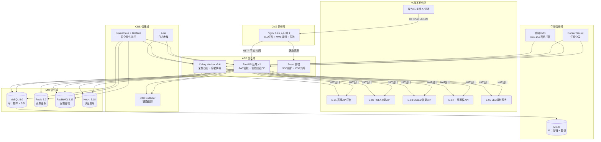
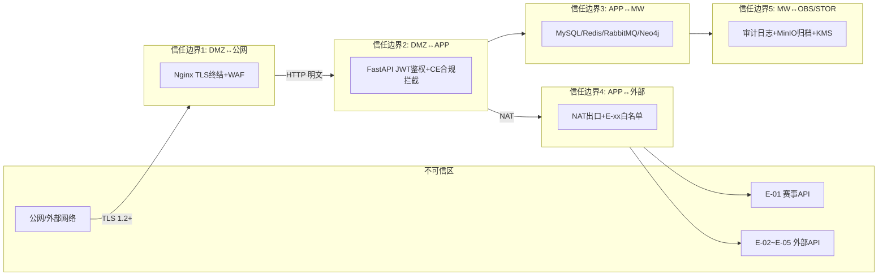

# AICoding 架构设计 · 安全设计

> 本文档为《AICoding 架构设计》核心产物之一，对应**安全架构设计模板**。
>
> 上游输入：《系统设计》（G4 已审核通过）§7 安全设计基线、§6 网络架构、§3.5 接口契约、§4 数据库设计；《高层架构设计》（G3 已审核通过）四层架构边界与纯被动红线；《资料摘要》（G1 已审核通过）原始诉求 D0–D4。
> 下游输出：为 G5 人工审核提供安全纵深评审依据，审核通过后归档为 `delivery/安全设计.md`。
> 本文档由 security-architect（严守正）在 G4 边界冻结前提下产出，不越权编写部署施工细节（归 platform-architect）、不重写系统模块/接口/数据库（归 system-architect 已完成）。

> **模板裁剪说明**：
> - 本系统为私有化自托管竞赛环境（单赛事、单租户、Docker Compose 单宿主机），不涉及公有云 DDoS 高防、云防火墙、CAM 策略等云原生安全产品，相关章节已裁剪并注明不适用原因。
> - §2.3「云账号与云资源访问」调整为「自托管环境运维账号与资源访问」，保留权限分离与高敏操作隔离原则。
> - 所有安全措施均映射回《系统设计》具体模块（M1–M11）、接口（§3.5 契约）、数据表（§4.2）与网络分区（§6.1）。

---

## 0. 元信息：修订记录

| 文档版本 | 发布日期 | 修订人 | 修订说明 |
| --- | --- | --- | --- |
| v1.0 | 2026-07-13 | 严守正（security-architect） | 初稿：七章 + 威胁—缓解映射表 + 信任边界图 + 敏感数据流图 + 阶段内中间确认自检报告（附录 C） |

---

## 1. 安全总体架构

### 1.1 安全总体架构图

本系统部署于私有化单赛事环境（16C64G 宿主机 Docker Compose），安全架构围绕**纯被动合规红线（违规探测=0 / IP 封禁=0）**展开，采用 DMZ / APP / MW / OBS 四区网络隔离 + Nginx WAF + Docker 容器安全 + 自研 KMS 密钥管理 + 全链路审计证据链的纵深防御体系。



**安全组件清单**：

| 组件 | 作用 | 部署位置 | 是否启用 | 说明 |
| --- | --- | --- | --- | --- |
| WAF（Nginx 规则） | 防御 SQL 注入、XSS、CSRF、路径遍历等 Web 攻击 | DMZ 区 Nginx 1.26 | 是 | 通过 Nginx 配置 regex 规则实现，覆盖 OWASP Top 10 核心攻击面 |
| 防火墙 / 安全组 | 容器网络隔离 + iptables 南北向与东西向流量管控 | 宿主机 + Docker 网络 | 是 | DMZ/APP/MW/OBS 四区网络隔离，默认拒绝 + 显式放通 |
| 容器安全 | 非根用户运行 + 只读文件系统 + 资源限制 | 全部 Docker 容器 | 是 | Docker Compose security_opt + user 指令 |
| KMS | 敏感数据加密（API Key / Token）+ AKSK 保护 | STOR 区 | 是 | 自研 KMS 轻量 AES-256，Docker Secret 分发主密钥 |
| 审计证据链 | 全链路操作留痕、防篡改、可检索导出 | MySQL t_audit_log + MinIO | 是 | 追加写不可修改，保留期 ≥1 年 |
| SOC（安全运营监控） | 安全事件监控、告警、入侵检测 | OBS 区 Prometheus + Loki | 是 | 基于 Prometheus 告警规则 + Loki 日志分析 |
| 堡垒机 | 运维通道审计、数据库操作日志 | 赛事运维统一堡垒机 | 是（赛事运维保障） | 运维操作全量记录，文件传输审计 |

> **不适用组件说明**：DDoS 高防不适用（竞赛环境内网无公网 DDoS 风险）；云防火墙不适用（自托管 Docker 网络隔离替代）；主机安全组件由赛事运维统一保障。

### 1.2 威胁模型

采用 **STRIDE** 方法，基于《系统设计》中的模块边界（M1–M11）、数据流（§2.3 业务流程）、接口契约（§3.5）、外部依赖（E-01~E-05）和运行形态（Docker Compose 单宿主机四区隔离）识别威胁。

#### 1.2.1 信任边界图



#### 1.2.2 STRIDE 威胁识别

| 威胁编号 | 威胁类别（STRIDE） | 威胁描述 | 受影响资产 | 攻击路径 |
| --- | --- | --- | --- | --- |
| T-S01 | 仿冒（Spoofing） | 攻击者窃取 JWT Token 后重放，冒充操作方/主理人身份访问系统 | M11 面板、M2 审批、M3 调度 | 中间人截获 HTTP 请求（虽 TLS 保护，但内网仍有风险）或 XSS 窃取 localStorage 中的 Token |
| T-S02 | 仿冒（Spoofing） | 外部 API Key（E-01 赛事 API Token / E-04 工商 API Token / E-05 LLM API Key）泄露后被冒用 | M1 合规网关 GW、M5 采集集群 | 密钥硬编码在代码/配置明文/日志中，攻击者获取后冒充系统调用外部 API |
| T-S03 | 仿冒（Spoofing） | 采集结果伪造：攻击者通过未授权接口注入伪造的采集结果，绕过四层核验 | M6 核验流水线、M7 资产图谱 | 采集结果上报接口（CollectResultEvent）缺少来源校验 |
| T-T01 | 篡改（Tampering） | 合规拦截规则（t_compliance_rule）被篡改，将主动探测动作从 BLOCK 改为 ALLOW | M1 合规拦截引擎 CE、纯被动红线 | 数据库直接写入或 SQL 注入修改 rule_code / decision 字段 |
| T-T02 | 篡改（Tampering） | 请求参数篡改：攻击者修改审批任务 ID（subject_id）或风险等级（risk_level），将 HIGH 降为 LOW 绕过人工复核 | M2 三级审批 | 接口参数未校验或越权修改他人审批任务 |
| T-T03 | 篡改（Tampering） | 审计日志（t_audit_log）被篡改或删除，销毁合规证据 | M9 合规证据链 | 数据库直接 DELETE/UPDATE 审计记录 |
| T-R01 | 否认（Repudiation） | 操作方否认执行过审批操作（通过/驳回），缺乏不可篡改的操作证据 | M2 审批、M9 证据链 | 审批接口未记录操作者 IP / 时间戳 / 操作上下文 |
| T-R02 | 否认（Repudiation） | 合规拦截事件不可追溯：CE 拦截了主动探测动作但未记录完整证据链 | M1 合规拦截 CE、M9 证据链 | 拦截日志缺少 traceId / actor / action / decision 完整字段 |
| T-I01 | 信息泄露（Information Disclosure） | 敏感密钥（API Key / Token）出现在应用日志、错误堆栈或 URL 参数中 | 全部模块、KMS | 日志框架打印配置对象、异常堆栈暴露环境变量 |
| T-I02 | 信息泄露（Information Disclosure） | 采集结果（企业资产情报）通过未授权接口或导出功能泄露给非授权用户 | M5 采集、M7 图谱、M10 看板 | 水平越权（IDOR）：接口未校验数据归属，评委/操作方越权访问 |
| T-I03 | 信息泄露（Information Disclosure） | 审计日志导出未脱敏，暴露内部 IP、路径、系统结构 | M9 证据链、M10 看板 | 战报/审计导出包含内部网络拓扑信息 |
| T-D01 | 拒绝服务（DoS） | 赛事 API 频控超限导致 IP 封禁（buffer > 95%），系统停摆 | M1 赛事 API 代理 GW、全部采集提交 | 多任务并发提交未限流，突破 buffer≤95% 红线 |
| T-D02 | 拒绝服务（DoS） | RabbitMQ 队列堆积导致采集任务无法消费，全链路阻塞 | M5 采集集群、M6 核验 | 采集结果事件大量堆积无消费或消费速度跟不上 |
| T-D03 | 拒绝服务（DoS） | Neo4j 慢查询或大图谱查询耗尽内存，图谱服务不可用 | M7 资产图谱 | 缺乏查询深度限制或未对 Cypher 查询做参数化约束 |
| T-E01 | 权限提升（Elevation of Privilege） | 水平越权：操作方 A 访问操作方 B 的审批任务或采集结果 | M2 审批、M5 采集 | 接口未校验 resource 归属（IDOR），仅校验角色不校验数据归属 |
| T-E02 | 权限提升（Elevation of Privilege） | 垂直越权：操作方通过接口篡改访问评委专属的图谱/日志只读功能 | M7 图谱、M9 证据链 | RBAC1 角色校验缺失或接口权限配置错误 |
| T-E03 | 权限提升（Elevation of Privilege） | 容器逃逸：攻击者通过漏洞从 Docker 容器逃逸到宿主机，获取 root 权限 | 全部服务、宿主机 | 容器以 root 运行或挂载了 Docker Socket 等高权限资源 |
| T-E04 | 权限提升（Elevation of Privilege） | 合规绕过：采集模块绕过 CE 合规拦截引擎直接发起主动探测 | M1 CE、M5 采集 | 出站动作未经过 CE 前置校验，或拦截引擎被旁路 |

#### 1.2.3 威胁—缓解措施映射表

| 威胁编号 | 威胁类别 | 缓解措施编号 | 缓解措施 | 落地章节 |
| --- | --- | --- | --- | --- |
| T-S01 | 仿冒 | M-S01a | JWT Token 设置短有效期（Access 2h）+ Redis 黑名单注销机制 + 同账号单点登录互踢 | §2.1.3 会话管理 |
| T-S01 | 仿冒 | M-S01b | Token 仅存储于 HttpOnly Cookie 或 Authorization Header，禁止 URL 携带；前端 localStorage 存储需配合 CSP 防 XSS | §2.1.3 / §3.2.5 传参禁忌 |
| T-S02 | 仿冒 | M-S02a | 外部 API Key 通过 Docker Secret 分发 + 自研 KMS AES-256 加密存储，运行时从 KMS 解密获取明文 | §6.1 密钥分级 / §6.3 红线 |
| T-S02 | 仿冒 | M-S02b | 外部 API 调用经 GW 代理统一出口，禁止业务模块直连外部 API；出口 IP 白名单限制 | §5.2.2 安全组规则 / §3.2.4 接口签名 |
| T-S03 | 仿冒 | M-S03 | 采集结果上报（CollectResultEvent）必须携带 task_id + source_name + traceId，核验层 L4 校验多源佐证数 ≥2 | §4.3.4 幂等性 / §3.2 接口契约 |
| T-T01 | 篡改 | M-T01 | t_compliance_rule 表仅允许管理员通过审批后修改；数据库账号最小权限，业务账号无 DDL 权限；SQL 注入防护 | §3.3.3 数据库安全 / §4.1 OWASP SQL注入 |
| T-T01 | 篡改 | M-T01b | 合规规则变更触发审计告警（AL-01 P0 级），变更前后快照对比 | §7.1 安全事件监控 / §7.2 审计日志 |
| T-T02 | 篡改 | M-T02 | 审批接口（POST /approval/{id}/decide）校验操作者权限 + 任务归属 + 风险等级不可由客户端篡改（服务端从 DB 读取） | §2.2.4 越权防护 / §4.3.1 越权防护 |
| T-T03 | 篡改 | M-T03 | t_audit_log 表追加写不可修改（MySQL 触发器禁止 UPDATE/DELETE）+ MinIO 归档追加写 + 日志独立存储 | §3.3.3 数据库安全 / §7.2 审计日志 |
| T-R01 | 否认 | M-R01 | 审批操作全量记录：actor / action / source_ip / timestamp / decision / detail JSON，写入 t_audit_log | §7.2 审计日志（业务操作审计） |
| T-R02 | 否认 | M-R02 | CE 合规拦截事件必须记录 traceId / actor / action / decision / rule_hit / source_ip 完整字段 | §7.2 审计日志（合规证据链） |
| T-I01 | 信息泄露 | M-I01a | 日志框架配置禁止打印 API Key / Token / 密码字段；异常处理统一拦截，禁止堆栈输出到响应体 | §4.2 输出安全 / §3.3.5 数据使用安全 |
| T-I01 | 信息泄露 | M-I01b | 配置文件中密钥使用 KMS 加密存储，Docker Secret 挂载，禁止明文出现在 YAML / .env 被日志采集 | §6.3 密钥使用红线 |
| T-I02 | 信息泄露 | M-I02 | 全部查询/修改接口校验数据归属（tenant_id + resource ownership）；列表接口按归属过滤；导出需审批 | §2.2.4 越权防护 / §3.3.5 数据使用安全 |
| T-I03 | 信息泄露 | M-I03 | 战报/审计导出脱敏：隐藏内部 IP（替换为 ***.***.x.x）、隐藏文件路径、隐藏中间件版本号 | §3.3.5 数据使用安全（展示脱敏） |
| T-D01 | 拒绝服务 | M-D01 | 赛事 API 提交频控硬闸 buffer≤95%（Redis 计数器实时监控）+ 分片提交 + 排队机制 | §5.2.3 安全组规则（出口限流）/ §4.3.4 幂等性 |
| T-D02 | 拒绝服务 | M-D02 | RabbitMQ 消费者设置最大并发 + 死信队列 + 队列堆积告警（AL-04 P2 级，阈值≥10万） | §5.4 中间件安全 / §7.1 安全事件监控 |
| T-D03 | 拒绝服务 | M-D03 | Neo4j Cypher 查询参数化 + 查询深度限制（max 3 hop）+ 查询超时 5s + 内存限制 8G | §5.4 中间件安全 / §4.1 SQL注入防护 |
| T-E01 | 权限提升 | M-E01 | 全部接口校验 JWT 角色 + 数据归属（tenant_id + subject_id/operator 归属）；IDOR 防护切面统一拦截 | §2.2.4 越权防护 / §4.3.1 越权防护 |
| T-E02 | 权限提升 | M-E02 | RBAC1 三级层级（操作方→主理人→评委），接口级权限由 FastAPI 中间件统一鉴权；评委仅只读 | §2.2.1 权限模型 / §2.2.2 权限维度 |
| T-E03 | 权限提升 | M-E03 | 全部容器以非根用户（UID 1000）运行 + 只读文件系统（read_only: true）+ 禁止特权容器 + 不挂载 Docker Socket | §5.3.2 容器安全 |
| T-E04 | 权限提升 | M-E04 | 出站动作统一经 CE 合规拦截引擎前置校验（@ComplianceCheck 注解 + 拦截器），fail-closed 默认拦截；旁路 CE 的出站请求触发 P0 告警 | §4.3.5 关键操作二次验证 / §1.2.4 高危缓解 |

#### 1.2.4 高危威胁缓解路径说明

本系统最高危威胁为 **T-E04（合规绕过）**与 **T-D01（API 封禁）**，直接关联纯被动红线（违规=0 / 封禁=0）。

- **T-E04 缓解路径**：采用应用层拦截器（ComplianceInterceptor）而非网关层签名，原因：①采集模块出站动作需在代码层精确识别 actionType（PASSIVE_QUERY / ACTIVE_SCAN / ACTIVE_HTTP），网关层无法区分被动查询与主动探测；②fail-closed 语义要求任何未明确放行的出站动作默认拦截，应用层拦截器可在方法调用链中精确嵌入。权衡：应用层拦截对性能影响可忽略（单次校验 1ms 以内），但要求全部出站代码路径均经过 @ComplianceCheck 注解，CICD 需增加静态扫描门禁。
- **T-D01 缓解路径**：采用 Redis 实时计数器监控赛事 API buffer 使用率（每秒刷新），buffer≥90% 触发预警（P2 告警），buffer≥95% 触发限流熔断（P0 告警 + 提交排队）。非 mTLS 方案原因：赛事 API 为外部强势上游（Conformist 模式），无法要求对方配合 mTLS 双向认证。

---

## 2. 身份与访问管理（IAM）

### 2.1 身份认证（Authentication）

#### 2.1.1 用户登录

本系统为私有化竞赛环境，用户角色固定为三类：操作方（operator）/ 主理人（manager）/ 评委（judge），不支持自行注册。

- **登录方式一：账号密码登录**。操作方/主理人/评委均使用账号密码登录，密码前端 RSA 加密提交，密文传输（公钥内嵌前端，私钥服务端 KMS 托管）。
- **登录方式二：操作方临时令牌登录**。赛事值守场景下，主理人可为操作方签发临时登录令牌（一次性，有效期 4h），通过安全通道（IM/线下）传递，首次登录后强制改密。此方式满足赛事期间快速授权需求，避免忘记密码导致赛事延误。
- **图形验证码强制场景**：连续登录失败 2 次后强制图形验证码（Sliding Puzzle），防止暴力破解。
- **MFA / 2FA**：竞赛环境不启用硬件令牌/OTP（系统设计 §7.2.1 已明确，三级审批替代 MFA 等效控制）。高敏操作（密钥变更、规则修改、数据导出）通过三级审批 + 操作方二次确认实现等效控制。

> **认证方式 ≥ 2 种已满足**：账号密码 + 临时令牌。

#### 2.1.2 密码策略（量化阈值）

| 项 | 基线值 | 说明 |
| --- | --- | --- |
| 最小长度 | ≥ 8 位（业务系统）；数据库/宿主机 ≥ 12 位 | 竞赛环境简化，但数据库保持高基线 |
| 复杂度 | 同时包含数字 + 大写字母 + 小写字母（可配置特殊字符开关） | 后端注册时校验，前端实时提示 |
| 加密传输 | 前端 RSA 公钥加密提交，密文传输 | 公钥内嵌前端 JS，私钥 KMS 托管 |
| 加密存储 | bcrypt 加盐哈希（cost factor = 10）；禁止 MD5 / SHA1 明文 | 用户密码不可逆存储 |
| 更换周期 | 赛事周期切换时强制更换（基线 30 天） | 与密钥轮换周期一致 |
| 重复限制 | 不允许使用最近 3 次的密码 | 存储历史哈希比对 |
| 失败锁定 | 连续失败 5 次锁定 15 分钟（次数和时长可配置） | Redis 计数 gw:login_fail:{username} TTL 15min |
| 自动登出 | 30 分钟无操作自动登出（前端心跳检测） | Access Token 2h 有效期兜底 |
| 注册策略 | 不允许自行注册，仅管理员创建；改密需原密码验证 | 竞赛环境固定用户集 |

#### 2.1.3 会话管理

| 维度 | 取值 | 说明 |
| --- | --- | --- |
| Token 类型 | JWT（无状态）+ Refresh Token | 禁止 URL 携带 Token，仅通过 Authorization: Bearer Header 传递 |
| Access Token 有效期 | 2 小时 | JWT Payload 含 userId / role / tenantId / exp / iat |
| Refresh Token 有效期 | 7 天 | 存储于 Redis key gw:refresh:{userId}，刷新时旋转 |
| 互踢机制 | 同账号新登录踢掉旧会话（Redis gw:session:{userId} 唯一） | 旧 Token 加入 Redis 黑名单 gw:blacklist:{jti} TTL = 剩余有效期 |
| 风险登录检测 | 异地登录（IP C 段变化）+ 异常时段（02:00-06:00）+ 连续失败后成功 | 触发风险告警（P2 级），记录审计日志 |
| 注销机制 | 调用 /api/v1/auth/logout → JWT jti 加入 Redis 黑名单 → 前端清除 Token | 黑名单 TTL = Token 剩余有效期，过期自动清理 |
| Token 防重放 | JWT Payload 含 jti（唯一标识）+ iat（签发时间），网关层校验 jti 是否在黑名单 | 每次请求校验 jti 有效性 |

### 2.2 授权与权限控制（Authorization）

#### 2.2.1 权限模型

采用 **RBAC1**（用户—角色—权限 + 层级继承），理由：系统设计 §7.2.5 已冻结此选择，三级人机审批（操作方→主理人→评委）需要层级管控，RBAC1 的角色继承机制天然支持。

| 角色编号 | 角色名 | 层级 | 权限范围 | 继承关系 |
| --- | --- | --- | --- | --- |
| R-01 | 评委（judge） | L3（最高） | 图谱只读 / 审计日志检索 / 源码核验入口 | 继承 R-02 全部只读权限 |
| R-02 | 主理人（manager） | L2 | 看板审阅 / 里程碑把控 / 资源调度裁决 / 审批复核 / 战报导出 | 继承 R-03 全部权限 + 审批裁决权 |
| R-03 | 操作方（operator） | L1（基础） | 人机协同面板操作 / 三级审批发起 / 算力临时上调 / 断点续跑 / 采集任务管理 | 基础操作权限 |

> **权限模型选择依据**：系统设计 §7.2.5 明确 RBAC1（角色 + 层级继承），三级审批需层级管控。不采用 ABAC 因为本系统为单租户竞赛环境，属性条件不构成差异化管控需求；不采用 RBAC0 因为三级审批的层级继承（主理人可覆盖操作方决策）是核心业务需求。

#### 2.2.2 权限维度

| 维度 | 机制 | 落地方式 | 关联接口 |
| --- | --- | --- | --- |
| 接口级 | FastAPI 中间件统一鉴权（JWT 角色校验 + 接口签名） | 路由元信息 meta.roles=[...]，全局路由守卫拦截；后端 @require_role 装饰器 | §3.5.5 路由设计：/console/approval 需 operator、/judge/verify 需 judge |
| 数据级 | 行级（按 tenant_id + operator 归属过滤）；列级（字段脱敏） | SQL 查询条件自动注入 tenant_id=1；敏感字段（API Key）查询时脱敏返回 | §4.2 数据库设计：全部表含 tenant_id 字段 |
| 功能级 | 前端菜单/按钮/操作细粒度控制 | 前端路由守卫 + 后端接口双重校验 | M11 面板：操作方可见审批队列，评委不可见 |

**接口级权限矩阵**（与系统设计 §3.5.5 路由设计对齐）：

| 路径 | 允许角色 | 操作类型 | 鉴权要求 |
| --- | --- | --- | --- |
| /login | 全部 | 公开 | 无 |
| /console/compliance | operator, manager | 读 | 已登录 |
| /console/wnsr | operator, manager | 读 | 已登录 |
| /console/approval | operator | 读写 | 已登录 + 角色 operator |
| /console/task-board | operator | 读写 | 已登录 |
| /judge/verify | judge | 只读 | 已登录 + 角色 judge |
| /api/v1/audit/export | manager | 读 | 已登录 + 角色 manager + 审批 |

#### 2.2.3 多租户隔离

本系统为**单租户竞赛环境**（高层架构 §4.2 明确非多租户），采用**逻辑隔离**保留字段方式：

- 全部数据表含 `tenant_id BIGINT NOT NULL DEFAULT 1` 字段（系统设计 §4.1 全局数据约定），所有查询自动注入 `WHERE tenant_id = 1`。
- 保留 tenant_id 字段以统一查询契约与未来扩展（决赛可演示多企业资产，但非多租户隔离产品）。
- 不采用物理隔离原因：单赛事环境无多租户隔离需求，物理隔离增加部署成本无收益。

#### 2.2.4 越权防护

| 越权类型 | 防护机制 | 落地方式 |
| --- | --- | --- |
| 水平越权（IDOR） | 全部查询/修改接口校验资源归属（tenant_id + operator/userId 归属） | IdempotencyInterceptor 切面统一拦截 + 接口内显式校验 resource.owner == current_user |
| 垂直越权 | RBAC1 角色校验 + 接口拦截器双层校验 | FastAPI @require_role 装饰器 + 路由守卫；评委接口标记 read_only=true |
| 接口越权 | 接口签名 HMAC-SHA256 + nonce + timestamp 防重放 | 外部 API 调用（E-01~E-05）强制签名；内部接口 JWT 鉴权 |

**IDOR 防护切面实现**：

```python
# common/aspect/idor_guard.py
@app.middleware("http")
async def idor_guard(request: Request, call_next):
    # 从 JWT 解析当前用户
    user = get_current_user(request)
    # 对 /api/v1/approval/{id} 类接口校验归属
    resource_id = extract_resource_id(request.url.path)
    if resource_id:
        owner = await get_resource_owner(resource_id)
        if owner != user.id and user.role != "manager":
            return JSONResponse(status_code=403, content={"code": "400301", "msg": "无权访问"})
    return await call_next(request)
```

### 2.3 自托管环境运维账号与资源访问

本系统为私有化自托管环境，不涉及公有云账号（CAM / IAM），运维账号管理遵循以下原则：

#### 2.3.1 账号策略

- **宿主机账号**：严禁 root 远程 SSH 登录；运维使用独立账号（ops-admin），通过赛事运维统一堡垒机接入。
- **数据库账号**：业务账号（passive_app）仅 DML 权限，无 DDL 权限；运维账号（passive_dba）独立，仅通过堡垒机使用。
- **容器账号**：全部容器以非根用户（UID 1000:appuser）运行，禁止容器内 root 操作。

#### 2.3.2 权限分离

| 人员类型 | 认证方式 | 权限范围 | 使用场景 |
| --- | --- | --- | --- |
| 运维人员（ops-admin） | 密码 + 堡垒机双因素 | 宿主机 SSH / Docker 操作 / 数据库运维 | 日常运维、故障排查 |
| 研发人员（dev-user） | 密码 + 堡垒机 | 仅 dev 环境访问；禁止访问 prod 数据库 | 开发调试 |
| 应用服务（passive_app） | Docker Secret 分发密码 | MySQL DML / Redis 读写 / RabbitMQ 读写 | 应用运行时 |
| 评委/主理人 | JWT（账号密码登录） | 业务面板只读/审批 | 赛事使用 |

#### 2.3.3 高敏权限分离

| 高敏操作 | 权限要求 | 审批要求 | 审计要求 |
| --- | --- | --- | --- |
| 合规规则修改（t_compliance_rule） | ops-admin + manager 双人确认 | 三级审批 HIGH 级 | 全量审计 + 变更前后快照 |
| 数据库 DDL 操作 | passive_dba 专用账号 | 堡垒机操作 + manager 审批 | 堡垒机日志 + 数据库审计 |
| 密钥轮换 | ops-admin 操作 | manager 确认 | 审计日志 + 轮换记录 |
| 数据导出 | operator 发起 | manager 审批 + 审计留痕 | 导出人/时间/行数/水印 |

---

## 3. 数据安全

### 3.1 数据分级

本系统数据分级与系统设计 §7.2.2 一致（G4 已冻结），分为 L1~L4 四级：

| 等级 | 类别 | 本系统具体数据 | 处理策略 | 关联数据表 |
| --- | --- | --- | --- | --- | 
| L1 | 公开 | 资产图谱拓扑结构（企业-子-域-号-程序关联关系，不含具体资产值） | 无特殊管控，可对评委展示 | t_asset_node / t_asset_relation（拓扑结构部分） |
| L2 | 内部 | 采集结果（域名/公众号 ID/小程序 ID/工商股权数据）、被动源清单、算力配额快照 | 需内部鉴权访问；操作方/主理人可查看 | t_collect_result / t_passive_source / t_compute_quota |
| L3 | 敏感 | 审批记录（审批任务/审批结论/操作者）、采集任务状态、度量快照 | 加密传输 + 审计留痕 + 导出审批 | t_approval_task / t_collect_task / t_metric_snapshot |
| L4 | 高敏 | 合规证据链日志（全链路操作审计）、API Key（E-01~E-05）、LLM API Key、数据库密码 | KMS AES-256 加密存储 + 强脱敏 + 严格审计 + 禁止导出 | t_audit_log / Docker Secret / KMS 密文 |

> **分级依据**：系统设计 §7.2.2 数据安全表已冻结 L1~L4 归属。L4 加密强度为 AES-256（自研 KMS），L3 明文存储但审计留痕，L2 明文存储需鉴权，L1 无管控。

### 3.2 数据传输安全

#### 3.2.1 公网访问

- 全链路 **HTTPS / TLS 1.2+**，Nginx 1.26 作为 TLS 终结点（系统设计 §6.2.1）。
- 禁用 SSLv3、TLS 1.0/1.1；Nginx 配置 `ssl_protocols TLSv1.2 TLSv1.3`。
- 密码套件优先 ECDHE + AES-GCM，禁用 RC4/DES/3DES。
- HTTP 80 强制 301 跳转 HTTPS 443。

#### 3.2.2 服务内部访问

- **DMZ → APP 区**：HTTP 明文（Docker 内网，系统设计 §6.3 明确不启用 mTLS）。信任边界由 Docker 网络隔离保障：DMZ 网络仅允许访问 APP 网络的 8080 端口。
- **APP → MW 区**：HTTP 明文（Docker 内网）。MySQL / Redis / RabbitMQ / Neo4j 仅允许 APP 网络访问。
- **APP → 外部（E-01~E-05）**：HTTPS（外部 API 均为 TLS），经 NAT 出口 + IP 白名单。
- **不启用 mTLS 的理由**：单宿主机 Docker Compose 内网，网络隔离已提供信任边界保障；mTLS 增加证书管理复杂度无收益（系统设计 §6.3 已冻结此决策）。

#### 3.2.3 数据库连接

- MySQL 8.0 开启 SSL 连接（`require_secure_transport=ON`），应用通过 SQLAlchemy 连接池指定 `ssl_ca / ssl_cert / ssl_key`。
- Redis 7.2 开启 TLS（`tls-port 6379`），应用通过 Redis 客户端 SSL 配置连接。
- Neo4j 5.18 开启 Bolt SSL（`dbms.ssl.bolt.enabled=true`）。
- RabbitMQ 3.13 管理端口开启 TLS，AMQP 内网通信可明文（Docker 内网）。

> **数据库 SSL 启用依据**：虽为 Docker 内网，但 MySQL/Redis 含 L4 敏感数据（审计日志、API Key 密文），SSL 连接防止内网嗅探。系统设计 §7.2.2 存储加密已明确敏感字段 AES-256 加密，SSL 连接为传输层补充。

#### 3.2.4 接口签名

外部 API 调用（E-01 赛事 API / E-02 FOFA / E-03 Shodan / E-04 工商 API / E-05 LLM）强制接口签名：

| 签名维度 | 取值 |
| --- | --- |
| 签名算法 | HMAC-SHA256 |
| 签名字段 | HTTP Method + 请求路径 + 请求体 SHA256 摘要 + timestamp + nonce |
| 防重放 | nonce 唯一性校验（Redis 缓存 5min，重复拒绝）+ timestamp 偏移 ≤5min |
| 签名传递 | Header: `X-Signature: {hmac}` / `X-Timestamp: {ts}` / `X-Nonce: {uuid}` |
| 密钥来源 | 每个外部 API 独立密钥，从 KMS 运行时解密获取 |

**内部接口签名**：内部 FastAPI 接口不强制 HMAC 签名（JWT 鉴权已覆盖），但写接口强制幂等键（X-Idempotency-Key，系统设计 §3.5.2）。

#### 3.2.5 传参禁忌

| 禁忌项 | 说明 | 检查方式 |
| --- | --- | --- |
| 禁止 URL 携带 Token | JWT 仅通过 Authorization Header 传递，禁止 `?token=xxx` | Nginx 规则拦截 URL 中的 token/jwt/key 参数 |
| 禁止 URL 携带 API Key / AKSK | 外部 API 密钥仅通过 Header 或请求体传递 | 代码审查 + CICD 扫描 |
| 禁止 URL 携带敏感数据 | 手机号/身份证/密码禁止出现在 URL 参数 | 本系统不采集个人隐私（D0§8⑤），但仍禁止 URL 传敏感字段 |
| 禁止日志打印敏感参数 | API Key / Token / 密码禁止出现在任何日志级别 | 日志框架配置 Pattern 过滤 + 代码审查 |
| 禁止 GET 请求携带写操作参数 | 写操作必须 POST，参数在 Body | Nginx 规则限制 GET 请求 Body 大小为 0 |

### 3.3 数据存储安全

#### 3.3.1 加密存储

| 数据类型 | 加密算法 | 加密层级 | 密钥管理 | 关联表/字段 |
| --- | --- | --- | --- | --- |
| LLM API Key（E-05） | AES-256-CBC | 应用层加密（KMS SDK 加密后存 Docker Secret） | 自研 KMS 主密钥 + Docker Secret 分发 | Docker Secret / .env 加密 |
| 工商 API Token（E-04） | AES-256-CBC | 应用层加密 | 自研 KMS | Docker Secret |
| 赛事 API Token（E-01） | AES-256-CBC | 应用层加密 | 自研 KMS | Docker Secret |
| FOFA/Shodan API Key（E-02/E-03） | AES-256-CBC | 应用层加密 | 自研 KMS | Docker Secret |
| 数据库密码 | AES-256-CBC | 应用层加密 | 自研 KMS | Docker Secret |
| 用户密码 | bcrypt（加盐，cost=10） | 不可逆哈希 | 盐值随机生成 | t_user.password_hash（如有） |
| 审计日志 | 明文存储 + MinIO 归档追加写 | 不可篡改保障（触发器禁 UPDATE/DELETE） | — | t_audit_log |
| 业务数据（采集结果/审批/图谱） | 明文存储 | 竞赛环境无加密要求 | — | t_collect_result 等 |

> **加密策略依据**：系统设计 §7.2.2 已冻结敏感字段 AES-256 加密存储，业务数据明文（竞赛环境）。KMS 主密钥通过 Docker Secret 分发，不硬编码到代码或配置。

#### 3.3.2 敏感字段单向哈希加盐

| 字段 | 哈希算法 | 盐值策略 | 存储方式 |
| --- | --- | --- | --- |
| 用户密码 | bcrypt（cost=10） | bcrypt 内置随机盐 | password_hash VARCHAR(100) |
| JWT Token 摘要（黑名单） | SHA-256 | 无需加盐（Token 本身已含随机 jti） | Redis gw:blacklist:{jti} |

#### 3.3.3 数据库安全

| 维度 | 取值 | 落地方式 |
| --- | --- | --- |
| 账号最小权限 | 业务账号 passive_app 仅 DML（SELECT/INSERT/UPDATE/DELETE），无 DDL（CREATE/ALTER/DROP） | MySQL GRANT 精确授权 |
| 禁止业务直连 root | root 账号仅本地管理，禁止远程连接；运维用 passive_dba | MySQL 用户绑定 127.0.0.1 |
| 慢查询日志 | 开启 slow_query_log，阈值 2s，输出到文件 + Loki 采集 | MySQL 配置 slow_query_log_file |
| 审计日志 | MySQL Enterprise Audit Plugin（社区版用 MariaDB Audit Plugin 替代），记录 DDL/DML 操作 | 审计日志输出到独立文件 |
| SSL 连接 | 开启 require_secure_transport=ON | 应用连接池配置 SSL 证书 |
| 备份加密 | 全量备份文件 AES-256 加密后归档至 MinIO | 备份脚本调用 KMS 加密 |
| 审计日志防篡改 | t_audit_log 表创建触发器禁止 UPDATE/DELETE | `CREATE TRIGGER prevent_audit_modify BEFORE UPDATE ON t_audit_log FOR EACH ROW SIGNAL SQLSTATE '45000'` |

#### 3.3.4 文件存储安全

本系统文件存储使用 MinIO（C-06，系统设计 §3.1.3），存储内容：备份文件、审计归档、战报导出。

| 维度 | 取值 |
| --- | --- |
| 服务端加密 | MinIO 启用 SSE-S3（服务端加密） |
| 访问控制 | 私有桶 + 预签名 URL（短有效期 15min） |
| 防盗链 | MinIO Referer 校验（仅允许本系统域名） |
| 上传文件安全 | 类型校验（白名单：.json/.csv/.pdf）+ 大小限制（≤50MB）+ 随机重命名（UUID） |
| 审计归档桶 | 独立 bucket `audit-archive`，启用版本控制（Versioning）+ 对象锁定（Object Lock 不可变模式） |
| 备份桶 | 独立 bucket `backup`，启用版本控制 |

#### 3.3.5 数据使用安全

| 维度 | 取值 | 落地方式 |
| --- | --- | --- |
| 展示脱敏 | API Key 显示为 `sk-****abcd`；内部 IP 显示为 `***.***.x.x`；文件路径显示为 `/app/***/config` | 后端 VO 序列化时脱敏（@SensitiveField 注解） |
| 数据导出管控 | 导出需 manager 审批 + 审计留痕 + 水印（操作人 + 时间戳）+ 行数限制（≤10000 行/次） | M10 看板导出接口强制审批流 |
| 战报导出脱敏 | 隐藏内部 IP / 中间件版本 / 文件路径 / Docker 网络结构 | 导出模板配置脱敏规则 |
| 数据销毁 | 逻辑删除（deleted=1）+ 定期物理销毁：采集结果 90 天后归档、任务快照 7 天后物理删除、审计日志 1 年后归档至 MinIO | 定时任务执行清理 |

#### 3.3.6 数据备份与异地容灾

| 存储类型 | 备份策略 | RPO | RTO | 归档位置 |
| --- | --- | --- | --- | --- |
| MySQL（C-01） | 全量每日 + binlog 增量每 15min | ≤15min | ≤30min | MinIO 独立 bucket（加密） |
| Redis（C-02） | RDB 每小时快照 | ≤1h | ≤1min | MinIO |
| Neo4j（C-04） | 全量每日导 CQL | ≤24h | ≤2h | MinIO |
| MinIO（C-06） | 跨目录副本 | — | — | 本机多盘 |

> **备份策略依据**：系统设计 §4.3.2 已冻结 RPO ≤15min / RTO ≤30min。竞赛环境无异地容灾需求（单赛事环境），备份与生产在同一宿主机不同目录（MinIO 独立 bucket），满足赛事期间的快速恢复需求。

#### 3.3.7 隐私合规

本系统为竞赛作品 + 政企巡检演示原型（非通用商用产品），隐私合规评估如下：

| 合规维度 | 适用性 | 评估结论 | 依据 |
| --- | --- | --- | --- |
| 个人信息保护法（PIPL） | 部分适用 | 本系统不采集个人隐私数据（D0§8⑤ Non-goals：不采集 9 类维度以外数据，不含个人隐私/未授权资产）。采集对象为企业数字资产情报（域名/公众号/小程序/工商股权），属公开信息。操作方/主理人/评委的账号信息（用户名/密码哈希）属于个人信息，已采取最小化采集（仅用户名+密码哈希，不采集手机号/身份证） | D0§8⑤ / D1§一.2④ |
| GDPR | 不适用 | 本系统不涉及欧盟数据主体，部署于中国境内私有化环境 | 高层架构 §4.2 部署形态 |
| 数据出境合规 | 不适用 | 私有化自托管，数据不出境；外部 API 调用（E-01~E-05）仅查询公开资产情报，不传输个人信息 | 高层架构 §4.2 |
| 用户同意机制 | 部分适用 | 操作方/主理人/评委账号由管理员创建，首次登录强制改密视为同意；无隐私政策弹窗需求（竞赛环境固定用户集） | D0§8④ 非商用产品 |
| 数据最小化 | 已满足 | 仅采集 9 类维度公开资产情报；不采集个人隐私；操作方账号仅含用户名+密码哈希，无手机号/邮箱/身份证 | D0§8⑤ / D1§一.2④ |
| 可被遗忘权 | 不适用 | 竞赛环境固定用户集，无用户注销需求；赛后统一清理 | 高层架构 §4.2 |

> **合规结论**：本系统不涉及个人信息大规模采集与处理，PIPL 仅部分适用（操作方账号信息），GDPR/数据出境不适用。无需发起中间确认（决策与用户原始诉求 D0§8⑤ 完全一致，未新增合规义务）。

---

## 4. 应用安全

> 本章以 OWASP Top 10 为框架，结合本系统技术栈（Python 3.11 + FastAPI + React 18 + MySQL + Neo4j + Docker），逐项给出具体防护措施。

### 4.1 输入安全（OWASP Top 10 防护清单）

| 风险 | 防护措施 | 落地方式 | 关联模块/接口 |
| --- | --- | --- | --- |
| SQL 注入 | 全部数据库操作强制参数化查询（SQLAlchemy ORM 参数绑定）；动态字段（order by / group by）使用白名单校验，禁止拼接 | SQLAlchemy text() + bindparams；FastAPI Pydantic 校验输入 | M1（t_compliance_rule）/ M5（t_collect_result）/ M6（t_verify_result） |
| XSS | 后端输出编码（HTML / JS / URL 上下文分别编码）；前端 React 默认转义 + DOMPurify 净化富文本；CSP 策略限制脚本来源 | FastAPI JSONResponse 自动编码；前端 `Content-Security-Policy: default-src 'self'; script-src 'self'` | M11 面板（React 前端） |
| CSRF | JWT 无 Cookie 依赖（Authorization Header 传递），天然防 CSRF；敏感操作（审批/提交/导出）增加 X-Requested-With Header 校验 + 幂等键 | 前端 Axios 拦截器自动添加 X-Requested-With；后端校验 Header 存在 | M2 审批（POST /approval/{id}/decide） |
| 命令注入 | 系统禁用 os.system / subprocess.shell=True；采集执行器（Amass/Subfinder）通过 CLI 参数数组形式调用，禁止拼接命令 | Python subprocess.run(args_list, shell=False) | M5 采集集群（C1-C4 适配器调用开源执行器） |
| 反序列化 | 禁用 Python pickle.loads 对不可信数据；JSON 反序列化使用 Pydantic 模型校验；禁用 fastjson autoType / Jackson @class | Pydantic BaseModel 校验全部 API 输入 | 全部 API 入口 |
| SSRF | 采集目标 URL 白名单（t_passive_source 被动源白名单）；内网 IP 黑名单（10.0.0.0/8 / 172.16.0.0/12 / 192.168.0.0/16）；DNS 解析后校验 IP 不在黑名单 | PassiveSourceAdapter 校验 source_name ∈ 白名单 | M5 采集集群（被动源 URL 校验） |
| 文件上传 | 类型校验（魔数 + 扩展名白名单 .json/.csv/.pdf）+ 大小限制（≤50MB）+ 随机重命名（UUID）+ 隔离存储桶 | MinIO 上传接口校验 + 后端文件头检测 | M9 审计导出 / M10 战报导出 |
| XXE | 本系统不使用 XML 解析（全 JSON 通信），不适用；如需解析 XML 使用 defusedxml 库禁用外部实体 | defusedxml 替代 xml.etree.ElementTree | 不涉及（全 JSON） |
| 开放重定向 | 跳转 URL 白名单（仅允许本系统域名 /console/*）；OAuth 回调 URL 校验 redirect_uri ∈ 白名单 | FastAPI RedirectResponse 校验 URL 域名 | M11 面板（登录后跳转） |
| 路径遍历 | 文件路径校验禁止 `../` 序列；Nginx 配置 `alias` 时限制 root 目录；文件名参数白名单（仅字母数字+连字符） | 后端 pathlib.Path.resolve() 后校验是否在允许目录内 | M9 审计导出 / M10 战报导出 |

### 4.2 输出安全

#### 4.2.1 统一异常处理

- 全部异常通过 FastAPI exception_handler 统一捕获，返回标准 Result 结构（code / msg / data / traceId / timestamp）。
- **禁止暴露堆栈、SQL、内部路径、文件名、行号**到响应体。
- 错误码遵循系统设计 §3.5.1 全局错误码体系（6 位数字 MMCCSS）。

```python
@app.exception_handler(Exception)
async def global_exception_handler(request: Request, exc: Exception):
    trace_id = request.headers.get("X-Trace-Id", generate_trace_id())
    logger.error(f"Unhandled exception trace_id={trace_id}", exc_info=True)
    return JSONResponse(
        status_code=500,
        content={"code": "000001", "msg": "系统繁忙，请稍后再试", "data": None, "traceId": trace_id, "timestamp": datetime.utcnow().isoformat()}
    )
```

#### 4.2.2 调试信息

- 生产环境（prod）关闭 FastAPI 文档 `/docs` 和 `/redoc`（`docs_url=None, redoc_url=None`）。
- 调试信息（debug / stacktrace / SQL 日志）仅在 dev 环境开启，prod 环境严格关闭。
- Nginx 配置 `server_tokens off` 隐藏版本号。

### 4.3 业务逻辑安全

#### 4.3.1 越权防护

- **水平越权（IDOR）**：全部查询/修改接口通过 IDOR 防护切面（§2.2.4）校验资源归属。每个接口必须显式校验 `resource.tenant_id == current_user.tenant_id && resource.operator == current_user.id`。
- **垂直越权**：RBAC1 角色校验由 FastAPI @require_role 装饰器统一拦截。评委接口标记 `read_only=true`，禁止 POST/PUT/DELETE。

#### 4.3.2 防刷防爬

| 维度 | 限制 | 触发动作 |
| --- | --- | --- |
| 全局 QPS | 1000（系统设计 §3.5.3） | 返回 429 + 000002 |
| 单 IP QPS | 50 | 返回 429 + 标记 IP |
| 单用户 QPS | 20 | 返回 429 |
| 重保接口（提交/审批） | 单用户 10 次/分钟 | 锁定 15 分钟 |
| 登录失败 | 5 次/15min | 锁定 15min |

> 限流实现：Nginx 全局限流（limit_req_zone）+ FastAPI RateLimitInterceptor（Redis 计数器），双层防护。

#### 4.3.3 防薅羊毛

本系统非消费类应用，不涉及薅羊毛场景。但防重复提交机制如下：

- 情报提交：幂等键 biz_req_no + Redis 24h 防抖。
- 审批操作：幂等键 id+operator + 状态机校验（PENDING→APPROVED 不可逆）。
- 算力分配：幂等键 task_id + tick_id 防重复分配。

#### 4.3.4 幂等性

遵循系统设计 §3.5.2 幂等性约定：

| 接口类型 | 幂等键来源 | 防抖时长 |
| --- | --- | --- |
| 情报提交（POST /gateway/submit） | biz_req_no | Redis 24h |
| 审批决定（POST /approval/{id}/decide） | id + operator | Redis 24h |
| 算力分配（POST /scheduler/allocate） | task_id | Redis 24h |
| 采集执行（POST /collector/run） | task_id | Redis 24h |
| 核验（POST /verifier/verify） | result_id | Redis 24h |

#### 4.3.5 关键操作二次验证

| 关键操作 | 二次验证方式 | 关联模块 |
| --- | --- | --- |
| 合规规则修改 | 三级审批 HIGH 级 + manager 确认 + 变更前后快照 | M1 CE |
| 情报批量提交 | 幂等键 + 频控校验 + CE 合规前置校验 | M1 GW |
| 数据导出 | manager 审批 + 水印 + 审计留痕 | M10 看板 |
| 密钥轮换 | manager 确认 + 审计日志 + 轮换记录 | KMS |
| 出站动作（采集） | CE 合规拦截引擎前置校验（@ComplianceCheck 注解），fail-closed | M1 CE / M5 采集 |

### 4.4 第三方与供应链安全

| 维度 | 防护措施 | 落地方式 |
| --- | --- | --- |
| 开源组件漏洞扫描 | CICD 流水线集成 pip-audit（Python）/ npm audit（前端），CVE 高危强制拦截 | pipeline 阶段 `pip-audit --strict` + `npm audit --audit-level=high` |
| 开源协议合规审查 | 开源工具留档（R5）：名称/版本/许可证/用途/调用边界，台账维护 | t_passive_source 表 license 字段；决赛一键出具证明 |
| 开源执行器被动性校验 | Amass/Subfinder/OneForAll 等开源执行器必须禁用主动模块（暴力/域传送/主动 HTTP），仅启用被动源 | CE 合规拦截引擎校验 actionType ∈ {PASSIVE_QUERY}；R1 验收要点② |
| 第三方服务接入评估 | FOFA/Shodan 被动 API 接入前评估：数据传输方式（HTTPS）、存储位置（不入库仅查询）、合规资质 | ACL 防腐层 PassiveSourceAdapter 统一封装 |
| 镜像源/仓库安全 | Python PyPI / Node NPM 使用内网镜像 + 白名单；Docker 基础镜像使用官方镜像 + 漏洞扫描 | pip.conf 指定内网源；Dockerfile FROM 官方镜像 + trivy 扫描 |
| 供应商管理 | 外部 API（E-01~E-05）合同含数据保护与审计条款；定期复评 | 赛事主办方协议 + API 服务条款 |

---

## 5. 网络与基础设施安全

> **重叠区说明**：网络拓扑骨架（VPC/子网/CIDR）权威方为 platform-architect。本章节基于系统设计 §6.1 网络环境规划（DMZ/APP/MW/OBS 四区）定义安全组规则与 WAF 规则，platform-architect 按此配置资源。

### 5.1 网络分区

基于系统设计 §6.1 网络环境规划，四区隔离通过 Docker Compose 自定义网络实现：

| 网络分区 | Docker 网络 | 部署组件 | 入站策略 | 出站策略 |
| --- | --- | --- | --- | --- |
| DMZ | `pia-dmz` | Nginx 1.26（C-07） | 允许公网入站 443/80 | 仅允许 → APP 网络 8080 |
| APP | `pia-app` | FastAPI x2 / Celery Worker x2-6 / React 前端 | 仅允许 DMZ 入站 8080；禁止公网 | 允许 → MW 网络；允许 → 公网（NAT 出口） |
| MW | `pia-mw` | MySQL / Redis / RabbitMQ / Neo4j | 仅允许 APP 入站 | 禁止公网出站 |
| OBS | `pia-obs` | Prometheus / Loki / Grafana / OTel | 仅允许 APP/MW 入站；Grafana 经 DMZ 暴露 | 禁止公网出站（Grafana 除外） |

**Docker Compose 网络隔离配置**：

```yaml
networks:
  pia-dmz:
    driver: bridge
    internal: false  # 允许公网入站
  pia-app:
    driver: bridge
    internal: false  # 需 NAT 出口
  pia-mw:
    driver: bridge
    internal: true   # 禁止公网
  pia-obs:
    driver: bridge
    internal: true   # 禁止公网
```

### 5.2 流量管控（南北向 + 东西向）

#### 5.2.1 公网入口防护

| 防护层 | 规则 | 落地方式 |
| --- | --- | --- |
| WAF（Nginx 规则） | SQL 注入正则拦截：`(union\s+select|insert\s+into|delete\s+from|drop\s+table|or\s+1=1)` | Nginx `location /api/ { if ($query_string ~* "...") { return 403; } }` |
| WAF（Nginx 规则） | XSS 正则拦截：`(&lt;script|javascript:|onerror=|onload=|&lt;iframe)` | Nginx `if ($args ~* "...") { return 403; }` |
| WAF（Nginx 规则） | 路径遍历拦截：`(\.\.\/|\.\.\\|%2e%2e)` | Nginx `if ($request_uri ~* "\.\.") { return 403; }` |
| WAF（Nginx 规则） | 命令注入拦截：`(\|\||&&|;|\$\(|\`|wget|curl\s+http)` | Nginx `if ($args ~* "...") { return 403; }` |
| WAF（Nginx 规则） | UA 黑名单：`sqlmap|nikto|nmap|masscan|dirbuster` | Nginx `if ($http_user_agent ~* "...") { return 403; }` |
| TLS 强制 | 仅 TLS 1.2+，HTTP 80 → 301 → HTTPS 443 | Nginx `ssl_protocols TLSv1.2 TLSv1.3;` |
| 限流 | 全局 1000 QPS / 单 IP 50 QPS / 单用户 20 QPS | Nginx limit_req + FastAPI RateLimitInterceptor |
| 隐藏版本号 | `server_tokens off` | Nginx 配置 |

#### 5.2.2 安全组规则

**iptables 南北向规则**（宿主机层面）：

| 方向 | 源 | 目标 | 端口 | 动作 | 说明 |
| --- | --- | --- | --- | --- | --- |
| 入站 | 公网 | DMZ | 443, 80 | 允许 | HTTPS/HTTP 入口 |
| 入站 | 公网 | 全部 | 22, 3306, 6379, 5672, 7687 | 拒绝 | 禁止公网访问 SSH/DB/Redis/MQ/Neo4j |
| 入站 | DMZ | APP | 8080 | 允许 | Nginx → FastAPI |
| 入站 | APP | MW | 3306, 6379, 5672, 7687 | 允许 | 应用 → 中间件 |
| 入站 | APP | OBS | 9090, 3100, 4317 | 允许 | 应用 → 监控 |
| 入站 | MW | OBS | 9090, 3100 | 允许 | 中间件 → 监控 |
| 出站 | APP | 公网 | 443 | 允许 | NAT 出口（E-01~E-05 API 调用） |
| 出站 | MW | 公网 | 全部 | 拒绝 | 禁止中间件出公网 |

> **权威说明**：安全组规则由 security-architect 定义，platform-architect 按此配置 Docker 网络 + iptables。禁止 0.0.0.0/0 开放 22/3306/6379/5672/7687 等敏感端口。

#### 5.2.3 出口流量管控

| 维度 | 规则 | 落地方式 |
| --- | --- | --- |
| 出口方式 | Docker bridge NAT | Docker Compose 默认 bridge 网络 NAT 出口 |
| 出口 IP 白名单 | E-01 赛事API / E-02 FOFA / E-03 Shodan / E-04 工商API / E-05 LLM 域名白名单 | iptables OUTPUT 链 DNS 白名单 + 应用层 PassiveSourceAdapter 校验 |
| 多出口 IP 轮询 | 赛事 API 调用多 IP 轮询（R6），单 IP buffer≤95% | GW 模块多 IP 轮询策略（待确认 #7 IP 池规模回填） |
| 频控硬闸 | buffer≤95% 实时监控，超限触发限流 | Redis 计数器 gw:rl:api:{api_name} |

#### 5.2.4 运维通道防护

| 维度 | 规则 |
| --- | --- |
| 堡垒机 | 赛事运维统一堡垒机接入，运维操作全量记录（SSH 命令 / 文件传输 / 数据库操作） |
| SSH | 严禁 root 远程登录；仅密钥对登录；密码登录仅作兜底（dev 环境） |
| 数据库运维 | 通过堡垒机 + MySQL 审计插件记录 DDL/DML |

### 5.3 主机与容器安全

#### 5.3.1 主机安全

| 维度 | 取值 |
| --- | --- |
| 最小化安装 | 宿主机仅安装 Docker Engine + Docker Compose + 基础工具（curl/jq/htop），关闭非必要服务 |
| 账号管控 | 严禁 root 远程 SSH；运维使用 ops-admin 账号；sudo 权限最小化 |
| SSH 登录 | 优先 SSH 密钥对登录（Ed25519），密码登录仅 dev 环境兜底 |
| 定期补丁 | 赛事前更新宿主机内核 + Docker Engine 安全补丁 |
| 主机安全组件 | 赛事运维统一保障（不在本系统自管范围） |

#### 5.3.2 容器 / Docker 安全

| 维度 | 取值 | 落地方式 |
| --- | --- | --- |
| 非根用户运行 | 全部容器以 UID 1000（appuser）运行 | Docker Compose `user: "1000:1000"` |
| 只读文件系统 | 容器根文件系统只读，仅 /tmp /data 可写 | `read_only: true` + `tmpfs: ["/tmp"]` + volume 挂载 |
| 禁止特权容器 | 全部容器禁止 `privileged: true` | Docker Compose `privileged: false` |
| 资源限制 | CPU / 内存限制，防止单容器耗尽宿主机资源 | `deploy.resources.limits` |
| 不挂载 Docker Socket | 禁止挂载 /var/run/docker.sock | Docker Compose volumes 禁止 docker.sock |
| 镜像扫描 | CICD 流水线集成 Trivy 扫描镜像漏洞 | `trivy image --severity HIGH,CRITICAL` |
| 镜像来源 | 使用官方基础镜像（python:3.11-slim / node:18-alpine / nginx:1.26-alpine） | Dockerfile FROM 官方镜像 |
| 不在镜像中打包密钥 | 密钥通过 Docker Secret / KMS 运行时下发，禁止 Dockerfile ENV / ARG 传递密钥 | Docker Secret 挂载 `/run/secrets/` |
| 容器隔离 | 每个服务独立容器，禁止容器间共享 namespace | Docker Compose 每个服务独立定义 |

### 5.4 中间件安全

#### 5.4.1 网络隔离

- MySQL / Redis / RabbitMQ / Neo4j 仅部署在 MW 网络（pia-mw），仅允许 APP 网络访问，**禁止公网暴露**。
- Grafana 通过 DMZ 网络暴露 3000 端口，需认证登录。

#### 5.4.2 强制鉴权

| 中间件 | 鉴权配置 | 说明 |
| --- | --- | --- |
| MySQL 8.0 | root 仅本地（127.0.0.1）；passive_app 限 DML；passive_dba 限运维 | `ALTER USER 'root'@'%' → 'root'@'localhost'` |
| Redis 7.2 | 开启 requirepass + ACL 用户隔离 | `requirepass {kms_decrypted}` + ACL 用户限制命令 |
| RabbitMQ 3.13 | 修改默认 guest 账号密码；启用 management 插件认证 | 删除 guest 用户，创建 passive_mq 专用账号 |
| Neo4j 5.18 | 修改默认 neo4j 密码；开启认证 | `dbms.security.auth_enabled=true` |
| MinIO | 开启 access key + secret key 认证；私有桶 | 非默认凭据，KMS 托管 |

#### 5.4.3 审计

| 中间件 | 审计配置 | 日志去向 |
| --- | --- | --- |
| MySQL | MariaDB Audit Plugin 记录 DDL/DML | 独立文件 → Loki |
| Redis | slowlog + commandstats | Loki |
| RabbitMQ | 管理插件操作日志 | Loki |
| Neo4j | 查询日志 + 认证日志 | Loki |
| Nginx | access_log + error_log | Loki（30 天） |

---

## 6. 密钥与凭证管理

> **重叠区说明**：KMS/Vault 选型与基础部署权威方为 platform-architect。密钥分级、访问控制、轮转周期由 security-architect 定义，platform-architect 按此配置 KMS/Vault。

### 6.1 密钥分级与存储

本系统密钥分为 5 类，存储方式与系统设计 §7.2.3 一致（Docker Secret + 自研 KMS AES-256）：

| 密钥类型 | 密钥编号 | 存储方式 | 下发方式 | 轮换周期 | 访问控制 | 关联模块 |
| --- | --- | --- | --- | --- | --- | --- |
| 数据库密码 | K-01 | Docker Secret（加密存储于 KMS） | Docker Secret 挂载 /run/secrets/db_password | 30 天（赛事周期切换） | 仅 passive_app / passive_dba 账号可读 | MySQL C-01 |
| 外部 API Key / Token（E-01~E-05） | K-02 | 自研 KMS AES-256 加密 + Docker Secret 分发 | KMS SDK 运行时解密 | 30 天 / 疑似泄露即时轮换 | 仅 M1 GW / M5 采集模块可读 | M1 GW / M5 采集 |
| 服务间通信密钥（JWT 签名密钥） | K-03 | 自研 KMS 加密 + Docker Secret 分发 | KMS SDK 运行时解密 | 30 天 | 仅认证服务可读 | M11 面板认证 |
| 用户密码 | K-04 | bcrypt 加盐哈希（不可逆） | — | 用户自行修改 | 仅用户本人可改 | t_user |
| API Key / Token（对外签发） | K-05 | 自研 KMS 加密存储 + 分级授权 | API 调用时校验 | 可撤销 + 有限期 7 天 | 按 API 接口粒度授权 | 外部调用方（如有） |

> **密钥分级依据**：系统设计 §7.2.3 已冻结 Docker Secret + 自研 KMS 方案。5 类密钥覆盖数据库密码、外部 API Key、服务间密钥、用户密码、对外 API Key，满足模板要求的密钥分级 5 类。

### 6.2 AKSK 泄露防护

本系统为自托管环境，不涉及公有云 AKSK（腾讯云 SecretId/SecretKey），但外部 API Key（E-01~E-05）泄露防护方案如下：

#### 6.2.1 方案 A：自研 KMS 白盒加密

- 外部 API Key 通过自研 KMS AES-256 加密后存储于 Docker Secret。
- 应用模块通过 KMS SDK 解密获取 API Key 明文，再调用外部 API。
- KMS 主密钥通过 Docker Secret 分发，不落盘、不入代码。

#### 6.2.2 方案 B：访问策略限制

- 外部 API 调用统一经 GW 代理模块，禁止业务模块直连外部 API。
- GW 模块内置出口 IP 白名单 + 频控 buffer≤95%，限制 API Key 使用范围。
- 每个 API Key 明确所有人、用途、存储位置、轮换日期。

### 6.3 密钥使用红线

| 红线编号 | 红线内容 | 检查方式 |
| --- | --- | --- |
| R-K01 | 严禁 API Key / 数据库密码 / Token 出现在源码、Git 仓库、前端代码、日志、错误堆栈、URL、配置明文 | CICD 集成 GitLeaks 扫描 + 代码审查 + 日志框架过滤 |
| R-K02 | 禁止多业务共用同一对 API Key；按外部系统（E-01~E-05）独立签发 | KMS 密钥登记表（密钥编号/所有人/用途/轮换日期） |
| R-K03 | 上线前必须通过代码扫描 + 镜像扫描，识别硬编码密钥 | CICD 流水线 GitLeaks + Trivy 红线拦截 |
| R-K04 | API Key 疑似泄露时，立即在 KMS 控制台禁用并轮换；事后排查访问日志确认影响面 | KMS 轮换接口 + 审计日志检索 |
| R-K05 | 每一对 API Key 明确所有人、用途、存储位置、轮换日期，上线 checklist 包含"密钥扫描通过"项 | KMS 密钥登记表 + 上线 checklist |
| R-K06 | 禁止跨环境共用密钥（dev / prod 独立密钥） | Docker Secret 按环境隔离（dev-secret / prod-secret） |

---

## 7. 运行时安全：监控、审计、应急

### 7.1 安全事件监控

| 监控维度 | 监控内容 | 告警规则 | 告警级别 | Owner |
| --- | --- | --- | --- | --- |
| 入侵检测（IDS） | Nginx WAF 攻击日志（SQL注入/XSS/路径遍历拦截次数）| 单 IP 5min 内拦截 ≥10 次 | P2 | @合规运维 |
| 合规红线 | CE 合规拦截引擎检测到主动动作放行（违规探测）OR 赛事 API 返回 IP 封禁 | 立即触发 | P0 | @合规运维 |
| 敏感操作 | 数据导出 / 批量删除 / 密钥变更 / 合规规则修改 / 用户角色变更 | 实时记录审计 + manager 告知 | P1 | @manager |
| 登录异常 | 异地登录 / 连续失败 5 次 / 夜间登录（02:00-06:00）/ 非常用设备 | 触发即告警 | P2 | @合规运维 |
| 权限异常 | 越权请求（403 响应）/ 敏感接口高频调用 / 非常规权限提升 | 5min 内 403 ≥5 次 | P2 | @合规运维 |
| 中间件健康 | MySQL 主库不可访问 / Redis 哨兵全部不可用 / RabbitMQ 队列堆积 ≥10万 | 触发即告警 | P0/P2 | @SRE |
| 资源水位 | CPU ≥80% 持续 10min / 磁盘 ≥85% 持续 5min | 触发即告警 | P2 | @SRE |
| 应用可用性 | 5xx 错误率 ≥1% 持续 5min / P99 ≥2s 持续 5min | 触发即告警 | P1 | @研发 |

> **告警通知方式**（与系统设计 §8.4.1 一致）：P0 电话+短信+IM / P1 短信+IM / P2 IM / P3 IM/邮件。

### 7.2 审计日志

本系统审计日志覆盖 5 个维度，与系统设计 §7.2.4 / §8.2 联动：

#### 7.2.1 审计日志维度清单

| 维度编号 | 审计维度 | 审计内容 | 存储方式 | 保留期 |
| --- | --- | --- | --- | --- |
| A-01 | 业务操作审计 | 操作时间 / 来源应用 / 来源类型 / 来源 IP / 操作者 / 事件名称 / 读写类型 / 扩展字段 | t_audit_log（MySQL）+ MinIO 归档 | ≥1 年 |
| A-02 | 数据库审计 | SQL 语句 / 执行人 / 客户端 IP / 时间 / 影响行数 / 操作类型（DDL/DML） | MariaDB Audit Plugin 独立文件 → Loki | 90 天热 + 1 年冷 |
| A-03 | 合规证据链审计 | traceId / actor / action / resource_type / resource_id / decision（ALLOW/REVIEW/BLOCK）/ source_ip / detail（JSON） | t_audit_log（追加写不可修改）+ MinIO 归档 | ≥1 年 |
| A-04 | 堡垒机日志 | 主机运维日志（SSH 命令历史）/ 数据库运维日志 / 文件传输日志 | 赛事运维统一堡垒机记录 | ≥1 年（赛事运维保障） |
| A-05 | WAF / 防火墙日志 | Nginx 攻击日志（拦截类型 / 原始请求 / 源 IP）/ iptables 拦截记录 / 访问日志 | Nginx access_log + error_log → Loki | 30 天热 + 90 天冷 |

#### 7.2.2 审计日志不可篡改保障

| 保障层 | 机制 | 落地方式 |
| --- | --- | --- |
| 数据库层 | t_audit_log 表触发器禁止 UPDATE/DELETE | MySQL BEFORE UPDATE/DELETE 触发器 SIGNAL SQLSTATE '45000' |
| 存储层 | MinIO 审计归档桶启用 Object Lock（不可变模式） | MinIO `object-lock` + `retention` 配置 |
| 传输层 | 审计日志写入 MySQL + 同步推送 Loki（双写） | M9 审计模块双写机制 |
| 访问层 | t_audit_log 表仅允许 INSERT + SELECT，禁止 UPDATE/DELETE | MySQL GRANT 仅授 INSERT/SELECT 权限给 passive_app |

#### 7.2.3 审计日志检索与导出

- 支持按企业（subject_id）/ 时间范围 / 违规类型（decision=BLOCK）/ 操作者（actor）组合检索。
- 导出需 manager 审批 + 水印（操作人 + 时间戳）+ 行数限制（≤10000 行/次）+ 审计留痕。
- 评委可通过 /judge/verify 接口只读检索审计日志（决赛源码核验）。

### 7.3 应急响应

#### 7.3.1 应急响应预案清单

| 预案编号 | 事件类型 | 触发条件 | 响应步骤 | 响应时间 | Owner |
| --- | --- | --- | --- | --- | --- |
| ER-01 | 漏洞响应 | CICD 扫描发现 CVE 高危漏洞 / 依赖组件曝出 0-day | ① 评估影响面 → ② 修复补丁 → ③ 灰度验证 → ④ 全量部署 → ⑤ 审计追溯 | ≤24h（高危）/ ≤7d（中危） | @研发 |
| ER-02 | 数据泄露 | 审计日志异常导出 / 采集结果未授权访问 / API Key 疑似泄露 | ① 立即禁用涉事密钥（KMS 轮换）→ ② 封锁涉事账号 → ③ 排查访问日志确认影响面 → ④ 修复漏洞 → ⑤ 审计报告 | ≤1h（密钥轮换）/ ≤24h（排查） | @合规运维 + @研发 |
| ER-03 | 被攻击 | Nginx WAF 检测到大规模攻击（SQL注入/XSS/CC）/ 容器逃逸疑似 | ① Nginx 自动拦截 + IP 封禁 → ② 告知赛事运维 → ③ 分析攻击路径 → ④ 修复漏洞 → ⑤ 加固规则 | ≤15min（拦截）/ ≤4h（分析） | @合规运维 |
| ER-04 | 密钥泄露 | API Key 出现在日志/Git/URL / 密钥被未授权使用 | ① 立即在 KMS 禁用并轮换涉事密钥 → ② 排查访问日志确认影响面 → ③ 修复泄露源头 → ④ 审计报告 | ≤30min（禁用轮换） | @合规运维 |
| ER-05 | 勒索病毒 | 宿主机文件被异常加密 / 容器内文件被勒索 | ① 立即隔离宿主机（断网）→ ② 从 MinIO 备份恢复数据 → ③ 排查入侵路径 → ④ 全量安全加固 → ⑤ 审计报告 | ≤2h（恢复） | @赛事运维 + @合规运维 |

#### 7.3.2 备份与恢复

| 维度 | 取值 | 依据 |
| --- | --- | --- |
| RPO | ≤15 分钟（MySQL binlog 增量间隔） | 系统设计 §4.3.2 |
| RTO | ≤30 分钟（主备切换 + 数据校验） | 系统设计 §4.3.2 |
| 恢复演练 | 每赛事阶段前 1 次（测试赛前 / 初赛前 / 决赛前） | 系统设计 §4.3.2 |
| 备份验证 | 每次备份后自动校验文件完整性（SHA-256）+ 定期随机抽样恢复验证 | 备份脚本 |

---

## 附录 A：与部署架构师的重叠区对账

> 本附录记录 security-architect 与 platform-architect 在网络拓扑、密钥管理、日志合规等重叠区的交接状态。

### A.1 安全侧来源对账表

| 重叠项 | 权威方 | 安全侧定义内容 | 交接状态 |
| --- | --- | --- |---|
| VPC / 子网 / CIDR 拓扑 | platform-architect | §5.1 网络分区基于系统设计 §6.1 DMZ/APP/MW/OBS 四区定义 | 待 platform-architect 回填 Docker 网络具体配置 |
| 安全组规则 | security-architect（权威） | §5.2.2 iptables 南北向规则表 | 已定义，platform-architect 按此配置 |
| WAF / DDoS 规则 | security-architect（权威） | §5.2.1 Nginx WAF 规则清单 | 已定义，platform-architect 按此配置 Nginx |
| KMS / Vault 选型与部署 | platform-architect | §6.1 密钥分级 5 类 + §6.3 轮换红线 | 待 platform-architect 确认 KMS 部署细节 |
| 密钥分级 / 轮转 / 访问控制 | security-architect（权威） | §6.1 密钥分级表 + §6.3 红线 6 条 | 已定义，platform-architect 按此配置 |
| 日志收集管道与存储 | platform-architect | §7.2 审计日志 5 维度 + 保留期 | 待 platform-architect 确认 Loki 管道配置 |
| 审计字段与合规保留期 | security-architect（权威） | §7.2.1 审计维度清单（A-01~A-05）+ 保留期 ≥1 年 | 已定义，platform-architect 保留期须 ≥ 本规定 |

---

## 附录 B：待裁决项

| 编号 | 待裁决项 | 说明 | 影响 | 建议 |
| --- | --- | --- | --- | --- |
| P-01 | 多出口 IP 资源数量 / 来源 / 成本（系统设计 #7） | GW 模块多 IP 轮询策略依赖 IP 池规模，当前为 MOCK | 影响 §5.2.3 出口流量管控的 IP 轮询策略实现 | 建议主理人尽快确认 IP 池规模，回填后更新 §5.2.3 |
| P-02 | 工商股权穿透层级上限（系统设计 #6） | 当前默认 ≥3 层，待主理人确认 | 影响采集范围与数据量，不影响安全设计边界 | 建议主理人确认后回填，安全设计无需修订 |

---

## 附录 C：阶段内中间确认自检报告（协议 §2.4）

> 本附录为 security-architect 在 §1 / §2 / §3 / §6 关键章节产出后，按公共协议插入的四次自检记录，供主理人 G5 审核弹窗追溯。四次自检均**未触发** `[中间确认]`（未命中协议 §2.1 方案分歧型、亦未命中 §2.2 决策不可逆/跨界感知型），但仍按协议 §2.3 反向验证 3 问给出证据。

### 自检 1（§1 完成威胁建模与 STRIDE 映射后）

- **§2.1 方案分歧判定**：STRIDE 6 类威胁（T-S01~T-E04 共 18 条）均基于《系统设计》模块边界、数据流、接口契约识别，威胁—缓解映射表每条均映射到 §2~§7 具体章节。无替代威胁建模方案需裁决（STRIDE 是行业标准方法，系统设计 §7 已隐含采用）。**不触发**。
- **§2.2 决策不可逆/跨界感知判定**：威胁建模为分析性产物，不引入新的用户可感知行为或合规义务。§1.2.4 高危威胁缓解路径（应用层拦截器 vs 网关层签名）的选择依据系统设计 §3.2.M1（CE 合规拦截引擎为应用层拦截器 @ComplianceCheck 注解），G4 已冻结。**不触发**。
- **§2.3 反向验证 3 问**：
  - Q1（返工成本）：返工范围 = §1.2 威胁表 + §1.2.3 映射表 + §1.2.4 高危说明；切换成本 ≈ 0.3 人月（重新识别威胁并重映射，不波及下游模块设计）。**证据**：威胁表为描述性产物，下游 §2~§7 仅消费映射编号。
  - Q2（用户/客户/监管可感知）：威胁建模为内部安全分析，不直接对用户/监管产生可感知行为。**证据**：评委/操作方感知的是登录/审批等业务流程（系统设计 §7.2 已定义），非威胁模型本身。
  - Q3（与用户原始诉求一致性）：纯被动红线（违规=0/封禁=0）直接引用 D0§5.4 / D1§一.2①；四层架构边界引用 D0§7.1 / 高层架构 §5.1。**证据**：威胁 T-E04（合规绕过）与 T-D01（API 封禁）直接对齐用户原始诉求的生死线。

### 自检 2（§2 完成 IAM 设计后）

- **§2.1 方案分歧判定**：RBAC1 权限模型由系统设计 §7.2.5 冻结（G4 已通过）；JWT 无状态认证 + Access 2h / Refresh 7d 由系统设计 §7.2.1 冻结；多租户隔离为逻辑隔离（tenant_id=1）由高层架构 §4.2 冻结。无替代方案需裁决。**不触发**。
- **§2.2 决策不可逆/跨界感知判定**：IAM 设计完全基于系统设计 §7.2 已冻结的决策，未新增用户可感知行为或合规义务。临时令牌登录方式（§2.1.1 第二种）为赛事场景下的快速授权补充，未改变产品形态。**不触发**。
- **§2.3 反向验证 3 问**：
  - Q1：返工范围 = §2.1~§2.3 + 系统设计 §3.5.5 路由权限矩阵；切换成本 ≈ 0.3 人月（调整角色/权限配置，不波及业务逻辑）。**证据**：IAM 配置为声明式产物，修改不重构业务代码。
  - Q2：操作方/主理人/评委可感知登录方式和权限范围；但这些由系统设计 §7.2.1 / §7.2.5 已定义，本设计未新增或削减。**证据**：系统设计 §7.2.1 明确"自建账号体系 + JWT"，§7.2.5 明确"RBAC1 三级层级"。
  - Q3：直接引用 D0§7.3（M1-M7 面板含三级审批）、D1§二（操作方→主理人→评委层级）、系统设计 §3.5.5（路由鉴权要求）。**证据**：IAM 与上游完全一致。

### 自检 3（§3 完成数据分级与隐私合规章节后）

- **§2.1 方案分歧判定**：数据分级 L1~L4 由系统设计 §7.2.2 冻结（G4 已通过）；隐私合规评估结论（PIPL 部分适用 / GDPR 不适用 / 数据出境不适用）基于 D0§8⑤ Non-goals（不采集个人隐私）与高层架构 §4.2（私有化自托管）。无替代合规方案需裁决。**不触发**。
- **§2.2 决策不可逆/跨界感知判定**：隐私合规评估未引入新的合规义务或监管承诺——本系统不采集个人隐私数据（D0§8⑤），不涉及数据出境（高层架构 §4.2），PIPL 仅部分适用（操作方账号信息）。评估结论与用户原始诉求完全一致。**不触发**。
- **§2.3 反向验证 3 问**：
  - Q1：返工范围 = §3.3.7 隐私合规表；切换成本 ≈ 0.1 人月（调整合规评估结论，不波及数据存储/传输设计）。**证据**：合规评估为声明性产物，数据分级已冻结。
  - Q2：监管可感知合规属性——但本系统不采集个人隐私（D0§8⑤ 明确），评估结论为"PIPL 部分适用 / GDPR 不适用"，未新增监管义务。**证据**：D0§8⑤ Non-goals 第五条"不采集 9 类维度以外数据（不含个人隐私/未授权资产）"。
  - Q3：直接引用 D0§8⑤（不采集个人隐私）、D0§8④（非通用商用产品）、高层架构 §4.2（私有化自托管/单赛事环境/非多租户）。**证据**：合规评估与原始诉求完全一致，未偏离。

### 自检 4（§6 完成密钥与凭证管理后，最后一次完整复核）

- **§2.1 方案分歧判定**：密钥管理方案（Docker Secret + 自研 KMS AES-256）由系统设计 §7.2.3 冻结（G4 已通过）；密钥分级 5 类（K-01~K-05）基于系统设计的密钥类型扩展；轮换周期 30 天由系统设计 §7.2.3 冻结。无替代方案需裁决。**不触发**。
- **§2.2 决策不可逆/跨界感知判定**：密钥管理方案为系统设计 §7.2.3 已冻结决策的细化展开，未新增用户可感知行为、合规义务或对外承诺。密钥轮换为运维操作，用户不直接感知。**不触发**。
- **§2.3 反向验证 3 问**：
  - Q1：返工范围 = §6.1~§6.3 + Docker Secret 配置 + KMS 部署；切换成本 ≈ 1 人月（更换 KMS 方案需重写密钥分发/加解密/轮换逻辑）。**证据**：但本方案为系统设计 G4 已冻结，无方案分歧，返工概率极低。
  - Q2：用户/客户/监管不直接感知密钥管理方式——密钥管理为运维层面操作，用户感知的是登录/审批等业务流程。**证据**：密钥管理不改变产品形态或用户交互。
  - Q3：直接引用 D0§6 R5（开源工具留档 + 决赛源码核验）、D1§一.2⑤（第三方开源工具留档可追溯）、系统设计 §7.2.3（Docker Secret + 自研 KMS AES-256 + 30 天轮换）。**证据**：密钥管理与上游完全一致。

> **自检结论**：四次自检均未命中协议 §2.1（方案分歧型）或 §2.2（决策不可逆/跨界感知型），未触发 `[中间确认]`。所有安全设计决策均基于 G3/G4 已冻结结论展开，未引入新的方案分歧、不可逆代价或跨界感知影响。

decision: "安全设计冻结，可进入 G5 审核"
