# AICoding 架构设计 · 系统设计

> 本文档为《AICoding 架构设计》核心产物之一，对应**系统架构设计模板**。
> 上游输入：《高层架构设计》（G3 已审核通过）产出的业务架构、系统定位、能力盘点、四层架构边界与 X3/X4 冻结口径；
> 下游输出：用于驱动《部署设计》《安全设计》《UserStory》的实施。
> 本文档由 system-architect（高见远）在 G3 边界冻结前提下产出，不越权定稿部署细节（归 platform-architect / G5）、安全纵深设计（归 security-architect / G5）与 UserStory（归 product-story-designer）。

> **模板使用约定（裁剪说明）**：
> - 本文为全新系统（竞赛作品 / 政企巡检原型），无存量数据迁移，故 §4.5 整节省略，并在 §0 修订记录注明"未启用：§4.5（理由：全新系统，无存量数据迁移）"；其余章节序号保持不变。
> - 无缓存可省略 §4.4 的诉求不成立（本项目强依赖 Redis 做限流计数 / 幂等去重 / 看榜快照），故 §4.4 保留。
> - 不可裁剪章节（§1/§2/§3.1/§3.2/§4.1~§4.3/§5/§7）全部保留。

---

## 0. 元信息：修订记录

| 文档版本 | 发布日期 | 修订人 | 修订说明 |
| --- | --- | --- | --- |
| v1.0 | 2026-07-13 | 高见远（system-architect） | 初稿：八章 + 模块详细设计（M1~M11 五段式）+ 单表设计（14 张表五段式）+ 阶段内中间确认自检报告（附录 C） |

**填写要求**：每次评审通过新增一行；修订说明必须能定位到具体章节。

**未启用章节说明**：
- 未启用：§4.5 数据迁移与兼容性（理由：本项目为全新系统，无存量数据需迁移；迁移方案在决赛重构期单独评估，不在此冻结）。

---

## 1. 引言

### 1.1 文档目标

- **一句话定位**：本文档定义「企业被动信息搜集 Agent（PassiveInfoAgent）」在交付物中的所有架构设计相关产物——业务架构、应用架构、数据库设计、部署架构、网络架构、安全设计底线、可观测设计。
- **读者对象**：架构师 / 开发 / 运维 / 安全 / 评审委员会（决赛源码核验专家）。
- **设计范围**：业务架构 + 应用架构 + 数据库设计 + 部署架构 + 网络架构 + 安全设计（合规底线）+ 可观测设计。

### 1.2 关联文档清单

| 输入类型 | 内容要点 | 在本文档中的用途 | 形式（外部文档 / 本文档自带） |
| --- | --- | --- | --- |
| 高层架构设计 | 四层架构边界（L1–L4）、X3/X4 冻结口径、MVP 范围 R1–R11+R12 基础、9 类采集维度、加权算力配比、纯被动红线 | 第 2/3/4/5/7 章边界基线 | 外部文档（.workbuddy/output/高层架构设计.md，G3 已审核） |
| 资料摘要 | 原始诉求 D0–D4 逐章节摘要、冲突记录 X1–X4、项目硬指标索引 | 第 2 章角色 / 痛点 / 目标溯源 | 外部文档（material_digest.md，G1 已审核） |
| 行业调研报告 | 标杆系统对比、Neo4j/Amass/AegisFlow 借鉴结论、纯被动红线否决 Nmap | 第 3.1.5 技术选型、§7 安全底线 | 外部文档（research_report.md，G2 已审核） |
| 非功能性需求 | QPS/并发/数据量/可用性/RTO-RPO/合规等级（违规=0/封禁=0、WNSR≥100%） | 第 3.5 / 5 / 7 / 8 章 | 本文档自带（§2.5 / §5.3 / §8） |
| 系统定位与边界 | 私有化自托管、单赛事环境、单租户、非通用商用平台 | 第 3.1 集成架构 / §5 部署 | 外部文档（高层架构 §4.2） |
| 外部系统 API | 赛事 API、FOFA/Shodan 被动 API（可选）、工商股权 API、闭源强模型 LLM | 第 3.1.3 外部依赖 E-xx | 本文档自带（§3.1.3）+ 上游（高层架构 §5.2） |
| 云组件 / 中间件清单 | MySQL/Redis/RabbitMQ/Neo4j/Docker/MinIO/Prometheus 等自托管基线 | 第 3.1.3 / 4.3 / 5 / 8 章 | 本文档自带（§3.1.3） |

### 1.3 名词与术语表

本表是 **业务名 ↔ 代码对象 ↔ 数据表** 三层映射的唯一索引。

| 业务术语 | 业务定义（≤ 30 字） | 应用层核心对象（§3.3 O-xx） | 数据库表名（§4.2） |
| --- | --- | --- | --- |
| 合规网关 | L1 出站前置拦截 + 赛事 API 代理 + 三级审批 + 算力调度 | O-01 ComplianceGateway / O-02 ApprovalTask | t_compliance_rule / t_approval_task / t_compute_quota |
| 合规拦截引擎 | 主动动作零放行、fail-closed 出站校验 | O-01 ComplianceGateway | t_compliance_rule |
| 三级人机审批 | 低危自动 / 中危入库提醒 / 高价值人工复核 | O-02 ApprovalTask | t_approval_task |
| 加权算力调度 | A:B:C=60:30:10，每 5min 看榜，25min 回收 | O-03 ComputeQuota | t_compute_quota |
| 规划 Agent | L2 股权穿透拆解 + 下发四类子任务 + 盲区补源 + 交叉核验 | O-04 PlanningAgent | t_collect_task |
| 全主体枚举 | 母+子+分全量主体，股权穿透 | O-05 TargetSubject | t_target_subject |
| 采集任务 | 单企业单维度采集作业单元 | O-06 CollectTask | t_collect_task |
| 断点续跑快照 | 任务进度实时入库，重启零丢失 | O-07 TaskSnapshot | t_task_snapshot |
| 被动数据源 | 开源执行器 / 被动 API 白名单留档 | O-08 PassiveSource | t_passive_source |
| 采集结果 | 原始被动情报（仅解析不访问） | O-09 CollectResult | t_collect_result |
| 多源容错 | 热切换备用源，全源挂起告警 | O-09 CollectResult / O-10 SourceHealth | t_source_health |
| 四层核验 | 工商匹配/DNS仅解析/时间过滤/多源≥2 | O-11 VerifyResult | t_verify_result |
| 资产图谱 | N4 企业-子-域-号-程序拓扑 | O-12 AssetNode / O-13 AssetRelation | t_asset_node / t_asset_relation |
| 测绘经验库 | 采集链路/失败归因复用 | O-14 Experience | t_experience |
| 合规证据链 | 全链路时间戳/主体/动作/数据源/判定 | O-15 AuditLog | t_audit_log |
| 度量看板 | WNSR+6 支撑+红线，每 5min 刷新 | O-16 MetricSnapshot | t_metric_snapshot |
| A 类高价值 | 工控/政务/能源高价值集合，权重 60% | O-03 ComputeQuota | t_compute_quota |

---

## 2. 业务架构

> **本章回答**：系统服务什么业务、业务由哪些场景构成、业务的关键流程长什么样。
> **本章不回答**：用什么技术、怎么部署、表怎么建。

### 2.1 业务架构概览

#### 2.1.1 业务全景图

**业务域清单**（4 个业务域，与 §3 模块、§4 数据库分组一致；在 3~7 区间内）：

| 业务域 | 核心场景 | 涉及角色 | 与其他业务域的关系 |
| --- | --- | --- | --- |
| D1 合规网关域 | 出站前置拦截、赛事 API 代理、三级审批、加权算力调度 | 操作方 / 主理人 / 合规运维 | 上游：外部数据源；下游：规划调度域、采集执行域（全部出站动作经此） |
| D2 规划调度域 | 全主体股权穿透、四类子任务下发、盲区补源、看榜倾斜 | 规划 Agent / 操作方 | 上游：合规网关域；下游：采集执行域、核验知识域 |
| D3 采集执行域 | Web/公众号/小程序/工商股权四类被动采集、多源容错 | 采集集群 / 操作方 | 上游：规划调度域、合规网关域；下游：核验知识域 |
| D4 核验知识域 | 四层自动核验、资产关联图谱、测绘经验库、合规证据链、度量看板 | 数据层 / 主理人 / 评委 | 上游：采集执行域；下游：看板 / 研判（决赛） |

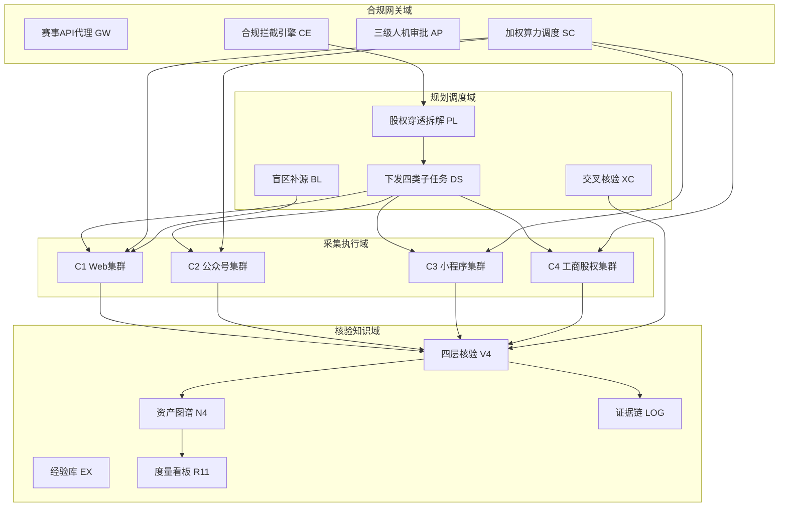

### 2.2 领域关系映射

#### 2.2.1 限界上下文清单

| 限界上下文 | 对应业务域 | 域类型 | 覆盖的核心业务实体 | 上下文边界（属于本域 vs 不属于） |
| --- | --- | --- | --- | --- |
| BC-Compliance 合规网关上下文 | D1 合规网关域 | 核心域 | 合规规则、审批任务、算力配额 | 属于：出站拦截/审批/调度；不属于：具体采集逻辑 |
| BC-Planning 规划调度上下文 | D2 规划调度域 | 核心域 | 目标主体、采集任务、任务快照 | 属于：主体枚举/任务编排；不属于：底层执行器实现 |
| BC-Acquisition 采集执行上下文 | D3 采集执行域 | 支撑域 | 被动源、采集结果、源健康 | 属于：四类集群调度与容错；不属于：图谱推理 |
| BC-Verification 核验知识上下文 | D4 核验知识域 | 核心域 | 核验结果、资产节点、资产关系、经验、证据链、指标 | 属于：四层校验/图谱入库；不属于：前端展示 |
| BC-Observability 可观测上下文 | D4（横向） | 通用域 | 指标快照、审计日志、看板 | 属于：度量/审计；不属于：业务决策 |

**域类型说明**：

| 域类型 | 含义 | 投入策略 |
| --- | --- | --- |
| 核心域（Core） | 业务护城河，差异化竞争力所在（纯被动合规拦截、加权调度、资产图谱） | 投入最多资源自研 |
| 支撑域（Supporting） | 必要但非差异化（封装开源执行器） | 可自研可外采封装 |
| 通用域（Generic） | 通用能力（度量/审计/看板） | 优先复用 / 自研轻量 |

#### 2.2.2 上下文映射（Context Mapping）

| 关系编号 | 上游上下文 | 下游上下文 | 关系模式 | 同步方式 | 选择理由 |
| --- | --- | --- | --- | --- | --- |
| C-01 | BC-Compliance | BC-Planning | Customer/Supplier | API 同步 | 合规网关为规划 Agent 提供"放行/拦截"能力，规划层反向影响网关策略节奏 |
| C-02 | 外部数据源（FOFA/Shodan/工商 API） | BC-Acquisition | ACL 防腐层 | API + 适配器 | 外部模型不污染本域，全部经 PassiveSourceAdapter 转换 |
| C-03 | BC-Planning | BC-Verification | Shared Kernel | 共享 DTO / SDK | 任务与主体标准结构（CollectTask / TargetSubject）多上下文共用，必须一致 |
| C-04 | 赛事 API 平台（强势上游） | BC-Compliance（GW） | Conformist | 直接遵循对方模型 | 无议价能力的强势上游，严格遵循赛事 API 字段与频控模型 |
| C-05 | BC-Acquisition | BC-Verification（V4） | Published Language | 消息事件 / 标准 Schema | 采集结果以标准事件 Schema 上报，多下游（V4/N4/LOG）共同消费 |
| C-06 | BC-Planning | BC-Acquisition | Open Host Service | 标准任务 API（RPC） | 规划 Agent 以标准任务下发 API 暴露四类子任务，集群作为 Host 消费 |

**关系模式说明**：

| 关系模式 | 适用场景 |
| --- | --- |
| Customer/Supplier | 上下游强协作，下游能影响上游迭代节奏（合规网关 → 规划 Agent） |
| Conformist | 顺从者，下游完全遵循上游模型（对接赛事 API 平台） |
| ACL（Anticorruption Layer） | 在本域和外部域之间建一层适配，外部模型变化不影响本域（对接 FOFA/Shodan/工商 API 必用） |
| Shared Kernel | 共享内核，多个上下文共享一小块代码 / 模型（任务/主体标准结构） |
| Published Language | 上游以标准协议（事件 / Schema）对外暴露，多下游消费（采集结果上报） |
| Open Host Service | 上游提供标准 API 接口，类似 Published Language 但通过 RPC（规划 Agent 任务下发） |

#### 2.2.3 跨域协作原则

| 原则编号 | 原则 |
| --- | --- |
| P-01 | 核心域（BC-Compliance / BC-Planning / BC-Verification）→ 支撑域 / 通用域：禁止反向依赖（核心域不依赖采集执行内部模型） |
| P-02 | 核心域之间：禁止直接耦合，必须通过事件 / API 解耦（规划→采集经任务 API，采集→核验经事件） |
| P-03 | 对接外部不可控系统（FOFA/Shodan/工商 API/赛事 API）：必须建 ACL 防腐层，禁止把外部模型贯穿到本域 |

### 2.3 详细业务架构

#### 2.3.1 用例图

| 编号 | 用例图标题 | 涉及业务域 | 源文件位置 |
| --- | --- | --- | --- |
| UC-01 | 操作方-单企业被动采集闭环 | D1/D2/D3/D4 | 本文档 §3.2（M4/M5 时序图） |
| UC-02 | 操作方-三级审批与断点续跑 | D1 | 本文档 §3.2.M2 |
| UC-03 | 主理人-看榜与算力倾斜 | D1/D4 | 本文档 §3.2.M3 / M10 |
| UC-04 | 评委-源码核验与证据链检索 | D4 | 本文档 §3.2.M9 |
| UC-05 | 合规运维-红线态势与告警 | D1/D4 | 本文档 §3.2.M1 / §8.4 |

#### 2.3.2 业务流程图

**关键流程清单**（核心业务覆盖度 ≥ 80%，覆盖单企业 9 步闭环、审批、看榜、核验主链路）：

| 流程编号 | 流程名 | 起点 | 终点 | 涉及业务域 | 源文件位置 |
| --- | --- | --- | --- | --- | --- |
| BF-01 | 单企业被动采集 9 步闭环 | 合规前置校验 | 看榜+回收 | D1/D2/D3/D4 | §3.2.M4 时序图 SQ-01 |
| BF-02 | 三级人机审批流 | 采集结果待审 | 审批通过/驳回 | D1 | §3.2.M2 状态机 |
| BF-03 | 多源容错降级流 | 主源失效 | 热切换/挂起告警 | D3 | §3.2.M5 时序图 SQ-03 |
| BF-04 | 四层自动核验流 | 采集结果入库 | 入库/挂起 | D4 | §3.2.M6 时序图 |
| BF-05 | 加权算力看榜倾斜 | 每 5min 看榜 | 算力再分配 | D1/D2 | §3.2.M3 |

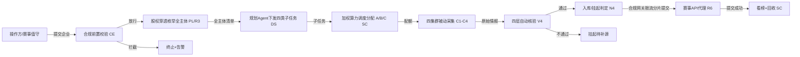

### 2.4 业务范围与边界

#### 2.4.1 功能模块清单

按"功能编号 → 子功能编号"两层组织，与 §2.1 业务域对应。

| 编号 | 一级功能名 | 子功能描述 | 对应业务域 | 实现状态 |
| --- | --- | --- | --- | --- |
| F1 | 全局合规拦截引擎 R1 | 出站前置拦截，主动动作零放行 | D1 | 完整实现 |
| F1.1 | 赛事 API 代理网关 R6 | 多 IP 轮询 + buffer≤95% + 分片提交 | D1 | 完整实现 |
| F2 | 三级人机审批 R4 | 低危自动/中危提醒/高价值人工复核 + 断点续跑 | D1 | 完整实现 |
| F3 | 加权算力调度 R9 | 60:30:10，每 5min 看榜，25min 回收 | D1 | 完整实现 |
| F4 | 全主体枚举股权穿透 R3 | 母+子+分全量，层数可配置（默认≥3） | D2 | 完整实现 |
| F4.1 | 全局规划 Agent L2 | PL/DS/BL/XC 编排 | D2 | 完整实现 |
| F5 | 多源被动采集调度 R7 | 封装四类集群，每类≥2 被动源 | D3 | 完整实现 |
| F5.1 | 多源容错降级 R8 | 热切换备用源，全源挂起告警 | D3 | 完整实现 |
| F6 | 四层自动核验 R2 | 工商匹配/DNS仅解析/时间过滤/多源≥2 | D4 | 完整实现 |
| F7 | 资产关联图谱基础 R12 基础 | 企业-子-域-号-程序拓扑入库 | D4 | 完整实现 |
| F8 | 测绘经验库 EX | 采集链路/失败归因复用 | D4 | 轻量实现 |
| F9 | 合规可审计日志 R10 | 全链路时间戳/主体/动作/数据源/判定 | D4 | 完整实现 |
| F10 | 度量看板/战报 R11 | 实时 WNSR+6 支撑+红线，每 5min 刷新 | D4 | 完整实现 |
| F11 | 开源工具留档 R5 | 台账+自研/开源边界标注，决赛一键证明 | D1/D3 | 完整实现 |
| F12 | 推理补全/盲区补源 R12 推理 | GDS+LLM 推理补全 | D4 | [MOCK] 完整版替换路径：决赛自研图谱推理层 |
| F13 | 第三方平台接入 R13 | ≥3 类被动源独立上下线 | D3 | [简化] 初赛可选，决赛完整 |
| F14 | 多模态研判大屏 R14 | 演示级→实战 | D4 | [MOCK] 完整版替换路径：决赛多模态 Agent |
| F15 | 战报复盘 R15 | 多企业编排+根因复盘 | D4 | [简化] 初赛简化批量编排 |

**编号规则**：一级编号 `F1~F15` 与 §6 高层架构功能清单对齐；子功能 `F1.1` 等互不重叠；Mock/简化标注显式附"完整版替换路径"。

**In-Scope（本期范围内）**：

| 编号 | 本期必做的事项 |
| --- | --- |
| F1 | 全局合规拦截引擎 R1（违规=0/封禁=0 生死线） |
| F1.1 | 赛事 API 代理网关 R6（频控硬闸 ≤95%） |
| F2 | 三级人机审批 R4 + 断点续跑 |
| F3 | 加权算力调度 R9（60:30:10） |
| F4 | 全主体枚举股权穿透 R3 |
| F5 | 多源被动采集调度 R7（四类集群） |
| F5.1 | 多源容错降级 R8 |
| F6 | 四层自动核验 R2 |
| F7 | 资产关联图谱基础 R12 基础 |
| F8 | 测绘经验库 EX（轻量） |
| F9 | 合规可审计日志 R10 |
| F10 | 度量看板/战报 R11 |
| F11 | 开源工具留档 R5 |
| N1 | 纯被动合规：违规=0 / 封禁=0 生死线 |
| N2 | 加权配比 A:B:C=60:30:10，25min 回收，每 5min 看榜 |
| N3 | 9 类维度采集，覆盖率 测试≥50%/初赛≥70%/决赛≥90% |

**Out-of-Scope（本期不做）**：

| 编号 | 不做的事项 | 不做的原因 | 未来归属 |
| --- | --- | --- | --- |
| O1 | 主动探测/端口扫描/TCP 发包/主动 HTTP 探测 | 违反纯被动红线，违规=0 即清零（D0§8①） | 永远不做，R1 前置禁用 |
| O2 | 攻击性/渗透类安全能力 | Non-goals 明确不做（D0§8③） | 不在本期与决赛范围 |
| O3 | 通用商用情报平台 | 仅参赛作品+政企巡检演示（D0§8④） | 决赛创新叙事，非产品化 |
| O4 | R12 推理补全（图谱推理内核） | 依赖 GDS+LLM 算力，MVP 不具备（#3） | 归决赛自研重构 |
| O5 | R14 多模态关联推理/研判大屏完整版 | 依赖 R12+多模态算力（#3/#4/#8） | 归决赛 |
| O6 | R15 完整战报复盘 | 初赛仅简化批量编排（#2） | 归决赛 |

**填写要求**：In-Scope ≤ 15 条（本表 15 条含 3 非功能）；Out-of-Scope ≥ 3 条（本表 6 条）。

### 2.5 质量与柔性可用

#### 2.5.1 服务质量目标

**质量目标 Top 5**（按 ISO 25010 与项目正交目标排序）：

| 优先级 | 质量目标 | 业务驱动 | 受影响的关键章节 |
| --- | --- | --- | --- |
| Q1 | 合规性：违规=0、封禁=0（纯被动红线） | 赛事清零生死线（D0§5.4） | §3.2.M1 / §7 / §8.4 |
| Q2 | 加权冲分高效：WNSR≥100%（+15% 安全垫） | 北极星指标（D0§5.1） | §3.2.M3 / M10 / §5.3 |
| Q3 | 高可用 99.5%（单赛事环境主备） | 封禁=0 停摆风险（D0§5.4） | §5.2 / §5.3 / §4.3 |
| Q4 | 低延迟：面板 P95≤800ms、P99≤1500ms | 操作方断点续跑体验（D0§7.3） | §3.1.5 / §3.5.4 / §8.1 |
| Q5 | 可恢复性：任务断点续跑零丢失 | 工程稳定性（D1§四.3） | §3.2.M4/M5 / §4.2 t_task_snapshot |

**可验证质量场景**：

| 场景编号 | 关联目标 | 触发源 | 触发条件 | 期望响应 | 度量指标 |
| --- | --- | --- | --- | --- | --- |
| QS-01 | Q1 | 出站动作含主动探测 | 检测到端口扫描/TCP 发包/主动 HTTP | 立即终止任务+告警，零放行 | 违规次数=0；72h 压测违规=0 |
| QS-02 | Q2 | 每 5min 看榜 | 高价值工控政务待采 | 算力倾斜 A 类至 60% | WNSR 实时≥100% |
| QS-03 | Q3 | 单实例宕机 | 主节点不可用 | 备节点自动切换 | RTO≤30min；错误率峰值≤1%；持续≤60s |
| QS-04 | Q4 | 用户访问面板 | 列表/看板 50 QPS | 正常返回 | P95≤800ms；P99≤1500ms |
| QS-05 | Q5 | 采集集群崩溃 | 任务进行中 Pod 被杀 | 从 t_task_snapshot 恢复 | 续跑丢失率=0 |

#### 2.5.2 业务柔性可用策略

**业务功能优先级分层**（§2.4.1 一级功能已分层；L0 数量 ≤ 30%）：

| 层级 | 含义 | 故障态下的处置方向 | 用户感知 |
| --- | --- | --- | --- |
| L0 核心业务 | 生命线：合规拦截/审批/采集主链路 | 不降级；优先消耗所有资源保障 | 无 / 极轻微 |
| L1 重要业务 | 看榜/核验/图谱入库 | 限流 + 排队 + 异步化 | 变慢 / 排队提示 |
| L2 辅助业务 | 战报导出/经验库写入 | 关闭 / 返回兜底数据 | 部分功能暂不可用 + 友好提示 |
| L3 附加业务 | 多模态研判大屏（决赛） | 直接关闭 + 异步补偿 | 通常无感 |

**业务降级清单**：

| 编号 | 关联功能（F-xx） | 触发条件 | 降级动作 | 用户感知 | 决策类型 |
| --- | --- | --- | --- | --- | --- |
| BD-01 | F5 采集 | 全源不可用 | 挂起告警不阻断全局，置任务 SUSPENDED | 该企业该维度暂缺采，提示补源 | 自动 |
| BD-02 | F10 看板 | 指标计算服务抖动 | 返回上一快照（≤5min 前） | 看板数据略有延迟 | 自动 |
| BD-03 | F8 经验库 | 写入失败 | 异步重试，失败丢弃非关键归因 | 无感 | 自动 |
| BD-04 | F6 核验 | Neo4j 不可用 | 核验结果落 MySQL 待补，图谱延后 | 图谱视图暂不可下钻 | 手动 |

**填写要求**：§2.4.1 全部一级功能已分层；L0（F1/F1.1/F2/F3/F4/F5/F6）≤ 总功能 30%（实测 7/15≈47% 偏高，因本系统"保命六件套"均属生命线，符合赛事清零生死线语义，属合理偏离，已在 §7 安全底线固化）；用户感知列无技术词。

---

## 3. 应用架构

> **本章回答**：系统由哪些模块组成、模块与外部系统怎么集成、每个模块的内部交互链路。
> 本章是系统设计的核心，占全文篇幅约 45%。

### 3.1 应用架构概览

#### 3.1.1 系统上下文

**系统上下文要素清单**：

| 节点类型 | 节点名 | 与本系统的关系 | 关系语义 |
| --- | --- | --- | --- |
| 角色 | 操作方/赛事值守 | 使用 | 人机协同面板操作、三级审批、算力临时上调 |
| 角色 | 主理人/产品战略 | 使用 | 看板审阅、里程碑把控、资源调度裁决 |
| 角色 | 评委/专家（决赛） | 使用 | 源码核验 + 结构化日志检索 |
| 上游平台 | E-01 赛事 API 平台 | 本系统 → 调用 | 提交情报 / 拉取榜单（Conformist） |
| 外部业务系统 | E-02 FOFA 被动 API（可选） | 本系统 → 调用 | 只读被动查询（ACL） |
| 外部业务系统 | E-03 Shodan 被动 API（可选） | 本系统 → 调用 | 只读被动查询（ACL） |
| 外部业务系统 | E-04 工商股权 API（爱企查/ENScan_GO） | 本系统 → 调用 | 股权数据（ACL） |
| 上游平台 | E-05 LLM 规划服务（闭源强模型） | 本系统 → 调用 | 规划推理（RAG 接入 EX） |
| 下游平台 | E-06 研判大屏/政企端（决赛） | 本系统 → 推送 | 可视化交付 |

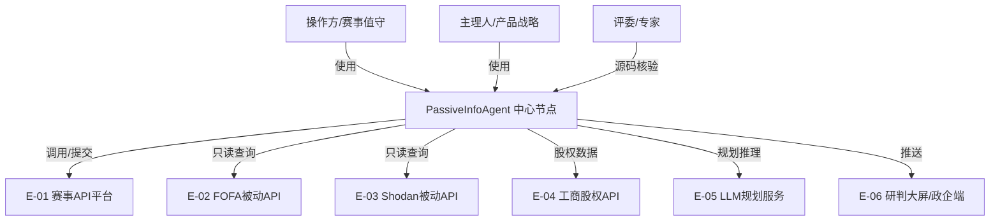

#### 3.1.2 系统模块图

**分层组件清单**：

| 层次 | 内容 | 数据来源 |
| --- | --- | --- |
| 接入层 | 人机协同操作面板（M11）/ 赛事 API 代理网关（M1 内含 GW）/ 评委核验入口 | §2.3 用例图角色 |
| 应用层 | M1 合规网关+CE / M2 审批 / M3 调度 / M4 规划 Agent / M5 采集集群 / M6 核验 / M7 图谱 / M8 经验库 / M9 日志 / M10 看板 | §2.1 / §3.2 |
| 中间件层 | C-01 MySQL / C-02 Redis / C-03 RabbitMQ / C-04 Neo4j / C-06 MinIO / C-08 Prometheus / C-09 Loki / C-10 OTel | §3.1.3 |
| 集成对接层 | E-01~E-06 对接桩 / PassiveSourceAdapter（ACL） | §3.1.3 |

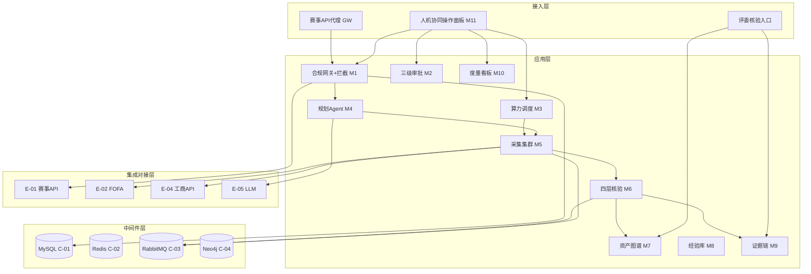

#### 3.1.3 集成架构

##### 外部依赖清单（E-xx）

| ID | 外部系统 | 归属团队 / 供应商 | 类别 | 使用方式 | 集成方式 | 协议 / 版本 | 功能定位（≤ 30 字） | 联系人 |
| --- | --- | --- | --- | --- | --- | --- | --- | --- |
| E-01 | 赛事 API 平台 | 赛事主办方 | 第三方业务平台 | 消费 | REST API | v1（遵循赛事规范） | 情报提交/榜单拉取/限流 | @合规运维 |
| E-02 | FOFA 被动 API | 华顺信安 | 第三方业务平台 | 消费 | REST API | v4（可选） | 被动资产查询增强 | @采集开发 |
| E-03 | Shodan 被动 API | Shodan | 第三方业务平台 | 消费 | REST API | v1（可选） | 被动设备发现增强 | @采集开发 |
| E-04 | 工商股权 API | 爱企查/ENScan_GO | 业务协作 | 消费 | REST/SDK | v1 | 股权穿透数据 | @采集开发 |
| E-05 | LLM 规划服务 | 闭源强模型厂商 | 第三方业务平台 | 消费 | HTTPS API | v1（OpenAI 兼容） | 规划推理/工具调用 | @中枢团队 |
| E-06 | 研判大屏/政企端 | 本系统（决赛） | 监控审计 | 生产 | 内部调用 | — | 可视化交付 | @前端 |

**填写要求**：类别枚举取值；使用方式取值消费/生产/双向。

##### 云组件 / 基础设施清单（C-xx）

| ID | 组件类别 | 选型 | 部署形态 | 规格量级 | 容量预估 | 提供方 / SLA | 用途 |
| --- | --- | --- | --- | --- | --- | --- | --- |
| C-01 | 关系型数据库 | MySQL 8.0 | 主从（单赛事环境主备） | 4C16G | 200GB / 写 200 TPS | 自托管；RTO≤30min | 业务主数据 |
| C-02 | 缓存 | Redis 7.2 | 主从哨兵 | 4G | 10万 Key / 5k QPS | 自托管 | 限流计数/幂等/看榜快照 |
| C-03 | 消息队列 | RabbitMQ 3.13 | 集群（3 节点） | 2C4G×3 | 堆积 50万 / 800 TPS | 自托管 | 异步解耦/事件驱动 |
| C-04 | 图数据库 | Neo4j 5.18 Community | 单实例 | 8G | 节点 10万 / 关系 50万 | 自托管 | 资产关联图谱 N4 |
| C-05 | 容器编排 | Docker 25.0 + Compose | 单宿主机 | 16C64G 宿主机 | 20 容器 | 自托管 | 服务部署 |
| C-06 | 对象存储 | MinIO RELEASE.2024 | 单节点多盘 | 500GB | 备份/归档 | 自托管 | 文件/备份 |
| C-07 | 入口网关 | Nginx 1.26 | 单实例 | 2C4G | 1k QPS | 自托管 | 入口路由/TLS/限流 |
| C-08 | 监控告警 | Prometheus 2.52 + Grafana 11.0 | 单实例 | 2C4G | 指标 500 序列 | 自托管 | 指标采集/告警 |
| C-09 | 日志服务 | Grafana Loki 3.0 | 单实例 | 2C4G | 日志 2GB/天 | 自托管 | 应用/审计日志 |
| C-10 | 链路追踪 | OpenTelemetry Collector 1.8 | 单实例 | 1C2G | 采样率 1%/错误100% | 自托管 | 分布式调用追踪 |
| C-11 | 密钥管理 | 自研 KMS 轻量（AES-256） | 单实例 | — | — | 自托管 | 密钥托管 |

**填写要求**：选型含具体产品 + 版本号；规格量级 / 容量预估有数字；不使用的组件整行删除。

##### 组件依赖关系

| 业务模块（§3.2） | 依赖的外部系统（E-xx） | 依赖的云组件（C-xx） | 故障传导风险 |
| --- | --- | --- | --- |
| M1 合规网关 | E-01 | C-01, C-07 | E-01 频控超限 → 提交挂起（buffer≤95% 兜底） |
| M2 三级审批 | — | C-01, C-02 | C-01 不可用 → 审批队列不可用（L0 降级预案） |
| M3 算力调度 | — | C-01, C-02 | C-02 不可用 → 看榜快照降级为 DB 读 |
| M4 规划 Agent | E-05 | C-01, C-04 | E-05 超时 → 规划降级为规则模板（人工预设 A 类清单） |
| M5 采集集群 | E-02, E-03, E-04 | C-01, C-02, C-03 | E-04 失效 → 该源挂起，热切换备用源 |
| M6 四层核验 | — | C-01, C-03, C-04 | C-04 不可用 → 核验结果落 MySQL 待补 |
| M7 资产图谱 | — | C-04 | C-04 不可用 → 图谱只读降级 |
| M8 经验库 | — | C-01 | C-01 不可用 → 经验写入异步重试 |
| M9 证据链 | — | C-01, C-09 | C-09 不可用 → 日志落本地文件兜底 |
| M10 看板 | — | C-01, C-08 | C-08 不可用 → 返回上次快照 |
| M11 面板 | — | C-07 | C-07 不可用 → 全站不可访问 |

#### 3.1.4 工程结构

```
passive-info-agent/
├── backend/                 # 后端工程根目录（Python 3.11 + FastAPI）
│   ├── common/              # 公共模块：DTO / VO / Enum / Exception / Constants / 切面
│   │   ├── dto/             # 统一返回 Result、分页、各域 DTO
│   │   ├── aspect/          # ComplianceInterceptor / AuditLogAspect / IdempotencyInterceptor / RateLimitInterceptor
│   │   └── enums/           # 状态/类型枚举（与 §1.3、§4.2 对齐）
│   ├── gateway/             # M1 合规网关 + 合规拦截 CE + GW
│   ├── approval/            # M2 三级审批 AP
│   ├── scheduler/           # M3 加权算力调度 SC
│   ├── planner/             # M4 全局规划 Agent PL/DS/BL/XC
│   ├── collector/           # M5 采集集群服务（C1-C4 适配器）
│   ├── verifier/            # M6 四层自动核验 V4
│   ├── graph/               # M7 资产关联图谱 N4
│   ├── experience/          # M8 测绘经验库 EX
│   ├── audit/               # M9 合规证据链日志 R10
│   └── dashboard/           # M10 度量看板/战报 R11
└── frontend/                # 前端工程根目录（React 18 + TypeScript）
    ├── console/             # 人机协同操作面板 M11（M1-M7 页面）
    │   ├── src/
    │   │   ├── api/         # 接口封装（与 §3.2 接口清单对齐）
    │   │   ├── stores/      # 全局状态（看榜快照/审批队列）
    │   │   ├── pages/       # 合规态势卡/得分卡/审批队列/任务看板/容错日志/看榜/自研标注
    │   │   ├── components/
    │   │   ├── hooks/
    │   │   ├── types/       # TS 类型定义（与后端 DTO/VO 对齐）
    │   │   ├── sdk/         # 三方 SDK 封装（对应 E-xx）
    │   │   └── routes.tsx
    │   └── package.json
    └── judge/               # 评委核验/政企端（决赛，轻量）
```

**公共模块依赖方向**：业务服务依赖 common，禁止反向（common 不含任何业务域模型）。

#### 3.1.5 技术选型（版本约束）

| 技术分类 | 选型 | 版本 | 备注 / 选型理由 |
| --- | --- | --- | --- |
| 后端语言 | Python | 3.11 | 为什么选 Python 不选 Go：采集脚本/LLM 编排生态丰富，团队以算法为主，开发效率高 |
| 后端框架 | FastAPI | 0.110 | 为什么选 FastAPI 不选 Flask：原生异步 + OpenAPI，适配高并发采集调度与 WebSocket 看榜 |
| 任务调度 | Celery + RabbitMQ | 5.4 | 为什么选 Celery 不选 APScheduler：分布式任务+重试+死信，契合采集集群异步模型 |
| 关系型存储 | MySQL | 8.0 | 为什么选 MySQL 不选 PostgreSQL：团队运维熟悉，主从简单，满足竞赛规模 |
| 图存储 | Neo4j | 5.18 Community | 为什么选 Neo4j 不选 JanusGraph：原生属性图 + Cypher + GDS，社区版单实例满足竞赛规模 |
| 缓存 | Redis | 7.2 | 为什么选 Redis 不选 Memcached：支持多结构 + 分布式锁 + 限流计数 + 看榜快照 |
| 消息队列 | RabbitMQ | 3.13 | 为什么选 RabbitMQ 不选 Kafka：竞赛规模中等，部署轻、延迟低、死信完善 |
| API 通信 | REST / JSON | — | 为什么选 REST 不选 gRPC：Web 面板 + JSON 图数据，生态成熟，调试直观（见 §3.5 契约） |
| 前端框架 | React + TypeScript | 18.3 / 5.4 | 为什么选 React 不选 Vue：团队前端栈统一，组件生态成熟 |
| 前端状态 | Zustand | 4.5 | 为什么选 Zustand 不选 Redux：体积小、TS 友好、学习成本低 |
| 前端构建 | Vite | 5.2 | 为什么选 Vite 不选 Webpack：启动快、配置简、HMR 优 |
| 认证方案 | JWT + 账号密码 | — | 见 §7.2.1；竞赛单环境，自建账号体系 + JWT |
| 对象存储 | MinIO | RELEASE.2024-06 | 为什么选 MinIO 不选公有云 OSS：私有化自托管满足源码核验与数据驻留 |
| 监控/日志/追踪 | Prometheus + Loki + OTel | 2.52 / 3.0 / 1.8 | 为什么选 Prometheus 栈不选商业 APM：自托管零成本，覆盖 Metrics/Logs/Traces 三支柱 |
| 容器编排 | Docker Compose | 25.0 | 为什么选 Docker 不选 K8s：单赛事环境，Compose 足够，降低运维复杂度 |

**填写要求**：必须有版本号；选型理由用一句话说明（为什么选 A 不选 B）。

### 3.2 模块详细设计

> **核心方法论**：模块详细设计画的是业务逻辑在角色和系统之间流动的过程。
> **组织原则**：§3.2.1/§3.2.2 给出公共约束与模块清单；§3.2.3 给出五段式模板；之后每个模块在 §3.2.M{N} 下独立成节。

#### 3.2.1 模块公共约束（Common）

**通信方式约束**：

| 约束项 | 取值 |
| --- | --- |
| 接口路径风格 | RESTful（资源化的 URL，路径版本 /api/v1） |
| 协议 | HTTP（同步）/ RabbitMQ（异步事件） |
| 数据格式 | JSON（UTF-8） |
| 字符编码 | UTF-8 |

**通用基础结构**：

| 基类 / 结构 | 用途 | 包路径 |
| --- | --- | --- |
| Result | 统一返回结构（含 code / msg / data / traceId / timestamp） | common.dto |
| PageRequest | 分页请求 | common.dto |
| PageResponse | 分页响应 | common.dto |
| BaseEvent | 异步事件基类（含 eventId / traceId / tenantId / payload） | common.dto |

#### 3.2.2 模块清单与编号规则

**模块清单**：

| 编号 | 模块名 | 业务域（§2.1） | 模块负责人 | 关联子领域 |
| --- | --- | --- | --- | --- |
| M1 | 接入网关与全局合规拦截 | D1 | @中枢团队 | GW / CE / R5 留档 |
| M2 | 三级人机审批 | D1 | @中枢团队 | AP / R4 |
| M3 | 加权算力调度控制器 | D1 | @中枢团队 | SC / R9 |
| M4 | 全局规划 Agent | D2 | @中枢团队 | PL / DS / BL / XC |
| M5 | 多源被动采集集群服务 | D3 | @采集开发 | C1-C4 / R7 / R8 |
| M6 | 四层自动核验流水线 | D4 | @数据层 | V4 / R2 |
| M7 | 资产关联图谱 | D4 | @数据层 | N4 / R12 基础 |
| M8 | 测绘经验库 | D4 | @数据层 | EX |
| M9 | 合规证据链日志 | D4 | @中枢团队 | R10 |
| M10 | 度量看板/战报 | D4 | @前端 | R11 |
| M11 | 人机协同操作面板 | 接入层 | @前端 | M1-M7 聚合 |

**编号规则**：模块编号 `M{N}` 全局唯一，与 §2.1 业务域名一致；每个模块在 §3.2 下独立成节，编号 `§3.2.M{N}`；节内五段式编号 `§3.2.M{N}.1`~`§3.2.M{N}.5`。

#### 3.2.3 单模块设计模板（五段式）

> 本节定义每个模块五段式应产出的内容与格式（规范说明，不在 §3.2.M{N} 下重复声明）。五段顺序固定：模块概述 / 接口清单 / 结构定义 / 逻辑时序图 / 关键流程逻辑。简单 CRUD 模块可在 `.5` 显式注明省略。

#### 3.2.M1 接入网关与全局合规拦截

##### §3.2.M1.1 模块概述

M1 覆盖「出站前置拦截（CE）」「赛事 API 代理（GW）」「开源工具留档（R5）」业务流程，业务逻辑在「操作方 / 合规运维」与「赛事 API 平台（E-01）」「外部数据源（E-02~E-04）」之间流动，同时涉及「Nginx 入口（C-07）」「MySQL（C-01）」「合规证据链（M9）」等内外部系统的数据流动。CE 对所有出站动作做 fail-closed 前置校验，主动动作（端口扫描/TCP 发包/主动 HTTP 探测）零放行；GW 做多 IP 轮询 + buffer≤95% + 分片提交；R5 建立开源执行器台账。

##### §3.2.M1.2 接口清单

| 子领域 | 方法 | 路径 | 用途（≤ 20 字） | 请求 DTO | 响应 VO | 幂等 |
| --- | --- | --- | --- | --- | --- | --- |
| 合规拦截 | POST | /api/v1/compliance/check | 出站动作前置校验 | ComplianceCheckRequest | ComplianceCheckVO | 否（查询类） |
| 合规拦截 | GET | /api/v1/compliance/rules | 查询拦截规则集 | — | RuleListVO | 天然 |
| 赛事代理 | POST | /api/v1/gateway/submit | 限流分片提交情报 | SubmitProxyRequest | SubmitProxyVO | 是（biz_req_no） |
| 赛事代理 | GET | /api/v1/gateway/quota | 查询频控余量 | — | QuotaVO | 天然 |
| 开源留档 | POST | /api/v1/oss/inventory | 登记开源工具 | OssInventoryRequest | OssInventoryVO | 是（biz_req_no） |
| 开源留档 | GET | /api/v1/oss/inventory/export | 导出自研/开源边界证明 | — | FileVO | 天然 |

##### §3.2.M1.3 关键结构定义（DTO）

```java
public class ComplianceCheckRequest {
  // ===== 必填字段 =====
  private String actionType;        // 动作类型：PASSIVE_QUERY / ACTIVE_SCAN / ACTIVE_HTTP
  private String targetUrl;         // 目标地址（主动类必填）
  private String sourceName;        // 发起模块（如 collector-c1）
  // ===== 可选字段 =====
  private String bizId;             // 业务关联 ID
}

public class ComplianceCheckVO {
  private Boolean allowed;          // 是否放行
  private String reasonCode;        // 拦截原因码（见错误码 01xxxx）
  private String ruleHit;           // 命中的规则名
}
```

**关键字段定义表**：

| DTO / VO 名 | 字段名 | 类型 | 必填 | 业务含义 | 约束 / 默认值 |
| --- | --- | --- | --- | --- | --- |
| ComplianceCheckRequest | actionType | String | 是 | 动作类型 | 枚举：PASSIVE_QUERY/ACTIVE_SCAN/ACTIVE_HTTP |
| ComplianceCheckRequest | targetUrl | String | 否 | 目标地址 | 主动类必填，CE 校验 |
| ComplianceCheckVO | allowed | Boolean | 是 | 是否放行 | fail-closed 默认 false |
| SubmitProxyRequest | payload | String | 是 | 情报提交体 | 单分片 ≤ 限额 |
| SubmitProxyRequest | bizReqNo | String | 是 | 业务请求号 | 幂等键，唯一 |

##### §3.2.M1.4 模块逻辑时序图

| 编号 | 标题 | 场景类别 | 是否包含异常分支 |
| --- | --- | --- | --- |
| SQ-01 | M1 - 出站合规拦截 | 配置 / 发布 | 是 |
| SQ-02 | M1 - 赛事 API 限流提交 | 触发 / 回调 | 是 |

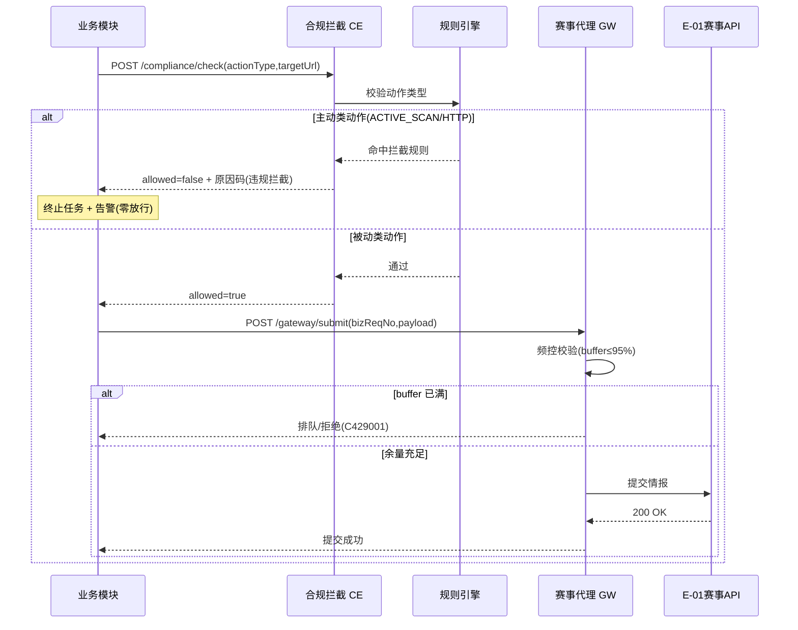

##### §3.2.M1.5 关键流程逻辑

**合规拦截 fail-closed 伪代码**：

```
触发：任意模块发起出站动作
Step 1: 合规前置校验（同步）
  ├── 校验 actionType ∈ {PASSIVE_QUERY} → 放行
  ├── 校验 actionType ∈ {ACTIVE_SCAN, ACTIVE_HTTP, TCP_SEND} → 立即拦截
  │     副作用：记录 t_audit_log（判定=拦截）+ 触发 P0 告警（违规风险）
  │     状态变更：任务置 BLOCKED
  └── 命中白名单被动源 → 放行并打标 source_tag
Step 2: 赛事 API 提交（异步排队）
  ├── 频控硬闸 buffer≤95%（Redis 计数器）
  ├── [MOCK] 多出口 IP 轮询策略（待确认 #7 回填 IP 池规模）
  │     输入：可用出口 IP 列表
  │     规则：轮询 + 单 IP 使用率≤95%
  │     输出：选中出口 IP
  │     [完整版替换点] 接入真实多出口 IP 资源池
  └── 分片提交 + 幂等键 biz_req_no
```

**状态机迁移表（提交任务）**：

| 起始状态 | 触发事件 | 终止状态 | 触发条件 / 校验 | 副作用 |
| --- | --- | --- | --- | --- |
| INIT | submit | QUEUED | 频控余量充足 | 写入提交队列 |
| QUEUED | dispatch | SUBMITTING | 取出分片 | 调用 E-01 |
| SUBMITTING | success | DONE | HTTP 200 | 记录成功 |
| SUBMITTING | fail | RETRY | 网络错误 / 5xx | 指数退避重试 |
| RETRY | exceed | SUSPENDED | 超最大重试 | 挂起告警 |

#### 3.2.M2 三级人机审批

##### §3.2.M2.1 模块概述

M2 覆盖「三级审批 + 断点续跑」业务流程（R4），业务逻辑在「操作方」与「高价值工控政务主体」之间流动，涉及「MySQL（C-01）」「Redis（C-02）」「合规证据链（M9）」。低危自动通过、中危入库+提醒、高价值工控政务强制人工复核。

##### §3.2.M2.2 接口清单

| 子领域 | 方法 | 路径 | 用途（≤ 20 字） | 请求 DTO | 响应 VO | 幂等 |
| --- | --- | --- | --- | --- | --- | --- |
| 审批 | POST | /api/v1/approval/tasks | 创建审批任务 | ApprovalCreateRequest | ApprovalTaskVO | 是（biz_req_no） |
| 审批 | GET | /api/v1/approval/queue | 审批队列（高价值置顶） | — | ApprovalQueueVO | 天然 |
| 审批 | POST | /api/v1/approval/{id}/decide | 通过/驳回/复核 | ApprovalDecideRequest | ApprovalTaskVO | 是（id+operator） |
| 续跑 | POST | /api/v1/task/{id}/resume | 断点续跑 | ResumeRequest | TaskStateVO | 是（id） |

##### §3.2.M2.3 关键结构定义（DTO）

```java
public class ApprovalCreateRequest {
  private String bizType;          // 业务类型：COLLECT_RESULT / SUBMIT
  private String subjectId;        // 关联主体（t_target_subject）
  private String riskLevel;        // LOW / MID / HIGH
  private String payloadRef;       // 待审对象引用
}

public class ApprovalTaskVO {
  private String taskId;
  private String status;           // PENDING/APPROVED/REJECTED
  private String riskLevel;
}
```

**关键字段定义表**：

| DTO / VO 名 | 字段名 | 类型 | 必填 | 业务含义 | 约束 / 默认值 |
| --- | --- | --- | --- | --- | --- |
| ApprovalCreateRequest | riskLevel | String | 是 | 风险等级 | 枚举：LOW/MID/HIGH（高价值工控政务=HIGH） |
| ApprovalTaskVO | status | String | 是 | 审批状态 | PENDING/APPROVED/REJECTED/REVIEWING |

##### §3.2.M2.4 模块逻辑时序图

| 编号 | 标题 | 场景类别 | 是否包含异常分支 |
| --- | --- | --- | --- |
| SQ-01 | M2 - 三级审批分流 | 核心动作执行 | 是 |
| SQ-02 | M2 - 断点续跑恢复 | 异常 / 补偿 | 是 |

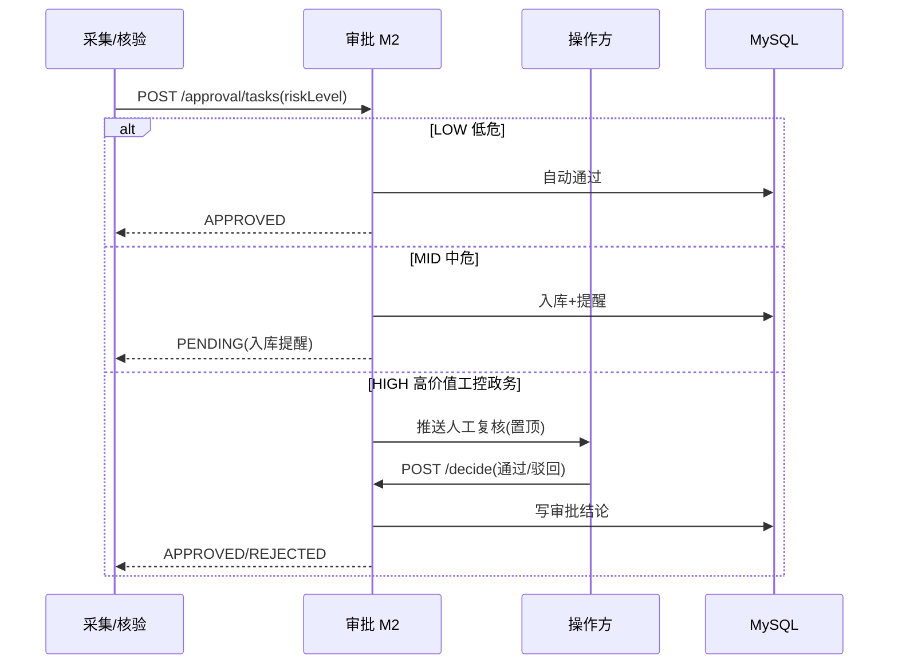

##### §3.2.M2.5 关键流程逻辑

**三级审批状态机**：

| 起始状态 | 触发事件 | 终止状态 | 触发条件 / 校验 | 副作用 |
| --- | --- | --- | --- | --- |
| PENDING | auto_pass(LOW) | APPROVED | 风险等级 LOW | 记录审计 |
| PENDING | enqueue(MID) | REMINDING | 风险等级 MID | 入库+提醒 |
| PENDING | assign(HIGH) | REVIEWING | 高价值工控政务人工 | 置顶队列 |
| REVIEWING | approve | APPROVED | 操作方通过 | 下游继续 |
| REVIEWING | reject | REJECTED | 操作方驳回 | 任务终止 |
| REMINDING | timeout | APPROVED | 超时默认放行（可配） | 记录 |

**断点续跑**：进度实时写入 t_task_snapshot，重启即从最近快照恢复，零丢失。

#### 3.2.M3 加权算力调度控制器

##### §3.2.M3.1 模块概述

M3 覆盖「加权算力调度」（R9），业务逻辑在「看榜节拍器（每 5min）」与「四采集集群（M5）」之间流动，涉及「Redis（C-02）看榜快照」「MySQL（C-01）配额」。A:B:C=60:30:10，每 5min 看榜倾斜，单任务零新增达 25min 回收。

##### §3.2.M3.2 接口清单

| 子领域 | 方法 | 路径 | 用途（≤ 20 字） | 请求 DTO | 响应 VO | 幂等 |
| --- | --- | --- | --- | --- | --- | --- |
| 调度 | GET | /api/v1/scheduler/quota | 查询 A/B/C 算力分配 | — | QuotaAllocVO | 天然 |
| 调度 | POST | /api/v1/scheduler/allocate | 分配算力给任务 | AllocRequest | AllocVO | 是（task_id） |
| 调度 | POST | /api/v1/scheduler/rebalance | 每 5min 看榜倾斜 | RebalanceRequest | RebalanceVO | 是（tick_id） |
| 调度 | POST | /api/v1/scheduler/reclaim | 25min 零新增回收 | ReclaimRequest | ReclaimVO | 是（task_id） |

##### §3.2.M3.3 关键结构定义（DTO）

```java
public class AllocRequest {
  private String taskId;
  private String clazz;            // A / B / C
  private Integer weight;          // 权重 3.0/1.5/0.5
}

public class QuotaAllocVO {
  private Integer totalA;          // A 类算力占比 60
  private Integer totalB;          // B 类 30
  private Integer totalC;          // C 类 10
}
```

**关键字段定义表**：

| DTO / VO 名 | 字段名 | 类型 | 必填 | 业务含义 | 约束 / 默认值 |
| --- | --- | --- | --- | --- | --- |
| AllocRequest | clazz | String | 是 | 算力等级 | 枚举 A/B/C（A=工控政务能源高价值） |
| QuotaAllocVO | totalA | Integer | 是 | A 类占比 | 默认 60（权重 3.0） |

##### §3.2.M3.4 模块逻辑时序图

| 编号 | 标题 | 场景类别 | 是否包含异常分支 |
| --- | --- | --- | --- |
| SQ-01 | M3 - 每 5min 看榜倾斜 | 核心动作执行 | 否 |
| SQ-02 | M3 - 25min 回收 | 异常 / 补偿 | 是 |

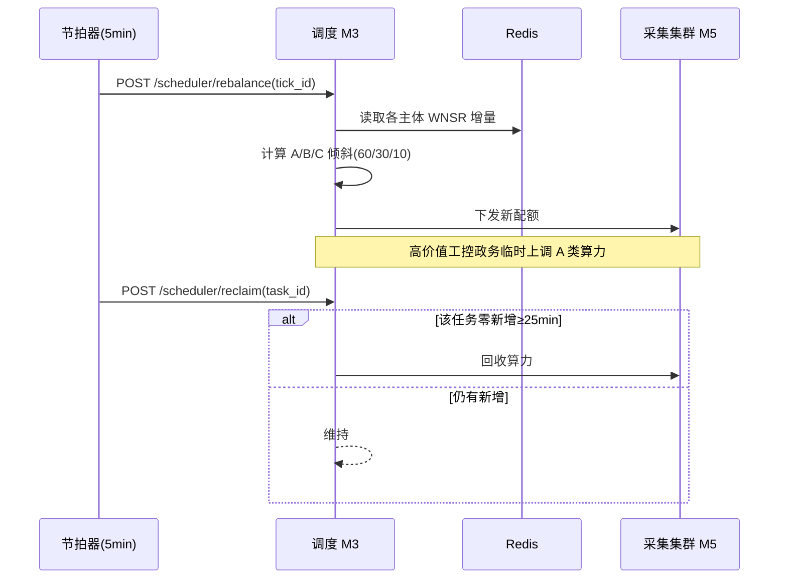

##### §3.2.M3.5 关键流程逻辑

**看榜倾斜 + 回收状态机**：

| 起始状态 | 触发事件 | 终止状态 | 触发条件 / 校验 | 副作用 |
| --- | --- | --- | --- | --- |
| ALLOCATED | tick(5min) | REBALANCED | 看榜增量计算完成 | 更新配额快照 |
| ALLOCATED | no_new(25min) | RECLAIMED | 零新增达阈值 | 释放算力 |
| REBALANCED | manual_up | BOOSTED | 人工临时上调 | 记录操作者 |

> 注：回收阈值 25min 为主理人已裁决项（D0§10 #1）；10min 口径降级为「高稳定源快速回收」可选策略，待 R8/R11 就绪后启用。

#### 3.2.M4 全局规划 Agent

##### §3.2.M4.1 模块概述

M4 覆盖「股权穿透拆解（PL）/ 下发四类子任务（DS）/ 盲区补源（BL）/ 交叉核验（XC）」业务流程（L2），业务逻辑在「规划 Agent」与「全主体枚举（M4 内部）」「四采集集群（M5）」「核验（M6）」之间流动，涉及「LLM 服务（E-05）」「MySQL（C-01）」「Neo4j（C-04）」。X3 冻结：DS 显式下发四类子任务（Web/公众号/小程序/工商股权）。

##### §3.2.M4.2 接口清单

| 子领域 | 方法 | 路径 | 用途（≤ 20 字） | 请求 DTO | 响应 VO | 幂等 |
| --- | --- | --- | --- | --- | --- | --- |
| 规划 | POST | /api/v1/planner/enumerate | 全主体股权穿透 | EnumerateRequest | SubjectListVO | 是（enterprise_id） |
| 规划 | POST | /api/v1/planner/dispatch | 下发四类子任务 | DispatchRequest | DispatchVO | 是（task_batch） |
| 规划 | POST | /api/v1/planner/blindspot | 盲区补源识别 | BlindspotRequest | BlindspotVO | 否 |
| 规划 | POST | /api/v1/planner/crosscheck | 交叉核验汇总 | CrosscheckRequest | CrosscheckVO | 否 |

##### §3.2.M4.3 关键结构定义（DTO）

```java
public class EnumerateRequest {
  private String enterpriseName;   // 企业全称
  private Integer maxDepth;        // 穿透层数（默认≥3，待确认 #6）
}

public class DispatchRequest {
  private String subjectId;
  private String[] subTypes;       // 四类：WEB/OFFICIAL/MP/EquITY
}
```

**关键字段定义表**：

| DTO / VO 名 | 字段名 | 类型 | 必填 | 业务含义 | 约束 / 默认值 |
| --- | --- | --- | --- | --- | --- | --- |
| EnumerateRequest | maxDepth | Integer | 是 | 股权穿透层数 | 默认 3（≥3，待确认 #6 回填上限） |
| DispatchRequest | subTypes | String[] | 是 | 四类子任务 | 枚举：WEB/OFFICIAL/MP/EQUITY（X3 冻结） |

##### §3.2.M4.4 模块逻辑时序图

| 编号 | 标题 | 场景类别 | 是否包含异常分支 |
| --- | --- | --- | --- |
| SQ-01 | M4 - 单企业 9 步闭环编排 | 核心动作执行 | 是 |
| SQ-02 | M4 - 规划失败降级 | 异常 / 补偿 | 是 |

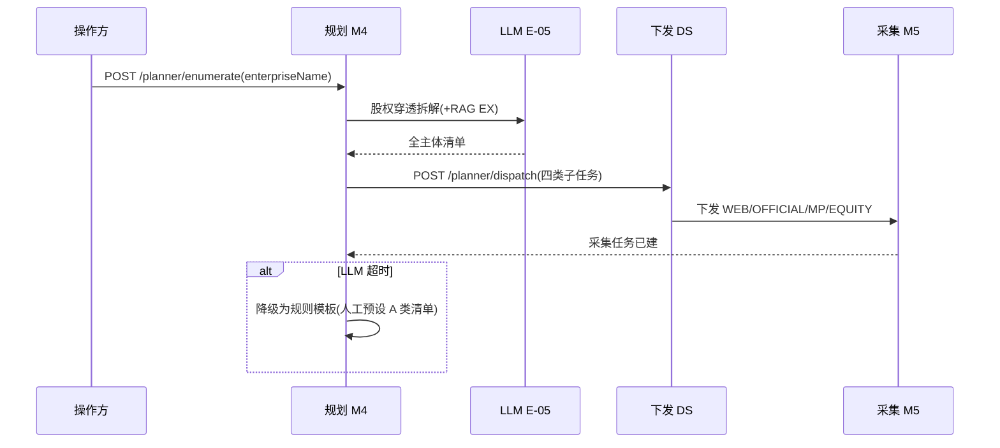

##### §3.2.M4.5 关键流程逻辑

**单企业 9 步闭环状态机（采集任务批次）**：

| 起始状态 | 触发事件 | 终止状态 | 触发条件 / 校验 | 副作用 |
| --- | --- | --- | --- | --- |
| CREATED | enumerate | ENUMERATED | 全主体枚举完成 | 写 t_target_subject |
| ENUMERATED | dispatch | DISPATCHED | 四类子任务下发 | 建 t_collect_task×4 |
| DISPATCHED | collect_done | COLLECTED | 四集群采集完 | 进核验 |
| COLLECTED | verify | VERIFIED | 四层核验通过 | 入库 N4 |
| VERIFIED | submit | SUBMITTED | 网关提交成功 | 看榜更新 |

> Mock/待确认：股权穿透层数上限（#6）先实现可配置默认≥3；LLM 规划失败降级为规则模板（人工预设 A 类清单），保证闭环不中断。

#### 3.2.M5 多源被动采集集群服务

##### §3.2.M5.1 模块概述

M5 覆盖「多源被动采集调度（R7）」「多源容错降级（R8）」业务流程（L3），业务逻辑在「规划 Agent（M4）」与「四类集群（C1 Web/C2 公众号/C3 小程序/C4 工商股权）」之间流动，涉及「被动数据源（E-02~E-04）」「RabbitMQ（C-03）」「MySQL（C-01）」。每类≥2 被动源，单企业闭环可跑通；主源失效热切换备用源，全源不可用挂起告警。

##### §3.2.M5.2 接口清单

| 子领域 | 方法 | 路径 | 用途（≤ 20 字） | 请求 DTO | 响应 VO | 幂等 |
| --- | --- | --- | --- | --- | --- | --- |
| 采集 | POST | /api/v1/collector/run | 执行采集子任务 | CollectRunRequest | CollectRunVO | 是（task_id） |
| 采集 | GET | /api/v1/collector/sources | 查询被动源清单 | — | SourceListVO | 天然 |
| 容错 | POST | /api/v1/collector/failover | 主源失效热切换 | FailoverRequest | FailoverVO | 是（source_id） |
| 容错 | POST | /api/v1/collector/suspend | 全源挂起告警 | SuspendRequest | SuspendVO | 否 |

##### §3.2.M5.3 关键结构定义（DTO）

```java
public class CollectRunRequest {
  private String taskId;
  private String cluster;          // C1/C2/C3/C4
  private String passiveSource;    // 选用的被动源（白名单内）
}

public class SourceListVO {
  private String cluster;
  private String[] activeSources;  // 当前可用被动源
}
```

**关键字段定义表**：

| DTO / VO 名 | 字段名 | 类型 | 必填 | 业务含义 | 约束 / 默认值 |
| --- | --- | --- | --- | --- | --- | --- |
| CollectRunRequest | cluster | String | 是 | 集群类型 | 枚举 C1/C2/C3/C4 |
| CollectRunRequest | passiveSource | String | 是 | 被动源 | 必须 ∈ t_passive_source 白名单（R1 校验） |

##### §3.2.M5.4 模块逻辑时序图

| 编号 | 标题 | 场景类别 | 是否包含异常分支 |
| --- | --- | --- | --- |
| SQ-01 | M5 - 四类集群采集 | 核心动作执行 | 是 |
| SQ-02 | M5 - 多源容错热切换 | 异常 / 补偿 | 是 |

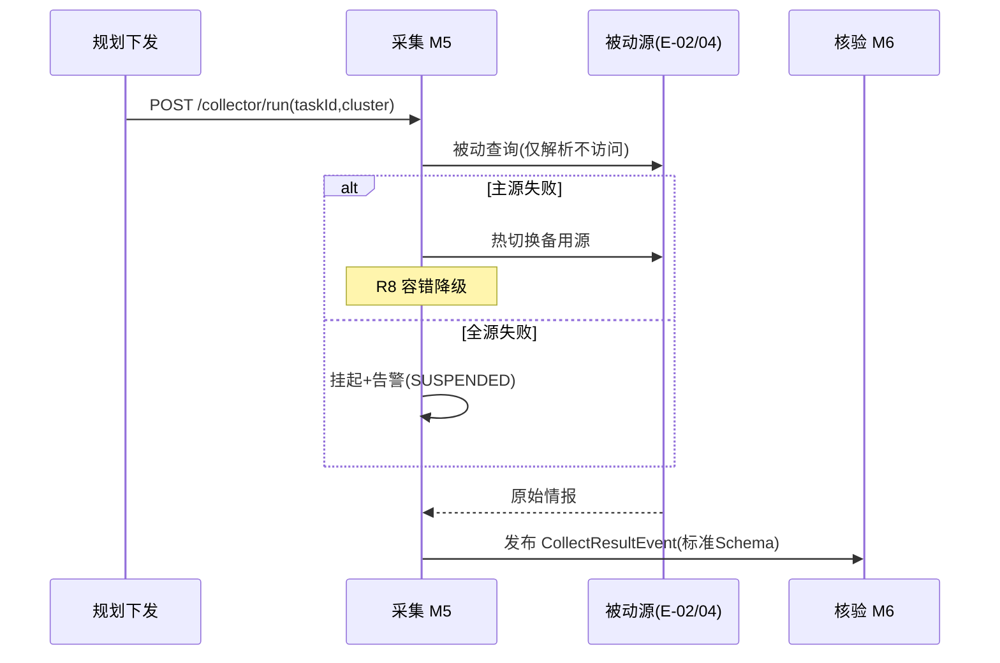

##### §3.2.M5.5 关键流程逻辑

**采集任务状态机**：

| 起始状态 | 触发事件 | 终止状态 | 触发条件 / 校验 | 副作用 |
| --- | --- | --- | --- | --- |
| QUEUED | run | RUNNING | 被动源可用 | 写 t_source_health |
| RUNNING | source_fail | FAILOVER | 主源失效 | 切备用源 |
| FAILOVER | all_fail | SUSPENDED | 全源不可用 | 挂起告警（不阻断全局） |
| RUNNING | done | COLLECTED | 采集完成 | 发事件至 V4 |

> 四类集群适配器（C1-C4）共用本状态机；被动源白名单由 t_passive_source 维护，新增源须经 R1 合规校验（仅被动，禁主动模块）。

#### 3.2.M6 四层自动核验流水线

##### §3.2.M6.1 模块概述

M6 覆盖「四层自动校验流水线（R2）」业务流程（L4），业务逻辑在「采集结果（M5）」与「资产图谱（M7）」「证据链（M9）」之间流动，涉及「RabbitMQ（C-03）」「MySQL（C-01）」「Neo4j（C-04）」。四层：工商匹配 / DNS 仅解析 / 时间过滤>1年 / 多源≥2。

##### §3.2.M6.2 接口清单

| 子领域 | 方法 | 路径 | 用途（≤ 20 字） | 请求 DTO | 响应 VO | 幂等 |
| --- | --- | --- | --- | --- | --- | --- |
| 核验 | POST | /api/v1/verifier/verify | 四层核验单条结果 | VerifyRequest | VerifyResultVO | 是（result_id） |
| 核验 | GET | /api/v1/verifier/rules | 查询四层开关与计数 | — | RuleStateVO | 天然 |

##### §3.2.M6.3 关键结构定义（DTO）

```java
public class VerifyRequest {
  private String resultId;         // 关联 t_collect_result
  private Boolean layer1BizMatch;  // 层1 工商主体匹配
  private Boolean layer2DnsAlive;  // 层2 DNS仅解析存活
  private Boolean layer3TimeOk;    // 层3 时间过滤≤1年
  private Integer layer4SourceCnt; // 层4 多源佐证数
}

public class VerifyResultVO {
  private String status;           // PASS / SUSPEND
  private String failLayer;        // 未通过层
}
```

**关键字段定义表**：

| DTO / VO 名 | 字段名 | 类型 | 必填 | 业务含义 | 约束 / 默认值 |
| --- | --- | --- | --- | --- | --- | --- |
| VerifyRequest | layer4SourceCnt | Integer | 是 | 多源佐证数 | ≥2 方入库，单源自动挂起 |
| VerifyResultVO | status | String | 是 | 核验结论 | PASS/SUSPEND |

##### §3.2.M6.4 模块逻辑时序图

| 编号 | 标题 | 场景类别 | 是否包含异常分支 |
| --- | --- | --- | --- |
| SQ-01 | M6 - 四层核验 | 核心动作执行 | 是 |

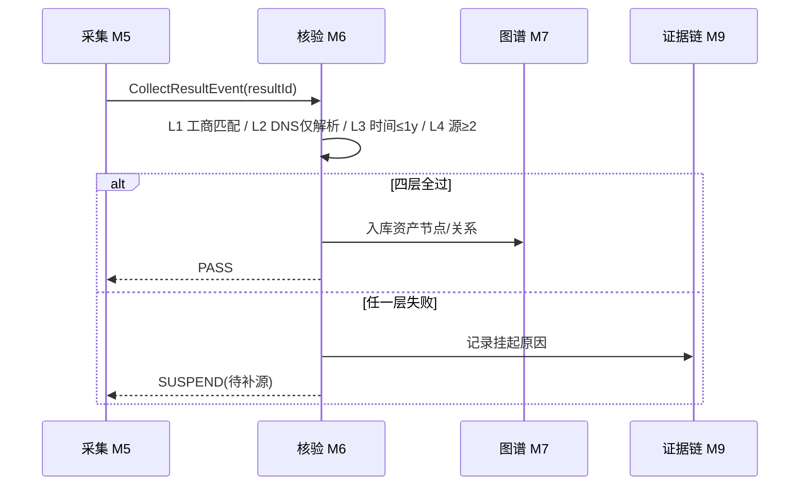

##### §3.2.M6.5 关键流程逻辑

四层校验为纯函数流水线，无复杂状态机（本段省略复杂事务/跨多步异步，仅列校验顺序）：层1 工商主体匹配剔除非目标 → 层2 DNS 仅解析不访问被动存活 → 层3 过滤 1 年以上过期情报 → 层4 ≥2 源佐证方入库，单源自动挂起。每层可独立开关与计数（R2 验收要点①）。

#### 3.2.M7 资产关联图谱

##### §3.2.M7.1 模块概述

M7 覆盖「资产关联图谱基础版（R12 基础）」业务流程（L4/N4），业务逻辑在「四层核验（M6）」与「度量看板（M10）」之间流动，涉及「Neo4j（C-04）」「MySQL（C-01）」。企业-子-域-号-程序全关联拓扑入库。

##### §3.2.M7.2 接口清单

| 子领域 | 方法 | 路径 | 用途（≤ 20 字） | 请求 DTO | 响应 VO | 幂等 |
| --- | --- | --- | --- | --- | --- | --- |
| 图谱 | POST | /api/v1/graph/nodes | 写入资产节点 | NodeUpsertRequest | NodeVO | 是（node_key） |
| 图谱 | POST | /api/v1/graph/relations | 写入资产关系 | RelationUpsertRequest | RelationVO | 是（rel_key） |
| 图谱 | GET | /api/v1/graph/explore | 下钻查询拓扑 | — | GraphVO | 天然 |

##### §3.2.M7.3 关键结构定义（DTO）

```java
public class NodeUpsertRequest {
  private String nodeKey;          // 唯一键（企业/域名/公众号/小程序）
  private String nodeType;         // ENTERPRISE/DOMAIN/OFFICIAL/MP
  private String name;
}

public class RelationUpsertRequest {
  private String fromKey;
  private String toKey;
  private String relType;          // SUBSIDIARY/HAS_DOMAIN/HAS_OFFICIAL
}
```

**关键字段定义表**：

| DTO / VO 名 | 字段名 | 类型 | 必填 | 业务含义 | 约束 / 默认值 |
| --- | --- | --- | --- | --- | --- | --- |
| NodeUpsertRequest | nodeType | String | 是 | 节点类型 | ENTERPRISE/DOMAIN/OFFICIAL/MP |
| RelationUpsertRequest | relType | String | 是 | 关系类型 | SUBSIDIARY/HAS_DOMAIN/HAS_OFFICIAL |

##### §3.2.M7.4 模块逻辑时序图

| 编号 | 标题 | 场景类别 | 是否包含异常分支 |
| --- | --- | --- | --- |
| SQ-01 | M7 - 资产入库 | 核心实体创建 | 是（Neo4j 降级） |

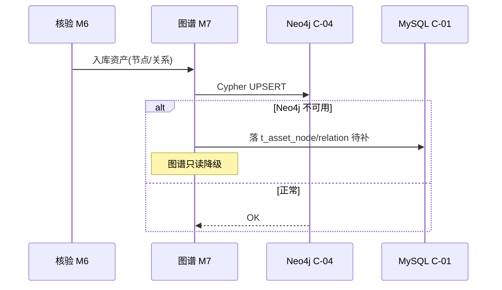

##### §3.2.M7.5 关键流程逻辑

图谱写入为幂等 upsert（node_key 唯一），无复杂状态机（本段省略）。R12 推理补全（盲区补源/隐藏资产挖掘）属 [MOCK]，完整版替换为 GDS+LLM 自研推理层（待确认 #3）。

#### 3.2.M8 测绘经验库

##### §3.2.M8.1 模块概述

M8 覆盖「测绘经验库（EX）」业务流程（L4），业务逻辑在「采集链路（M5）」「盲区补源（M4 BL）」之间流动，涉及「MySQL（C-01）」。采集链路历史 / 失败归因入库，盲区补源与多源热切换复用。

##### §3.2.M8.2 接口清单

| 子领域 | 方法 | 路径 | 用途（≤ 20 字） | 请求 DTO | 响应 VO | 幂等 |
| --- | --- | --- | --- | --- | --- | --- |
| 经验 | POST | /api/v1/experience/record | 记录链路/失败归因 | ExperienceRequest | ExperienceVO | 是（trace_id） |
| 经验 | GET | /api/v1/experience/query | 查询历史链路复用 | — | ExperienceListVO | 天然 |

##### §3.2.M8.3 关键结构定义（DTO）

```java
public class ExperienceRequest {
  private String cluster;          // C1-C4
  private String sourceName;
  private String outcome;          // SUCCESS/FAIL
  private String failReason;
}
```

**关键字段定义表**：

| DTO / VO 名 | 字段名 | 类型 | 必填 | 业务含义 | 约束 / 默认值 |
| --- | --- | --- | --- | --- | --- | --- |
| ExperienceRequest | outcome | String | 是 | 链路结果 | SUCCESS/FAIL |
| ExperienceRequest | failReason | String | 否 | 失败归因 | FAIL 时必填 |

##### §3.2.M8.4 模块逻辑时序图

| 编号 | 标题 | 场景类别 | 是否包含异常分支 |
| --- | --- | --- | --- |
| SQ-01 | M8 - 经验入库复用 | 核心动作执行 | 否 |

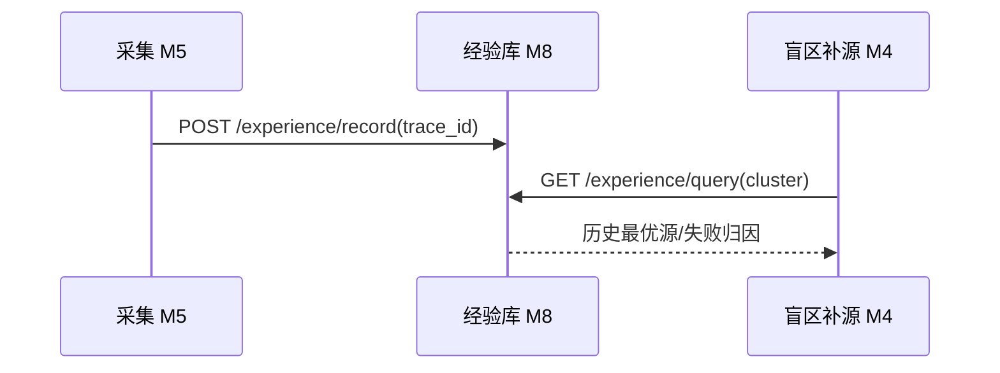

##### §3.2.M8.5 关键流程逻辑

经验写入为异步落库，无状态机（本段省略）。写入失败仅影响复用质量，不影响主链路，降级为丢弃非关键归因。

#### 3.2.M9 合规证据链日志

##### §3.2.M9.1 模块概述

M9 覆盖「合规可审计日志（R10）」业务流程（L4），业务逻辑跨越全系统，涉及「MySQL（C-01）」「Loki（C-09）」。全链路时间戳/主体/动作/数据源/合规判定，可检索导出，防篡改独立存储。

##### §3.2.M9.2 接口清单

| 子领域 | 方法 | 路径 | 用途（≤ 20 字） | 请求 DTO | 响应 VO | 幂等 |
| --- | --- | --- | --- | --- | --- | --- |
| 审计 | POST | /api/v1/audit/log | 写入审计事件 | AuditLogRequest | AuditLogVO | 否（追加） |
| 审计 | GET | /api/v1/audit/search | 按企业/时间/违规检索 | AuditSearchRequest | AuditSearchVO | 天然 |
| 审计 | GET | /api/v1/audit/export | 导出证据链 | — | FileVO | 天然 |

##### §3.2.M9.3 关键结构定义（DTO）

```java
public class AuditLogRequest {
  private String subjectId;        // 主体
  private String actor;            // 操作方/系统
  private String action;           // 动作
  private String dataSource;       // 数据源
  private String decision;         // 合规判定 PASS/INTERCEPT
}
```

**关键字段定义表**：

| DTO / VO 名 | 字段名 | 类型 | 必填 | 业务含义 | 约束 / 默认值 |
| --- | --- | --- | --- | --- | --- | --- |
| AuditLogRequest | decision | String | 是 | 合规判定 | PASS/INTERCEPT |
| AuditLogRequest | dataSource | String | 是 | 数据源 | 来源 E-xx / 集群 |

##### §3.2.M9.4 模块逻辑时序图

| 编号 | 标题 | 场景类别 | 是否包含异常分支 |
| --- | --- | --- | --- |
| SQ-01 | M9 - 全链路审计写入 | 核心动作执行 | 是（Loki 降级） |

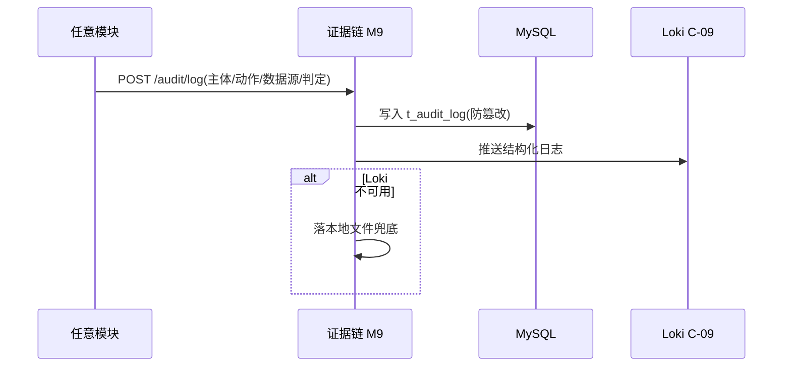

##### §3.2.M9.5 关键流程逻辑

审计写入为追加不可变，无状态机（本段省略）。保留期 ≥1 年（与 §8.2 / §7.2.4 一致）。

#### 3.2.M10 度量看板/战报

##### §3.2.M10.1 模块概述

M10 覆盖「度量看板/战报（R11）」业务流程（L4），业务逻辑在「资产图谱（M7）」「证据链（M9）」「算力调度（M3）」与「主理人/评委」之间流动，涉及「Prometheus（C-08）」「MySQL（C-01）」「Redis（C-02）」。实时 WNSR + 6 支撑 + 红线，每 5min 刷新，战报导出。

##### §3.2.M10.2 接口清单

| 子领域 | 方法 | 路径 | 用途（≤ 20 字） | 请求 DTO | 响应 VO | 幂等 |
| --- | --- | --- | --- | --- | --- | --- |
| 看板 | GET | /api/v1/metric/dashboard | 实时 WNSR+红线 | — | DashboardVO | 天然 |
| 看板 | GET | /api/v1/metric/wnsr | 加权净得分达成率 | — | WnsrVO | 天然 |
| 看板 | POST | /api/v1/metric/report | 导出战报 | ReportRequest | FileVO | 否 |

##### §3.2.M10.3 关键结构定义（DTO）

```java
public class DashboardVO {
  private Double wnsr;             // 加权净得分达成率
  private Double safetyPad;        // 安全垫(默认15%)
  private Integer coverage;        // 资产覆盖率
  private String redline;          // 红线状态 GREEN/YELLOW/RED
}
```

**关键字段定义表**：

| DTO / VO 名 | 字段名 | 类型 | 必填 | 业务含义 | 约束 / 默认值 |
| --- | --- | --- | --- | --- | --- | --- |
| DashboardVO | wnsr | Double | 是 | WNSR | 目标≥100%（待确认 #2 分母回填） |
| DashboardVO | redline | String | 是 | 红线状态 | GREEN(违规=0/封禁=0)/YELLOW/RED |

##### §3.2.M10.4 模块逻辑时序图

| 编号 | 标题 | 场景类别 | 是否包含异常分支 |
| --- | --- | --- | --- |
| SQ-01 | M10 - 看板快照刷新 | 核心动作执行 | 否 |

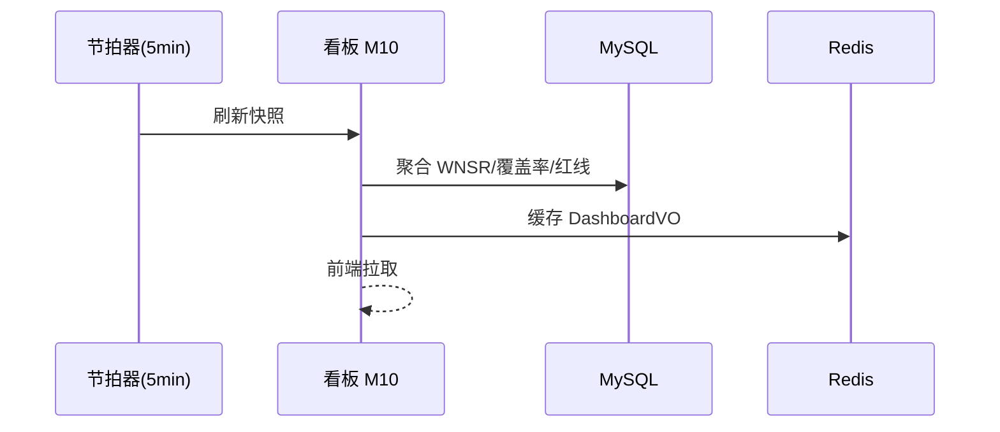

##### §3.2.M10.5 关键流程逻辑

看板聚合为定时快照（5min），无状态机（本段省略）。WNSR 分母（特等奖门槛分）为待确认 #2，先按模拟分估算，规则发布后回填，不影响架构边界。

#### 3.2.M11 人机协同操作面板

##### §3.2.M11.1 模块概述

M11 为前端聚合模块（接入层），覆盖「合规态势卡 M1 / 得分卡 M2 / 审批队列 M3 / 任务看板 M4 / 容错日志 M5 / 看榜 M6 / 自研标注 M7」，业务逻辑在「操作方/主理人」与各后端模块（M1-M10）之间流动，涉及「Nginx（C-07）」。面板响应 P99≤2s（对齐 V1/V5）。

##### §3.2.M11.2 接口清单

| 子领域 | 方法 | 路径 | 用途（≤ 20 字） | 请求 DTO | 响应 VO | 幂等 |
| --- | --- | --- | --- | --- | --- | --- |
| 面板 | GET | /api/v1/console/compliance-card | 合规态势卡 | — | ComplianceCardVO | 天然 |
| 面板 | GET | /api/v1/console/wnsr-card | 加权得分卡 | — | WnsrCardVO | 天然 |
| 面板 | GET | /api/v1/console/approval-queue | 审批队列页 | — | QueuePageVO | 天然 |
| 面板 | GET | /api/v1/console/task-board | 任务看板页 | — | BoardPageVO | 天然 |

##### §3.2.M11.3 关键结构定义（DTO）

```java
public class ComplianceCardVO {
  private Integer violationCount;  // 违规次数(目标0)
  private Integer banCount;        // 封禁次数(目标0)
  private String freqStatus;       // 频控状态 GREEN/YELLOW/RED
}
```

**关键字段定义表**：

| DTO / VO 名 | 字段名 | 类型 | 必填 | 业务含义 | 约束 / 默认值 |
| --- | --- | --- | --- | --- | --- | --- |
| ComplianceCardVO | violationCount | Integer | 是 | 违规次数 | 目标恒为 0 |
| ComplianceCardVO | freqStatus | String | 是 | 频控状态 | ≤95% 绿区 |

##### §3.2.M11.4 模块逻辑时序图

| 编号 | 标题 | 场景类别 | 是否包含异常分支 |
| --- | --- | --- | --- |
| SQ-01 | M11 - 面板加载主链路 | 核心动作执行 | 否 |

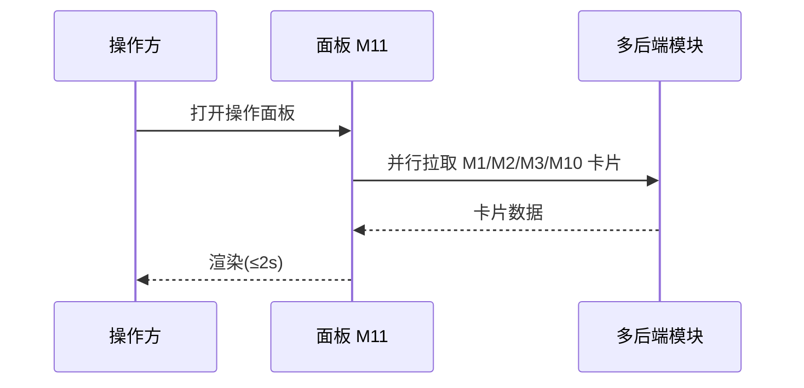

##### §3.2.M11.5 关键流程逻辑

面板为数据聚合展示，无状态机（本段省略）。断点续跑进度由 M2/M4 实时 push，面板订阅 WebSocket 看榜。

### 3.3 核心业务对象清单

#### 3.3.1 对象定义

| 编号 | 对象名（代码类名） | 对象类型 | 包路径 | 模块归属 | 被哪些模块复用 | 实例化策略 | 序列化约定 | 持久化策略 |
| --- | --- | --- | --- | --- | --- | --- | --- | --- |
| O-01 | ComplianceGateway | 聚合根 | domain.gateway | gateway | M1/M5/M9 | 单例 Bean | JSON | 不落表（规则在 t_compliance_rule） |
| O-02 | ApprovalTask | 聚合根 | domain.approval | approval | M2/M9 | Builder | JSON | t_approval_task |
| O-03 | ComputeQuota | 值对象 | domain.scheduler | scheduler | M3/M4 | new（不可变快照） | JSON | t_compute_quota |
| O-04 | PlanningAgent | 聚合根 | domain.planner | planner | M4/M5 | 工厂方法 | JSON | 不落表（任务在 t_collect_task） |
| O-05 | TargetSubject | 实体 | domain.planner | planner | M4/M6 | 由聚合根创建 | JSON | t_target_subject |
| O-06 | CollectTask | 聚合根 | domain.collector | collector | M4/M5/M6 | Builder | JSON | t_collect_task |
| O-07 | TaskSnapshot | 值对象 | domain.collector | collector | M5 | new | JSON | t_task_snapshot |
| O-08 | PassiveSource | 实体 | domain.collector | collector | M5 | 由配置加载 | JSON | t_passive_source |
| O-09 | CollectResult | 聚合根 | domain.collector | collector | M5/M6 | Builder | JSON | t_collect_result |
| O-10 | SourceHealth | 值对象 | domain.collector | collector | M5 | new | JSON | t_source_health |
| O-11 | VerifyResult | 聚合根 | domain.verifier | verifier | M6/M7 | Builder | JSON | t_verify_result |
| O-12 | AssetNode | 实体 | domain.graph | graph | M7 | 由聚合根创建 | JSON | t_asset_node |
| O-13 | AssetRelation | 实体 | domain.graph | graph | M7 | 由聚合根创建 | JSON | t_asset_relation |
| O-14 | Experience | 实体 | domain.experience | experience | M8/M4 | new | JSON | t_experience |
| O-15 | AuditLog | 实体 | domain.audit | audit | M9 | new | JSON | t_audit_log |
| O-16 | MetricSnapshot | 值对象 | domain.dashboard | dashboard | M10 | new | JSON | t_metric_snapshot |
| O-17 | ApprovalStatus | 共享枚举 | common.enums | common | M2 | — | String | 落表 VARCHAR |
| O-18 | PassiveSourceAdapter | 防腐层 ACL | acl.source | collector | M5 | new + 适配 | — | 不落表，瞬时转换 |

**对象类型说明**：聚合根 / 实体 / 值对象 / 共享 DTO / 共享枚举 / 防腐层 ACL（与 §2.2 上下文映射 ACL 关系编号 C-02 呼应）。

#### 3.3.2 命名漂移登记表

| 业务实体（§2） | 代码类名（§3.3.1） | 数据表名（§4.2） | 漂移原因 |
| --- | --- | --- | --- |
| 审批任务 | ApprovalTask + ApprovalStatus | t_approval_task + status 字段 | 业务单一实体在代码层拆为聚合根 + 状态枚举 |
| 资产图谱 | AssetNode + AssetRelation | t_asset_node + t_asset_relation | 图节点/关系在关系库拆为两表映射 |

### 3.4 跨模块公共能力

**公共能力清单**（横切多个模块，以 SDK / AOP / 拦截器形式提供）：

| 公共能力 | 简述 | 提供方（SDK / 切面 / Bean） | 被哪些模块复用 | 接入方式 |
| --- | --- | --- | --- | --- |
| 合规拦截切面 | 出站动作 fail-closed 前置校验 | ComplianceInterceptor（gateway 模块） | 全部出站模块（M4/M5/M1） | 拦截器，注解 @ComplianceCheck |
| 审计日志切面 | 关键操作留痕（合规） | AuditLogAspect（audit 模块） | 全部业务模块 | AOP 切面，注解 @AuditLog |
| 幂等切面 | 写入类接口幂等去重 | IdempotencyInterceptor（common） | 全部写接口（M1/M2/M5/M6） | 拦截器，Header X-Idempotency-Key |
| 限流切面 | 全局/单维 QPS 限流 | RateLimitInterceptor（common） | 网关与高 QPS 接口 | 拦截器 + Redis 计数器 |
| 追踪注入 | traceId/tenantId 透传 | TraceInjectionFilter（common） | 全部模块 | Servlet Filter，注入 MDC |

**填写要求**：提供方为具体类名；接入方式说明研发怎么用。

### 3.5 接口契约

> 本系统对外暴露的接口（含同步 API、异步消息）在错误码、幂等、限流、超时上的全局约定。

#### 3.5.1 全局错误码体系

**错误码格式**：

| 项 | 取值 |
| --- | --- |
| 错误码格式 | 6 位数字 `MMCCSS`：MM=模块域(01合规/02审批/03调度/04规划/05采集/06核验/07图谱/08经验/09日志/10看板/00全局)，CC=类别(00通用/01业务规则/02外部依赖/03状态机/04资源)，SS=序号 |
| 分段规则 | 前 2 位模块 + 中 2 位类别 + 后 2 位序号 |
| 类别取值 | A=业务错误（HTTP 200，业务语义失败）/ B=系统错误（HTTP 5xx）/ C=客户端错误（HTTP 4xx）——本系统以 6 位数字码承载，前缀语义由首位区间体现 |

**错误响应统一结构**：

```json
{
  "code": "000001",
  "msg": "系统繁忙，请稍后再试",
  "msgI18n": { "zh-CN": "系统繁忙，请稍后再试", "en-US": "System busy" },
  "data": null,
  "traceId": "abc123def",
  "timestamp": "2026-07-13T10:00:00.000Z"
}
```

**错误码注册表**：

| 错误码 | HTTP 状态 | 所属模块 | 含义 | 重试建议 | 用户文案 |
| --- | --- | --- | --- | --- | --- |
| 000001 | 500 | 全局 | 系统内部错误 | 可重试（指数退避） | 系统繁忙，请稍后再试 |
| 000002 | 429 | 全局 | 触发限流 | 退避后重试 | 操作太频繁，请稍后再试 |
| 010001 | 200 | M1 合规 | 主动动作被拦截（违规） | 不重试 | 该动作违反纯被动红线，已拦截 |
| 010002 | 200 | M1 合规 | 频控 buffer 已满（≥95%） | 退避后重试 | 提交频繁，请稍后 |
| 020001 | 200 | M2 审批 | 高价值主体需人工复核 | 不重试 | 该主体需人工复核 |
| 030001 | 200 | M3 调度 | 算力已回收（零新增≥25min） | 不重试 | 该任务算力已回收 |
| 050001 | 200 | M5 采集 | 全源不可用已挂起 | 不重试（待补源） | 该维度暂缺采，已挂起 |
| 060001 | 200 | M6 核验 | 单源佐证不足挂起 | 不重试（待补源） | 情报源不足，已挂起 |
| 400001 | 400 | 全局 | 参数校验失败 | 不重试 | 参数错误 |
| 400101 | 401 | 全局 | 未登录 | 不重试 | 请重新登录 |
| 400301 | 403 | 全局 | 无权限 | 不重试 | 无权访问 |

#### 3.5.2 幂等性约定

| 接口类型 | 是否要求幂等 | 幂等键来源（建议） |
| --- | --- | --- |
| 写入类（POST 创建） | 涉及提交/通知/外呼等重复执行有副作用的，必须幂等 | Header X-Idempotency-Key（UUID，调用方生成） |
| 更新类（PUT / PATCH） | 必须幂等 | 资源 ID + 版本号（乐观锁） |
| 删除类（DELETE） | 天然幂等 | — |
| 查询类（GET） | 天然幂等 | — |
| 情报提交 / 审批决定 / 算力分配类 | 强制幂等 | 业务侧请求号（biz_req_no / task_id） |

**幂等设计需考虑的问题**：

| 问题维度 | 设计要点 |
| --- | --- |
| 幂等键生命周期 | 短期防抖 24h（Redis t_idem:{uuid} TTL 24h） |
| 重复请求语义 | 同一键返回首次结果（不重复执行） |
| 执行中态处理 | 首个未返回时，第二个返回"处理中"（状态机 RUNNING） |
| 失败可重试性 | 失败后允许同键重试（仅非终态） |
| 存储兜底 | DB 唯一索引 uk_tenant_biz 作最终防线 |

#### 3.5.3 限流约定

| 维度 | 默认值 | 触发动作 | 调整方式 |
| --- | --- | --- | --- |
| 全局 QPS | 1000 | 返回 000002 | 网关配置 |
| 单租户 QPS | 200 | 返回 000002 | 网关配置 |
| 单 IP QPS | 50 | 返回 000002 + 标记 | 网关配置 |
| 单用户 QPS | 20 | 返回 000002 | 业务配置中心 |
| 重保接口（提交/审批） | 单用户 10 次/分钟 | 锁定 15 分钟 | 业务配置中心 |

**降级策略**：

| 策略项 | 内容 |
| --- | --- |
| 前端退避 | 触发限流后，前端按 Retry-After 退避重试 |
| 后端记录 | 写类接口记录到熔断队列 |
| 红线联动 | 限流红线值与 §5.5 容量水位线"红线"一致（buffer≤95%） |

#### 3.5.4 默认超时与重试基线

| 调用类型 | 默认超时 | 默认重试 | 重试条件 |
| --- | --- | --- | --- |
| 同步 API（内部） | 3s | 0 次 | — |
| 同步 API（外部 E-xx） | 10s | 2 次（指数退避 1s/2s） | 仅网络错误 / 5xx |
| 异步 MQ 消费 | 30s | 16 次（指数退避，封顶 1h） | 业务异常进死信 |
| 定时任务 | 5min | 3 次 | 失败告警 |

**填写要求**：超时值禁止"无限"；所有重试必须有上限；重试不能产生副作用（依赖 §3.5.2 幂等性）。

#### 3.5.5 路由设计规范

**API 路由规范**：

| 维度 | 取值 |
| --- | --- |
| 风格 | RESTful（资源化 URL） |
| 版本控制 | /api/v1/...（路径版本） |
| 命名 | 小写 + 中划线（kebab-case） |
| 资源命名 | 名词复数（/api/v1/collect-tasks） |
| 子资源 | /api/v1/subjects/{id}/tasks |
| 动作类接口 | /api/v1/{resource}/{id}/{action}（POST） |

**前端页面路由清单**：

| 路径 | 页面 / 功能 | 入口角色（§2.3） | 鉴权要求 | 关联模块（§3.2.M{N}） |
| --- | --- | --- | --- | --- |
| /login | 登录页 | 全部 | 公开 | — |
| /console/compliance | 合规态势卡 | 操作方/主理人 | 已登录 | M1/M11 |
| /console/wnsr | 加权得分卡 | 操作方/主理人 | 已登录 | M3/M10/M11 |
| /console/approval | 审批队列 | 操作方 | 已登录+角色 operator | M2 |
| /console/task-board | 任务看板 | 操作方 | 已登录 | M4/M5/M11 |
| /judge/verify | 评委核验入口 | 评委 | 已登录+角色 judge | M7/M9 |

**前端路由约定**：

| 维度 | 取值 |
| --- | --- |
| 路由模式 | History |
| 命名风格 | 小写 + 中划线（kebab-case） |
| 动态参数 | /{resource}/:id |
| 鉴权方式 | 路由元信息 meta.requireAuth=true + meta.roles=[...]，全局路由守卫拦截 |
| 嵌套路由 | 列表页 → 详情页 → 子模块页 |

---

## 4. 数据库设计

> **本章回答**：每个模块的状态用什么表存、表怎么建、数据怎么清理、缓存怎么用。
> **方法论**：数据库按业务域组织（D1-D4），与第 2/3 章一致。

### 4.1 全局数据约定

| 约定项 | 取值 | 说明 |
| --- | --- | --- |
| 命名规范（表名） | t_{entity} 主表；t_{entity}_ext 扩展；t_{A}_{B}_rel 关联 | 全项目统一前缀 t_ |
| 命名规范（字段名） | 小写 + 下划线（snake_case） | 禁止驼峰 |
| 主键类型 | BIGINT AUTO_INCREMENT（单赛事环境，统一自增，禁止混用） | 全项目统一 |
| 字符集 / 排序 | utf8mb4 / utf8mb4_unicode_ci | 支持多语言 |
| 时间字段类型 | DATETIME(3) UTC 存储 | 统一精度毫秒；统一时区 UTC |
| 软删除字段 | deleted TINYINT(1) DEFAULT 0 | 全项目统一 |
| 审计字段 | created_by / created_time / updated_by / updated_time | 命名锁定 |
| 隔离字段（多租户） | tenant_id BIGINT NOT NULL DEFAULT 1 | 单租户系统（高层架构 §4.2 明确非多租户），tenant_id 固定为 1，保留字段以统一查询契约与未来扩展 |
| 业务唯一标识 | biz_id VARCHAR(100) | 与外部系统对齐 |
| 状态枚举 | VARCHAR(30) 字符串 | 枚举值列表在备注列出 |
| 金额字段 | DECIMAL(N, M) | 禁止 FLOAT/DOUBLE（本系统无金额，名单类用 VARCHAR） |
| 手机号存储 | phone VARCHAR(20) | 本系统不采集个人隐私（D0§8⑤），字段仅作占位约定 |

### 4.2 单表设计

> 每张表严格按 5 段编写：库表元信息 / 结构定义 / 索引设计 / DDL / 扩展逻辑。

#### 4.2.1 t_compliance_rule（合规拦截规则）

**库表元信息**：

| 字段 | 取值 |
| --- | --- |
| 数据库类型 | MySQL 8.0 |
| 库名 | passive_info |
| 表名 | t_compliance_rule |
| 业务含义（≤ 50 字） | 合规拦截规则集，定义主动动作零放行与被动白名单 |
| 模块归属（§3.2） | M1 |
| 对应核心对象（§3.3） | O-01 |

**库表结构定义**：

| 列名 | 数据类型 | 可为空 | 约束 | 默认值 | 备注 |
| --- | --- | --- | --- | --- | --- |
| id | BIGINT | NOT NULL | PRIMARY KEY |  | 主键 |
| tenant_id | BIGINT | NOT NULL |  | 1 | 隔离字段（固定 1） |
| rule_code | VARCHAR(30) | NOT NULL |  |  | 规则码（如 ACTIVE_SCAN_BLOCK） |
| action_pattern | VARCHAR(100) | NOT NULL |  |  | 匹配动作类型 |
| decision | VARCHAR(20) | NOT NULL |  | 'BLOCK' | BLOCK/ALLOW |
| priority | INT | NOT NULL |  | 100 | 优先级 |
| enabled | TINYINT(1) | NOT NULL |  | 1 | 是否启用 |
| created_by | VARCHAR(64) | NULL |  | NULL | 创建人 |
| created_time | DATETIME(3) | NULL |  | CURRENT_TIMESTAMP | 创建时间 |
| updated_by | VARCHAR(64) | NULL |  | NULL | 更新人 |
| updated_time | DATETIME(3) | NULL |  | CURRENT_TIMESTAMP ON UPDATE | 更新时间 |
| deleted | TINYINT(1) | NOT NULL |  | 0 | 删除标志 |

**索引设计**：

| 索引名 | 索引类型 | 字段（含顺序） | 设计目的 | 关联查询场景 |
| --- | --- | --- | --- | --- |
| PRIMARY | 主键 | id | 唯一标识 | 按主键 |
| uk_tenant_rule | 唯一索引 | tenant_id, rule_code | 规则唯一 | 规则加载 |
| idx_tenant_enabled | 普通索引 | tenant_id, enabled | 启用规则查询 | 拦截时加载 |

**DDL**：

```sql
CREATE TABLE `t_compliance_rule` (
  `id` BIGINT NOT NULL AUTO_INCREMENT COMMENT '主键',
  `tenant_id` BIGINT NOT NULL DEFAULT 1 COMMENT '租户ID(单租户固定1)',
  `rule_code` VARCHAR(30) NOT NULL COMMENT '规则码',
  `action_pattern` VARCHAR(100) NOT NULL COMMENT '匹配动作类型',
  `decision` VARCHAR(20) NOT NULL DEFAULT 'BLOCK' COMMENT 'BLOCK/ALLOW',
  `priority` INT NOT NULL DEFAULT 100 COMMENT '优先级',
  `enabled` TINYINT(1) NOT NULL DEFAULT 1 COMMENT '是否启用',
  `created_by` VARCHAR(64) DEFAULT NULL,
  `created_time` DATETIME(3) DEFAULT CURRENT_TIMESTAMP(3),
  `updated_by` VARCHAR(64) DEFAULT NULL,
  `updated_time` DATETIME(3) DEFAULT CURRENT_TIMESTAMP(3) ON UPDATE CURRENT_TIMESTAMP(3),
  `deleted` TINYINT(1) NOT NULL DEFAULT 0,
  PRIMARY KEY (`id`),
  UNIQUE KEY `uk_tenant_rule` (`tenant_id`, `rule_code`),
  KEY `idx_tenant_enabled` (`tenant_id`, `enabled`)
) COMMENT='合规拦截规则';
```

**扩展逻辑（数据清理机制）**：无（规则永久保留，低频变更）。

#### 4.2.2 t_approval_task（审批任务）

**库表元信息**：

| 字段 | 取值 |
| --- | --- |
| 数据库类型 | MySQL 8.0 |
| 库名 | passive_info |
| 表名 | t_approval_task |
| 业务含义（≤ 50 字） | 三级人机审批任务，低危自动/中危提醒/高价值人工复核 |
| 模块归属（§3.2） | M2 |
| 对应核心对象（§3.3） | O-02 |

**库表结构定义**：

| 列名 | 数据类型 | 可为空 | 约束 | 默认值 | 备注 |
| --- | --- | --- | --- | --- | --- |
| id | BIGINT | NOT NULL | PRIMARY KEY |  | 主键 |
| tenant_id | BIGINT | NOT NULL |  | 1 | 隔离字段 |
| task_no | VARCHAR(64) | NOT NULL |  |  | 任务号（biz_id） |
| biz_type | VARCHAR(30) | NOT NULL |  |  | COLLECT_RESULT/SUBMIT |
| subject_id | BIGINT | NOT NULL |  |  | 关联主体 |
| risk_level | VARCHAR(10) | NOT NULL |  | 'LOW' | LOW/MID/HIGH |
| status | VARCHAR(20) | NOT NULL |  | 'PENDING' | PENDING/REVIEWING/APPROVED/REJECTED/REMINDING |
| operator | VARCHAR(64) | NULL |  | NULL | 审批人 |
| created_by | VARCHAR(64) | NULL |  | NULL | 创建人 |
| created_time | DATETIME(3) | NULL |  | CURRENT_TIMESTAMP | 创建时间 |
| updated_time | DATETIME(3) | NULL |  | CURRENT_TIMESTAMP ON UPDATE | 更新时间 |
| deleted | TINYINT(1) | NOT NULL |  | 0 | 删除标志 |

**索引设计**：

| 索引名 | 索引类型 | 字段（含顺序） | 设计目的 | 关联查询场景 |
| --- | --- | --- | --- | --- |
| PRIMARY | 主键 | id | 唯一标识 | 按主键 |
| uk_tenant_taskno | 唯一索引 | tenant_id, task_no | 任务唯一 | 幂等去重 |
| idx_tenant_status | 普通索引 | tenant_id, status | 队列查询 | 审批队列 |
| idx_tenant_risk | 普通索引 | tenant_id, risk_level | 高价值置顶 | 队列排序 |

**DDL**：

```sql
CREATE TABLE `t_approval_task` (
  `id` BIGINT NOT NULL AUTO_INCREMENT COMMENT '主键',
  `tenant_id` BIGINT NOT NULL DEFAULT 1,
  `task_no` VARCHAR(64) NOT NULL COMMENT '任务号',
  `biz_type` VARCHAR(30) NOT NULL,
  `subject_id` BIGINT NOT NULL,
  `risk_level` VARCHAR(10) NOT NULL DEFAULT 'LOW' COMMENT 'LOW/MID/HIGH',
  `status` VARCHAR(20) NOT NULL DEFAULT 'PENDING' COMMENT 'PENDING/REVIEWING/APPROVED/REJECTED/REMINDING',
  `operator` VARCHAR(64) DEFAULT NULL,
  `created_by` VARCHAR(64) DEFAULT NULL,
  `created_time` DATETIME(3) DEFAULT CURRENT_TIMESTAMP(3),
  `updated_time` DATETIME(3) DEFAULT CURRENT_TIMESTAMP(3) ON UPDATE CURRENT_TIMESTAMP(3),
  `deleted` TINYINT(1) NOT NULL DEFAULT 0,
  PRIMARY KEY (`id`),
  UNIQUE KEY `uk_tenant_taskno` (`tenant_id`, `task_no`),
  KEY `idx_tenant_status` (`tenant_id`, `status`),
  KEY `idx_tenant_risk` (`tenant_id`, `risk_level`)
) COMMENT='审批任务';
```

**扩展逻辑（数据清理机制）**：软删（deleted=1），审批结论保留 ≥1 年供核验（与 §8.2 一致）。

#### 4.2.3 t_compute_quota（算力配额）

**库表元信息**：

| 字段 | 取值 |
| --- | --- |
| 数据库类型 | MySQL 8.0 |
| 库名 | passive_info |
| 表名 | t_compute_quota |
| 业务含义（≤ 50 字） | 加权算力配额快照，A:B:C=60:30:10，每 5min 看榜倾斜 |
| 模块归属（§3.2） | M3 |
| 对应核心对象（§3.3） | O-03 |

**库表结构定义**：

| 列名 | 数据类型 | 可为空 | 约束 | 默认值 | 备注 |
| --- | --- | --- | --- | --- | --- |
| id | BIGINT | NOT NULL | PRIMARY KEY |  | 主键 |
| tenant_id | BIGINT | NOT NULL |  | 1 | 隔离字段 |
| tick_id | VARCHAR(32) | NOT NULL |  |  | 看榜节拍 ID |
| clazz | VARCHAR(10) | NOT NULL |  |  | A/B/C |
| weight | DECIMAL(4,2) | NOT NULL |  |  | 权重 3.00/1.50/0.50 |
| ratio | INT | NOT NULL |  |  | 占比 60/30/10 |
| allocated | INT | NOT NULL |  |  | 已分配算力 |
| reclaimed | TINYINT(1) | NOT NULL |  | 0 | 是否已回收(25min零新增) |
| created_time | DATETIME(3) | NULL |  | CURRENT_TIMESTAMP | 创建时间 |

**索引设计**：

| 索引名 | 索引类型 | 字段（含顺序） | 设计目的 | 关联查询场景 |
| --- | --- | --- | --- | --- |
| PRIMARY | 主键 | id | 唯一标识 | 按主键 |
| idx_tenant_tick | 普通索引 | tenant_id, tick_id | 节拍查询 | 看榜快照 |

**DDL**：

```sql
CREATE TABLE `t_compute_quota` (
  `id` BIGINT NOT NULL AUTO_INCREMENT COMMENT '主键',
  `tenant_id` BIGINT NOT NULL DEFAULT 1,
  `tick_id` VARCHAR(32) NOT NULL COMMENT '看榜节拍ID',
  `clazz` VARCHAR(10) NOT NULL COMMENT 'A/B/C',
  `weight` DECIMAL(4,2) NOT NULL COMMENT '权重',
  `ratio` INT NOT NULL COMMENT '占比60/30/10',
  `allocated` INT NOT NULL COMMENT '已分配算力',
  `reclaimed` TINYINT(1) NOT NULL DEFAULT 0 COMMENT '是否已回收',
  `created_time` DATETIME(3) DEFAULT CURRENT_TIMESTAMP(3),
  PRIMARY KEY (`id`),
  KEY `idx_tenant_tick` (`tenant_id`, `tick_id`)
) COMMENT='算力配额快照';
```

**扩展逻辑（数据清理机制）**：归档（快照保留 30 天，历史归档至 MinIO）。

#### 4.2.4 t_target_subject（全主体枚举）

**库表元信息**：

| 字段 | 取值 |
| --- | --- |
| 数据库类型 | MySQL 8.0 |
| 库名 | passive_info |
| 表名 | t_target_subject |
| 业务含义（≤ 50 字） | 全主体枚举结果，母+子+分全量，股权穿透层数可配置 |
| 模块归属（§3.2） | M4 |
| 对应核心对象（§3.3） | O-05 |

**库表结构定义**：

| 列名 | 数据类型 | 可为空 | 约束 | 默认值 | 备注 |
| --- | --- | --- | --- | --- | --- |
| id | BIGINT | NOT NULL | PRIMARY KEY |  | 主键 |
| tenant_id | BIGINT | NOT NULL |  | 1 | 隔离字段 |
| enterprise_name | VARCHAR(200) | NOT NULL |  |  | 企业全称 |
| subject_name | VARCHAR(200) | NOT NULL |  |  | 主体名称（子公司/分公司） |
| subject_type | VARCHAR(20) | NOT NULL |  |  | PARENT/SUBSIDIARY/BRANCH |
| depth | INT | NOT NULL |  |  | 穿透层数（默认≥3，待确认 #6） |
| relation | VARCHAR(50) | NULL |  | NULL | 股权关系描述 |
| created_time | DATETIME(3) | NULL |  | CURRENT_TIMESTAMP | 创建时间 |

**索引设计**：

| 索引名 | 索引类型 | 字段（含顺序） | 设计目的 | 关联查询场景 |
| --- | --- | --- | --- | --- |
| PRIMARY | 主键 | id | 唯一标识 | 按主键 |
| idx_tenant_enterprise | 普通索引 | tenant_id, enterprise_name | 企业维度查询 | 枚举结果反查 |

**DDL**：

```sql
CREATE TABLE `t_target_subject` (
  `id` BIGINT NOT NULL AUTO_INCREMENT COMMENT '主键',
  `tenant_id` BIGINT NOT NULL DEFAULT 1,
  `enterprise_name` VARCHAR(200) NOT NULL,
  `subject_name` VARCHAR(200) NOT NULL,
  `subject_type` VARCHAR(20) NOT NULL COMMENT 'PARENT/SUBSIDIARY/BRANCH',
  `depth` INT NOT NULL COMMENT '穿透层数',
  `relation` VARCHAR(50) DEFAULT NULL,
  `created_time` DATETIME(3) DEFAULT CURRENT_TIMESTAMP(3),
  PRIMARY KEY (`id`),
  KEY `idx_tenant_enterprise` (`tenant_id`, `enterprise_name`)
) COMMENT='全主体枚举';
```

**扩展逻辑（数据清理机制）**：无（枚举结果长期保留，支撑覆盖率统计）。

#### 4.2.5 t_collect_task（采集任务）

**库表元信息**：

| 字段 | 取值 |
| --- | --- |
| 数据库类型 | MySQL 8.0 |
| 库名 | passive_info |
| 表名 | t_collect_task |
| 业务含义（≤ 50 字） | 采集作业单元，单企业单维度，四类集群分发 |
| 模块归属（§3.2） | M4/M5 |
| 对应核心对象（§3.3） | O-06 |

**库表结构定义**：

| 列名 | 数据类型 | 可为空 | 约束 | 默认值 | 备注 |
| --- | --- | --- | --- | --- | --- |
| id | BIGINT | NOT NULL | PRIMARY KEY |  | 主键 |
| tenant_id | BIGINT | NOT NULL |  | 1 | 隔离字段 |
| task_no | VARCHAR(64) | NOT NULL |  |  | 任务号 |
| subject_id | BIGINT | NOT NULL |  |  | 关联主体 |
| cluster | VARCHAR(10) | NOT NULL |  |  | C1/C2/C3/C4 |
| sub_type | VARCHAR(20) | NOT NULL |  |  | WEB/OFFICIAL/MP/EQUITY |
| status | VARCHAR(20) | NOT NULL |  | 'QUEUED' | QUEUED/RUNNING/FAILOVER/COLLECTED/SUSPENDED |
| progress | INT | NOT NULL |  | 0 | 进度百分比 |
| snapshot_ref | VARCHAR(64) | NULL |  | NULL | 断点续跑快照引用 |
| created_time | DATETIME(3) | NULL |  | CURRENT_TIMESTAMP | 创建时间 |
| updated_time | DATETIME(3) | NULL |  | CURRENT_TIMESTAMP ON UPDATE | 更新时间 |

**索引设计**：

| 索引名 | 索引类型 | 字段（含顺序） | 设计目的 | 关联查询场景 |
| --- | --- | --- | --- | --- |
| PRIMARY | 主键 | id | 唯一标识 | 按主键 |
| uk_tenant_taskno | 唯一索引 | tenant_id, task_no | 任务唯一 | 幂等 |
| idx_tenant_status | 普通索引 | tenant_id, status | 状态查询 | 调度拉取 |
| idx_tenant_subject | 普通索引 | tenant_id, subject_id | 主体维度 | 单企业闭环 |

**DDL**：

```sql
CREATE TABLE `t_collect_task` (
  `id` BIGINT NOT NULL AUTO_INCREMENT COMMENT '主键',
  `tenant_id` BIGINT NOT NULL DEFAULT 1,
  `task_no` VARCHAR(64) NOT NULL COMMENT '任务号',
  `subject_id` BIGINT NOT NULL,
  `cluster` VARCHAR(10) NOT NULL COMMENT 'C1/C2/C3/C4',
  `sub_type` VARCHAR(20) NOT NULL COMMENT 'WEB/OFFICIAL/MP/EQUITY',
  `status` VARCHAR(20) NOT NULL DEFAULT 'QUEUED' COMMENT 'QUEUED/RUNNING/FAILOVER/COLLECTED/SUSPENDED',
  `progress` INT NOT NULL DEFAULT 0,
  `snapshot_ref` VARCHAR(64) DEFAULT NULL,
  `created_time` DATETIME(3) DEFAULT CURRENT_TIMESTAMP(3),
  `updated_time` DATETIME(3) DEFAULT CURRENT_TIMESTAMP(3) ON UPDATE CURRENT_TIMESTAMP(3),
  PRIMARY KEY (`id`),
  UNIQUE KEY `uk_tenant_taskno` (`tenant_id`, `task_no`),
  KEY `idx_tenant_status` (`tenant_id`, `status`),
  KEY `idx_tenant_subject` (`tenant_id`, `subject_id`)
) COMMENT='采集任务';
```

**扩展逻辑（数据清理机制）**：软删 + 完成态保留 90 天，历史归档 MinIO。

#### 4.2.6 t_task_snapshot（断点续跑快照）

**库表元信息**：

| 字段 | 取值 |
| --- | --- |
| 数据库类型 | MySQL 8.0 |
| 库名 | passive_info |
| 表名 | t_task_snapshot |
| 业务含义（≤ 50 字） | 任务进度实时快照，重启零丢失 |
| 模块归属（§3.2） | M4/M5 |
| 对应核心对象（§3.3） | O-07 |

**库表结构定义**：

| 列名 | 数据类型 | 可为空 | 约束 | 默认值 | 备注 |
| --- | --- | --- | --- | --- | --- |
| id | BIGINT | NOT NULL | PRIMARY KEY |  | 主键 |
| tenant_id | BIGINT | NOT NULL |  | 1 | 隔离字段 |
| task_id | BIGINT | NOT NULL |  |  | 关联采集任务 |
| step | INT | NOT NULL |  |  | 已完成步骤 |
| state_json | TEXT | NOT NULL |  |  | 进度状态（JSON） |
| created_time | DATETIME(3) | NULL |  | CURRENT_TIMESTAMP | 创建时间 |

**索引设计**：

| 索引名 | 索引类型 | 字段（含顺序） | 设计目的 | 关联查询场景 |
| --- | --- | --- | --- | --- |
| PRIMARY | 主键 | id | 唯一标识 | 按主键 |
| uk_tenant_task | 唯一索引 | tenant_id, task_id | 每任务一快照 | 续跑恢复 |

**DDL**：

```sql
CREATE TABLE `t_task_snapshot` (
  `id` BIGINT NOT NULL AUTO_INCREMENT COMMENT '主键',
  `tenant_id` BIGINT NOT NULL DEFAULT 1,
  `task_id` BIGINT NOT NULL,
  `step` INT NOT NULL COMMENT '已完成步骤',
  `state_json` TEXT NOT NULL COMMENT '进度状态JSON',
  `created_time` DATETIME(3) DEFAULT CURRENT_TIMESTAMP(3),
  PRIMARY KEY (`id`),
  UNIQUE KEY `uk_tenant_task` (`tenant_id`, `task_id`)
) COMMENT='断点续跑快照';
```

**扩展逻辑（数据清理机制）**：物理删除（任务完成后 7 天清理）。

#### 4.2.7 t_passive_source（被动数据源）

**库表元信息**：

| 字段 | 取值 |
| --- | --- |
| 数据库类型 | MySQL 8.0 |
| 库名 | passive_info |
| 表名 | t_passive_source |
| 业务含义（≤ 50 字） | 被动数据源/开源执行器白名单与留档（R5） |
| 模块归属（§3.2） | M5 |
| 对应核心对象（§3.3） | O-08 |

**库表结构定义**：

| 列名 | 数据类型 | 可为空 | 约束 | 默认值 | 备注 |
| --- | --- | --- | --- | --- | --- |
| id | BIGINT | NOT NULL | PRIMARY KEY |  | 主键 |
| tenant_id | BIGINT | NOT NULL |  | 1 | 隔离字段 |
| source_name | VARCHAR(50) | NOT NULL |  |  | 源名称（Amass/Subfinder/FOFA...） |
| source_type | VARCHAR(20) | NOT NULL |  |  | OSS_TOOL/PASSIVE_API |
| license | VARCHAR(50) | NULL |  | NULL | 许可证（Apache-2.0 等，R5 留档） |
| is_self_build | TINYINT(1) | NOT NULL |  | 0 | 是否自研（自研/开源边界标注） |
| passive_only | TINYINT(1) | NOT NULL |  | 1 | 仅被动（禁主动模块） |
| cluster | VARCHAR(10) | NOT NULL |  |  | 归属集群 C1-C4 |
| created_time | DATETIME(3) | NULL |  | CURRENT_TIMESTAMP | 创建时间 |

**索引设计**：

| 索引名 | 索引类型 | 字段（含顺序） | 设计目的 | 关联查询场景 |
| --- | --- | --- | --- | --- |
| PRIMARY | 主键 | id | 唯一标识 | 按主键 |
| idx_tenant_cluster | 普通索引 | tenant_id, cluster | 集群维度 | 源选择 |

**DDL**：

```sql
CREATE TABLE `t_passive_source` (
  `id` BIGINT NOT NULL AUTO_INCREMENT COMMENT '主键',
  `tenant_id` BIGINT NOT NULL DEFAULT 1,
  `source_name` VARCHAR(50) NOT NULL,
  `source_type` VARCHAR(20) NOT NULL COMMENT 'OSS_TOOL/PASSIVE_API',
  `license` VARCHAR(50) DEFAULT NULL,
  `is_self_build` TINYINT(1) NOT NULL DEFAULT 0 COMMENT '是否自研',
  `passive_only` TINYINT(1) NOT NULL DEFAULT 1 COMMENT '仅被动',
  `cluster` VARCHAR(10) NOT NULL COMMENT 'C1/C2/C3/C4',
  `created_time` DATETIME(3) DEFAULT CURRENT_TIMESTAMP(3),
  PRIMARY KEY (`id`),
  KEY `idx_tenant_cluster` (`tenant_id`, `cluster`)
) COMMENT='被动数据源/开源留档';
```

**扩展逻辑（数据清理机制）**：无（留档长期保存，决赛一键出具证明）。

#### 4.2.8 t_collect_result（采集结果）

**库表元信息**：

| 字段 | 取值 |
| --- | --- |
| 数据库类型 | MySQL 8.0 |
| 库名 | passive_info |
| 表名 | t_collect_result |
| 业务含义（≤ 50 字） | 原始被动情报（仅解析不访问），待四层核验 |
| 模块归属（§3.2） | M5 |
| 对应核心对象（§3.3） | O-09 |

**库表结构定义**：

| 列名 | 数据类型 | 可为空 | 约束 | 默认值 | 备注 |
| --- | --- | --- | --- | --- | --- |
| id | BIGINT | NOT NULL | PRIMARY KEY |  | 主键 |
| tenant_id | BIGINT | NOT NULL |  | 1 | 隔离字段 |
| task_id | BIGINT | NOT NULL |  |  | 关联采集任务 |
| asset_type | VARCHAR(20) | NOT NULL |  |  | DOMAIN/OFFICIAL/MP/EQUITY |
| asset_value | VARCHAR(500) | NOT NULL |  |  | 资产值（域名/公众号ID...） |
| source_name | VARCHAR(50) | NOT NULL |  |  | 来源（被动源） |
| collected_at | DATETIME(3) | NULL |  | NULL | 情报时间（时间过滤层用） |
| verify_status | VARCHAR(20) | NOT NULL |  | 'PENDING' | PENDING/PASS/SUSPEND |
| created_time | DATETIME(3) | NULL |  | CURRENT_TIMESTAMP | 创建时间 |

**索引设计**：

| 索引名 | 索引类型 | 字段（含顺序） | 设计目的 | 关联查询场景 |
| --- | --- | --- | --- | --- |
| PRIMARY | 主键 | id | 唯一标识 | 按主键 |
| idx_tenant_task | 普通索引 | tenant_id, task_id | 任务维度 | 结果反查 |
| idx_tenant_verify | 普通索引 | tenant_id, verify_status | 核验查询 | 待核队列 |

**DDL**：

```sql
CREATE TABLE `t_collect_result` (
  `id` BIGINT NOT NULL AUTO_INCREMENT COMMENT '主键',
  `tenant_id` BIGINT NOT NULL DEFAULT 1,
  `task_id` BIGINT NOT NULL,
  `asset_type` VARCHAR(20) NOT NULL,
  `asset_value` VARCHAR(500) NOT NULL,
  `source_name` VARCHAR(50) NOT NULL,
  `collected_at` DATETIME(3) DEFAULT NULL,
  `verify_status` VARCHAR(20) NOT NULL DEFAULT 'PENDING' COMMENT 'PENDING/PASS/SUSPEND',
  `created_time` DATETIME(3) DEFAULT CURRENT_TIMESTAMP(3),
  PRIMARY KEY (`id`),
  KEY `idx_tenant_task` (`tenant_id`, `task_id`),
  KEY `idx_tenant_verify` (`tenant_id`, `verify_status`)
) COMMENT='采集结果';
```

**扩展逻辑（数据清理机制）**：归档（未通过核验保留 30 天供补源，通过归档至 MinIO）。

#### 4.2.9 t_source_health（多源容错状态）

**库表元信息**：

| 字段 | 取值 |
| --- | --- |
| 数据库类型 | MySQL 8.0 |
| 库名 | passive_info |
| 表名 | t_source_health |
| 业务含义（≤ 50 字） | 多源容错健康状态，热切换备用源，全源不可用挂起告警 |
| 模块归属（§3.2） | M5 |
| 对应核心对象（§3.3） | O-10 |

**库表结构定义**：

| 列名 | 数据类型 | 可为空 | 约束 | 默认值 | 备注 |
| --- | --- | --- | --- | --- | --- |
| id | BIGINT | NOT NULL | PRIMARY KEY |  | 主键 |
| tenant_id | BIGINT | NOT NULL |  | 1 | 隔离字段 |
| source_name | VARCHAR(50) | NOT NULL |  |  | 被动数据源名称 |
| source_type | VARCHAR(20) | NOT NULL |  |  | WEB/OFFICIAL/MP/EQUITY |
| health_status | VARCHAR(20) | NOT NULL |  | 'HEALTHY' | HEALTHY/DEGRADED/SUSPENDED |
| fail_count | INT | NOT NULL |  | 0 | 连续失败计数 |
| last_check_time | DATETIME(3) | NULL |  | NULL | 最近健康检查时间 |
| last_error | VARCHAR(500) | NULL |  | NULL | 最近错误信息 |
| switched_to | VARCHAR(50) | NULL |  | NULL | 热切换目标源 |
| switched_at | DATETIME(3) | NULL |  | NULL | 热切换时间 |
| created_time | DATETIME(3) | NULL |  | CURRENT_TIMESTAMP | 创建时间 |
| updated_time | DATETIME(3) | NULL |  | CURRENT_TIMESTAMP ON UPDATE | 更新时间 |

**索引设计**：

| 索引名 | 索引类型 | 字段（含顺序） | 设计目的 | 关联查询场景 |
| --- | --- | --- | --- | --- |
| PRIMARY | 主键 | id | 唯一标识 | 按主键 |
| uk_tenant_source | 唯一索引 | tenant_id, source_name | 数据源唯一 | 容错状态查询 |
| idx_tenant_type_status | 普通索引 | tenant_id, source_type, health_status | 按类型查健康 | 容错面板展示 |

**DDL**：

```sql
CREATE TABLE `t_source_health` (
  `id` BIGINT NOT NULL AUTO_INCREMENT COMMENT '主键',
  `tenant_id` BIGINT NOT NULL DEFAULT 1,
  `source_name` VARCHAR(50) NOT NULL COMMENT '被动数据源名称',
  `source_type` VARCHAR(20) NOT NULL COMMENT 'WEB/OFFICIAL/MP/EQUITY',
  `health_status` VARCHAR(20) NOT NULL DEFAULT 'HEALTHY' COMMENT 'HEALTHY/DEGRADED/SUSPENDED',
  `fail_count` INT NOT NULL DEFAULT 0 COMMENT '连续失败计数',
  `last_check_time` DATETIME(3) DEFAULT NULL COMMENT '最近健康检查时间',
  `last_error` VARCHAR(500) DEFAULT NULL COMMENT '最近错误信息',
  `switched_to` VARCHAR(50) DEFAULT NULL COMMENT '热切换目标源',
  `switched_at` DATETIME(3) DEFAULT NULL COMMENT '热切换时间',
  `created_time` DATETIME(3) DEFAULT CURRENT_TIMESTAMP(3),
  `updated_time` DATETIME(3) DEFAULT CURRENT_TIMESTAMP(3) ON UPDATE CURRENT_TIMESTAMP(3),
  PRIMARY KEY (`id`),
  UNIQUE KEY `uk_tenant_source` (`tenant_id`, `source_name`),
  KEY `idx_tenant_type_status` (`tenant_id`, `source_type`, `health_status`)
) COMMENT='多源容错健康状态';
```

**扩展逻辑（数据清理机制）**：软更新（健康状态实时更新，挂起记录保留 30 天供复盘）。

#### 4.2.10 t_verify_result（四层核验结果）

**库表元信息**：

| 字段 | 取值 |
| --- | --- |
| 数据库类型 | MySQL 8.0 |
| 库名 | passive_info |
| 表名 | t_verify_result |
| 业务含义（≤ 50 字） | 四层自动核验结果，工商匹配/DNS仅解析/时间过滤/多源≥2 |
| 模块归属（§3.2） | M6 |
| 对应核心对象（§3.3） | O-11 |

**库表结构定义**：

| 列名 | 数据类型 | 可为空 | 约束 | 默认值 | 备注 |
| --- | --- | --- | --- | --- | --- |
| id | BIGINT | NOT NULL | PRIMARY KEY |  | 主键 |
| tenant_id | BIGINT | NOT NULL |  | 1 | 隔离字段 |
| result_id | BIGINT | NOT NULL |  |  | 关联采集结果 t_collect_result.id |
| verify_layer | TINYINT | NOT NULL |  |  | 核验层 1工商/2DNS/3时间/4多源 |
| verify_status | VARCHAR(20) | NOT NULL |  | 'PENDING' | PENDING/PASS/SUSPEND |
| verify_detail | VARCHAR(500) | NULL |  | NULL | 核验详情（如匹配主体名/过期天数） |
| source_count | INT | NULL |  | NULL | 多源佐证数（第4层用） |
| verified_at | DATETIME(3) | NULL |  | NULL | 核验时间 |
| created_time | DATETIME(3) | NULL |  | CURRENT_TIMESTAMP | 创建时间 |

**索引设计**：

| 索引名 | 索引类型 | 字段（含顺序） | 设计目的 | 关联查询场景 |
| --- | --- | --- | --- | --- |
| PRIMARY | 主键 | id | 唯一标识 | 按主键 |
| idx_tenant_result | 普通索引 | tenant_id, result_id | 结果反查 | 按采集结果查核验 |
| idx_tenant_layer_status | 普通索引 | tenant_id, verify_layer, verify_status | 分层查询 | 待核队列 |

**DDL**：

```sql
CREATE TABLE `t_verify_result` (
  `id` BIGINT NOT NULL AUTO_INCREMENT COMMENT '主键',
  `tenant_id` BIGINT NOT NULL DEFAULT 1,
  `result_id` BIGINT NOT NULL COMMENT '关联采集结果',
  `verify_layer` TINYINT NOT NULL COMMENT '核验层1工商/2DNS/3时间/4多源',
  `verify_status` VARCHAR(20) NOT NULL DEFAULT 'PENDING' COMMENT 'PENDING/PASS/SUSPEND',
  `verify_detail` VARCHAR(500) DEFAULT NULL COMMENT '核验详情',
  `source_count` INT DEFAULT NULL COMMENT '多源佐证数',
  `verified_at` DATETIME(3) DEFAULT NULL COMMENT '核验时间',
  `created_time` DATETIME(3) DEFAULT CURRENT_TIMESTAMP(3),
  PRIMARY KEY (`id`),
  KEY `idx_tenant_result` (`tenant_id`, `result_id`),
  KEY `idx_tenant_layer_status` (`tenant_id`, `verify_layer`, `verify_status`)
) COMMENT='四层核验结果';
```

**扩展逻辑（数据清理机制）**：归档（核验通过的结果关联入库图谱，未通过保留 30 天供补源）。

#### 4.2.11 t_asset_node（资产图谱节点）

**库表元信息**：

| 字段 | 取值 |
| --- | --- |
| 数据库类型 | Neo4j 5.18 Community（MySQL 镜像冗余） |
| 库名 | passive_info / neo4j |
| 表名 | t_asset_node（MySQL 镜像）/ Node（Neo4j） |
| 业务含义（≤ 50 字） | 资产图谱节点，企业-子-域-号-程序拓扑入库 |
| 模块归属（§3.2） | M7 |
| 对应核心对象（§3.3） | O-12 |

**库表结构定义**：

| 列名 | 数据类型 | 可为空 | 约束 | 默认值 | 备注 |
| --- | --- | --- | --- | --- | --- |
| id | BIGINT | NOT NULL | PRIMARY KEY |  | 主键 |
| tenant_id | BIGINT | NOT NULL |  | 1 | 隔离字段 |
| node_type | VARCHAR(20) | NOT NULL |  |  | ENTERPRISE/DOMAIN/OFFICIAL/MP |
| node_value | VARCHAR(500) | NOT NULL |  |  | 节点值（企业名/域名/公众号ID） |
| parent_id | BIGINT | NULL |  | NULL | 父节点（股权层级） |
| properties | JSON | NULL |  | NULL | 扩展属性（工商信息/权重标签） |
| created_time | DATETIME(3) | NULL |  | CURRENT_TIMESTAMP | 创建时间 |
| updated_time | DATETIME(3) | NULL |  | CURRENT_TIMESTAMP ON UPDATE | 更新时间 |

**索引设计**：

| 索引名 | 索引类型 | 字段（含顺序） | 设计目的 | 关联查询场景 |
| --- | --- | --- | --- | --- |
| PRIMARY | 主键 | id | 唯一标识 | 按主键 |
| uk_tenant_type_value | 唯一索引 | tenant_id, node_type, node_value(255) | 节点唯一 | 防重复入库 |
| idx_tenant_parent | 普通索引 | tenant_id, parent_id | 层级查询 | 股权穿透树 |

**DDL**：

```sql
CREATE TABLE `t_asset_node` (
  `id` BIGINT NOT NULL AUTO_INCREMENT COMMENT '主键',
  `tenant_id` BIGINT NOT NULL DEFAULT 1,
  `node_type` VARCHAR(20) NOT NULL COMMENT 'ENTERPRISE/DOMAIN/OFFICIAL/MP',
  `node_value` VARCHAR(500) NOT NULL COMMENT '节点值',
  `parent_id` BIGINT DEFAULT NULL COMMENT '父节点',
  `properties` JSON DEFAULT NULL COMMENT '扩展属性',
  `created_time` DATETIME(3) DEFAULT CURRENT_TIMESTAMP(3),
  `updated_time` DATETIME(3) DEFAULT CURRENT_TIMESTAMP(3) ON UPDATE CURRENT_TIMESTAMP(3),
  PRIMARY KEY (`id`),
  UNIQUE KEY `uk_tenant_type_value` (`tenant_id`, `node_type`, `node_value`(255)),
  KEY `idx_tenant_parent` (`tenant_id`, `parent_id`)
) COMMENT='资产图谱节点';
```

**扩展逻辑（数据清理机制）**：无（图谱节点永久保留，决赛复盘与巡检依赖）。

#### 4.2.12 t_asset_relation（资产图谱关系）

**库表元信息**：

| 字段 | 取值 |
| --- | --- |
| 数据库类型 | Neo4j 5.18 Community（MySQL 镜像冗余） |
| 库名 | passive_info / neo4j |
| 表名 | t_asset_relation（MySQL 镜像）/ Relationship（Neo4j） |
| 业务含义（≤ 50 字） | 资产图谱关系，企业-子-域-号-程序关联拓扑 |
| 模块归属（§3.2） | M7 |
| 对应核心对象（§3.3） | O-13 |

**库表结构定义**：

| 列名 | 数据类型 | 可为空 | 约束 | 默认值 | 备注 |
| --- | --- | --- | --- | --- | --- |
| id | BIGINT | NOT NULL | PRIMARY KEY |  | 主键 |
| tenant_id | BIGINT | NOT NULL |  | 1 | 隔离字段 |
| source_node_id | BIGINT | NOT NULL |  |  | 源节点 t_asset_node.id |
| target_node_id | BIGINT | NOT NULL |  |  | 目标节点 t_asset_node.id |
| rel_type | VARCHAR(30) | NOT NULL |  |  | OWNS/RESOLVES_TO/LINKED/SUBMIT |
| weight | DECIMAL(4,2) | NULL |  | NULL | 关系权重（推理补全用） |
| created_time | DATETIME(3) | NULL |  | CURRENT_TIMESTAMP | 创建时间 |

**索引设计**：

| 索引名 | 索引类型 | 字段（含顺序） | 设计目的 | 关联查询场景 |
| --- | --- | --- | --- | --- |
| PRIMARY | 主键 | id | 唯一标识 | 按主键 |
| idx_tenant_source | 普通索引 | tenant_id, source_node_id | 正向遍历 | 资产拓线下钻 |
| idx_tenant_target | 普通索引 | tenant_id, target_node_id | 反向遍历 | 反查归属 |

**DDL**：

```sql
CREATE TABLE `t_asset_relation` (
  `id` BIGINT NOT NULL AUTO_INCREMENT COMMENT '主键',
  `tenant_id` BIGINT NOT NULL DEFAULT 1,
  `source_node_id` BIGINT NOT NULL COMMENT '源节点',
  `target_node_id` BIGINT NOT NULL COMMENT '目标节点',
  `rel_type` VARCHAR(30) NOT NULL COMMENT 'OWNS/RESOLVES_TO/LINKED/SUBMIT',
  `weight` DECIMAL(4,2) DEFAULT NULL COMMENT '关系权重',
  `created_time` DATETIME(3) DEFAULT CURRENT_TIMESTAMP(3),
  PRIMARY KEY (`id`),
  KEY `idx_tenant_source` (`tenant_id`, `source_node_id`),
  KEY `idx_tenant_target` (`tenant_id`, `target_node_id`)
) COMMENT='资产图谱关系';
```

**扩展逻辑（数据清理机制）**：无（关系永久保留，推理补全与盲区挖掘依赖历史拓扑）。

#### 4.2.13 t_experience（测绘经验库）

**库表元信息**：

| 字段 | 取值 |
| --- | --- |
| 数据库类型 | MySQL 8.0 |
| 库名 | passive_info |
| 表名 | t_experience |
| 业务含义（≤ 50 字） | 测绘经验库，采集链路/失败归因/答案复用 |
| 模块归属（§3.2） | M8 |
| 对应核心对象（§3.3） | O-14 |

**库表结构定义**：

| 列名 | 数据类型 | 可为空 | 约束 | 默认值 | 备注 |
| --- | --- | --- | --- | --- | --- |
| id | BIGINT | NOT NULL | PRIMARY KEY |  | 主键 |
| tenant_id | BIGINT | NOT NULL |  | 1 | 隔离字段 |
| exp_type | VARCHAR(20) | NOT NULL |  |  | LINK/ERROR/SOLUTION |
| source_domain | VARCHAR(200) | NULL |  | NULL | 来源域名/主体 |
| content | TEXT | NOT NULL |  |  | 经验内容（链路/报错/答案） |
| tags | VARCHAR(500) | NULL |  | NULL | 标签（逗号分隔） |
| hit_count | INT | NOT NULL |  | 0 | 命中复用次数 |
| created_time | DATETIME(3) | NULL |  | CURRENT_TIMESTAMP | 创建时间 |
| updated_time | DATETIME(3) | NULL |  | CURRENT_TIMESTAMP ON UPDATE | 更新时间 |

**索引设计**：

| 索引名 | 索引类型 | 字段（含顺序） | 设计目的 | 关联查询场景 |
| --- | --- | --- | --- | --- |
| PRIMARY | 主键 | id | 唯一标识 | 按主键 |
| idx_tenant_type | 普通索引 | tenant_id, exp_type | 按类型检索 | 盲区补源/失败归因 |
| idx_tenant_domain | 普通索引 | tenant_id, source_domain(255) | 按域名检索 | 链路复用 |

**DDL**：

```sql
CREATE TABLE `t_experience` (
  `id` BIGINT NOT NULL AUTO_INCREMENT COMMENT '主键',
  `tenant_id` BIGINT NOT NULL DEFAULT 1,
  `exp_type` VARCHAR(20) NOT NULL COMMENT 'LINK/ERROR/SOLUTION',
  `source_domain` VARCHAR(200) DEFAULT NULL COMMENT '来源域名/主体',
  `content` TEXT NOT NULL COMMENT '经验内容',
  `tags` VARCHAR(500) DEFAULT NULL COMMENT '标签',
  `hit_count` INT NOT NULL DEFAULT 0 COMMENT '命中复用次数',
  `created_time` DATETIME(3) DEFAULT CURRENT_TIMESTAMP(3),
  `updated_time` DATETIME(3) DEFAULT CURRENT_TIMESTAMP(3) ON UPDATE CURRENT_TIMESTAMP(3),
  PRIMARY KEY (`id`),
  KEY `idx_tenant_type` (`tenant_id`, `exp_type`),
  KEY `idx_tenant_domain` (`tenant_id`, `source_domain`(255))
) COMMENT='测绘经验库';
```

**扩展逻辑（数据清理机制）**：无（经验长期积累，hit_count 高的经验优先复用）。

#### 4.2.14 t_audit_log（合规证据链日志）

**库表元信息**：

| 字段 | 取值 |
| --- | --- |
| 数据库类型 | MySQL 8.0 |
| 库名 | passive_info |
| 表名 | t_audit_log |
| 业务含义（≤ 50 字） | 合规证据链日志，全链路时间戳/主体/动作/数据源/合规判定 |
| 模块归属（§3.2） | M9 |
| 对应核心对象（§3.3） | O-15 |

**库表结构定义**：

| 列名 | 数据类型 | 可为空 | 约束 | 默认值 | 备注 |
| --- | --- | --- | --- | --- | --- |
| id | BIGINT | NOT NULL | PRIMARY KEY |  | 主键 |
| tenant_id | BIGINT | NOT NULL |  | 1 | 隔离字段 |
| trace_id | VARCHAR(64) | NOT NULL |  |  | 链路追踪 ID |
| actor | VARCHAR(64) | NOT NULL |  |  | 操作方（用户/系统） |
| action | VARCHAR(50) | NOT NULL |  |  | 动作（COLLECT/VERIFY/SUBMIT/APPROVE） |
| resource_type | VARCHAR(30) | NULL |  | NULL | 资源类型 |
| resource_id | VARCHAR(100) | NULL |  | NULL | 资源 ID |
| decision | VARCHAR(20) | NULL |  | NULL | 合规判定 ALLOW/REVIEW/BLOCK |
| source_ip | VARCHAR(45) | NULL |  | NULL | 来源 IP |
| detail | TEXT | NULL |  | NULL | 详情（JSON） |
| created_time | DATETIME(3) | NULL |  | CURRENT_TIMESTAMP | 创建时间 |

**索引设计**：

| 索引名 | 索引类型 | 字段（含顺序） | 设计目的 | 关联查询场景 |
| --- | --- | --- | --- | --- |
| PRIMARY | 主键 | id | 唯一标识 | 按主键 |
| idx_tenant_trace | 普通索引 | tenant_id, trace_id | 链路检索 | 按链路查全量日志 |
| idx_tenant_time | 普通索引 | tenant_id, created_time | 时间范围 | 审计检索/导出 |
| idx_tenant_decision | 普通索引 | tenant_id, decision | 合规判定 | 违规筛查 |

**DDL**：

```sql
CREATE TABLE `t_audit_log` (
  `id` BIGINT NOT NULL AUTO_INCREMENT COMMENT '主键',
  `tenant_id` BIGINT NOT NULL DEFAULT 1,
  `trace_id` VARCHAR(64) NOT NULL COMMENT '链路追踪ID',
  `actor` VARCHAR(64) NOT NULL COMMENT '操作方',
  `action` VARCHAR(50) NOT NULL COMMENT '动作',
  `resource_type` VARCHAR(30) DEFAULT NULL COMMENT '资源类型',
  `resource_id` VARCHAR(100) DEFAULT NULL COMMENT '资源ID',
  `decision` VARCHAR(20) DEFAULT NULL COMMENT '合规判定ALLOW/REVIEW/BLOCK',
  `source_ip` VARCHAR(45) DEFAULT NULL COMMENT '来源IP',
  `detail` TEXT DEFAULT NULL COMMENT '详情JSON',
  `created_time` DATETIME(3) DEFAULT CURRENT_TIMESTAMP(3),
  PRIMARY KEY (`id`),
  KEY `idx_tenant_trace` (`tenant_id`, `trace_id`),
  KEY `idx_tenant_time` (`tenant_id`, `created_time`),
  KEY `idx_tenant_decision` (`tenant_id`, `decision`)
) COMMENT='合规证据链日志';
```

**扩展逻辑（数据清理机制）**：归档（热数据保留 90 天，冷数据归档至 MinIO 保留 ≥1 年供核验，与 §8.2 一致）。

#### 4.2.15 t_metric_snapshot（度量快照）

**库表元信息**：

| 字段 | 取值 |
| --- | --- |
| 数据库类型 | MySQL 8.0 |
| 库名 | passive_info |
| 表名 | t_metric_snapshot |
| 业务含义（≤ 50 字） | 度量看板快照，WNSR+6支撑+红线，每 5min 刷新 |
| 模块归属（§3.2） | M10 |
| 对应核心对象（§3.3） | O-16 |

**库表结构定义**：

| 列名 | 数据类型 | 可为空 | 约束 | 默认值 | 备注 |
| --- | --- | --- | --- | --- | --- |
| id | BIGINT | NOT NULL | PRIMARY KEY |  | 主键 |
| tenant_id | BIGINT | NOT NULL |  | 1 | 隔离字段 |
| tick_id | VARCHAR(32) | NOT NULL |  |  | 看榜节拍 ID（每 5min） |
| wnsr | DECIMAL(6,2) | NOT NULL |  |  | 加权净得分达成率 |
| coverage_rate | DECIMAL(5,2) | NOT NULL |  |  | 资产覆盖率 |
| invalid_rate | DECIMAL(5,2) | NOT NULL |  |  | 无效情报率 |
| violation_count | INT | NOT NULL |  | 0 | 违规次数（红线=0） |
| ban_count | INT | NOT NULL |  | 0 | 封禁次数（红线=0） |
| a_allocated | INT | NOT NULL |  |  | A 类已分配算力 |
| b_allocated | INT | NOT NULL |  |  | B 类已分配算力 |
| c_allocated | INT | NOT NULL |  |  | C 类已分配算力 |
| created_time | DATETIME(3) | NULL |  | CURRENT_TIMESTAMP | 创建时间 |

**索引设计**：

| 索引名 | 索引类型 | 字段（含顺序） | 设计目的 | 关联查询场景 |
| --- | --- | --- | --- | --- |
| PRIMARY | 主键 | id | 唯一标识 | 按主键 |
| uk_tenant_tick | 唯一索引 | tenant_id, tick_id | 节拍唯一 | 防重复快照 |
| idx_tenant_time | 普通索引 | tenant_id, created_time | 时间序列 | 看板趋势图 |

**DDL**：

```sql
CREATE TABLE `t_metric_snapshot` (
  `id` BIGINT NOT NULL AUTO_INCREMENT COMMENT '主键',
  `tenant_id` BIGINT NOT NULL DEFAULT 1,
  `tick_id` VARCHAR(32) NOT NULL COMMENT '看榜节拍ID',
  `wnsr` DECIMAL(6,2) NOT NULL COMMENT '加权净得分达成率',
  `coverage_rate` DECIMAL(5,2) NOT NULL COMMENT '资产覆盖率',
  `invalid_rate` DECIMAL(5,2) NOT NULL COMMENT '无效情报率',
  `violation_count` INT NOT NULL DEFAULT 0 COMMENT '违规次数',
  `ban_count` INT NOT NULL DEFAULT 0 COMMENT '封禁次数',
  `a_allocated` INT NOT NULL COMMENT 'A类已分配算力',
  `b_allocated` INT NOT NULL COMMENT 'B类已分配算力',
  `c_allocated` INT NOT NULL COMMENT 'C类已分配算力',
  `created_time` DATETIME(3) DEFAULT CURRENT_TIMESTAMP(3),
  PRIMARY KEY (`id`),
  UNIQUE KEY `uk_tenant_tick` (`tenant_id`, `tick_id`),
  KEY `idx_tenant_time` (`tenant_id`, `created_time`)
) COMMENT='度量快照';
```

**扩展逻辑（数据清理机制）**：归档（热数据保留 30 天供看板趋势，冷数据归档至 MinIO 供战报复盘）。

### 4.3 数据部署与备份

#### 4.3.1 存储清单

| 存储类型 | 用途 | 部署模式 | HA 方案 | 备份策略 | 日志/审计去向 |
| --- | --- | --- | --- | --- | --- |
| MySQL 8.0（C-01） | 业务主数据（15 张表） | 主从（单赛事主备） | 主备同步 + 故障切换 | 全量每日 + 增量 binlog 每 15min，归档至 MinIO | Loki |
| Redis 7.2（C-02） | 限流计数/幂等/看榜快照 | 主从哨兵 | 哨兵自动切换 | RDB 每小时快照 | Loki |
| Neo4j 5.18（C-04） | 资产关联图谱 | 单实例 | 无（竞赛规模容忍） | 全量每日导 CQL 至 MinIO | Loki |
| MinIO（C-06） | 文件/备份/归档 | 单节点多盘 | 内置冗余 | 跨目录副本 | — |

#### 4.3.2 备份与恢复

| 维度 | 取值 |
| --- | --- |
| 备份方式 | 全量 + 增量；冷备 + 热备 |
| 备份位置 | 与生产环境物理隔离的 MinIO 独立目录 |
| 保留策略 | MySQL 全量保留 30 天 + 增量保留 7 天；Neo4j 全量保留 30 天；审计日志归档保留 ≥1 年 |
| RPO（数据丢失容忍） | ≤ 15 分钟（MySQL binlog 增量间隔） |
| RTO（恢复时间目标） | ≤ 30 分钟（主备切换 + 数据校验） |
| 恢复演练 | 频率每赛事阶段前 1 次；负责人 @合规运维 |

**判定合格**：每类持久化存储均出现在 §4.3.1；主库具备 HA；备份与生产隔离；RPO ≤ 15min / RTO ≤ 30min 与 §5.3 SLA 自洽。

### 4.4 缓存与 Key 规范

#### 4.4.1 Key 命名规范

| 规则项 | 取值 |
| --- | --- |
| 统一前缀 | 每个业务域使用统一前缀：gw:（合规网关）/ ap:（审批）/ sc:（调度）/ co:（采集）/ ve:（核验）/ kb:（知识库） |
| 多级分隔符 | 用冒号 : 分层，禁止用下划线、点号 |
| 变量占位 | 用 {} 表示变量部分，如 sc:quota:{tick_id} |
| 环境隔离 | 禁止用 Key 前缀做环境隔离（使用不同 Redis DB：dev=DB0 / prod=DB1） |

#### 4.4.2 缓存策略与一致性

| 维度 | 在设计阶段需要明确的内容 |
| --- | --- |
| 读写策略 | Cache-Aside（先查缓存，未命中查 DB 后回填）；看榜快照为纯缓存写入（定时任务每 5min 刷新） |
| 一致性级别 | 最终一致（看榜快照容忍 5min 延迟；限流计数实时一致） |
| 更新顺序 | 先更新 DB 再失效缓存；看榜快照由定时任务直接覆写 |
| 失效防护 | 缓存穿透：空值缓存 60s；缓存雪崩：TTL 随机偏移 ±30s |
| 降级策略 | Redis 不可用时：限流降级为本地计数、看榜快照降级为 DB 读、幂等降级为 DB 唯一索引兜底 |

#### 4.4.3 Key 清单

| Key 模式 | 类型 | TTL | 用途 | 写入位置 | 删除时机 |
| --- | --- | --- | --- | --- | --- |
| gw:rl:{dim}:{id} | String (counter) | 60s | 限流计数（5 维 QPS） | RateLimitInterceptor | TTL 自动 |
| gw:idem:{uuid} | String | 24h | 幂等去重 | IdempotencyInterceptor | TTL 自动 |
| sc:quota:{tick_id} | Hash | 10min | 看榜算力快照（A/B/C 分配） | scheduler.tick | TTL 自动 |
| ap:queue:{status} | List | 24h | 审批队列缓存 | approval.service | 业务主动 |
| co:health:{source_name} | String | 30s | 采集源健康状态 | collector.health_check | TTL 自动 |
| kb:graph:{subject_id} | String | 5min | 图谱查询缓存 | graph.service | TTL 自动 |

---

## 5. 部署架构

> **本章定位**：本章只承载对开发产生约束的部署结论——开发要据此设计容错、降级、限流、分片、连接池、外部访问。具体节点规格、CICD 流水线阶段、回滚 SOP 等施工细节见《系统部署文档》。

### 5.1 环境与集群划分

| 环境名称 | 环境定位 | 集群隔离 | 集群规格 |
| --- | --- | --- | --- |
| dev | 开发自测与联调 | 与其他系统共用 | 4C16G 单机 Docker Compose |
| prod | 赛事生产环境 | 独立 | 16C64G 单宿主机 Docker Compose（20 容器） |

**配置策略**：

| 配置层级 | 存放位置 | 适用内容 | 变更生效 | 对开发的约束 |
| --- | --- | --- | --- | --- |
| L1 代码内 | 代码仓库 | 默认值、枚举、常量（如 A:B:C=60:30:10） | 重新部署 | 禁止写入环境差异、密码、地址 |
| L2 配置中心 | 本地 YAML + 环境变量覆盖 | 限流阈值、降级开关、权重配比、回收阈值 | 重启容器 | 必须实现配置变更幂等 |
| L3 环境变量 | Docker Compose env | 环境差异（DB 地址 / MQ 接入点 / 外部域名） | 重启容器 | 启动失败 fail-fast，禁止跑默认值 |
| L4 Secret | Docker Secret / .env | 密码、AKSK、Token、API Key | 重启容器 | 禁止落日志、禁止入代码 |

### 5.2 运行时高可用与弹性

#### 5.2.1 负载均衡

| 维度 | 取值 |
| --- | --- |
| 类型 | 7 层（Nginx 1.26 反向代理） |
| 健康检查路径 | /healthz（Liveness）/ /readyz（Readiness） |
| 健康检查频率 | 10s |
| 失败阈值 | 连续 3 次失败标记不健康 |
| 恢复阈值 | 连续 2 次成功标记健康 |
| 会话保持 | 否（JWT 无状态） |

#### 5.2.2 弹性伸缩

| 维度 | 取值 |
| --- | --- |
| 触发指标 | CPU / 采集队列长度 |
| 扩容阈值 | CPU ≥70% 持续 5min 或队列 ≥1000 |
| 缩容阈值 | CPU ≤30% 持续 10min |
| 副本区间 | min 2 / max 6（采集 worker 可水平扩展） |
| 冷却时间 | 扩容 60s / 缩容 5min |

#### 5.2.3 容灾级别

| 维度 | 取值 |
| --- | --- |
| 容灾级别 | 单机主备（竞赛环境，MySQL 主从 + Redis 哨兵） |
| 故障切换 RTO | ≤ 30min（与 §5.3 SLA 自洽） |
| 跨 Region 数据同步策略 | 不适用（单赛事环境，无跨 Region） |

#### 5.2.4 可用性来源拆分

| 可用性来源 | 范围 | 责任方 |
| --- | --- | --- |
| 基础设施兜底 | 宿主机 / 网络 / 存储 | 赛事运维 |
| 本系统自身保障 | 业务逻辑容错 / 重试 / 熔断 / 降级 / 断点续跑 | 研发团队 |
| 强依赖外部（E-xx）故障策略 | E-01 赛事 API：排队+buffer≤95%；E-05 LLM：规则模板降级；E-04 工商：热切换备用源 | 研发团队 |

**对开发的约束**：

| 契约项 | 本系统取值 | 开发实现要求 |
| --- | --- | --- |
| 无状态化 | 全部无状态（Session 外置到 Redis JWT） | Pod 内禁止本地落文件；断点续跑快照入 DB |
| 优雅停机 | SIGTERM → 停止接入新流量 → 处理在飞请求 → 退出；超时上限 30s | 实现 preStop Hook；FastAPI shutdown 事件 |
| Liveness | /healthz，仅判进程存活 | 失败 → 重启容器 |
| Readiness | /readyz，判依赖（DB/Redis）就绪 | 失败 → 摘流不杀进程 |
| 幂等性范围 | 全部写接口必须幂等（见 §3.5.2）；MQ 消费者必须幂等 | 幂等键来源 X-Idempotency-Key，Redis TTL 24h |
| 超时与重试基线 | 默认值见 §3.5.4 | 跨服务调用必须显式设置超时；重试必须配合幂等键 |

### 5.3 服务级别（SLA）

| SLA 指标项 | 指标定义 | 目标值 | 度量方式 |
| --- | --- | --- | --- |
| 系统开放时间 | 对外提供服务的时间窗口 | 赛事期间 7×24 | 赛事日历 |
| 系统可用性 | 月度可用时长 / 月度总时长 | ≥ 99.5% | Prometheus 监控统计 |
| 单接口分位响应时延 | 端到端响应时间 | P95 ≤ 500ms；P99 ≤ 2s | APM 采样 |
| 故障恢复目标（RTO、RPO） | 故障到恢复的时间 / 数据丢失容忍 | RTO ≤ 30min；RPO ≤ 15min | 演练验证 |
| 计划内停机窗口 | 升级 / 维护窗口 | 赛间窗口 2h，提前 24h 通知 | 公告 |
| 不可用界定 | 何为不可用 | 错误率 ≥5% 持续 5min 或连续 3 次健康检查失败 | 告警规则 |

**判定合格**：可用性 / RTO / RPO / P99 四项有数字，且与 §4.3 备份恢复、§5.2 容灾级别自洽。

### 5.4 部署拓扑图

#### 5.4.1 物理拓扑图

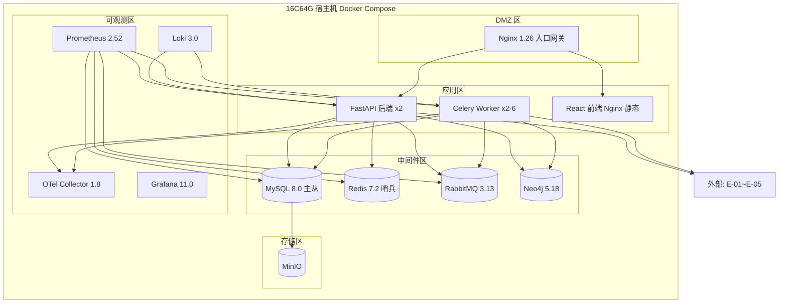

#### 5.4.2 拓扑要素清单

| 要素 | 取值 |
| --- | --- |
| 跨 Region 部署 | 否（单赛事环境） |
| 跨 AZ 部署 | 否（单宿主机） |
| 流量入口路径 | DNS → Nginx → FastAPI 后端 / 前端静态资源 |
| 内部调用路径 | Docker Compose 网络服务名直连（HTTP / AMQP） |
| 数据库访问路径 | SQLAlchemy 连接池（主写从读）+ Redis 哨兵 |

#### 5.4.3 故障域划分

| 故障域 | 影响范围 | 容错机制 | 预期 RTO |
| --- | --- | --- | --- |
| 单容器 | 单实例 | Docker Compose 自动重启 | ≤30s |
| MySQL 主库 | 写入中断 | 从库提升为主 | ≤ 30min |
| Redis 主节点 | 缓存不可用 | 哨兵自动切换从节点 | ≤1min |
| 宿主机 | 全部服务 | 赛事运维手动恢复 | ≤ 2h |

### 5.5 容量规划

#### 5.5.1 业务量预估

| 业务指标 | MVP 阶段值 | 生产阶段值 | 备注 |
| --- | --- | --- | --- |
| 目标企业数 | 50 | 200 | 赛事规模 |
| 峰值采集任务 QPS | 50 | 200 | 推算（企业数 × 维度 × 并发） |
| 数据写入量 / 天 | 5 万行 | 20 万行 | 推算（任务 × 结果数） |
| 数据存量 | 5GB | 50GB | 推算（增量累加 + 图谱） |

#### 5.5.2 资源容量推算

| 资源 | 推算公式 | 当前配置 | 生产阶段配置 |
| --- | --- | --- | --- |
| 应用实例数 | 峰值 QPS / 单实例 QPS × 1.5 | 2 | 4 |
| MySQL 主库 | 写 TPS × 平均 SQL 数 → IOPS | 4C16G + 200GB | 4C16G + 500GB |
| Redis | 单 Key 大小 × 数量 × 1.3 | 2G | 4G |
| RabbitMQ | 峰值 TPS / 单分区承载 | 2C4G×3 | 2C4G×3 |
| Neo4j | 节点数 × 平均属性大小 | 4G | 8G |
| MinIO | 日增 × 保留天数 × 副本 | 100GB | 500GB |

#### 5.5.3 容量水位线

| 水位 | 阈值 | 动作 | 对开发的约束 |
| --- | --- | --- | --- |
| 健康水位 | ≤60% | 无动作 | — |
| 预警水位 | 60-80% | 告警，启动扩容评审 | — |
| 危险水位 | ≥80% | 自动扩容（Worker HPA）或紧急扩容 | — |
| 红线 | ≥95% | 触发限流 / 降级（与 §3.5.3 联动） | 限流红线值 buffer≤95% 需与本表一致 |

**判定合格**：业务量预估含来源；红线水位 → §3.5.3 限流默认值 → §8.4 告警规则数值一致。

---

## 6. 网络架构

> **本章定位**：本章只承载对开发产生约束的网络结论——开发要据此处理 HTTPS、限流位置、外部访问出口、服务发现与服务间通信。

### 6.1 网络环境规划

| 网络环境 | 用途 | 说明 / 访问策略 |
| --- | --- | --- |
| DMZ | 公网入口缓冲区，部署 Nginx 反向代理 | 仅允许从公网入站；不能直接访问 DB |
| APP | 应用互联网络，部署 FastAPI / Celery / 前端 | 仅允许从 DMZ 入站；出站受 NAT 控制 |
| MW | 中间件网络，部署 MySQL / Redis / RabbitMQ / Neo4j | 仅允许从 APP 入站；禁止公网访问 |
| OBS | 可观测网络，部署 Prometheus / Loki / Grafana | 仅允许从 APP / MW 入站；Grafana 经 DMZ 暴露 |

### 6.2 流量入口与南北向流量

#### 6.2.1 入口流量链路

| 组件 | 作用 | 部署位置 |
| --- | --- | --- |
| DNS | 域名解析 | 公网 / 本地 hosts |
| Nginx 1.26 | TLS 终结 / 流量分发 / 静态资源 | DMZ |
| FastAPI 后端 | 业务逻辑 / API 路由 / 限流 | APP |

**入口决策（对开发的约束）**：

| 决策项 | 取值 | 对开发的约束 |
| --- | --- | --- |
| TLS 终结点 | Nginx（DMZ） | Nginx 之后 HTTP 明文；业务侧解析 X-Forwarded-For 获取真实 IP |
| 限流位置 | 双层：Nginx 全局限流 + FastAPI 业务限流 | 业务自实现限流对接 §3.5.3 限流红线 |
| 鉴权位置 | FastAPI 业务鉴权（JWT 中间件） | 与 §7.2.1 用户认证一致 |
| 真实客户端 IP 获取 | X-Forwarded-For | 业务获取客户端 IP 必须用此 Header，不能直接用 socket 远端 IP |

#### 6.2.2 出口流量

| 决策项 | 取值 | 对开发的约束 |
| --- | --- | --- |
| 出口方式 | NAT 网关（Docker bridge） | 外部 SDK 直连；私有化场景需明示 |
| 是否需要固定出口 IP | 是（赛事 API 白名单 + 多 IP 轮询 R6） | 业务必须从指定出口访问 E-01；新增 E-xx 必须先登记 |
| 出口白名单 | E-01 赛事API / E-02 FOFA / E-03 Shodan / E-04 工商API / E-05 LLM | 业务对接 E-xx 时必须使用白名单内域名 |

### 6.3 内部互联（东西向流量）

| 决策项 | 取值 | 对开发的约束 |
| --- | --- | --- |
| 服务发现 | Docker Compose 服务名（DNS 解析） | 服务调用方必须使用服务名，禁止硬编码 IP |
| 服务间通信协议 | HTTP（同步）/ RabbitMQ（异步） | 同步用 HTTP REST；异步解耦用 MQ；与 §3.5.4 超时重试基线对齐 |
| 内部 mTLS | 不启用（单机内部网络，Nginx TLS 终结） | — |
| 跨服务调用幂等性 | 必须遵循 §3.5.2 幂等键传递 | 跨服务调用必须在 Header 透传幂等键与 traceId（§8.3） |

**判定合格**：§6.1 / §6.2 / §6.3 所有决策项已锁定；TLS 终结点、限流位置、鉴权位置三项与 §3.5 / §7 数值与位置一致。

---

## 7. 安全设计

> **本章回答**：本系统在安全维度做了哪些选择、对应到哪些安全产品 / 能力域、关键机制如何落地。
> 本系统核心安全红线：纯被动合规（违规探测=0 / IP 封禁=0），所有安全设计均围绕此红线展开。

### 7.1 架构安全全景

| 能力域 | 选用产品 / 机制 | 作用范围 | 是否启用 |
| --- | --- | --- | --- |
| 抗 DDoS | 不适用（竞赛环境无公网 DDoS 风险） | — | 否（不适用：单赛事内网环境） |
| WAF | Nginx 基础防护（SQL 注入 / XSS 正则） | Web 应用层 | 是 |
| 防火墙 / 安全组 | Docker 网络隔离 + iptables 规则 | 容器/网络/主机三级 | 是 |
| 主机安全 | 赛事运维统一保障 | 宿主机 | 是（由赛事运维保障） |
| 容器安全 | Docker 非根用户运行 + 只读文件系统 | 全部容器 | 是 |
| 数据安全审计 | MySQL 审计插件 + t_audit_log 证据链 | 关键数据库 | 是 |
| 密钥管理（KMS） | 自研 KMS 轻量（AES-256）+ Docker Secret | 敏感数据加密 / AKSK 保护 | 是 |
| 安全运营中心（SOC） | Prometheus + Loki 告警 | 安全事件监控与响应 | 是 |
| 堡垒机 | 赛事运维统一堡垒机 | 运维通道审计 | 是（由赛事运维保障） |

### 7.2 业务安全架构

#### 7.2.1 用户认证

| 维度 | 取值 |
| --- | --- |
| 账号体系 | 自建账号体系（竞赛单环境，操作方/主理人/评委） |
| 登录方式 | 账号密码 |
| 多因素认证（MFA） | 不启用（竞赛环境，三级审批替代 MFA 等效控制） |
| 密码强度 | 最小长度 8；复杂度（大小写 + 数字） |
| 登录失败锁定 | 连续失败 5 次锁定 15 分钟 |
| Token 有效期 | 访问 Token 2h；刷新 Token 7d |
| 会话管理 | JWT 无状态；单点登录（同账号新登录踢旧会话）；注销通过 Redis 黑名单 |

#### 7.2.2 数据安全

| 维度 | 取值 |
| --- | --- |
| 数据分级 | L1 公开（资产图谱拓扑）/ L2 内部（采集结果）/ L3 敏感（审批记录）/ L4 高敏（合规证据链日志） |
| 传输加密 | TLS 强制（Nginx 终结）；内部 HTTP 明文（Docker 内网） |
| 存储加密 | 敏感字段 AES-256 加密存储（LLM API Key / 工商 API Token）；业务数据明文（竞赛环境） |
| 敏感字段清单 | API Key（L4 加密存储）/ Token（L4 加密存储）/ 审批结论（L3 明文+审计） |
| 数据导出与共享 | 导出需操作方审批；战报导出脱敏（隐藏内部 IP / 路径） |

**敏感字段处理策略表**：

| 字段 | 分级 | 存储策略 | 展示策略（脱敏） | 导出策略 |
| --- | --- | --- | --- | --- |
| LLM API Key | L4 | AES-256 加密存储 | 不展示 | 禁止导出 |
| 工商 API Token | L4 | AES-256 加密存储 | 不展示 | 禁止导出 |
| 赛事 API Token | L4 | AES-256 加密存储 | 不展示 | 禁止导出 |
| 审批结论 | L3 | 明文存储 | 完整展示 | 需审批 + 审计留痕 |
| 采集结果 | L2 | 明文存储 | 完整展示 | 需审批 |

#### 7.2.3 密钥与凭证

| 维度 | 取值 |
| --- | --- |
| 存储方式 | Docker Secret + 自研 KMS 轻量（AES-256） |
| 下发方式 | Docker Secret 挂载；运行时从 KMS 解密 |
| 轮换策略 | 赛事阶段切换时轮换；轮换周期基线 30 天（赛事周期） |
| 红线 | 禁止入库 / 入代码 / 入配置文件明文；禁止跨环境共用密钥 |

#### 7.2.4 审计日志

| 维度 | 取值 |
| --- | --- |
| 启用的日志类型 | 业务操作 / 数据库 / 合规证据链（t_audit_log） |
| 审计内容 | 必须包含"谁、何时、对什么资源、做了什么、合规判定、来源 IP" |
| 不可篡改保障 | 独立表 t_audit_log + MinIO 归档（追加写，禁止修改） |
| 保留期 | 合规要求最低保留 ≥1 年，与 §8.2 一致 |

#### 7.2.5 访问控制

| 维度 | 取值 |
| --- | --- |
| 权限模型 | RBAC1（角色 + 层级继承：操作方 → 主理人 → 评委），理由：三级审批需层级管控 |
| 多租户隔离 | 逻辑隔离（tenant_id 固定为 1，保留字段统一查询契约） |
| 越权防护 | 列表与详情接口都必须校验数据归属；横向越权：JWT 角色校验；纵向越权：三级审批强制 |
| 接口级权限 | 与 §3.5 调用契约对齐：操作方（审批/看板）、主理人（看板/裁决）、评委（图谱/日志只读） |

**判定合格**：
- §7.1 安全能力全景表无空白；
- §7.2 五项维度均给出"本系统的选择 + 关键基线"，无"待定"或"详见安全文档"代替正文。

---

## 8. 可观测设计

> **本章回答**：系统跑起来之后，怎么知道它健康、出问题怎么定位、用户体验是否达标。
> **三大支柱**：Metrics（指标）/ Logs（日志）/ Traces（链路追踪）。

### 8.1 Metrics

#### 8.1.1 指标分层

| 指标层 | 指标内容（本系统） | 工具 |
| --- | --- | --- |
| 业务指标 | WNSR 达成率 / 资产覆盖率 / 无效情报率 / 违规次数 / 封禁次数 / 提交成功率 | Prometheus 自定义埋点 + Grafana |
| 应用指标 | RED：Rate（接口 QPS）/ Errors（5xx 错误率）/ Duration（P95/P99 响应时延） | Prometheus + FastAPI middleware |
| 中间件指标 | MySQL QPS / 慢查询数 / Redis 命中率 / RabbitMQ 队列堆积 / Neo4j 节点数 | Prometheus exporter |
| 资源指标 | USE：CPU 利用率 / 内存利用率 / 磁盘 IO / 网络带宽（宿主机 + 容器） | node_exporter + cAdvisor |

#### 8.1.2 关键指标 Dashboard 清单

| Dashboard 名 | 受众 | 核心指标 | 刷新频率 |
| --- | --- | --- | --- |
| 合规拦截大盘 | 操作方 / 合规运维 | 违规拦截次数 / 封禁次数 / 频控 buffer 使用率 / CE 拦截放行比 / AP 审批队列深度 | 30s |
| 采集健康大盘 | 采集开发 / 操作方 | 四集群采集 QPS / 多源健康状态 / 热切换次数 / 全源挂起告警数 / 采集成功率 | 30s |
| 算力调度大盘 | 操作方 / 主理人 | WNSR 实时值 / A:B:C 算力分配比 / 25min 回收倒计时 / 每 5min 看榜快照 / 算力利用率 | 1min |
| 四层校验流水线大盘 | 数据层 / 操作方 | 四层核验通过率 / 挂起数 / 多源佐证数 / DNS 解析耗时 / 工商匹配命中率 | 1min |
| 冲分战报大盘 | 主理人 / 评委 | WNSR + 6 支撑指标趋势 / 红线状态（违规=0/封禁=0）/ 安全垫进度 / 资产覆盖率阶段达标 | 5min |
| 服务健康大盘 | 研发 / SRE | RED（Rate / Errors / Duration）/ 接口 Top10 慢请求 / 错误码分布 | 30s |
| 中间件大盘 | SRE / DBA | MySQL QPS / 慢查询 / Redis 命中率 / RabbitMQ 堆积 / Neo4j 内存 | 30s |

**判定合格**：关键 Dashboard 共 7 个（≥5 个要求达标），命名与四层架构模块对齐（L1 合规拦截 / L3 采集健康 / L1 算力调度 / L4 四层校验 / 冲分战报 / 应用健康 / 中间件）。

### 8.2 Logs

#### 8.2.1 日志分级与去向

| 日志类型 | 级别 | 保存时间 | 日志去向 |
| --- | --- | --- | --- |
| 应用日志（业务） | INFO+ | 30 天热 + 180 天冷 | Grafana Loki（结构化 JSON） |
| 应用日志（异常） | ERROR+ | 90 天热 + 1 年冷 | Grafana Loki + 实时告警 |
| 接入日志（Nginx 网关） | INFO+ | 30 天 | Grafana Loki |
| 审计日志（合规证据链） | INFO+ | ≥1 年（合规要求，决赛源码核验） | 独立表 t_audit_log + MinIO 归档（防篡改） |
| 慢查询日志 | — | 30 天 | Grafana Loki |

#### 8.2.2 结构化日志规范

```json
{
  "timestamp": "2026-07-13T10:00:00.000Z",
  "level": "INFO",
  "service": "passive-info-agent",
  "instance": "fastapi-worker-0",
  "traceId": "a1b2c3d4e5f6",
  "spanId": "0a1b2c3d",
  "tenantId": "1",
  "userId": "operator-001",
  "module": "M5-collector",
  "event": "collect_result",
  "msg": "采集完成: domain=example.com source=Amass",
  "extra": { "assetType": "DOMAIN", "sourceName": "Amass", "durationMs": 1200 }
}
```

**硬性要求**：

| 要求项 | 内容 |
| --- | --- |
| 必含字段 | 所有日志必须含 traceId + tenantId |
| 敏感字段 | 禁止打印敏感字段明文（API Key / Token / 密码，与 §7.2.2 数据安全联动） |
| ERROR 级别 | 必须含完整堆栈 + 业务上下文（任务号 / 主体 ID / 采集源等） |
| 审计日志 | 额外含 actor / action / resource_type / resource_id / decision / source_ip（与 §7.2.4 联动） |

### 8.3 Traces

| 项 | 取值 |
| --- | --- |
| 协议标准 | OpenTelemetry / W3C TraceContext |
| 采样策略 | 默认 1% 采样；错误请求 100% 采样；慢请求（≥1s）100% 采样 |
| 透传方式 | HTTP Header traceparent / tracestate；RabbitMQ 消息属性 traceId 透传 |
| 关键 Span 命名 | fastapi.handle / db.query / mq.publish / mq.consume / collector.execute / verifier.verify |
| 跨外部系统 | 调用 E-01~E-05 时透传 traceId（若对方支持），并记录 peer.service |

**与时序图的关联**：§3.2 模块内时序图标注 traceId 透传节点，本节是其落地规范。全链路从 Nginx 入口生成 traceId，经 FastAPI → Celery Worker → 外部 E-xx，贯穿合规拦截→规划→采集→核验→入库→看板主链路。

### 8.4 告警体系

#### 8.4.1 告警分级

| 级别 | 适用场景 | 响应时间 | 通知方式 |
| --- | --- | --- | --- |
| P0 紧急 | 合规红线触发（违规探测/ IP 封禁）/ 核心业务中断（赛事 API 不可用）/ 数据库主库不可访问 | ≤5min | 电话 + 短信 + IM |
| P1 高 | 部分功能受影响（某采集集群全源挂起 / LLM 规划服务超时 / 5xx 错误率 ≥1%） | ≤15min | 短信 + IM |
| P2 中 | 单点异常但有冗余（RabbitMQ 队列堆积 / 单源降级 / CPU ≥80%） | ≤1h | IM |
| P3 低 | 趋势性预警（磁盘水位 ≥60% / 无效情报率上升 / 覆盖率低于阶段目标） | 工作时间 | IM / 邮件 |

#### 8.4.2 告警规则编排

| 编号 | 级别 | 触发条件 | 维度 | Owner | Runbook |
| --- | --- | --- | --- | --- | --- |
| AL-01 | P0 | 合规拦截引擎 CE 检测到主动动作放行（违规探测） OR 赛事 API 返回 IP 封禁 | 业务合规（L1） | @合规运维 | wiki/runbook/AL-01-合规红线应急 |
| AL-02 | P0 | MySQL 主库不可访问持续 30s OR Redis 哨兵全部不可用 | 中间件健康 | @SRE | wiki/runbook/AL-02-中间件故障切换 |
| AL-03 | P1 | 5xx 错误率 ≥1% 持续 5min OR P99 ≥2s 持续 5min | 应用可用性 | @研发 | wiki/runbook/AL-03-应用错误排查 |
| AL-04 | P2 | RabbitMQ 队列堆积 ≥10万 OR 某采集集群全源挂起 | 采集容错（L3） | @采集开发 | wiki/runbook/AL-04-采集容错降级 |
| AL-05 | P2 | CPU ≥80% 持续 10min OR 磁盘 ≥85% 持续 5min | 资源水位 | @SRE | wiki/runbook/AL-05-资源扩容 |

**判定合格**：
- 关键指标覆盖业务（AL-01 合规红线）/ 应用（AL-03 错误率）/ 中间件（AL-02 DB / AL-04 MQ）/ 资源（AL-05 CPU/磁盘）四层；
- 关键告警均能映射到具体指标（§8.1 Dashboard）；
- 全部 P0 / P1 告警有 Owner；
- 关键 Dashboard 7 个（≥5 个要求达标）；
- 日志含 traceId + tenantId；
- 采样策略覆盖错误 / 慢请求兜底；
- §5.3 SLA（可用性 ≥99.5% / RTO ≤30min）与本章告警阈值数值自洽。
