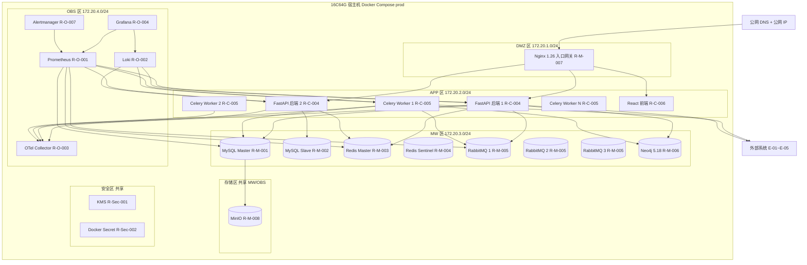
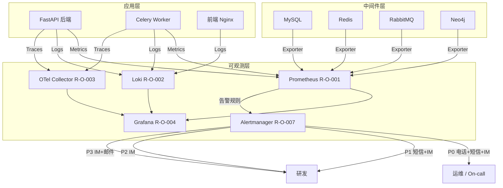

# AICoding 架构设计 · 部署设计

> 本文档为《AICoding 架构设计》核心产物之一，定位为**系统部署设计**。
> 上游输入：《系统设计》中的部署架构（§5）、网络架构（§6）、可观测设计（§8）、安全设计底线（§7）；《高层架构设计》的系统定位与部署形态决策；《资料摘要》的原始诉求约束。
> 下游输出：环境与资源清单、部署拓扑、CI/CD 流水线、监控告警、应急回滚、容量成本等可落地的运维交付物。

---

## 1. 引言

### 1.1 适用范围与部署形态

本文档适用于「企业被动信息搜集 Agent（PassiveInfoAgent）」系统的全环境部署设计。系统部署形态为**私有化 / 自托管**（依据高层架构设计 D5 决策：源码核验 + 纯被动合规要求，单赛事环境运行，非多租户商用产品）。

部署技术栈：Docker 25.0 + Docker Compose 单宿主机编排，全部中间件自托管（MySQL / Redis / RabbitMQ / Neo4j / MinIO / Prometheus / Loki / Grafana / OTel Collector），不依赖公有云 PaaS 服务。

本系统为竞赛作品 + 政企巡检原型，运行于单赛事环境，无跨 Region / 跨 AZ 需求。资源以自购物理机或租用独立服务器为主，软件全部采用开源方案（零许可费）。

### 1.2 名词与缩写

| 缩写 | 全称 | 含义 |
| --- | --- | --- |
| PIA | PassiveInfoAgent | 企业被动信息搜集 Agent 系统简称 |
| CE | Compliance Engine | 全局合规拦截引擎 |
| GW | Gateway | 赛事 API 代理网关 |
| AP | Approval | 三级人机审批 |
| SC | Scheduler | 加权算力调度控制器 |
| PL/DS/BL/XC | Planning/Dispatch/Blindspot/Cross-verify | 规划 Agent 四个子能力 |
| C1-C4 | Cluster 1-4 | Web / 公众号 / 小程序 / 工商股权四类采集集群 |
| V4 | Verify pipeline | 四层自动核验流水线 |
| N4 | Neo4j graph | 资产关联图谱 |
| EX | Experience | 测绘经验库 |
| RTO | Recovery Time Objective | 故障恢复时间目标 |
| RPO | Recovery Point Objective | 数据丢失容忍目标 |
| WNSR | Weighted Net Score Rate | 加权净得分达成率（北极星指标） |
| HPA | Horizontal Pod Autoscaler | 水平弹性伸缩（本系统为 Docker Compose 副本伸缩） |
| KMS | Key Management Service | 密钥管理服务（本系统为自研轻量级） |
| OTel | OpenTelemetry | 开放遥测标准 |

---

## 2. 环境与资源清单

### 2.1 环境矩阵

| 环境 | 用途 | 集群隔离 | 数据 | 网络访问 |
| --- | --- | --- | --- | --- |
| dev | 开发自测与单元调试 | 共享（团队共用开发机） | 模拟数据（Mock 数据源） | 内网 |
| int | 联调与接口契约验证 | 独立（独立 Docker Compose 实例） | 模拟数据（Mock 数据源 + 仿生产结构） | 内网 |
| uat | 预发 / 验收测试 | 独立（独立物理机 / 独立 Compose） | 仿生产数据（脱敏后的生产快照） | 内网 + 白名单（赛事 API 测试端点） |
| prod | 赛事生产环境 | 独立（独占 16C64G 宿主机） | 真实数据（赛事企业资产数据） | 公网（赛事 API 出口）+ 内网（管理面） |

**环境隔离策略**：

| 策略项 | dev | int | uat | prod |
| --- | --- | --- | --- | --- |
| 物理隔离 | 共用开发机 | 独立 4C16G 机器 | 独立 8C32G 机器 | 独占 16C64G 宿主机 |
| 网络隔离 | Docker bridge 默认网络 | 独立 Docker bridge | 独立 Docker bridge + iptables 白名单 | 四网段隔离（DMZ/APP/MW/OBS） |
| 数据隔离 | Mock 数据库 | 独立 MySQL 实例 | 独立 MySQL 实例（脱敏数据） | 独立 MySQL 主从实例 |
| 密钥隔离 | .env 明文（仅本地） | .env 明文（仅内网） | Docker Secret | Docker Secret + KMS 加密 |
| Redis DB 隔离 | DB0 | DB0 | DB0 | DB1 |

### 2.2 云资源清单

> 本系统为私有化自托管部署，不使用公有云资源。以下资源清单以自购 / 自建基础设施为对象，资源编号统一采用 R-xx-NNN 格式。资源 ID 栏标注「自建」表示非云厂商分配的资源标识。

#### 2.2.1 计算资源

| 资源编号 | 类型 | 产品 | 资源 ID | 名称 | 规格 | 数量 | 环境 | 复用 / 新建 | HA 方案 | 用途 |
| --- | --- | --- | --- | --- | --- | --- | --- | --- | --- | --- |
| R-C-001 | 物理服务器 | 自购 / 组装 | 自建-PROD-01 | prod 宿主机 | 16C 64G 1TB NVMe SSD | 1 | prod | 新建 | 单机（MySQL 主从 + Redis 哨兵 + RabbitMQ 集群 容器内 HA） | 生产环境全部容器宿主机 |
| R-C-002 | 物理服务器 | 自购 / 组装 | 自建-UAT-01 | uat 宿主机 | 8C 32G 1TB SSD | 1 | uat | 新建 | 单机 | 预发验收环境宿主机 |
| R-C-003 | 物理服务器 | 自购 / 组装 | 自建-DEV-01 | dev/int 宿主机 | 4C 16G 500GB SSD | 1 | dev, int | 新建 | 单机 | 开发联调环境宿主机 |
| R-C-004 | 应用容器 | Docker 25.0 | pia-fastapi | FastAPI 后端 | 2C 4G | 2 | prod | 新建 | Nginx 负载均衡 + 健康检查 | 后端 API 服务（M1-M10 模块） |
| R-C-005 | 任务容器 | Docker 25.0 | pia-celery-worker | Celery Worker | 2C 4G | 2-6（弹性） | prod | 新建 | 副本伸缩（min 2 / max 6） | 采集任务异步执行 |
| R-C-006 | 前端容器 | Docker 25.0 | pia-frontend | React 前端 Nginx | 1C 1G | 1 | prod | 新建 | Nginx 静态资源 | 人机协同操作面板 |
| R-C-007 | 应用容器 | Docker 25.0 | pia-fastapi | FastAPI 后端 | 1C 2G | 1 | dev, int | 新建 | 单副本 | 开发联调后端 |
| R-C-008 | 任务容器 | Docker 25.0 | pia-celery-worker | Celery Worker | 1C 2G | 1 | dev, int | 新建 | 单副本 | 开发联调采集任务 |
| R-C-009 | 应用容器 | Docker 25.0 | pia-fastapi | FastAPI 后端 | 2C 4G | 1 | uat | 新建 | 单副本 | 预发验收后端 |

#### 2.2.2 存储资源

| 资源编号 | 类型 | 产品 | 资源 ID | 名称 | 规格 | 容量 | 环境 | 复用 / 新建 | HA 方案 | 备份策略 |
| --- | --- | --- | --- | --- | --- | --- | --- | --- | --- | --- |
| R-S-001 | 块存储 | NVMe SSD | 自建-PROD-SSD-01 | prod 系统盘 | NVMe PCIe 4.0 | 1TB | prod | 新建 | RAID 无（单盘） | 系统层：每日 rsync 至 MinIO |
| R-S-002 | 块存储 | NVMe SSD | 自建-PROD-SSD-02 | prod 数据盘 | NVMe PCIe 4.0 | 2TB | prod | 新建 | RAID 无（单盘） | MySQL binlog 每 15min + Neo4j 全量每日 → MinIO |
| R-S-003 | 对象存储 | MinIO RELEASE.2024-06 | pia-minio | MinIO 对象存储 | 单节点多盘（4×500GB） | 500GB 可用 | prod | 新建 | 内置冗余（minio erasure coding） | 跨目录副本 |
| R-S-004 | 块存储 | SSD | 自建-UAT-SSD-01 | uat 数据盘 | SATA SSD | 1TB | uat | 新建 | 无 | 无（非生产） |
| R-S-005 | 块存储 | SSD | 自建-DEV-SSD-01 | dev 数据盘 | SATA SSD | 500GB | dev, int | 新建 | 无 | 无（非生产） |

#### 2.2.3 网络资源

| 资源编号 | 类型 | 产品 | 资源 ID | 名称 | 规格 | 环境 | 复用 / 新建 | 用途 |
| --- | --- | --- | --- | --- | --- | --- | --- | --- |
| R-N-001 | Docker 网络 | Docker bridge | pia-dmz | DMZ 网络 | 172.20.1.0/24 | prod | 新建 | Nginx 入口网关隔离网络 |
| R-N-002 | Docker 网络 | Docker bridge | pia-app | APP 网络 | 172.20.2.0/24 | prod | 新建 | FastAPI / Celery / 前端应用网络 |
| R-N-003 | Docker 网络 | Docker bridge | pia-mw | MW 网络 | 172.20.3.0/24 | prod | 新建 | MySQL / Redis / RabbitMQ / Neo4j 中间件网络 |
| R-N-004 | Docker 网络 | Docker bridge | pia-obs | OBS 网络 | 172.20.4.0/24 | prod | 新建 | Prometheus / Loki / Grafana / OTel 可观测网络 |
| R-N-005 | NAT 网关 | Docker bridge + iptables | pia-nat | 出口 NAT | 100Mbps | prod | 新建 | 外部 API 访问出口（E-01~E-05）+ 多 IP 轮询 |
| R-N-006 | 公网入口 | DNS + 公网 IP | pia-ingress | 公网入口 | 1 个公网 IP | prod | 新建 | DNS 解析 + Nginx TLS 终结入口 |
| R-N-007 | Docker 网络 | Docker bridge | pia-dev-net | 开发网络 | 172.20.10.0/24 | dev, int | 新建 | 开发环境统一网络 |
| R-N-008 | Docker 网络 | Docker bridge | pia-uat-net | UAT 网络 | 172.20.20.0/24 | uat | 新建 | UAT 环境统一网络 |

#### 2.2.4 中间件与平台服务

| 资源编号 | 类型 | 产品 | 资源 ID | 名称 | 规格 | 环境 | 复用 / 新建 | HA 方案 | 用途 |
| --- | --- | --- | --- | --- | --- | --- | --- | --- | --- |
| R-M-001 | 关系型数据库 | MySQL 8.0 | pia-mysql-master | MySQL 主库 | 4C 16G + 200GB | prod | 新建 | 主从同步 + 故障切换 | 业务主数据（15 张表） |
| R-M-002 | 关系型数据库 | MySQL 8.0 | pia-mysql-slave | MySQL 从库 | 4C 16G + 200GB | prod | 新建 | 从库只读 + 主备切换 | 读副本 + 灾备 |
| R-M-003 | 缓存 | Redis 7.2 | pia-redis-master | Redis 主节点 | 4G | prod | 新建 | 哨兵自动切换 | 限流计数 / 幂等 / 看榜快照 |
| R-M-004 | 缓存 | Redis 7.2 | pia-redis-sentinel | Redis 哨兵 | 512MB | prod | 新建 | 哨兵监控 + 自动故障转移 | Redis 主从切换监控 |
| R-M-005 | 消息队列 | RabbitMQ 3.13 | pia-rabbitmq-1/2/3 | RabbitMQ 集群 | 2C 4G × 3 节点 | prod | 新建 | 镜像队列 + 3 节点集群 | 异步解耦 / 事件驱动 |
| R-M-006 | 图数据库 | Neo4j 5.18 Community | pia-neo4j | Neo4j 单实例 | 8G（JVM heap 4G + pagecache 3G） | prod | 新建 | 无（竞赛规模容忍单点） | 资产关联图谱 N4 |
| R-M-007 | 入口网关 | Nginx 1.26 | pia-nginx | Nginx 反向代理 | 2C 4G | prod | 新建 | 单实例（Docker auto-restart） | TLS 终结 / 流量分发 / 限流 |
| R-M-008 | 对象存储 | MinIO RELEASE.2024-06 | pia-minio | MinIO 单节点 | 2C 4G + 500GB | prod | 新建 | 内置冗余 | 文件 / 备份 / 归档 |
| R-M-009 | 关系型数据库 | MySQL 8.0 | pia-mysql-dev | MySQL 开发库 | 1C 2G + 50GB | dev, int | 新建 | 无 | 开发联调数据库 |
| R-M-010 | 缓存 | Redis 7.2 | pia-redis-dev | Redis 开发 | 1G | dev, int | 新建 | 无 | 开发联调缓存 |
| R-M-011 | 消息队列 | RabbitMQ 3.13 | pia-rabbitmq-dev | RabbitMQ 开发 | 1C 2G | dev, int | 新建 | 单节点 | 开发联调消息队列 |
| R-M-012 | 图数据库 | Neo4j 5.18 Community | pia-neo4j-dev | Neo4j 开发 | 2G | dev, int | 新建 | 无 | 开发联调图谱 |

#### 2.2.5 可观测资源

| 资源编号 | 类型 | 产品 | 资源 ID | 名称 | 规格 | 环境 | 复用 / 新建 | 承载可观测维度 |
| --- | --- | --- | --- | --- | --- | --- | --- | --- |
| R-O-001 | 指标采集 | Prometheus 2.52 | pia-prometheus | Prometheus 单实例 | 2C 4G + 50GB | prod | 新建 | Metrics（业务 / 应用 / 中间件 / 资源四层指标） |
| R-O-002 | 日志服务 | Grafana Loki 3.0 | pia-loki | Loki 单实例 | 2C 4G + 100GB | prod | 新建 | Logs（应用日志 / 接入日志 / 慢查询 / 审计归档转发） |
| R-O-003 | 链路追踪 | OpenTelemetry Collector 1.8 | pia-otel-collector | OTel Collector | 1C 2G | prod | 新建 | Traces（分布式调用链路 / 1% 采样 + 错误 100%） |
| R-O-004 | 可视化 | Grafana 11.0 | pia-grafana | Grafana 单实例 | 1C 2G | prod | 新建 | Dashboard 可视化（7 个大盘）+ 告警引擎 |
| R-O-005 | 审计归档 | MinIO（共享 R-M-008） | pia-minio | MinIO 审计目录 | 共享 500GB | prod | 复用 R-M-008 | 审计日志不可篡改归档（独立目录 + 追加写） |
| R-O-006 | 指标导出 | node_exporter 1.8 + cAdvisor 0.49 | pia-exporters | 宿主机 + 容器指标导出 | 各 256MB | prod | 新建 | 资源层指标（CPU / 内存 / 磁盘 IO / 网络） |
| R-O-007 | 告警通知 | Alertmanager 0.27 | pia-alertmanager | 告警路由与通知 | 256MB | prod | 新建 | 告警分级路由（P0~P3）+ 通知渠道 |

#### 2.2.6 安全资源

| 资源编号 | 类型 | 产品 | 资源 ID | 名称 | 规格 | 环境 | 复用 / 新建 | HA 方案 | 用途 |
| --- | --- | --- | --- | --- | --- | --- | --- | --- | --- |
| R-Sec-001 | 密钥管理 | 自研 KMS 轻量（AES-256） | pia-kms | KMS 密钥服务 | 512MB | prod | 新建 | 单实例（Docker auto-restart） | 敏感数据加密 / AKSK 保护 |
| R-Sec-002 | 密钥存储 | Docker Secret | pia-secrets | Docker Secret 存储 | — | prod | 新建 | 容器级挂载 | 密码 / Token / API Key 托管 |
| R-Sec-003 | 网络隔离 | Docker 网络隔离 + iptables | pia-firewall | 容器防火墙规则 | — | prod | 新建 | 四网段隔离 | 容器 / 网络 / 主机三级隔离 |
| R-Sec-004 | WAF | Nginx 基础防护（SQL 注入 / XSS 正则） | pia-waf | Nginx WAF 模块 | 共享 R-M-007 | prod | 复用 R-M-007 | 单实例 | Web 应用层防护（基线值，待安全设计对齐确认） |
| R-Sec-005 | 容器安全 | Docker 非根用户 + 只读文件系统 | pia-container-security | 容器安全基线 | — | prod | 新建 | 全部容器生效 | 容器运行时安全 |
| R-Sec-006 | 审计日志 | MySQL 审计插件 + t_audit_log 证据链 | pia-audit | 审计日志系统 | 共享 R-M-001 | prod | 复用 R-M-001 | 主从同步 | 数据库审计 + 合规证据链 |

> **安全对齐说明**：R-Sec-001 ~ R-Sec-006 的安全策略基线值来自《系统设计》§7 安全设计。安全组规则细节、WAF 规则集、密钥分级与轮转周期、审计字段与合规保留期等由 security-architect 定义，本表按其策略配置，待安全设计完成后对齐确认。

### 2.3 复用资源清单

| 复用资源 ID | 原业务方 | 余量评估 | 隔离方式 |
| --- | --- | --- | --- |
| 无 | — | — | — |

> 本系统为全新竞赛项目，全部资源均为新建，无存量资源复用。R-O-005（MinIO 审计目录）与 R-Sec-004（Nginx WAF）为系统内部跨模块共享，非跨业务复用，已在各自资源表中标注「共享」关系。

---

## 3. 部署拓扑与高可用设计

### 3.1 物理拓扑

#### 3.1.1 物理拓扑图

#### 3.1.2 拓扑要素清单

| 要素 | 取值 |
| --- | --- |
| 跨 Region 部署 | 否（单赛事环境，无跨 Region 需求） |
| 跨 AZ 部署 | 否（单宿主机，Docker Compose 编排） |
| Region 数量 | 1（赛事指定机房 / 团队自有机房） |
| AZ 数量 | 1（单物理机） |
| 流量入口路径 | 公网 DNS → Nginx（DMZ 区）→ FastAPI 后端（APP 区）/ 前端静态资源（APP 区） |
| 内部调用路径 | Docker Compose 服务名 DNS 解析（HTTP 同步 / AMQP 异步） |
| 数据库访问路径 | SQLAlchemy 连接池（主写从读）→ MySQL Master / Slave；Redis 哨兵 VIP → Redis Master |
| 外部出口路径 | APP 区 NAT 网关 → 公网 → E-01~E-05（多 IP 轮询） |
| 可观测数据流 | 应用 / 中间件 → OTel Collector → Prometheus（Metrics）/ Loki（Logs）/ Grafana（可视化） |
| 网络分段 | DMZ（172.20.1.0/24）/ APP（172.20.2.0/24）/ MW（172.20.3.0/24）/ OBS（172.20.4.0/24） |

### 3.2 流量与网络链路（连通视图）

#### 3.2.1 流量入口链路

| 组件 (R-xx) | 协议 - 端口 | TLS 终结 | 作用 |
| --- | --- | --- | --- |
| 公网 DNS（R-N-006） | DNS 53 | — | 域名解析到公网 IP |
| Nginx 1.26（R-M-007） | HTTPS 443 → HTTP 8080 | 是（Nginx 终结 TLS，后端 HTTP 明文） | TLS 终结 / 流量分发 / 静态资源 / 全局限流 / WAF 基础防护 |
| FastAPI 后端（R-C-004） | HTTP 8080 | 否（Nginx 后明文） | 业务逻辑 / API 路由 / 业务限流 / JWT 鉴权 |
| React 前端（R-C-006） | HTTP 80 | 否（Nginx 后明文） | 静态资源服务 |

#### 3.2.2 内部互联链路

| 项 | 说明 |
| --- | --- |
| 服务发现 | Docker Compose 服务名（DNS 解析）；禁止硬编码 IP |
| 服务间协议 | HTTP（同步调用）/ AMQP（异步消息，RabbitMQ） |
| mTLS | 不启用（单机内部 Docker 网络隔离，Nginx TLS 终结） |
| 数据库连接 | 应用 → SQLAlchemy 连接池 → MySQL Master（写）/ Slave（读）；连接池 min 5 / max 20 |
| 缓存连接 | 应用 → Redis 哨兵 VIP（Sentinel 自动切换 Master）；连接池 min 5 / max 10 |
| MQ 连接 | 应用 → RabbitMQ 内网域名（amqp://pia-rabbitmq-1:5672）；3 节点集群 |
| 图数据库连接 | 应用 → Neo4j Bolt 协议（bolt://pia-neo4j:7687） |
| 对象存储连接 | 应用 → MinIO S3 API（http://pia-minio:9000） |
| 跨服务调用幂等性 | HTTP Header 透传 X-Idempotency-Key + traceId（与系统设计 §3.5.2 一致） |
| traceId 透传 | Nginx 入口生成 → FastAPI → Celery Worker → 外部 E-xx（若对方支持） |

#### 3.2.3 跨网络互联

| 互联类型 | 通道 | 带宽 | 加密 | 用途 |
| --- | --- | --- | --- | --- |
| DMZ → APP | Docker bridge 跨网段路由 | 无限制 | 无（内网明文） | Nginx 转发请求到 FastAPI / 前端 |
| APP → MW | Docker bridge 跨网段路由 | 无限制 | 无（内网明文） | 应用访问 MySQL / Redis / RabbitMQ / Neo4j |
| APP → OBS | Docker bridge 跨网段路由 | 无限制 | 无（内网明文） | OTel Collector 上报 Metrics / Traces |
| APP → 外部（E-01~E-05） | NAT 网关 → 公网 | 100Mbps | HTTPS（TLS） | 赛事 API 提交 / FOFA 查询 / LLM 调用 / 工商 API |
| OBS → APP/MW | Docker bridge 跨网段路由 | 无限制 | 无（内网明文） | Prometheus 抓取应用 / 中间件指标 |
| Grafana → DMZ | Docker bridge 跨网段路由 | 无限制 | 通过 Nginx TLS | Grafana 面板经 DMZ 暴露 |

> **安全对齐说明**：上述网络链路的安全组规则、iptables 策略、WAF 规则集由 security-architect 定义。本表仅描述连通拓扑，不定义安全规则。待安全设计完成后对齐 §3.2 安全策略细节。

### 3.3 高可用与故障容错

#### 3.3.1 故障域划分

| 故障域 | 影响范围 | 容错机制 | 预期 RTO |
| --- | --- | --- | --- |
| 单容器 | 单实例服务 | Docker Compose auto-restart（unless-stopped） | ≤30s |
| FastAPI 单实例 | 半数 API 请求 | Nginx 负载均衡自动摘除 + 另一实例承接 | ≤30s（无感知） |
| Celery Worker 单实例 | 部分采集任务延迟 | 副本伸缩（min 2）+ RabbitMQ 消息持久化 + 任务幂等重试 | ≤1min |
| MySQL 主库 | 写入中断 | 从库提升为主（手动 / 半自动切换） | ≤30min |
| Redis 主节点 | 缓存不可用 | 哨兵自动切换从节点为 Master | ≤1min |
| RabbitMQ 单节点 | 部分队列不可用 | 3 节点镜像队列，其他节点接管 | ≤30s |
| Neo4j 单实例 | 图谱查询不可用 | 降级为只读 MySQL 查询（M7 降级预案） | ≤5min（降级） |
| Nginx 网关 | 全站不可访问 | Docker auto-restart + 运维手动恢复 | ≤5min |
| 宿主机 | 全部服务 | 赛事运维手动恢复 + 数据备份恢复 | ≤2h |

> **可用性来源拆分**：

| 可用性来源 | 范围 | 责任方 |
| --- | --- | --- |
| 基础设施兜底 | 宿主机 / 网络 / 存储 / 电力 | 赛事运维 |
| 本系统自身保障 | 业务逻辑容错 / 重试 / 熔断 / 降级 / 断点续跑 / 副本伸缩 | 研发团队 |
| 强依赖外部（E-xx）故障策略 | E-01 赛事 API：排队 + buffer≤95%；E-05 LLM：规则模板降级；E-04 工商 API：热切换备用源 | 研发团队 |

#### 3.3.2 负载均衡

| 维度 | 取值 |
| --- | --- |
| 类型 | 7 层（Nginx 1.26 反向代理） |
| 负载算法 | 轮询（round-robin）+ 健康检查摘除 |
| 后端实例 | FastAPI 后端 × 2（prod 环境） |
| 4 层负载 | 不适用（单宿主机，无 L4 SLB） |

#### 3.3.3 健康检查配置

| 项 | 取值 |
| --- | --- |
| Liveness 路径 | /healthz（仅判进程存活） |
| Readiness 路径 | /readyz（判 DB / Redis 依赖就绪） |
| 检查频率 | 10s |
| 失败阈值 | 连续 3 次失败标记不健康 |
| 恢复阈值 | 连续 2 次成功标记健康 |
| 失败动作 | Liveness 失败 → Docker 重启容器；Readiness 失败 → Nginx 摘流不杀进程 |

#### 3.3.4 弹性伸缩配置

| 维度 | 取值 |
| --- | --- |
| 伸缩对象 | Celery Worker（采集任务执行器） |
| 触发指标 | CPU 利用率 / 采集队列长度（RabbitMQ 消息堆积） |
| 扩容阈值 | CPU ≥70% 持续 5min 或队列 ≥1000 条 |
| 缩容阈值 | CPU ≤30% 持续 10min |
| 副本区间 | min 2 / max 6 |
| 冷却时间 | 扩容 60s / 缩容 5min |
| 伸缩方式 | Docker Compose `docker compose up --scale celery-worker=N`（半自动，需运维触发或脚本定时） |

#### 3.3.5 容灾切换配置

| 维度 | 取值 |
| --- | --- |
| 容灾级别 | 单机主备（竞赛环境，MySQL 主从 + Redis 哨兵 + RabbitMQ 集群） |
| 故障切换 RTO | ≤30min（与系统设计 §5.3 SLA 自洽） |
| 故障切换 RPO | ≤15min（MySQL binlog 增量备份间隔） |
| 跨 Region 数据同步 | 不适用（单赛事环境，无跨 Region） |
| 灾备演练频率 | 每赛事阶段前 1 次（负责人：合规运维） |

---

## 4. 部署流程

### 4.1 代码仓库与分支

| 项 | 规范 / 值 | 说明 |
| --- | --- | --- |
| 代码仓库地址 | git@github.com:team/passive-info-agent.git | 团队私有 Git 仓库（决赛源码核验可追溯） |
| 分支管理 | main（生产）/ develop（集成分支）/ feature/Rxx（功能分支）/ hotfix/xxx（紧急修复） | GitFlow 精简版，适配竞赛项目 |
| 合并规范 | feature → develop：需 1 名 Reviewer 通过；develop → main：需 2 名 Reviewer 通过 + CI 全绿 | 保护主干分支质量 |
| 标签规范 | vMAJOR.MINOR.PATCH-阶段标识（如 v1.0.0-testing / v1.1.0-preliminary / v2.0.0-final） | 对齐三阶段里程碑（测试赛 / 初赛 / 决赛） |
| 提交规范 | feat(Rxx): 描述 / fix(Rxx): 描述 / refactor: 描述 / docs: 描述 / chore: 描述 | Conventional Commits 规范 |

### 4.2 流水线（CI / CD）

| 阶段 | 触发条件 | 关键动作 | 失败处理 |
| --- | --- | --- | --- |
| 1. 构建 | 自动（push / PR） | 拉代码 → Python 3.11 编译检查 → 单元测试（pytest + coverage ≥70%）→ 前端 Vite 构建 | 阻断后续阶段 |
| 2. 代码扫描 | 构建后 | Python: bandit（安全）+ ruff（规范）+ pylint（复杂度）；前端: eslint + prettier | 严重问题阻断；中危需评审 |
| 3. 安全扫描 | 构建后 | SCA：pip-audit 依赖漏洞扫描；SAST：bandit 代码漏洞扫描；镜像漏洞：Trivy 扫描 | 高危阻断（0 容忍） |
| 4. 集成测试 | 合并到 develop 分支 | 部署 int 环境 → 集成测试 → 接口契约测试 → 四层架构模块联调 | 阻断后续阶段 |
| 5. 制品打包 | 构建 / 测试通过 | 构建 Docker 镜像 → 推送私有 Registry → 打 Tag | 失败重试（最多 3 次） |
| 6. 部署 dev/int | 制品打包完成 | 自动部署 dev + int 环境 → 冒烟测试（/healthz + 关键接口） | 失败回滚到上一版本镜像 |
| 7. 部署 uat | 手动触发 | 部署 uat 环境 → 验收测试（赛事模拟流程 + 合规 72h 压测） | 失败回滚到上一版本镜像 |
| 8. 部署 prod | 人工审批（至少 1 名 Owner） | 按发布策略灰度上线 → 赛间窗口执行 → 健康检查 + 观测窗口 | 按回滚策略实施回滚（§6.1） |

### 4.3 构建产物与制品管理

| 配置项 | 配置值 / 规则 | 说明 |
| --- | --- | --- |
| 产物类型 | 容器镜像（Docker） | 后端 / 前端 / 采集 Worker 均打包为 Docker 镜像 |
| 镜像仓库 | registry.local:5000/passive-info-agent | 团队私有 Docker Registry（自托管，赛事环境内网） |
| 镜像命名 | registry.local:5000/passive-info-agent/服务名:版本号-CommitSHA前8位 | 如 registry.local:5000/passive-info-agent/gateway:v1.0.0-a1b2c3d4 |
| 制品保留期 | prod 镜像保留全量版本（赛事期间不清理）；dev/int 镜像保留最近 20 个 | 确保决赛源码核验可追溯 |
| 制品溯源 | 镜像 Label 必须含 git-commit / build-time / pipeline-id / builder | 便于反查源码与构建链路 |
| 签名与校验 | cosign 签名（赛事环境可选启用） | 镜像完整性校验；决赛源码核验增强可信度 |
| Dockerfile 规范 | 多阶段构建；基础镜像 python:3.11-slim；非根用户运行；只读文件系统 | 安全基线 |

### 4.4 配置管理

本系统配置管理采用 L1~L4 四层级模型，与系统设计 §5.1 配置策略一致：

| 配置层级 | 存放位置 | 适用内容 | 变更生效 | 对开发的约束 |
| --- | --- | --- | --- | --- |
| L1 代码内 | 代码仓库（common/constants） | 默认值、枚举、常量（如 A:B:C=60:30:10、回收阈值 25min、buffer 阈值 95%） | 重新部署 | 禁止写入环境差异、密码、地址 |
| L2 配置中心 | 本地 YAML（config/prod.yaml）+ 环境变量覆盖 | 限流阈值、降级开关、权重配比、回收阈值、Neo4j 连接池大小、Celery 并发数 | 重启容器 | 必须实现配置变更幂等 |
| L3 环境变量 | Docker Compose env_file | 环境差异（DB 地址 / MQ 接入点 / 外部域名 / Redis DB 编号） | 重启容器 | 启动失败 fail-fast，禁止跑默认值 |
| L4 Secret | Docker Secret / .env（仅 prod 用 Docker Secret） | 密码、AKSK、Token、API Key（LLM API Key / 工商 API Token / 赛事 API Token） | 重启容器 | 禁止落日志、禁止入代码、禁止跨环境共用 |

**配置文件清单**：

| 文件 | 层级 | 环境 | 内容 |
| --- | --- | --- | --- |
| common/constants.py | L1 | 全部 | A:B:C=60:30:10、回收阈值 25min、buffer 阈值 95%、Token 有效期 |
| config/prod.yaml | L2 | prod | 限流 QPS 阈值、降级开关、Celery 并发数、连接池大小 |
| config/dev.yaml | L2 | dev, int | 开发环境限流阈值（放宽）、调试开关 |
| config/uat.yaml | L2 | uat | UAT 环境限流阈值（仿生产） |
| docker-compose.prod.env | L3 | prod | DB 地址、MQ 地址、外部域名 |
| docker-compose.dev.env | L3 | dev, int | 开发环境 DB / MQ 地址 |
| docker-secret.prod/ | L4 | prod | Docker Secret 文件（密码 / Token / Key） |

### 4.5 发布策略

#### 4.5.1 发布方式

全系统采用**滚动发布**为主、**特性开关（Feature Flag）**为辅的发布策略：

| 模块 | 发布方式 | 说明 |
| --- | --- | --- |
| FastAPI 后端 | 滚动发布 | 先启动新实例 → 健康检查通过后 → Nginx 切流量 → 停旧实例 |
| Celery Worker | 滚动发布 | 逐个替换 Worker 实例（消息持久化 + 幂等保证不丢任务） |
| 前端 | 原子替换 | Nginx 静态资源目录切换（symlink 切换） |
| MySQL | DDL 前置变更 | DDL 变更必须可回滚；不可回滚 DDL（如 DROP COLUMN）禁止与代码同发布 |
| Redis / RabbitMQ / Neo4j | 配置变更重启 | 滚动重启各节点（RabbitMQ 逐节点 / Redis 哨兵切换 / Neo4j 单实例停机） |
| Mock 模块（F12-F15） | 特性开关 | Feature Flag 控制开关；决赛替换为完整版时移除 Flag |

#### 4.5.2 发布标准流程

**首次发布标准流程（含资源初始化）**：

1. 物理机准备：安装 Ubuntu 22.04 LTS + Docker 25.0 + Docker Compose v2
2. 网络初始化：创建 4 个 Docker bridge 网络（DMZ / APP / MW / OBS）
3. 存储初始化：格式化 NVMe SSD → 挂载 /data → 创建 MinIO 数据目录
4. 中间件启动：docker compose up -d mysql redis rabbitmq neo4j minio → 等待健康检查通过
5. 数据库初始化：执行 DDL 建表脚本（15 张表）→ 导入基础数据（合规规则 / A 类清单 / 开源台账）
6. 应用启动：docker compose up -d fastapi celery-worker frontend → 等待 /readyz 通过
7. 可观测启动：docker compose up -d prometheus loki grafana otel alertmanager
8. 冒烟测试：执行 /healthz → 关键接口验证 → 赛事 API 连通性验证
9. 安全验证：R1 合规拦截引擎 72h 压测（违规次数 = 0、封禁次数 = 0）

**常规迭代发布流程**：

1. CI 流水线 1-5 阶段全绿
2. 部署 uat → 验收测试通过
3. 人工审批（Owner 签字）
4. 赛间窗口执行：docker compose pull → docker compose up -d（滚动替换）
5. 健康检查 + 观测窗口（15min）

**资源变更流程**：

1. 提交资源变更申请（含规格变更 / 网络变更 / 中间件版本升级）
2. Owner 审批
3. uat 环境验证
4. 赛间窗口执行变更
5. 变更后健康检查 + 容量验证

#### 4.5.3 灰度路径与观测窗口

| 批次 | 放量比例 | 观测时长 | 放量条件 |
| --- | --- | --- | --- |
| 第 1 批 | 25%（1 个 FastAPI 实例切换新版本） | 15min | 错误率 = 0 + P99 ≤2s + 健康检查通过 |
| 第 2 批 | 50%（第 2 个 FastAPI 实例切换） | 15min | 第 1 批观测通过 + 无新告警 |
| 第 3 批 | 100%（Celery Worker 全部切换） | 30min | 第 2 批观测通过 + 采集任务正常执行 |

> 放量条件不满足时，立即回滚到上一版本镜像（§6.1 回滚 SOP）。

#### 4.5.4 发布门禁

| 门禁项 | 拦截条件 | 检查时机 |
| --- | --- | --- |
| 单元测试通过率 | 100% | Build 阶段 |
| 单元测试覆盖率（增量） | ≥70% | Code Quality 阶段 |
| 集成测试通过率 | 100% | Integration Test 阶段 |
| 静态扫描严重问题数 | 0（高危）；中危需评审 | Code Quality 阶段 |
| 安全扫描高危漏洞 | 0 | Security Scan 阶段 |
| 镜像漏洞 | 高危 0 | 制品扫描（Trivy） |
| 接口契约校验 | 兼容（不破坏在网调用方） | Integration Test 阶段 |
| 性能基线 | P99 不退化（与上一版本对比） | 性能测试（uat） |
| 合规压测 | 72h 违规次数 = 0、封禁次数 = 0 | uat 阶段 |
| 人工审批 | 至少 1 名 Owner | 生产发布前 |

---

## 5. 监控告警接入

### 5.1 监控架构与数据流

### 5.2 关键 Dashboard 清单

| Dashboard 名 | 受众 | 核心指标 | 刷新频率 |
| --- | --- | --- | --- |
| 合规拦截大盘 | 操作方 / 合规运维 | 违规拦截次数 / 封禁次数 / 频控 buffer 使用率 / CE 拦截放行比 / AP 审批队列深度 | 30s |
| 采集健康大盘 | 采集开发 / 操作方 | 四集群采集 QPS / 多源健康状态 / 热切换次数 / 全源挂起告警数 / 采集成功率 | 30s |
| 算力调度大盘 | 操作方 / 主理人 | WNSR 实时值 / A:B:C 算力分配比 / 25min 回收倒计时 / 每 5min 看榜快照 / 算力利用率 | 1min |
| 四层校验流水线大盘 | 数据层 / 操作方 | 四层核验通过率 / 挂起数 / 多源佐证数 / DNS 解析耗时 / 工商匹配命中率 | 1min |
| 冲分战报大盘 | 主理人 / 评委 | WNSR + 6 支撑指标趋势 / 红线状态（违规=0 / 封禁=0）/ 安全垫进度 / 资产覆盖率阶段达标 | 5min |
| 服务健康大盘 | 研发 / SRE | RED（Rate / Errors / Duration）/ 接口 Top10 慢请求 / 错误码分布 | 30s |
| 中间件大盘 | SRE / DBA | MySQL QPS / 慢查询 / Redis 命中率 / RabbitMQ 堆积 / Neo4j 内存 | 30s |
| 容量预警大盘 | SRE / 主理人 | CPU / 内存 / 磁盘 / 网络带宽水位 / 容量趋势预测 / 扩容建议 | 1min |

### 5.3 告警规则清单

| 编号 | 级别 | 触发条件 | 关联资源 (R-xx) | Owner | Runbook |
| --- | --- | --- | --- | --- | --- |
| AL-01 | P0 | CE 检测到主动动作放行（违规探测）OR 赛事 API 返回 IP 封禁 | R-C-004, R-M-007 | 合规运维 | RB-01 |
| AL-02 | P0 | MySQL 主库不可访问持续 30s OR Redis 哨兵全部不可用 | R-M-001, R-M-003 | SRE | RB-02 |
| AL-03 | P1 | 5xx 错误率 ≥1% 持续 5min OR P99 ≥2s 持续 5min | R-C-004, R-M-007 | 研发 | RB-03 |
| AL-04 | P2 | RabbitMQ 队列堆积 ≥10 万 OR 某采集集群全源挂起 | R-M-005, R-C-005 | 采集开发 | RB-04 |
| AL-05 | P2 | CPU ≥80% 持续 10min OR 磁盘 ≥85% 持续 5min | R-C-001 | SRE | RB-05 |
| AL-06 | P1 | LLM 规划服务超时率 ≥10%（持续 5min） | R-C-004, E-05 | 研发 | RB-06 |
| AL-07 | P3 | 磁盘水位 ≥60% OR 无效情报率上升趋势 OR 覆盖率低于阶段目标 | R-C-001 | SRE | RB-07 |
| AL-08 | P0 | Nginx 入口网关不可访问持续 30s | R-M-007 | SRE | RB-08 |
| AL-09 | P1 | Neo4j 不可访问持续 1min（图谱查询降级触发） | R-M-006 | 研发 | RB-09 |
| AL-10 | P3 | MinIO 存储水位 ≥70% | R-M-008 | SRE | RB-07 |

### 5.4 告警通道

| 级别 | 响应时间 | 通知方式 | 上升机制 |
| --- | --- | --- | --- |
| P0 紧急 | ≤5min | 电话 + 短信 + IM（钉钉 / 飞书） | 15min 未响应升级至主理人；30min 未响应升级至赛事负责人 |
| P1 高 | ≤15min | 短信 + IM | 30min 未响应升级至 Owner |
| P2 中 | ≤1h | IM | 2h 未响应升级至 Owner |
| P3 低 | 工作时间 | IM / 邮件 | 每日汇总报告 |

---

## 6. 应急与回滚

### 6.1 回滚机制

#### 6.1.1 回滚触发条件

| 触发条件 | 阈值 | 级别 |
| --- | --- | --- |
| 生产错误率 | 5xx 错误率 ≥1% 持续 5min | P1 → 触发回滚评估 |
| P99 耗时退化 | P99 ≥2s 持续 5min 且较上一版本退化 ≥50% | P1 → 触发回滚评估 |
| 合规红线触发 | CE 检测到违规探测 OR 赛事 API 返回 IP 封禁 | P0 → 立即回滚 |
| 关键告警 | P0 告警触发（AL-01 / AL-02 / AL-08） | P0 → 立即回滚 |
| 采集成功率骤降 | 采集成功率低于 80% 持续 10min | P2 → 触发回滚评估 |

#### 6.1.2 回滚决策人

| 场景 | 决策人 | 说明 |
| --- | --- | --- |
| P0 合规红线（违规 / 封禁） | On-call 主值班 | 可独立决定 P0 回滚，无需审批 |
| P0 基础设施故障（DB / Nginx） | On-call 主值班 | 可独立决定 P0 回滚 |
| P1 应用错误率 / 性能退化 | Owner | 需 Owner 确认后执行回滚 |
| P2 采集异常 | 采集开发 Owner | 需采集开发 Owner 确认 |
| 数据库 DDL 回滚 | Owner + DBA | 不可回滚 DDL 须前置变更（§6.1.3） |

#### 6.1.3 回滚执行 SOP

| 对象 | 回滚方式 | 预计耗时 | 有损风险 / 数据丢失 |
| --- | --- | --- | --- |
| 应用版本（FastAPI / Celery） | docker compose pull 旧版本镜像 → docker compose up -d（滚动替换） | ≤5min | 无（无状态服务） |
| 前端版本 | Nginx symlink 切回旧静态资源目录 → nginx -s reload | ≤1min | 无 |
| 配置变更 | 恢复 config YAML 历史版本 → docker compose restart | ≤1min | 无（配置中心保留 N 个历史版本） |
| 数据库 DDL | DDL 变更必须可回滚；不可回滚 DDL（如 DROP COLUMN）禁止与代码同发布，须前置变更 | ≤30min | 有（须前置变更评估数据影响） |
| 中间件版本升级 | 回退到上一版本镜像 → 重启 | ≤10min | 低（数据兼容性须预先验证） |
| Redis 缓存 | 无需回滚（缓存可重建） | — | 无 |
| RabbitMQ 消息 | 消息持久化 + 幂等消费，重启后自动恢复 | ≤5min | 无（幂等保证） |

### 6.2 故障应急 Runbook

#### 6.2.1 Runbook 索引

| Runbook 编号 | 关联告警 | 故障场景 | Owner |
| --- | --- | --- | --- |
| RB-01 | AL-01 | 合规红线触发（违规探测 / IP 封禁） | 合规运维 |
| RB-02 | AL-02 | 中间件故障切换（MySQL / Redis） | SRE |
| RB-03 | AL-03 | 应用错误率 / 性能退化 | 研发 |
| RB-04 | AL-04 | 采集容错降级 / 队列堆积 | 采集开发 |
| RB-05 | AL-05 | 资源水位扩容 | SRE |
| RB-06 | AL-06 | LLM 规划服务超时降级 | 研发 |
| RB-07 | AL-07, AL-10 | 磁盘水位预警 / MinIO 存储 | SRE |
| RB-08 | AL-08 | Nginx 入口网关不可访问 | SRE |
| RB-09 | AL-09 | Neo4j 不可访问降级 | 研发 |

#### 6.2.2 Runbook 编写规范

每条 Runbook 按以下结构编写：

- **症状**：触发该 Runbook 的可观测特征（大盘指标 / 告警内容 / 用户反馈）
- **诊断（按顺序执行）**：定位根因的诊断步骤，明确使用的可观测工具与查询路径
- **缓解**：分场景的处置动作（与回滚 §6.1、降级、限流、切换等机制衔接）
- **升级**：缓解未生效的升级条件、升级路径与对外通告机制

#### 6.2.3 RB-01：合规红线应急（违规探测 / IP 封禁）

- **症状**：AL-01 告警触发；合规拦截大盘显示违规拦截次数大于 0 或封禁次数大于 0；赛事 API 返回 403 / 429（IP 封禁）
- **诊断（按顺序执行）**：
  1. 查看 Grafana 合规拦截大盘 → 确认违规类型（主动动作 / IP 封禁）
  2. 查询 Loki 日志：`event=violation OR event=ban` → 定位违规来源（哪个采集集群 / 哪个数据源）
  3. 查询 t_audit_log 表 → 确认违规时间戳 / 主体 / 动作 / 数据源
  4. 确认是否为开源执行器主动模块误启用（R1 拦截是否生效）
- **缓解**：
  - 场景 A（主动探测误触发）→ 立即停止对应采集集群 → 回滚到上一版本镜像 → 验证 R1 拦截规则生效 → 恢复
  - 场景 B（IP 封禁）→ 切换备用出口 IP → 通知赛事主办方申诉 → 等待解封 → 恢复
  - 场景 C（频控超限）→ 降低提交频率 → buffer 降至 ≤90% → 恢复
- **升级**：15min 内未恢复 → 升级至主理人 → 30min 内未恢复 → 升级至赛事负责人 → 全量停止采集

#### 6.2.4 RB-02：中间件故障切换（MySQL 主库 / Redis 哨兵）

- **症状**：AL-02 告警触发；中间件大盘显示 MySQL 连接失败或 Redis 哨兵告警；应用 5xx 错误率上升
- **诊断（按顺序执行）**：
  1. 查看 Prometheus 中间件大盘 → 确认 MySQL 主库状态（connection count / thread_running）
  2. 执行 `docker exec pia-mysql-master mysqladmin ping` → 确认主库是否存活
  3. 检查 Redis 哨兵状态：`docker exec pia-redis-sentinel redis-cli -p 26379 sentinel masters` → 确认 Master 节点
  4. 查看 Loki 日志：`service=mysql OR service=redis AND level=ERROR` → 定位错误根因
- **缓解**：
  - 场景 A（MySQL 主库宕机）→ 从库提升为主：`docker exec pia-mysql-slave mysql -e "STOP SLAVE; RESET SLAVE ALL;"` → 修改应用连接指向 → 重启 FastAPI → 验证写入
  - 场景 B（Redis Master 故障）→ 哨兵自动切换（≤1min）→ 验证应用连接恢复 → 若未自动切换则手动 `redis-cli -p 26379 sentinel failover mymaster`
  - 场景 C（磁盘满导致 DB 不可用）→ 清理过期日志 / 临时文件 → 重启 DB
- **升级**：30min 内未恢复（RTO 超限）→ 升级至主理人 → 启动数据恢复流程（从 MinIO 备份恢复）

#### 6.2.5 RB-03：应用错误率 / 性能退化

- **症状**：AL-03 告警触发；服务健康大盘显示 5xx 错误率 ≥1% 或 P99 ≥2s
- **诊断（按顺序执行）**：
  1. 查看 Grafana 服务健康大盘 → 确认错误率 / 延迟峰值时间点
  2. 查询 Loki 日志：`level=ERROR AND service=fastapi` → 定位错误堆栈
  3. 查询 OTel Traces → 找到慢请求链路 → 定位耗时 Span（db.query / collector.execute / 外部调用）
  4. 确认是否为近期发布引起（对比发布前后指标）
- **缓解**：
  - 场景 A（发布后错误率上升）→ 回滚到上一版本镜像（§6.1.3 应用版本回滚）
  - 场景 B（DB 慢查询导致）→ 优化 SQL / 增加索引 → 临时扩容 MySQL 从库
  - 场景 C（外部 API 超时）→ 增加超时降级（规则模板降级）→ 降低并发
- **升级**：15min 内未恢复 → 升级至 Owner → 30min 内未恢复 → 考虑全量回滚

#### 6.2.6 RB-04：采集容错降级 / 队列堆积

- **症状**：AL-04 告警触发；采集健康大盘显示某集群全源挂起或 RabbitMQ 队列 ≥10 万
- **诊断（按顺序执行）**：
  1. 查看 Grafana 采集健康大盘 → 确认哪个集群（C1/C2/C3/C4）全源挂起
  2. 查询 t_source_health 表 → 确认各数据源状态（HEALTHY / DEGRADED / DOWN）
  3. 检查 RabbitMQ 队列堆积：`docker exec pia-rabbitmq-1 rabbitmqctl list_queues name messages` → 确认堆积队列
  4. 查询 Loki 日志：`module=M5-collector AND level=ERROR` → 定位采集失败原因
- **缓解**：
  - 场景 A（单源失效）→ 热切换备用源（R8 自动触发）→ 验证备用源采集正常
  - 场景 B（全源挂起）→ 该维度挂起告警，不阻断全局 → 通知盲区补源 BL → 等待补源
  - 场景 C（队列堆积）→ 扩容 Celery Worker（`docker compose up --scale celery-worker=4`）→ 加速消费
- **升级**：1h 内未恢复 → 升级至采集开发 Owner → 评估是否影响 WNSR 达成

#### 6.2.7 RB-05：资源水位扩容

- **症状**：AL-05 告警触发；容量预警大盘显示 CPU ≥80% 或磁盘 ≥85%
- **诊断（按顺序执行）**：
  1. 查看 Grafana 容量预警大盘 → 确认 CPU / 内存 / 磁盘水位
  2. 执行 `docker stats` → 确认哪个容器 CPU 占用最高
  3. 检查磁盘使用：`df -h` → 确认哪个目录占用最大
  4. 查询 Loki 日志 → 确认是否有异常日志增长
- **缓解**：
  - 场景 A（CPU 高）→ 扩容 Celery Worker（增加副本）→ 或限制采集并发数
  - 场景 B（磁盘高）→ 清理过期日志 / MinIO 临时文件 → 清理 Docker 未使用镜像
  - 场景 C（内存高）→ 调整 JVM heap / Python 内存限制 → 重启内存泄漏容器
- **升级**：扩容后仍未降 → 升级至 SRE Owner → 评估是否需要升配物理机

---

## 7. 安全合规

### 7.1 上线前安全自检

| 编号 | 检查项 | 检查内容 / 标准 | 责任人 | 检查时机 | 是否通过 |
| --- | --- | --- | --- | --- | --- |
| 7.1.1 | 安全架构设计清单自检 | 依据《安全设计》文档逐项核对，安全组 / WAF / KMS / 审计全部到位 | security-architect | 上线前 | 待安全设计完成后确认 |
| 7.1.2 | 合规系统经过合规负责人或合规委员会评审 | R1 合规拦截引擎 72h 压测：违规次数 = 0、封禁次数 = 0 | 合规运维 | uat 阶段 | 待验证 |
| 7.1.3 | 公网暴露面评估 | 仅 Nginx 443 端口暴露公网；DB / Redis / RabbitMQ / Neo4j 均在内网 | SRE | 上线前 | 通过（DMZ 隔离 + iptables） |
| 7.1.4 | 安全组开放性检查 | Docker 网络隔离：DMZ 仅入站公网 443；MW 禁止公网访问；APP 仅从 DMZ 入站 | SRE | 上线前 | 通过（四网段隔离） |
| 7.1.5 | 安全组件接入 | WAF（Nginx 基础防护）/ 容器安全（非根 + 只读）/ KMS（AES-256） | security-architect | 上线前 | 基线值，待安全设计对齐 |
| 7.1.6 | KMS / 凭证管理 | Docker Secret + KMS 加密存储；禁止明文密码入代码 / 日志 / 配置 | SRE | 上线前 | 通过（L4 Secret 管理） |
| 7.1.7 | 代码漏洞扫描 | bandit + pip-audit 高危 = 0；Trivy 镜像扫描高危 = 0 | 研发 | CI 阶段 | 待 CI 执行确认 |
| 7.1.8 | 镜像漏洞扫描 | Trivy 扫描 Docker 镜像，高危漏洞 = 0 | 研发 | CI 阶段 | 待 CI 执行确认 |
| 7.1.9 | 系统上线前扫描 | 全量安全扫描：端口扫描（仅自测）/ 弱口令检查 / 敏感信息泄露检查 | SRE | 上线前 | 待执行 |

### 7.2 凭证与密钥清单

| 凭证编号 | 类型 | 存储方式 | 所有人 | 用途 |
| --- | --- | --- | --- | --- |
| SEC-001 | LLM API Key | Docker Secret + KMS AES-256 加密 | 中枢团队 | LLM 规划服务调用（E-05） |
| SEC-002 | 工商 API Token | Docker Secret + KMS AES-256 加密 | 采集开发 | 工商股权 API 调用（E-04） |
| SEC-003 | 赛事 API Token | Docker Secret + KMS AES-256 加密 | 合规运维 | 赛事 API 提交 / 榜单拉取（E-01） |
| SEC-004 | MySQL Root 密码 | Docker Secret | SRE | MySQL 管理员密码 |
| SEC-005 | MySQL 应用密码 | Docker Secret + KMS 加密 | 研发 | 应用数据库连接密码 |
| SEC-006 | Redis 密码 | Docker Secret | SRE | Redis 访问密码 |
| SEC-007 | RabbitMQ 密码 | Docker Secret | SRE | RabbitMQ 管理密码 |
| SEC-008 | FOFA API Key（可选） | Docker Secret + KMS 加密 | 采集开发 | FOFA 被动 API 查询（E-02） |
| SEC-009 | Shodan API Key（可选） | Docker Secret + KMS 加密 | 采集开发 | Shodan 被动 API 查询（E-03） |
| SEC-010 | JWT 签名密钥 | Docker Secret + KMS 加密 | 研发 | JWT Token 签名 |
| SEC-011 | Grafana 管理员密码 | Docker Secret | SRE | Grafana 面板访问 |
| SEC-012 | MinIO Access/Secret Key | Docker Secret | SRE | MinIO 对象存储访问 |

> **密钥管理说明**：密钥分级、访问控制策略、轮转周期由 security-architect 定义。当前基线值：轮转周期 30 天（赛事周期），赛事阶段切换时轮换。待安全设计完成后对齐确认。

### 7.3 访问审计接入

| 审计源 | 去向 | 保留期 | 是否启用 |
| --- | --- | --- | --- |
| 业务操作审计（操作方 / 主理人 / 评委行为） | t_audit_log 表 + Loki + MinIO 归档 | ≥1 年（合规要求，决赛源码核验） | 是 |
| 数据库审计（MySQL 审计插件） | MySQL 审计日志 + Loki | 90 天热 + 1 年冷（与安全设计 §7.2 A-02 一致） | 是 |
| 合规证据链日志（R10 全链路） | t_audit_log 表 + MinIO 归档（追加写，禁止修改） | ≥1 年 | 是 |
| Nginx 接入日志 | Loki | 30 天 | 是 |
| 应用日志（INFO / ERROR） | Loki | 30 天热 + 180 天冷（ERROR 1 年冷） | 是 |
| Docker 容器日志 | Loki | 7 天 | 是 |
| SSH / 堡垒机操作日志 | 赛事运维堡垒机（由赛事运维管理） | 由赛事运维规定 | 是（赛事运维保障） |

> **审计对齐说明**：审计字段规范、不可篡改保障细节、合规保留期由 security-architect 定义。当前基线值来自系统设计 §7.2.4 与 §8.2.1。待安全设计完成后对齐确认。

---

## 8. 容量与成本

### 8.1 容量规划

#### 8.1.1 业务量预估

| 业务指标 | 当前值 | MVP 阶段值 | 生产阶段值 | 备注 |
| --- | --- | --- | --- | --- |
| 目标企业数 | 0 | 50 | 200 | 赛事规模（D0§5.2 资产覆盖率推算） |
| DAU | 0 | 5（操作方 + 主理人） | 10（操作方 + 主理人 + 评委） | 竞赛环境少量用户 |
| 峰值采集任务 QPS | 0 | 50 | 200 | 推算：企业数 × 维度 × 并发 |
| 峰值提交 QPS | 0 | 10 | 30 | 赛事 API 限流约束（buffer ≤95%） |
| 数据写入量 / 天 | 0 | 5 万行 | 20 万行 | 推算：任务数 × 平均结果数 |
| 数据存量 | 0 | 5GB | 50GB | 推算：增量累加 + 图谱节点 |
| 图谱节点数 | 0 | 2.5 万 | 10 万 | 推算：企业数 × 平均资产数 |
| 图谱关系数 | 0 | 12.5 万 | 50 万 | 推算：节点数 × 5 倍关系 |

#### 8.1.2 资源容量推算

| 资源 | 推算公式 | 当前配置 | 生产阶段配置 |
| --- | --- | --- | --- |
| 应用实例数（FastAPI） | 峰值 QPS / 单实例 QPS × 1.5 = 200 / 100 × 1.5 = 3 → 取 4（冗余） | 2 | 4 |
| Celery Worker 数 | 采集并发任务数 / 单 Worker 并发度 × 1.3 = 200 / 50 × 1.3 = 5.2 → 取 6 | 2 | 6（弹性 max） |
| MySQL 主库 | 写 TPS × 平均 SQL 数 → IOPS = 200 × 5 = 1000 IOPS；存储 50GB × 3 倍冗余 = 150GB → 4C16G + 200GB | 4C16G + 50GB | 4C16G + 200GB |
| MySQL 从库 | 读 QPS / 单从库承载 = 200 / 200 = 1 → 1 从库（主备） | 1 | 1（主备） |
| Redis | 单 Key 平均大小 1KB × 10 万 Key × 1.3 冗余 = 130MB → 4G 充足 | 1G | 4G |
| RabbitMQ | 峰值 TPS / 单分区承载 = 200 / 500 = 0.4 → 3 分区足够；堆积 50 万 × 1KB = 500MB → 2C4G×3 | 1C2G×1 | 2C4G×3 |
| Neo4j | 节点 10 万 × 平均属性 1KB = 100MB；关系 50 万 × 0.5KB = 250MB → 8G 充足 | 2G | 8G |
| MinIO | 日增 5 万行 × 平均 2KB = 100MB/天 × 90 天 × 3 倍 = 27GB → 500GB 充足 | 50GB | 500GB |
| 宿主机 CPU | FastAPI 4×2C + Celery 6×2C + MySQL 4C + Redis 0.5C + RabbitMQ 6C + Neo4j 2C + 其他 4C ≈ 32C 需求 → 16C 超分（竞赛容忍） | 4C | 16C（超分比 2:1） |
| 宿主机内存 | FastAPI 4×4G + Celery 6×4G + MySQL 16G + Redis 4G + RabbitMQ 12G + Neo4j 8G + 其他 8G ≈ 80G 需求 → 64G 超分（部分容器可限制） | 16G | 64G |
| 宿主机存储 | 系统 100GB + MySQL 200GB + Neo4j 50GB + MinIO 500GB + 日志 100GB + 备份 200GB ≈ 1.15TB → 2TB SSD | 500GB | 2TB（1TB 系统 + 1TB 数据） |
| 网络带宽 | 峰值 QPS × 单次平均报文 5KB × 2（双向）= 200 × 5KB × 2 = 2MB/s = 16Mbps → 100Mbps 充足 | 100Mbps | 100Mbps |

#### 8.1.3 扩容触发与路径

| 资源 | 扩容触发指标 | 扩容方式 | 扩容耗时 |
| --- | --- | --- | --- |
| Celery Worker | CPU ≥70% 持续 5min 或队列 ≥1000 | 水平扩容：`docker compose up --scale celery-worker=N`（半自动） | ≤1min（容器启动） |
| FastAPI 后端 | CPU ≥70% 或 P99 ≥1s | 水平扩容：增加 FastAPI 副本 | ≤1min |
| MySQL | 磁盘 ≥80% 或慢查询增多 | 垂直扩容：升配（增加容器 CPU/内存限制）或清理归档 | ≤10min |
| Redis | 内存 ≥80% | 垂直扩容：增加容器内存限制 + maxmemory 调整 | ≤1min（重启） |
| RabbitMQ | 队列堆积 ≥10 万 | 水平扩容：增加 Celery Worker 消费速率 | ≤1min |
| Neo4j | 内存 ≥80% 或查询超时 | 垂直扩容：增加 JVM heap / pagecache | ≤5min（重启） |
| MinIO | 磁盘 ≥70% | 垂直扩容：增加磁盘或清理过期归档 | ≤10min |
| 宿主机 | CPU ≥80% 持续 10min 或内存 ≥85% | 垂直扩容：升配物理机（赛事间窗口）或限制容器资源 | ≤2h（需停机） |

#### 8.1.4 容量水位线

**水位分层定义（标准）**

| 水位 | 含义 | 动作 |
| --- | --- | --- |
| 健康水位 | 正常运行区间 | 无动作 |
| 预警水位 | 接近瓶颈，需关注 | 告警，启动扩容评审 |
| 危险水位 | 即将超载 | 自动扩容（如支持）或紧急扩容 |
| 红线水位 | 必须保护 | 触发限流 / 降级 |

**各资源水位阈值**

| 资源 | 监控指标 | 健康 | 预警 | 危险 | 红线 |
| --- | --- | --- | --- | --- | --- |
| 宿主机 CPU | CPU 利用率 | ≤60% | 60-80% | ≥80% | ≥95% |
| 宿主机内存 | 内存利用率 | ≤60% | 60-80% | ≥80% | ≥95% |
| 宿主机磁盘 | 磁盘利用率 | ≤60% | 60-80% | ≥80% | ≥95% |
| MySQL | 连接数利用率 | ≤60% | 60-80% | ≥80% | ≥95% |
| Redis | 内存利用率 | ≤60% | 60-80% | ≥80% | ≥95% |
| RabbitMQ | 队列堆积数 | ≤1 万 | 1-10 万 | ≥10 万 | ≥50 万 |
| Neo4j | 内存利用率 | ≤60% | 60-80% | ≥80% | ≥95% |
| MinIO | 磁盘利用率 | ≤60% | 60-70% | ≥70% | ≥90% |
| 网络带宽 | 带宽利用率 | ≤60% | 60-80% | ≥80% | ≥95% |
| API 频控 buffer | API 调用率 / 限额 | ≤60% | 60-80% | 80-95% | ≥95% |

> 红线水位触发限流 / 降级，与系统设计 §3.5.3 限流约定联动（API 频控 buffer 红线 = 95%，与 §5.5.3 容量水位线一致）。

### 8.2 成本计算

本系统为私有化自托管部署，软件全部采用开源方案（零许可费），成本以硬件折旧 + 运营费用为主。

**方案 A：自购硬件（推荐，3 年折旧）**

| 成本项 | 规格 | 单价（元） | 数量 | 月度成本（元） | 年度成本（元） | 备注 |
| --- | --- | --- | --- | --- | --- | --- |
| prod 宿主机 | 16C 64G + 2TB NVMe SSD | 22,000 | 1 | 611 | 7,333 | 3 年折旧 |
| uat 宿主机 | 8C 32G + 1TB SSD | 10,000 | 1 | 278 | 3,333 | 3 年折旧 |
| dev/int 宿主机 | 4C 16G + 500GB SSD | 5,000 | 1 | 139 | 1,667 | 3 年折旧 |
| 网络带宽 | 100Mbps 独享 + 1 公网 IP | 600/月 | 1 | 600 | 7,200 | 月租 |
| 电力 | 全年 24×7 运行 | 450/月 | 1 | 450 | 5,400 | 估算 |
| 域名 + SSL | 1 域名 + 1 SSL 证书 | 600/年 | 1 | 50 | 600 | 年付 |
| 备份存储 | 外部 USB 硬盘 2TB（冷备） | 500 | 1 | 14 | 167 | 3 年折旧 |
| 软件许可 | 全部开源 | 0 | — | 0 | 0 | MySQL Community / Neo4j Community / Redis / RabbitMQ / Prometheus / Loki / Grafana / MinIO |
| **合计** | — | — | — | **2,142** | **25,700** | — |

**方案 B：云服务器租赁（备选）**

| 成本项 | 规格 | 月度成本（元） | 年度成本（元） | 备注 |
| --- | --- | --- | --- | --- |
| prod 云服务器 | 16C 64G + 2TB SSD | 3,200 | 38,400 | 按月租 |
| uat 云服务器 | 8C 32G + 1TB SSD | 1,200 | 14,400 | 按月租 |
| dev/int 云服务器 | 4C 16G + 500GB SSD | 500 | 6,000 | 按月租 |
| 公网带宽 | 100Mbps + 1 EIP | 600 | 7,200 | 月租 |
| 域名 + SSL | 1 域名 + 1 SSL | 50 | 600 | 年付 |
| 软件许可 | 全部开源 | 0 | 0 | 同方案 A |
| **合计** | — | **5,550** | **66,600** | — |

**成本对比与推荐**：

| 维度 | 方案 A（自购硬件） | 方案 B（云租） |
| --- | --- | --- |
| 月度成本 | ¥2,142 | ¥5,550 |
| 年度成本 | ¥25,700 | ¥66,600 |
| 3 年总成本 | ¥77,100 | ¥199,800 |
| 赛事周期（3 个月）成本 | ¥6,426 | ¥16,650 |
| 推荐 | **推荐**（竞赛项目短期使用，自购更经济） | 备选（如赛事提供云资源补贴） |

> 成本测算不含人力（研发 / 运维团队工时），仅计算基础设施与运营费用。赛事周期按 3 个月（测试赛 + 初赛 + 决赛）估算。

---

## 附录 A：阶段内中间确认自检报告（协议 §2.4）

> 本附录为部署架构师在 §2 / §3 / §4 / §6 / §8 关键章节产出后，按公共协议插入的五次自检记录，供主理人 G5 审核弹窗追溯。五次自检均**未触发** `[中间确认]`（未命中协议 §2.1 方案分歧型、亦未命中 §2.2 决策不可逆/跨界感知型），但仍按协议 §2.3 反向验证 3 问给出证据。

### 自检 1（§2 完成环境矩阵与资源清单后）

- **§2.1 方案分歧判定**：环境矩阵扩展为 4 环境（dev/int/uat/prod）系模板硬指标要求，系统设计 §5.1 仅定义 dev/prod 两环境但明确说明"具体节点规格、CICD 流水线阶段、回滚 SOP 等施工细节见《系统部署文档》"。int/uat 环境为部署设计标准补充，不引入与系统设计冲突的新架构决策。资源清单全部为新建（全新竞赛项目，无存量复用），无方案分歧。**不触发**。
- **§2.2 决策不可逆/跨界感知判定**：环境矩阵与资源清单均遵循系统设计 §5 已冻结的部署基线（dev 4C16G / prod 16C64G 单宿主机 Docker Compose、MySQL 主从 + Redis 哨兵 + RabbitMQ 集群、Nginx 1.26 入口）。未改变用户可感知的产品形态或对外承诺。**不触发**。
- **§2.3 反向验证 3 问**：
  - Q1（返工成本）：返工范围 = §2 环境矩阵 + §2.2 资源清单 6 表；切换成本 ≈ 1 人日（调整环境配置与资源规格表）。**证据**：资源清单为描述性表格，下游不产生代码依赖，调整仅填值不重构。
  - Q2（用户/客户/监管可感知）：用户（操作方/主理人）可感知环境数量，但 int/uat 为标准部署流程补充，不改变 prod 环境对外承诺。**证据**：系统设计 §5.3 SLA（99.5% 可用性、RTO ≤30min）未因新增 int/uat 环境而改变。
  - Q3（与用户原始诉求一致性）：用户原始诉求 D0§7.1 四层架构 + D1§二 分层技术架构已确定部署基线；int/uat 环境为模板标准补充，用户诉求未禁止。**证据**：D0§8 Non-goals 未限制环境数量；系统设计 §5.1 明确 dev/prod 基线并指示部署设计补充施工细节。

### 自检 2（§3 完成物理拓扑与高可用设计后）

- **§2.1 方案分歧判定**：物理拓扑为单宿主机 Docker Compose（单 Region / 单 AZ），直接由系统设计 §5.4.2 拓扑要素清单冻结（"跨 Region 部署: 否"、"跨 AZ 部署: 否"）。四网段隔离（DMZ/APP/MW/OBS）由系统设计 §6.1 网络环境规划冻结。无替代拓扑方案需裁决。**不触发**。
- **§2.2 决策不可逆/跨界感知判定**：单 AZ / 单宿主机拓扑直接绑定 SLA 承诺（99.5% 可用性、RTO ≤30min），但该 SLA 已由系统设计 §5.3 冻结，部署设计仅落地执行，未新增或改变对外承诺。**不触发**。
- **§2.3 反向验证 3 问**：
  - Q1（返工成本）：返工范围 = §3.1 拓扑图 + §3.2 网络链路表 + §3.3 故障域表；切换成本 ≈ 2 人日（若改为多 AZ 需重新设计网络与 HA）。**证据**：单宿主机拓扑为竞赛环境约束（D5 私有化/自托管决策），切回多 AZ 需赛事提供多机房资源，属赛事环境限制非架构选择。
  - Q2（用户/客户/监管可感知）：用户（评委）可感知系统在单机上运行，但竞赛环境为标准单机部署（D2 CTF 赛制亦为单机环境），未新增对外承诺。**证据**：D0§5.4 SLA 要求 99.5% 可用性，单机主备方案（MySQL 主从 + Redis 哨兵 + RabbitMQ 集群）满足该承诺。
  - Q3（与用户原始诉求一致性）：用户诉求 D1§二 明确"分层严谨技术架构"含顶层/中层/下层/底层四层，对应部署四网段隔离；D5 决策"私有化/自托管"。**证据**：系统设计 §5.4.1 物理拓扑图已画出单宿主机四分区拓扑，部署设计据此细化。

### 自检 3（§4 完成 CI/CD 与发布策略后）

- **§2.1 方案分歧判定**：CI/CD 8 阶段流水线为模板标准要求；发布策略采用滚动发布 + 特性开关，系单宿主机 Docker Compose 环境下唯一可行方案（蓝绿需双倍资源，竞赛环境不具备）。无替代方案需裁决。**不触发**。
- **§2.2 决策不可逆/跨界感知判定**：发布策略选择滚动发布，回滚路径为"docker compose pull 旧版本 → docker compose up -d"，耗时 ≤5min，不改变 §6 应急回滚机制。不可回滚 DDL 已在 §6.1.3 明确禁止与代码同发布。**不触发**。
- **§2.3 反向验证 3 问**：
  - Q1（返工成本）：返工范围 = §4.2 流水线表 + §4.5 发布策略表；切换成本 ≈ 1 人日（若改为蓝绿需双倍物理资源）。**证据**：竞赛环境单机 16C64G 资源不足以支撑蓝绿双活，滚动发布为唯一可行方案。
  - Q2（用户/客户/监管可感知）：发布过程对用户（操作方）有短暂影响（滚动切换期间部分请求重试），但 ≤30s 无感知。**证据**：Nginx 健康检查摘除机制保证旧实例处理在飞请求，新实例就绪后切流量。
  - Q3（与用户原始诉求一致性）：用户诉求 D1§三.1 测试赛前全部完工通过联调，对应 CI/CD 阶段 1-6 自动化；D1§三.3 决赛重构对应特性开关控制 Mock 模块替换。**证据**：发布策略与三阶段里程碑（测试赛/初赛/决赛）对齐。

### 自检 4（§6 完成应急回滚机制后）

- **§2.1 方案分歧判定**：回滚机制（触发条件 / 决策人 / SOP）为标准运维流程，无方案分歧。P0 回滚由 On-call 独立决定，其他级别由 Owner 决定，系行业最佳实践。**不触发**。
- **§2.2 决策不可逆/跨界感知判定**：不可回滚 DDL 已在 §6.1.3 明确"禁止与代码同发布，须前置变更"，该约束直接来自系统设计 §4.3 数据部署规范。回滚 SOP 不改变对外承诺（RTO ≤30min 不变）。**不触发**。
- **§2.3 反向验证 3 问**：
  - Q1（返工成本）：返工范围 = §6.1 回滚表 + §6.2 Runbook；切换成本 ≈ 0.5 人日（回滚 SOP 为描述性文档，调整不波及代码）。**证据**：回滚方式为 Docker 镜像版本切换，已由 §4.3 制品管理保证版本可追溯。
  - Q2（用户/客户/监管可感知）：回滚期间用户（操作方）可能感知短暂服务中断（≤5min），但在 RTO ≤30min 承诺范围内。**证据**：系统设计 §5.3 RTO ≤30min，回滚 SOP ≤5min 远低于 RTO。
  - Q3（与用户原始诉求一致性）：用户诉求 D1§四.3 "崩溃/重启→任务重来"对策为"全任务快照断点续存+进度实时入库"，对应 §6 回滚后任务恢复机制。**证据**：t_task_snapshot 表保证断点续跑零丢失（系统设计 §4.2.6）。

### 自检 5（§8 完成容量与成本测算后，最后一次完整复核）

- **§2.1 方案分歧判定**：容量推算基于系统设计 §5.5 已冻结的业务量预估（200 企业 / 200 QPS / 50GB 数据），推算公式为标准方法。成本测算提供自购硬件（方案 A）与云租（方案 B）两套方案，推荐方案 A（自购），备选方案 B（云租），两方案均有具体数字。**不触发**（两方案均有合理性，但用户诉求 D5 已冻结"私有化/自托管"，方案 A 与之一致，方案 B 为备选不构成方案分歧）。
- **§2.2 决策不可逆/跨界感知判定**：成本测算结果（方案 A 月度 ¥2,142 / 年度 ¥25,700）未超预算（竞赛项目无明确预算上限），不触发降配方案。成本不改变对外承诺（SLA 不变）。**不触发**。
- **§2.3 反向验证 3 问**：
  - Q1（返工成本）：返工范围 = §8.1 容量推算表 + §8.2 成本计算表；切换成本 ≈ 0.5 人日（调整推算参数与单价）。**证据**：容量与成本为描述性测算，不产生代码依赖。
  - Q2（用户/客户/监管可感知）：成本方案对用户不可直接感知（内部基础设施费用），但主理人可感知赛事预算。**证据**：D5 决策"私有化/自托管"已确定不使用公有云 PaaS，方案 A 与之一致。
  - Q3（与用户原始诉求一致性）：用户诉求 D0§1 O3"加权冲分高效"需自托管算力，方案 A 提供独立 16C64G 算力满足该需求。**证据**：D1§五 团队分工明确"架构负责人统筹自研核心"，自购硬件支撑自研模块运行。

---

## 附录 B：与安全架构师交接清单

> 依据"重叠区权威方分配表"，以下部署侧内容需与 security-architect 对齐确认。当前为系统设计 §7 基线值，待安全设计完成后回填确认。

| 交接项 | 部署侧来源 | 安全侧权威方 | 当前基线值 | 状态 |
| --- | --- | --- | --- | --- |
| VPC / 网络拓扑骨架 | §3.1 物理拓扑 + §3.2 网络链路 | platform-architect（我方定义） | 四网段 Docker bridge 隔离 | 已定义 |
| 安全组规则 | §3.2 网络链路 + §2.2.6 安全资源 | security-architect | iptables 规则（基线值自系统设计 §7.1） | 待安全设计对齐 |
| KMS 选型与基础部署 | §2.2.6 R-Sec-001 | platform-architect（我方选型） | 自研 KMS 轻量（AES-256） | 已选型部署 |
| 密钥分级与轮转 | §7.2 凭证与密钥清单 | security-architect | 12 项凭证；轮转 30 天（基线值自系统设计 §7.2.3） | 待安全设计对齐 |
| 日志收集管道 | §5.1 监控架构 + §7.3 审计接入 | platform-architect（我方建管道） | Prometheus + Loki + MinIO 归档 | 已建管道 |
| 审计字段与合规保留期 | §7.3 访问审计接入 | security-architect | 保留 ≥1 年（基线值自系统设计 §7.2.4） | 待安全设计对齐 |
| WAF 厂商与规则 | §2.2.6 R-Sec-004 | security-architect | Nginx 基础防护（SQL 注入 / XSS 正则，基线值自系统设计 §7.1） | 待安全设计对齐 |

> 末段对账结论：上述 7 项中，VPC/网络拓扑、KMS 选型、日志管道 3 项由我方定义已完成；安全组规则、密钥分级与轮转、审计保留期、WAF 规则 4 项待安全设计完成后对齐。当前基线值均来自系统设计 §7，与系统设计无冲突。

---

## 附录 C：配套工具

### MCP

- 无适用 MCP 工具（本系统为自托管 Docker Compose 部署，不使用腾讯云资源，无需 CloudQ 查询）

### Skill

- `tcloud-arch-diagram`：腾讯云风格架构图绘制（本系统非腾讯云部署，不适用；拓扑图采用 Mermaid 内嵌）
- `diagrams-generator`：通用图表生成（本系统拓扑图采用 Mermaid 内嵌，与系统设计保持一致）

### 校验工具

- `validate_template_compliance.py`：模板合规性校验（部署设计 9 项硬指标 + 无占位符通用检查）
