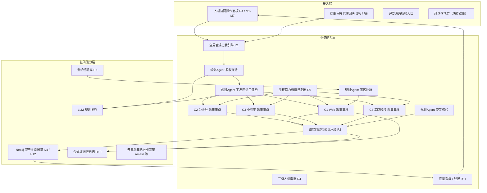
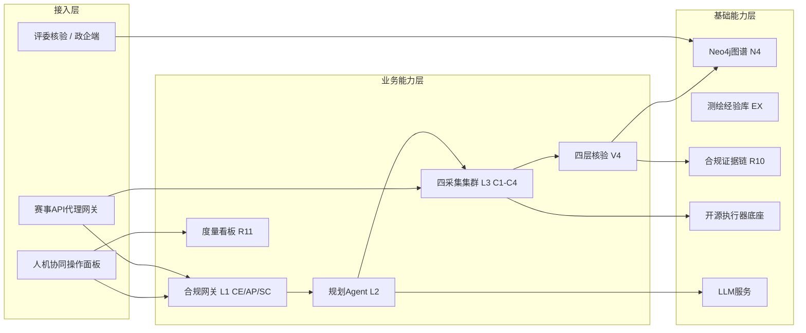

# AICoding 架构设计 · 高层架构设计

> 本文档为《AICoding 架构设计》核心产物之一，对应**高层架构设计**模板。
> 上游输入：业务原始诉求（产品战略团队 PRD / 用户全周期规划 / CTF 范式 / 竞品基线 / 六维经验）+ 行业调研结论（research_report.md，G2 已审核通过）+ 资料摘要（material_digest.md，G1 已审核通过）。
> 下游输出：驱动《系统设计》《部署设计》《安全设计》《UserStory》四份文档的撰写。
> 本文档是 `system-architect` 与 `product-story-designer` 的唯一上游边界基线，在 G3 人工审核通过前不得下发。

---

## 0. 元信息：修订记录

```yaml
标题: 企业被动信息搜集 Agent - 高层架构设计 v0.1
版本: v0.1
状态: Draft   # Draft | Reviewing | Approved | Deprecated
创建日期: 2026-07-13
最后更新: 2026-07-13
作者: 许边界（business-architect）
评审人:
  - 齐构成（主理人 / 方向明）

关联文档:
  上游输入:
    - 业务原始诉求 / PRD: deliverables/product-strategy/prd-passive-info-agent-2026-07-13.md
    - 资料摘要: .workbuddy/output/material_digest.md（G1 已审核通过）
    - 行业调研报告: .workbuddy/output/research_report.md（G2 已审核通过）
  下游产出:
    - 系统设计: AICoding架构设计-2-系统设计.md
    - 部署设计: AICoding架构设计-3-部署设计.md
    - 安全设计: AICoding架构设计-4-安全设计.md
    - UserStory: AICoding架构设计-5-UserStory.md
```

| 版本 | 日期 | 作者 | 变更内容 | 评审状态 |
| --- | --- | --- | --- | --- |
| v0.1 | 2026-07-13 | 许边界（business-architect） | 初稿：六章 + 附录，冻结四层架构边界与 X3/X4 口径，承载上游已裁决项与待确认依赖项 | Draft |

> **版本管理纪律**：破坏性变更（章节结构调整 / 关键决策反转）升 MAJOR；新增章节、扩充内容升 MINOR。

---

## 1. 需求概要

### 1.1 需求概要说明

企业被动信息搜集 Agent 用于解决"纯被动、合规、可审计地批量采集企业数字资产情报"这一核心问题，服务于赛事评委/专家、一线操作方与政企落地方，覆盖 9 类维度采集与加权冲分。本期由"冲击国家级特等奖"的产品战略驱动启动，须以零违规、零封禁为生死线，在测试赛—初赛—决赛三阶段递进达成 WNSR ≥ 100%（+15% 安全垫）。

### 1.2 关键决策摘要

| 编号 | 决策类别 | 决策内容 | 关联章节 |
| --- | --- | --- | --- |
| D1 | 范围决策 | 本期冻结四层架构边界（L1 人机调度与合规网关 / L2 全局规划 Agent / L3 四大采集集群 / L4 情报存储与四层核验知识库）；9 类采集维度（ICP 域名、子域名、旁站站点、微信公众号、小程序、历史快照、工商股权、开源泄露、工控配套系统）全量承载；需求池 R1–R15 按 P0/P1/P2 分层分期落地 | §4 / §5 / §6 |
| D2 | 技术选型决策 | L1 100% 自研（借鉴 AegisFlow 设计模式，代码 100% 自研以满足 R5 源码核验）；L3/L4 复用开源执行器（Amass 等）+ Neo4j 底座 + 自研 Schema/推理层；LLM 规划采用「强闭源指挥 + 轻量开源小 Agent + RAG」。规划 Agent 显式下发四类子任务（X3 经调研建议冻结，与 R7 / D0§7.1 L3 四类集群一致）；A 类高价值标签统一术语为「工控/政务/能源高价值」集合（X4 主理人授权统一术语，权重 60% 不变） | §3 / §4.2 |
| D3 | MVP / 完整版边界 | MVP = R1–R11（P0+P1）+ R12 基础图谱，跑通单企业 9 步闭环；R12 推理补全 / R13 完整接入 / R14 多模态研判 / R15 完整复盘归完整版（决赛） | §4.3 / §6.1 |
| D4 | 复用 vs 新建 | 复用 Neo4j（Community / AuraDB Free）图谱底座 + 开源采集执行器（Amass / Subfinder / OneForAll / crt.sh）+ 赛事 API 代理自研；L1 中枢（CE/AP/SC/GW）、L4 校验流水线（V4）与图谱 Schema/推理层自研 | §3.2 / §5.2 |
| D5 | 部署形态 | 私有化 / 自托管（源码核验 + 纯被动合规要求），单赛事环境运行，非多租户商用产品（D0§8④ 明确不做通用商用情报平台） | §4.2 / §5.2 |

**硬指标**：≥ 3 条，≤ 5 条；每条决策必须能映射到正文具体章节（D1→§4/§5/§6，D2→§3/§4.2，D3→§4.3/§6.1，D4→§3.2/§5.2，D5→§4.2/§5.2）。

### 1.3 价值主张

| 价值维度 | 量化目标 | 度量指标 | 当前值 | 目标值 | 截止时间 |
| --- | --- | --- | --- | --- | --- |
| 合规 | 全程违规探测 = 0 且 IP 封禁 = 0（零事故生死线） | 合规安全率（违规次数 / 封禁次数） | 基线 0 | 100%（零事故） | 测试赛起全程 |
| 业务完备 | 9 类维度资产覆盖率分阶段达标 | 资产覆盖率 | 0 | 测试 ≥50% / 初赛 ≥70% / 决赛 ≥90% | 三阶段递进 |
| 效率（冲分） | 加权净得分达成率达标并预留安全垫 | WNSR（有效加权得分达成率） | 基线 | ≥100%（冲 ≈115% 安全垫） | 初赛达线 / 决赛特奖 |
| 成本 | 初赛以开源执行器零许可费 + 自托管算力为主 | 单位采集许可成本 | — | ≤ 开源零许可 + 自托管算力（FOFA/Shodan API 仅可选补充） | MVP 上线 |

**硬指标**：业务价值 ≥ 2 条（合规、业务完备、效率均属业务价值）+ 技术/成本价值 ≥ 1 条（成本）；每条均量化。

---

## 2. 需求分析 & 痛点解构

### 2.1 核心角色关注点

本章节按「甲方决策者 / 最终用户 / 受影响方」三类视角盘点核心角色关注点，下方表格逐行列出各角色 Top1 关心点。
甲方决策者作为核心角色之一，关注特奖达成率与零违规底线。
最终用户（操作方 / 赛事值守）作为核心角色，关注断点续跑与三级复核效率。
受影响方（评委 / 合规运维）角色的关注点对齐合规可审计与零封禁底线。

| 角色 | 业务身份 | 主要操作 | Top1 关心点 | 来源 |
| --- | --- | --- | --- | --- |
| 甲方决策者：产品战略主理人 / 赛道负责人 | 产品战略团队（方向明 / 齐构成） | 看板审阅、里程碑把控、资源调度裁决 | 特奖达成率（WNSR ≥100%+15% 安全垫）与零违规底线是否守住 | D0 §TL;DR / §5.1 / §10 |
| 最终用户 A：操作方 / 赛事值守 | 一线操作与人工值守 | 人机协同面板操作、三级审批、算力临时上调、断点续跑 | 断点续跑零丢失 + 三级复核效率，避免任务重来 / 高价值工控政务漏审 | D0 §2 US-3 / §7.3 M4 |
| 最终用户 B：落地用户（政企安全团队，决赛叙事） | 政企资产安全负责人 | 全主体枚举、资产图谱查询、巡检报告获取 | 母公司 + 全资/控股子 + 分公司全量零误报覆盖与可审计对接 | D0 §2 US-2 / §1 O2 |
| 受影响方：评委 / 专家（决赛源码核验） | 赛事评审 | 源码核验 + 结构化日志审查 | 自研 / 开源边界可证明、零主动探测可被证据链证实 | D0 §2 US-1 / §6 R5 / §8① |
| 受影响方：合规 / 运维（SRE） | 合规与运维保障 | 审计监控、告警响应、可用性保障 | 全链路可审计留痕 + 系统可用性（封禁=0 停摆风险） | D0 §5.4 / D1 §四.3 |

**硬指标**：≥ 3 类（甲方决策者 / 最终用户 / 受影响方各至少一行）；每行必须有"Top1 关心点"，禁止笼统写"使用方便"。

### 2.2 核心痛点

| 编号 | 痛点描述 | 现象 / 数据 | 影响角色 | 影响程度 | 优先级 |
| --- | --- | --- | --- | --- | --- |
| P1 | 纯被动合规红线极易被开源采集器的主动能力击穿 | 500+ 参赛队伍中红线极严；D0§5.4 规定违规探测 = 0 即清零、IP 封禁 = 0 即停摆；research_report R-01 指出 Amass / FOFA 默认含主动模块（暴力/域传送/主动 HTTP），一旦误用即触发清零 | 合规 / 全体 | 高（合规生死线） | P1 |
| P1 | 加权算力若平均分配，高价值国企（工控/政务）算力不足致 WNSR 不达标 | D0§5.3：A:B:C 边际贡献 ≈ 36:9:1，均匀分配仅较基准 +59%，须按 60:30:10 倾斜才能让高加分主体足量采集 | 冲分 / 甲方决策者 | 高（特奖达成） | P1 |
| P2 | 多源容错不足致单源失效某类资产缺采丢分 | D1§四.2：单源失效导致某类资产缺采；要求每类 2~3 套备用源热切换 | 冲分 / 操作方 | 中 | P2 |
| P2 | 情报质量（过期 / 虚假 / 单源）导致无效情报扣分 | D0§5.4：无效情报率初赛 ≤5% / 决赛 ≤2%，超阈降权扣分；错误提交率 ≤1% 触发熔断 | 冲分 / 质量可信 | 中 | P2 |
| P2 | 工程稳定性不足，崩溃重启任务重来 | D1§四.3：崩溃/重启导致任务重来，需全任务快照断点续存 + 进度实时入库 | 操作方 / 运维 | 中 | P2 |

**优先级标准**：
- **P1**：直接影响业务核心流程或合规底线，不解决无法上线。
- **P2**：影响用户体验或运营效率，可在 MVP 后迭代。
- **P3**：体验型 / 长尾问题，列入完整版或后续版本。

**硬指标**：每条痛点必须有"现象 / 数据"佐证；P1 ≥ 1 条且必须在 §2.3 有对应目标（本表 P1 两条分别对齐 V1、V2）。

### 2.3 期待目标

| 编号 | 目标描述 | 对齐痛点 | 度量指标 | 当前值 | 目标值 | 截止时间 |
| --- | --- | --- | --- | --- | --- | --- |
| V1 | 全程违规探测 = 0 且 IP 封禁 = 0（零事故） | P1（合规红线） | 合规安全率（违规次数 / 封禁次数） | 0 基线 | 100%（零事故） | 测试赛起全程 |
| V2 | WNSR（有效加权得分达成率）≥ 100% 并预留 15% 安全垫 | P1（冲分） | WNSR 达成率 | 基线 | ≥100%（冲 ≈115%） | 初赛达线 / 决赛特奖 |
| V3 | 9 类维度资产覆盖率分阶段达标 | P2（缺采） | 资产覆盖率 | 0 | 测试 ≥50% / 初赛 ≥70% / 决赛 ≥90% | 三阶段递进 |
| V4 | 无效情报率分阶段压降、错误提交熔断可控 | P2（质量） | 无效情报率 / 错误提交率 | — | 无效 ≤10%/5%/2%（测/初/决）；错误提交 ≤1% | 决赛 |
| V5 | 任务断点续跑零丢失、单任务零新增 25min 回收算力 | P2（稳定性） | 续跑丢失率 / 回收时延 | — | 0 丢失 / 25min | 测试赛 |

**硬指标**：每条目标必须**有数字 + 对齐至少 1 条痛点**；P1 痛点必须有对应 V 级目标（P1→V1、V2）。

### 2.4 基线复用

| 复用类别 | 现有能力 | 复用方式 | 来源系统 | 备注 |
| --- | --- | --- | --- | --- |
| 图谱底座 | Neo4j（Community / AuraDB Free） | 直接部署自托管，GDS 算法支撑推理补全 | 开源图数据库（Neo4j Inc.） | 决赛自研图谱 Schema 与推理层；Community 单实例满足竞赛规模 |
| 采集执行器 | OWASP Amass（被动源）/ Subfinder / OneForAll / crt.sh | 封装为开源执行器，仅启用被动源 | 公开开源项目 / 公开 API | 主动模块须被 R1 前置拦截禁用（research R-01） |
| 控制面范式 | AegisFlow 设计模式（ActionEnvelope + allow/review/block + 哈希链证据 + fail-closed） | 借鉴模式，代码 100% 自研 | 开源社区（saivedant169/AegisFlow） | L1 CE/AP + R10 审计日志蓝本；避免决赛源码核验抄袭判定（R-04） |
| LLM 规划 | 闭源强模型（指挥官）+ 轻量开源小 Agent + RAG 知识库 | 调用 API + 自研编排 | 外部 LLM 服务 | L2 规划 Agent（PL/DS/BL/XC）；D4§二 明确此组合 |
| 可选数据源 | FOFA / Shodan 被动 API | 采购订阅（可选增强） | 第三方 SaaS | U-09 待业务方裁决；仅只读查询、禁主动扫描 |
| 经验库范式 | SkillTrace 依赖图谱思路（链路/报错/答案复用） | 借鉴方法论 | 上游 D4§一.1 | L4 EX 测绘经验库设计参照 |

**硬指标**：必须先盘点再决定新建；凡列入"功能缺口"的能力，必须先在本节确认基线无法覆盖。

### 2.5 功能缺口

| 阶段 | 功能缺口 | 必要性 | 优先级 | 对齐目标 |
| --- | --- | --- | --- | --- |
| 事前（合规前置 / 规划） | 全局合规拦截引擎 R1（出站前置拦截、主动动作零放行） | 必须 | P0 | V1 |
| 事前（合规前置 / 规划） | 全主体资产枚举 / 股权穿透 R3（母+子+分全量主体） | 必须 | P0 | V3 |
| 事前（合规前置 / 规划） | 三级人机审批 + 断点续跑面板 R4 | 必须 | P0 | V1 / V5 |
| 事中（采集 / 调度 / 校验） | 多源被动采集调度层 R7（封装四类集群，每类 ≥2 被动源） | 必须 | P1 | V3 |
| 事中（采集 / 调度 / 校验） | 多源容错降级 R8（热切换备用源，全源不可用挂起告警） | 必须 | P1 | V3 |
| 事中（采集 / 调度 / 校验） | 加权算力调度控制器 R9（60:30:10、25min 回收、每 5min 看榜） | 必须 | P1 | V2 |
| 事中（采集 / 调度 / 校验） | 赛事 API 代理网关 R6（多 IP 轮询 + buffer ≤95% + 分片提交） | 必须 | P0 | V1 |
| 事后（入库 / 核验） | 四层自动校验流水线 R2（工商匹配 / DNS 仅解析 / 时间过滤 / 多源 ≥2） | 必须 | P0 | V4 |
| 事后（入库 / 核验） | 资产关联图谱基础版 R12 基础（企业-子-域-号-程序拓扑入库） | 重要 | P2（基础 ✅MVP） | V3 |
| 运营（看板 / 审计 / 留档） | 合规可审计日志 R10（全链路时间戳/主体/动作/数据源/合规判定） | 必须 | P1 | V1 |
| 运营（看板 / 审计 / 留档） | 度量看板 / 战报 R11（实时 WNSR + 6 支撑 + 红线，每 5min 刷新） | 必须 | P1 | V2 |
| 运营（看板 / 审计 / 留档） | 开源工具留档与自研边界标注 R5（台账 + 决赛一键证明） | 必须 | P0 | V1（源码核验） |
| 决赛（创新延后） | 推理补全 / 多模态 / R14 研判大屏 / R15 完整复盘 | 重要 | P2（归完整版） | V3 / V2 |

**硬指标**：每条缺口必须对齐 §2.3 至少一条目标；MVP 缺口必须在 §6.3 功能清单中对应有 MVP 范围标记。

---

## 3. 行业调研

### 3.1 行业标杆系统分析

> 以下标杆事实均来自 research_report.md（G2 已审核通过）§2，区分「已核实事实」与「推断/建议」；加权评分与取舍结论见 §3.2。

| 标杆系统 | 厂商 / 来源 | 场景覆盖 | 技术亮点 | 商业模式 | 适用度 |
| --- | --- | --- | --- | --- | --- |
| FOFA | 华顺信安 | 被动资产测绘 / 攻击面管理 / 资产拓线 | 全球分布式资产搜索引擎 + AI 指纹 + 多线索动态拓线 | SaaS 订阅（企业版约 $5400/月） | 中（可选被动 API 数据源） |
| Shodan | Shodan 团队 | IoT / 设备被动发现 / 暴露面监测 | 每周全网爬取建索引 + 开发者 API（含 scan 主动 API） | SaaS 订阅（$49~1099/月） | 中（可选被动 API 数据源） |
| OWASP Amass | OWASP 社区 | 攻击面侦察（被动 + 主动可拆分） | 100+ 被动数据源（crt.sh / 被动 DNS / 公开 API）+ 内置图库 | 开源 Apache-2.0（免费） | 高（L3 C1 执行器） |
| Neo4j | Neo4j, Inc. | 图数据库 / 资产关联图谱 / 攻击路径分析 | 原生属性图 + Cypher/GQL + GDS 65+ 算法（Node2Vec / Link Prediction） | 开源 Community（GPLv3）/ AuraDB Free | 高（L4 N4 图谱底座） |
| Maltego | Maltego（荷兰） | OSINT 关联分析 / 情报图谱 | 120+ 数据伙伴 + Transforms 枢纽 + 关联图（ISO 27001） | SaaS + 桌面（Professional €7500/年） | 低（仅方法论参照） |
| AegisFlow | 开源社区（saivedant169） | Agent 运行时治理 / 合规网关范式 | ActionEnvelope + allow/review/block + 哈希链证据 + fail-closed | 开源 MIT/Apache（免费） | 高（L1 控制面范式） |
| 主动探测侦察范式（Nmap 等） | 开源社区 | 主动端口 / 主机扫描 | TCP SYN/ACK、ICMP、UDP 主动探测 | 开源（免费） | 不借鉴（红线否决） |

**硬指标**：≥ 3 家；至少包含 1 家头部 SaaS（FOFA / Shodan / Maltego）+ 1 家开源/自研代表（Amass / Neo4j / AegisFlow）。本表 7 家，达标。

### 3.2 方案对标及优先级打分

**对比矩阵**（每行权重之和 = 1.00；评分标尺 1~5，1=严重不符合，3=基本满足但有明显局限，5=完美契合；反向维度高分=更优）：

| 评估维度 | 权重 | FOFA | Shodan | Amass | Neo4j | Maltego | AegisFlow | Nmap |
| --- | --- | --- | --- | --- | --- | --- | --- | --- |
| 场景契合度 | 0.30 | 4 | 3 | 5 | 5 | 3 | 5 | 1 |
| 技术成熟度 | 0.20 | 5 | 5 | 4 | 5 | 5 | 3 | 5 |
| 集成难度（反向）| 0.15 | 3 | 3 | 5 | 4 | 2 | 4 | 4 |
| 成本（反向） | 0.15 | 3 | 3 | 5 | 4 | 2 | 5 | 5 |
| 合规可控性 | 0.20 | 3 | 3 | 4 | 5 | 2 | 5 | 1 |
| **加权总分** | **1.00** | **3.70** | **3.40** | **4.60** | **4.70** | **2.90** | **4.45** | **2.85** |

**结论摘要**（依据 research_report §3.2，权重印证 D0§1 三目标正交）：
- **优先借鉴**：Neo4j（4.70）、Amass（4.60）、AegisFlow（4.45）—— 均为开源/自托管、合规可控、零许可成本，且直接对应 L4 / L3 / L1。
- **部分借鉴**：FOFA（3.70）、Shodan（3.40）、Maltego（2.90）—— 前两者作 L3 可选被动 API 数据源（仅只读查询、禁用主动扫描）；Maltego 仅借鉴「实体-关系关联图 + 多源 Pivot + 研判呈现」方法论。
- **不借鉴（否决）**：Nmap / 主动探测范式（2.85，场景契合度 1、合规可控性 1）—— 主动端口扫描/TCP 发包/主动 HTTP 探测本质违反本项目「纯被动」红线（research R-01 / D0§5.4），无论技术成熟度与成本多优均整体否决。

### 3.3 完整报告参考

- 完整报告链接：`.workbuddy/output/research_report.md`（G2 已审核通过，12/12 自动校验 + 人工审核通过）
- 调研工具：`tech-research-advisor`
- 调研日期：2026-07-13
- 调研归档：`.workbuddy/output/research_report.md`
- 关键来源：FOFA 官方 VIP 页（SR-01）、OWASP Amass 仓库（SR-05）、Neo4j AuraDB（SR-09）、Shodan 文档（SR-12）、AegisFlow 仓库（SR-13）、Nmap 官方（SR-14）、material_digest.md（SR-16）

---

## 4. 方案决策

### 4.1 价值定位澄清

**定位三段式**（对外 / 对内 / 差异化）：

```
对外价值（评委 / 政企落地方）: 提供"纯被动、可审计、高覆盖"的企业数字资产情报与资产关联图谱，区别于一切主动探测类方案，可被证据链证实零主动动作。
对内价值（操作方 / 主理人）: 一线操作方提效（断点续跑 / 三级审批 / 看榜倾斜）+ 合规零事故（违规=0/封禁=0）+ 加权冲分可量化管控（WNSR 实时可见）。
差异化价值        : 赛道唯一"被动情报采集 + 资产关联图谱 + 加权算力调度"品类；资产图谱推理补全、全链路人机分级审批、频限感知加权调度为独占创新点（D0§4.3 / D4§三）。
```

**与产品矩阵的关系**：本系统为参赛作品核心，承载 L1–L4 四层闭环，向上对齐产品战略团队北极星 WNSR ≥100%，向下驱动系统设计 / 部署设计 / 安全设计 / UserStory 四份下游文档。

### 4.2 系统定位澄清

| 维度 | 内容 |
| --- | --- |
| 系统名称 | 企业被动信息搜集 Agent（PassiveInfoAgent） |
| 系统类型 | 新建（竞赛作品 / 可落地政企巡检原型，非通用商用产品） |
| 部署形态 | 私有化 / 自托管（源码核验 + 纯被动合规要求，单赛事环境运行） |
| 多租户 | 否（单赛事 / 单实例；决赛可演示多企业资产，但非多租户隔离产品） |
| 服务对象 | 赛事评委/专家、操作方/赛事值守、政企落地方（决赛叙事）、主理人/产品战略团队 |
| 上游依赖 | 外部被动数据源（开源执行器 / FOFA-Shodan 被动 API / 工商 API）、LLM 服务（闭源强模型）、多出口 IP 资源（待确认 #7） |
| 下游消费者 | 研判大屏 / 战报（R14 / R15）、政企巡检交付（决赛）、评委源码核验入口 |
| 边界（不做） | 不做主动探测 / 不做攻击性渗透能力 / 不做通用商用情报平台 / 不超 9 类维度 / 不绕过 API 频限 / 不做人工逐条录入式采集（D0§8 Non-goals） |

> **X3 冻结标注（调研建议冻结）**：规划 Agent（L2 DS）显式下发**四类**采集子任务（Web / 公众号 / 小程序 / 工商股权），与 R7「四类集群」、D0§7.1 L3（C1–C4）口径一致；工商股权由 R3 枚举引擎 + C4 集群共同承担，实体不缺失。依据 research_report U-07 建议，且用户原始诉求 R7 / D0§7.1 L3 已明确四类集群，X3 冲突闭合。
>
> **X4 术语统一标注（主理人授权统一术语）**：A 类高价值标签统一术语为「工控 / 政务 / 能源高价值」集合（将 D1 的电网 / 矿山归入「工控」大类），加权算力占比 60% 不变。依据 research_report U-08 建议，权重量化不受影响。

### 4.3 MVP 与完整版决策

| 阶段 | 时间窗 | 范围（功能编号） | 架构差异点 | 退出标准 | 不做（延后） |
| --- | --- | --- | --- | --- | --- |
| MVP | 测试赛 ~ 初赛 | R1–R11 + R12 基础图谱 | 开源执行器封装 + 自研中枢（L1 100% 自研）+ Neo4j 基础图谱 + 三级审批 + 加权调度初版；推理补全 / 多模态以 GDS 轻量实现或 Mock | 单赛事环境跑通单企业 9 步闭环 + 初赛 WNSR ≥100% 达线 + 违规=0/封禁=0 | R12 推理补全 / R13 完整接入 / R14 / R15 完整复盘 |
| 完整版 | 决赛 | + R12 推理补全 + R13 + R14 + R15 | 自研内核重构（≤30% 开源 + 70% 自研）+ 图谱 Schema/推理层自研 + 多模态研判大屏 | 决赛特奖 WNSR ≥115% 安全垫 + 源码核验通过 + 全程零违规 | — |

**演进纪律**（重要）：
- ✅ MVP 的架构骨架必须是完整版的**子集**，不允许 MVP 上线后推倒重来（L1 自研中枢 → 决赛保留并深化；Neo4j 图谱底座 → 决赛自研 Schema/推理层，引擎保留）。
- ✅ MVP 中可 Mock 的能力（推理补全 / 多模态 / 研判大屏）须在本节明确"完整版替换计划"。
- ❌ 禁止：MVP 为赶工引入"完整版无法继承"的临时架构。

> **P0 = MVP 绑定声明**：P0 功能（R1–R6 保命六件套）全部纳入 MVP 范围并标记为 ✅，确保测试赛前 100% 完工通过联调（D0§9.2）。

---

## 5. 业务架构设计

### 5.1 业务架构图

本系统业务架构严格分为三层：接入层（用户 / 触点）→ 业务能力层（核心模块 L1–L4）→ 基础能力层（底座 / 数据 / 复用执行器），数据流自上而下贯穿主链路，运营看榜反馈回路自下而上回灌调度层。



**绘制规范**：三层（接入层 → 业务能力层 → 基础能力层）不缺层；实线 = 同步调用、虚线 = 异步事件、粗线 = 主链路（合规→规划→采集→核验→入库→看板）。

### 5.2 系统依赖架构

| 依赖类型 | 系统 / 模块 | 提供方 | 依赖能力 | 接入方式 | 同步/异步 | 关键约束 |
| --- | --- | --- | --- | --- | --- | --- |
| 上游 | 开源采集执行器（Amass / Subfinder / OneForAll / crt.sh） | 开源社区 | 被动源枚举 | CLI / API 封装 | 同步（调用）+ 异步（事件） | 仅被动源白名单，主动模块被 R1 禁用；R5 留档 |
| 上游 | FOFA / Shodan 被动 API（可选） | 第三方 SaaS | 被动查询增强 | REST API | 同步 | buffer ≤95%、禁 scan；U-09 待裁决 |
| 上游 | 工商股权 API（爱企查 / ENScan_GO） | 第三方 | 股权数据 | REST / SDK | 同步 | 频控；决赛自研重构（R12 相关） |
| 上游 | LLM 服务（闭源强模型） | 外部厂商 | 规划推理 | API | 同步 | 提示词 / 工具调用约束，RAG 接入 EX |
| 下游 | 研判大屏 / 战报（R14 / R15） | 本系统 | 可视化交付 | 内部调用 | 同步 | 归决赛 |
| 复用底座 | Neo4j（Community / AuraDB Free） | 开源 | 图存储 / 推理 | Bolt 驱动 | 同步 | 自托管；Community 单实例；决赛自研 Schema/推理层 |
| 复用底座 | 合规证据链日志 R10 | 自研 | 审计 | 内部存储 | 同步 / 异步 | 防篡改、全链路可检索（D0§6 R10） |
| 数据订阅 | 测绘经验库 EX | 自研 | 历史链路复用 | 内部 | 异步 | 采集链路 / 失败归因入库（D4§三 创新4） |

**硬指标**：
- 每条依赖必须明确"接入方式 + 同步/异步 + 关键约束"，禁止只写"调用 API"。
- 所有 P1 痛点对应的核心能力（合规拦截 / 加权调度 / 多源容错 / 四层校验）均可在本表找到依赖来源（自建 / 复用 / 采购）。

### 5.3 业务闭环

**业务主链路**（端到端，对应 D0§7.2 单企业 9 步闭环）：

```
合规前置校验(CE) → 股权穿透枚举全主体(PL/R3) → 规划Agent下发四类子任务(DS) → 加权算力调度分配A/B/C(SC)
→ 四集群被动采集(C1-C4,仅解析不访问) → 四层自动核验(V4) → 入库/挂起判定(N4) → 合规网关限流分片提交(R6) → 看榜+回收(SC,25min零新增)
```

**关键反馈回路**：

| 回路 | 触发点 | 反馈对象 | 反馈机制 | 价值 |
| --- | --- | --- | --- | --- |
| 业务效果回路 | 单企业闭环完结 + 每 5min 看榜 | SC 加权算力调度 | 每 5min 看榜倾斜算力（A60/B30/C10），高价值工控政务临时上调 | 优化加权总分 WNSR |
| 运营监控回路 | 红线 / 违规 / 频控异常 | 操作方 / 合规（AP） | 实时告警 + 三级审批（低危自动 / 中危入库+提醒 / 高价值人工复核） | 快速响应、避免清零 |
| 模型 / 数据迭代回路 | 采集链路历史 / 失败归因 | EX 测绘经验库 → BL 盲区补源 / R8 热切换 | 异步入库，盲区补源与多源热切换复用 | 提升覆盖率与容错 |

**运营主线**（与 §6.5 原型呼应）：
- **每日**：赛事值守看榜（M6）+ 合规态势卡（M1），高价值工控政务人工复核（M3）。
- **每周**：战报导出（R11）+ 资产覆盖率 / 准确率复盘（初赛后）。
- **每月 / 阶段**：架构重构评审（决赛前自研内核重构窗口）。

---

## 6. 产品需求及原型

### 6.1 需求边界

**In-Scope**（本期必做，硬指标 ≤15 条）：

```
F1. 全局合规拦截引擎（R1）：出站前置拦截，主动动作零放行，fail-closed
F2. 四层情报自动校验流水线（R2）：工商匹配 / DNS 仅解析 / 时间过滤 / 多源≥2
F3. 全主体资产枚举引擎 / 股权穿透（R3）：母+子+分全量主体，层数可配置
F4. 人机协同操作面板 + 三级审批 + 断点续跑（R4）
F5. 开源工具留档与自研边界标注（R5）：台账 + 决赛一键出具核验证明
F6. 赛事 API 代理网关（R6）：多 IP 轮询 + buffer≤95% + 分片提交
F7. 多源被动采集调度层（R7）：封装四类集群，每类≥2 被动源，单企业闭环
F8. 多源容错降级（R8）：热切换备用源，全源不可用挂起告警
F9. 加权算力调度控制器（R9）：60:30:10，每5min看榜，25min零新增回收
F10. 合规可审计日志（R10）：全链路时间戳/主体/动作/数据源/合规判定
F11. 度量看板 / 战报（R11）：实时 WNSR + 6 支撑 + 红线，每5min刷新
F12. Neo4j 资产关联图谱基础版（R12 基础）：企业-子-域-号-程序拓扑入库
N1. 非功能：纯被动合规（违规=0 / 封禁=0 生死线）
N2. 非功能：加权配比 A:B:C=60:30:10，25min 回收，每5min看榜倾斜
N3. 非功能：9 类维度采集，全主体覆盖率 测试≥50%/初赛≥70%/决赛≥90%
```

**Out-of-Scope（架构能力边界外，硬指标要求 ≥3 条）**：
| 编号 | 不做的事 | 原因 | 后续计划 |
| --- | --- | --- | --- |
| O1 | 主动探测 / 端口扫描 / TCP 发包 / 主动 HTTP 探测 | 违反纯被动红线，违规探测=0 即清零（D0§8①、§5.4） | 永远不做；由 R1 全局合规拦截引擎前置禁用 |
| O2 | 攻击性 / 渗透类安全能力 | Non-goals 明确不做（D0§8③） | 不在本期与决赛范围 |
| O3 | 通用商用情报平台（产品化） | 仅参赛作品 + 政企巡检演示叙事（D0§8④） | 决赛创新叙事，非产品化 |

**Out-of-Scope（决赛创新延后项，归完整版）**：
| 编号 | 不做的事 | 原因 | 后续计划 |
| --- | --- | --- | --- |
| O4 | R12 推理补全（图谱推理内核）/ 盲区补源智能推理 | 依赖 GDS + LLM 算力与工期，MVP 不具备（U-02 / #3） | 归决赛自研重构 |
| O5 | R14 多模态关联推理 / 政企常态化巡检 / 研判大屏完整版 | 依赖 R12 + 多模态算力（U-02 / #3 / #4 / #8） | 归决赛 |
| O6 | R15 完整战报复盘（丢分 / 违规根因定位） | 初赛仅做简化批量编排（U-02） | 归决赛 |

**Out-of-Scope（需主理人 / 业务方反馈的外部依赖项）**：
| 编号 | 依赖项 | 原因 | 后续计划 |
| --- | --- | --- | --- |
| D1 | 采购 FOFA / Shodan 被动 API 订阅（U-09 / #7） | 涉及外部低额订阅与预算，可逆待裁决 | 初赛以开源执行器为主；是否采购由业务方裁决 |
| D2 | 工商股权穿透层级上限固化（U-04 / #6） | 穿透 N 层待确认 | 先实现可配置层数，待主理人确认后冻结 |

**硬指标**：In-Scope ≤ 15 条（本表 12 功能 + 3 非功能 = 15）；Out-of-Scope ≥ 3 条（本表分三组，共 8 行）。

#### 6.1.1 待主理人确认依赖项（需主理人 / 业务方反馈，不得由本架构单方裁决）

> 以下项目属上游未决事实，本架构**不裁决**，仅承载为依赖项并给出备选路径，待主理人 / 业务方反馈后回填。#1（回收阈值 25min）、#5（按需求模块统计开源占比）已裁决，不再列入。

| 编号 | 待确认项 | 不确定性说明 | 备选路径（本架构默认采用） |
| --- | --- | --- | --- |
| #2 | 特等奖门槛得分（WNSR 分母） | 赛事规则未发布，无法回填 | 按模拟分估算 WNSR，规则发布后回填；不影响架构边界，仅影响冲分阈值 |
| #3 | 决赛多模态推理范围与算力成本边界 | 多模态关联推理算力预算未定 | 限定 R14 为演示级；推理补全先用 GDS 算法（Node2Vec / Link Prediction）轻量实现 |
| #4 | 政企常态化巡检交付深度 | 演示级 vs 可实战未定 | 默认演示级（闭环流程 + 样例报告），决赛再深化 |
| #6 | 工商股权穿透层级上限 | 穿透 N 层未定 | 默认 ≥3 层；按 R3 验收「至少覆盖 N 层」先实现可配置层数 |
| #7 | 多出口 IP 资源数量 / 来源 / 成本 | IP 池规模与成本未定 | 自筹代理 / 出口池；R6 频控硬闸 ≤95% 兜底 |
| #8 | 研判大屏受众与必含指标 | 受众与指标未定 | 默认主理人 / 评委视角，必含 WNSR / 合规红线 / 看榜 / 资产覆盖率 |

### 6.2 产品模块全景图

**模块卡片**（每个模块必填字段）：

| 模块名称 | 一级归属 | 责任团队 | 上游 | 下游 | MVP 是否包含 |
| --- | --- | --- | --- | --- | --- |
| 人机协同操作面板（R4 / M1-M7） | 接入层 | 前端可视化团队 | CE / SC / AP | 操作方 | 是 |
| 赛事 API 代理网关（GW / R6） | 接入层（网关边界） | 架构中枢团队 | 赛事 API | L1 / L3 | 是 |
| 全局合规拦截引擎（CE / R1） | 业务能力层（L1） | 架构中枢团队 | 操作方 / 调度层 | 全部出站动作 | 是 |
| 三级人机审批（AP / R4） | 业务能力层（L1） | 架构中枢团队 | CE / 操作方 | 提交队列 | 是 |
| 加权算力调度控制器（SC / R9） | 业务能力层（L1） | 架构中枢团队 | 看板 / 规划 Agent | 四采集集群 | 是 |
| 全局规划 Agent（PL/DS/BL/XC，L2） | 业务能力层（L2） | LLM / 中枢团队 | 股权 API / LLM | 四采集集群 / 核验 | 是 |
| 四大采集集群（C1-C4，L3） | 业务能力层（L3） | 采集开发团队 | 规划 Agent / 开源执行器 | 四层核验 | 是 |
| 四层自动核验流水线（V4 / R2） | 业务能力层（L4） | 数据层团队 | 四采集集群 | N4 / 日志 | 是 |
| 度量看板 / 战报（R11） | 业务能力层 | 前端团队 | N4 / 日志 / SC | 操作方 / 主理人 | 是 |
| Neo4j 资产关联图谱（N4 / R12） | 基础能力层 | 数据层团队 | 四层核验 | 看板 / 研判 | 是（基础版） |
| 测绘经验库（EX） | 基础能力层 | 数据层团队 | 采集链路 | 规划 Agent（BL） | 是（轻量） |
| 合规证据链日志（R10） | 基础能力层 | 架构中枢团队 | 全部模块 | 审计 / 复盘 | 是 |
| 开源采集执行器底座（Amass 等） | 基础能力层（复用） | 采集开发团队 | 公开开源项目 | 四采集集群 | 是（封装） |
| LLM 规划服务 | 基础能力层（复用） | 外部厂商 | — | 规划 Agent | 是 |



### 6.3 功能清单

| 编号 | 一级模块 | 二级功能 | 功能描述 | 优先级 | MVP 范围 | 完整版范围 | 对齐目标 |
| --- | --- | --- | --- | --- | --- | --- | --- |
| F1 | L1 合规网关 | 全局合规拦截引擎（R1） | 出站前置拦截，主动动作零放行，fail-closed + 72h 压测违规=0 | P0 | ✅ | ✅ | V1 |
| F2 | L4 核验 | 四层自动校验流水线（R2） | 工商匹配 / DNS 仅解析不访问 / 时间过滤>1年 / 多源≥2 入库 | P0 | ✅ | ✅ | V4 |
| F3 | L2 规划 / L3 | 全主体枚举股权穿透（R3） | 母+子+分全量主体，层数可配置（默认≥3） | P0 | ✅ | ✅ | V3 |
| F4 | L1 人机 | 三级审批 + 断点续跑面板（R4） | 低危自动 / 中危入库+提醒 / 高价值工控政务人工复核 | P0 | ✅ | ✅ | V1 / V5 |
| F5 | L1 / 审计 | 开源留档自研标注（R5） | 台账 + 自研/开源边界标注，决赛一键出具证明 | P0 | ✅ | ✅ | V1 |
| F6 | L1 网关 | 赛事 API 代理网关（R6） | 多 IP 轮询 + buffer≤95% + 排队 + 分片提交 | P0 | ✅ | ✅ | V1 |
| F7 | L3 采集 | 多源被动采集调度层（R7） | 封装四类集群，每类≥2 被动源，单企业闭环可跑通 | P1 | ✅ | ✅ | V3 |
| F8 | L3 容错 | 多源容错降级（R8） | 热切换备用源，全源不可用挂起告警不阻断全局 | P1 | ✅ | ✅ | V3 |
| F9 | L1 调度 | 加权算力调度（R9） | 60:30:10，每5min看榜倾斜，零新增25min回收 | P1 | ✅ | ✅ | V2 |
| F10 | 基础能力 | 合规可审计日志（R10） | 全链路时间戳/主体/动作/数据源/合规判定，可检索导出 | P1 | ✅ | ✅ | V1 |
| F11 | 运营看板 | 度量看板 / 战报（R11） | 实时 WNSR + 6 支撑 + 红线状态，每5min刷新，战报导出 | P1 | ✅ | ✅ | V2 |
| F12 | L4 图谱 | 资产关联图谱基础（R12 基础） | 企业-子-域-号-程序全关联拓扑入库 | P2 | ✅ | ✅ | V3 |
| F13 | L4 图谱 | 推理补全 / 盲区补源（R12 推理） | GDS + LLM 推理补全与隐藏资产挖掘 | P2 | ❌ | ✅ | V3 |
| F14 | L3 接入 | 第三方平台接入（R13） | ≥3 类被动源独立上下线 | P2 | ❌（初赛可选） | ✅ | V3 |
| F15 | 运营创新 | 多模态关联推理 / 政企巡检 / 研判大屏（R14） | 演示级→实战，可视化研判大屏 | P2 | ❌ | ✅ | V2 / V3 |
| F16 | 运营复盘 | 批量编排与战报复盘（R15） | 多企业编排 + 丢分/违规根因复盘 | P2 | ❌（简化✅） | ✅ | V2 |

**硬指标**：
- 每个 P0 功能必须在 MVP 范围内为 ✅（F1–F6 对应 R1–R6，均 ✅）。
- 每个功能必须能反向映射到 §2.5 功能缺口 + §2.3 期待目标（F1→V1，F2→V4，F3→V3，F4→V1/V5，F9→V2，F11→V2，F12→V3 等）。

### 6.4 产品原型 - 人机协同操作面板（操作方 / 值守端）

**核心页面清单**：

| 页面 | 用途 | 关键交互 | MVP |
| --- | --- | --- | --- |
| 合规态势卡（M1） | 实时违规/封禁/频控绿区 | 实时刷新，异常告警 | ✅ |
| 加权得分卡 WNSR（M2） | WNSR + 安全垫 + A/B/C 环形图 | 每 5min 快照 | ✅ |
| 审批队列（M3） | 三级审批，高价值工控政务置顶 | 一键通过 / 复核 / 驳回 | ✅ |
| 任务看板（M4） | 子任务状态 / 断点续跑 / 盲区补源 | 进度拖拽 / 续跑 | ✅ |
| 容错日志（M5） | 多源切换 / 挂起告警 | 检索 / 筛选 | ✅ |
| 看榜与算力倾斜（M6） | 每 5min 看榜快照 | 人工临时上调算力 | ✅ |
| 自研 / 开源标注（M7） | 决赛一键出具核验证明 | 导出台账 | ✅ |

**关键交互约束**：
- 面板响应：操作到呈现 P99 ≤ 2s（对齐 V1 / V5）。
- 断点续跑：进度零丢失，重启即恢复（对齐 V5）。
- 审批：高危工控政务人工复核强制，不可跳过（对齐 V1 合规底线）。

**原型链接**：待 Figma / Axure 补齐（决赛前交付）。

### 6.5 产品原型 - 度量看板 / 战报与研判大屏（主理人 / 评委端）

**核心页面清单**：

| 页面 | 用途 | 关键交互 | MVP |
| --- | --- | --- | --- |
| 实时度量看板（R11） | WNSR + 6 支撑 + 红线状态 | 每 5min 刷新 / 导出战报 | ✅ |
| 合规审计视图（R10） | 全链路日志检索 / 导出 | 按企业 / 时间 / 违规检索 | ✅ |
| 资产图谱视图（R12 基础） | 企业关联拓扑 | 下钻 / 盲区标识 | ✅（基础） |
| 研判大屏（R14，决赛） | 核心指标大屏 | 实时刷新 | ❌（决赛） |
| 战报复盘（R15，决赛） | 丢分 / 违规根因 | 多维下钻 | ❌（决赛） |

**关键交互约束**：
- 看板刷新：每 5min 自动快照（对齐 V2 看榜倾斜节奏）。
- 审计检索：支持按企业 / 时间 / 违规类型组合检索导出（对齐 V1 可审计性）。

**原型链接**：待 Figma / Axure 补齐（决赛前交付）。

---

## 附录 A：生成流程方法论

> 本附录描述高层架构设计的生成方法论，作为正文章节的产出依据（元信息，不需按业务替换）。

### A.0 生成流程总览

| 步骤 | 名称 | 核心产出 | 落入正文章节 |
| --- | --- | --- | --- |
| Step0 | 业务基础知识库构建 | 关联文档结构化知识库 | （为全文提供输入） |
| Step1 | 行业调研分析 | 行业标杆 / 方案对比 / MVP 决策 | §3 行业调研 |
| Step2 | 需求分析 / 痛点解构 | 需求画像卡 | §2 需求分析 & 痛点解构 |
| Step3 | 能力盘点，系统定位 | 价值定位 + 系统定位 | §4 方案决策 / §5.2 系统依赖架构 |
| Step4 | 生成系统高层架构设计 | 本文档主文档 | §1 ~ §5 |
| Step5 | 产品需求及原型 | 需求边界 + 全景图 + 原型 | §6 产品需求及原型 |

### A.1 输入与产出

- 输入：material_digest.md（G1 已审核）、research_report.md（G2 已审核）、用户原始诉求（PRD / 全周期规划 / CTF 范式 / 竞品基线 / 六维经验）。
- 产出：本文档 §0~§6 + 附录 C（自检报告），作为 system-architect / product-story-designer 的上游边界基线。

---

## 附录 B：配套工具清单

### B.1 知识库与调研 Skill

- `docx` / `pdf` / `pptx` / `xlsx`：本批上游资料均为 markdown，经 knowledge-ingest-engine 精读摘要。
- `tech-research-advisor`：产出 research_report.md（G2 已审核）。

### B.2 架构与图表

- `diagrams-generator` / Mermaid：本文 §5.1 业务架构图与 §6.2 模块全景图以 Mermaid 内嵌（满足「接入层→业务能力层→基础能力层」三层、标准模块名、数据流方向）。
- 高层架构合规校验：`validate_template_compliance.py`（11 项硬指标 + 无占位符通用检查）。

---

## 附录 C：阶段内中间确认自检报告（协议 §2.4）

> 本附录为业务架构师在 §2 / §4 / §5 / §6 关键章节产出后，按公共协议插入的四次自检记录，供主理人 G3 审核弹窗追溯。四次自检均**未触发** `[中间确认]`（未命中协议 §2.1 方案分歧型、亦未命中 §2.2 决策不可逆/跨界感知型），但仍按协议 §2.3 反向验证 3 问给出证据。

### 自检 1（§2 完成系统定位与价值定位后）

- **§2.1 方案分歧判定**：系统类型（新建竞赛作品）、部署形态（私有化/自托管）、多租户（否）、边界（Non-goals）均由用户原始诉求 D0§7.1 / D0§8 / D1§二 显式给定；上游 research_report §4.1 取舍建议与用户诉求一致，无 ≥2 种会显著改变下游边界的替代方案需裁决。**不触发**。
- **§2.3 反向验证 3 问**：
  - Q1（返工成本）：返工范围 = §4.2 系统定位表 + 下游部署设计/安全设计；切换成本 ≈ 0.5 人日（重填定位表，不波及模块设计）。**证据**：部署形态仅在定位表与下游设计引用，无实体代码。
  - Q2（用户/客户/监管可感知）：评委/主理人可见架构形态；但私有化/自托管是用户诉求 D0§8④（不做通用商用）+ 源码核验的必然形式，未新增对外承诺。**证据**：D0§8④ 明确不做通用商用平台，D1§一.2⑤ 要求决赛源码核验。
  - Q3（与用户原始诉求一致性）：直接引用 D0§7.1（四层架构自研/复用口径）、D0§8（Non-goals 七条）、D1§二（部署与边界）。**证据**：上述章节已显式指定系统类型与边界。

### 自检 2（§4 完成 MVP / 完整版决策与部署形态决策后）

- **§2.1 方案分歧判定**：MVP = R1–R11 + R12 基础，延后 R12 推理/R13/R14/R15 至决赛。该分期直接由用户诉求 D0§6（P0/P1/P2 分层）+ D0§9.2（P0 测试赛前 100%、P1 初赛前、P2 决赛前）给定，无替代分期方案需裁决。**不触发**。
- **§2.2 决策不可逆/跨界感知判定**：MVP 裁剪不改变用户可感知的产品形态（R12-R15 在用户诉求中本就归 P2 决赛）；未偏离用户原始诉求显式提及的能力。**不触发**。
- **§2.3 反向验证 3 问**：
  - Q1：返工范围 = §4.3 表 + §6.3 功能清单；切换成本 ≈ 1 人日（调整分期标记）。**证据**：分期与用户诉求 P0/P1/P2 对齐，拆移成本低。
  - Q2：操作方/评委感知的初赛可演示范围由用户诉求 P0/P1 既定，本决策未新增或削减可见能力。**证据**：D0§6 需求池 P0/P1/P2 已固定各功能归属阶段。
  - Q3：直接引用 D0§6（R12-R15 为 P2）+ D0§9.2（P2 初赛后–决赛前）。**证据**：分期与原始诉求一致，未偏离。

### 自检 3（§5 完成三层业务架构图与业务闭环设计后）

- **§2.1 方案分歧判定**：主链路（9 步闭环）由 D0§7.2 显式给定；三层架构（接入层→业务能力层→基础能力层）对应 L1-L4 四层模块；反馈回路（看榜倾斜/审批/经验库）由 D0§5.3 / D0§7.3 / D4§三 给定。无替代闭环方式需裁决。**不触发**。
- **§2.2 决策不可逆/跨界感知判定**：闭环方式未引入用户诉求之外的对外承诺或多租户/合规变更。**不触发**。
- **§2.3 反向验证 3 问**：
  - Q1：返工范围 = §5.1 图 + §5.3 闭环表；切换成本 ≈ 0.5 人日。**证据**：图与表为描述性产物，下游 system-architect 仅消费边界。
  - Q2：闭环为内部运行逻辑，不直接对用户/监管新增可感知行为。**证据**：主链路即 D0§7.2 既定 9 步。
  - Q3：直接引用 D0§7.2（9 步闭环）+ D0§5.3（每5min看榜/25min回收）+ D0§7.3（M1-M7 面板）。**证据**：闭环与上游完全一致。

### 自检 4（§6 完成 In/Out-Scope 与功能清单后，最后一次完整复核）

- **§2.1 方案分歧判定**：In-Scope（F1-F12 + N1-N3）与 Out-of-Scope（O1-O6 + D1-D2）均源自用户诉求 R1-R15 / D0§8 / 待确认项；X3（四类子任务）、X4（A 类术语）已按调研建议冻结 / 主理人授权统一，非单方裁决新能力。无方案分歧。**不触发**。
- **§2.2 决策不可逆/跨界感知判定**：Out-of-Scope 仅排除用户诉求已明确的 Non-goals 与 P2 延后项；待确认 #2/#3/#4/#6/#7/#8 列为依赖项并标注「需主理人/业务方反馈」，未伪造结论、未单方裁决。**不触发**。
- **§2.3 反向验证 3 问**：
  - Q1：返工范围 = §6.1 边界 + §6.3 清单；切换成本 ≈ 1 人日（待确认回填后微调）。**证据**：边界表结构化，回填仅填值不重构。
  - Q2：用户/评委可感知的初赛能力由 P0/P1 固定，本边界未新增或削减。**证据**：In-Scope 与 R1-R11 一一对应。
  - Q3：直接引用 D0§6（需求池）、D0§8（Non-goals）、D0§10（待确认 #2–#8）。**证据**：边界与原始诉求一致，待确认项原样承载未裁决。

> **X3 / X4 冻结标注说明**：X3（四类子任务）依 research_report U-07 建议冻结，且用户原始诉求 R7「四类集群」/ D0§7.1 L3（C1–C4）已显式给定四类，故标注「调研建议冻结（与用户原始诉求一致）」；X4（A 类术语）由主理人授权统一为「工控/政务/能源高价值」，权重 60% 不变，标注「主理人授权统一术语」。两项均不构成需用户重新裁决的新论题，故未发起 `[中间确认]`。

decision: "高层架构边界冻结，下游可进入"
