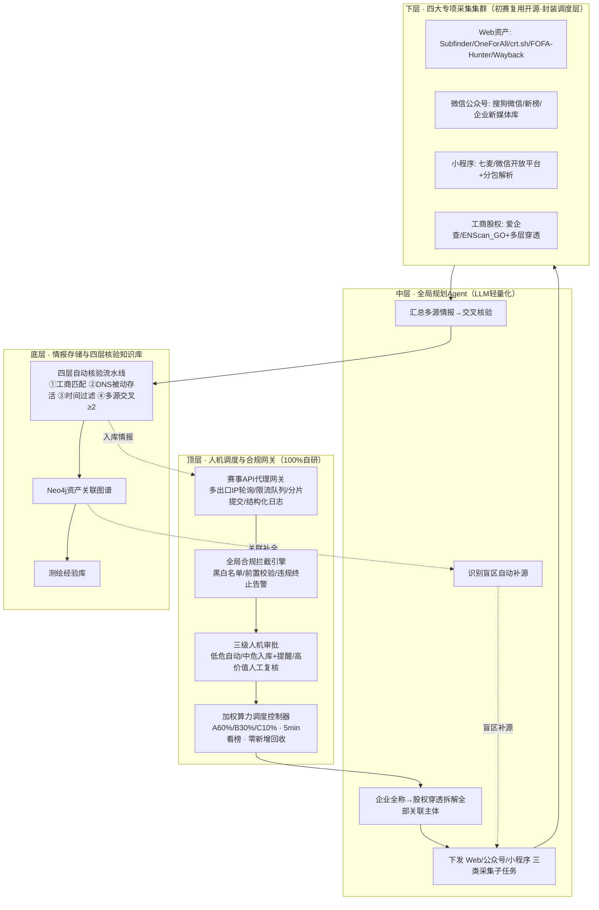

# 功能规格书（PRD）：企业被动信息搜集 Agent

**日期**：2026-07-13
**类型**：PRD（功能规格书 / 第一棒·立项需求阶段）
**参与成员**：方向明（主理人/编排）、瑞思（用户研究员）、竞析（竞品分析师）、数析（数据分析师）、析客（需求分析师）、路径（路线图规划师）
**接力说明**：本交付物为产品战略团队「第一棒」产出，供第二棒（架构师 / 技术专家，方案·架构 0.1→0.3 阶段）接力。

---

## 📌 TL;DR（执行摘要）

- **核心目标**：以纯被动、合规、可审计的方式批量采集企业数字资产情报，最大化有效加权得分达成率（北极星 WNSR ≥100%，预留 15% 安全垫），冲击国家级特等奖。
- **关键决策**：采用「合规网关 / 规划 Agent / 四大采集集群 / 四层核验知识库」四层架构；P0 六件套（R1–R6 保命模块）必须在测试赛前 100% 完工；赛道错位（被动采集 + 资产关联图谱）建立辨识度。
- **主理人裁决（两处口径冲突已统一）**：① 算力回收阈值统一为 **25 分钟**零新增（数析 10 分钟口径降级为「高稳定源可选快速回收」覆盖策略）；② 开源/自研占比按**需求模块（R1–R15）**为统计单元，保命模块内核 100% 自研、调度层 R7 计入自研基数，决赛通过「自研编排 + 开源执行器 → 纯自研执行器」替换自然达 ≤30% 开源。
- **下一步**：交第二棒进入方案·架构阶段，依据本 PRD 的接口契约与里程碑开展技术选型与模块拆分。

---

## 🎯 核心结论卡片

| 项目 | 内容 |
|------|------|
| 推荐方案 | 企业被动信息搜集 Agent：四层架构 + 三级人机审批 + 加权算力调度，纯被动合规采集 + 资产关联图谱差异化 |
| 优先级 | **P0**（保命六件套 R1–R6 必须在测试赛前完工；违规=0 / 封禁=0 为生死线） |
| 预期影响 | 资产覆盖率分阶段 50% / 70% / 90%；情报准确率 90% / 95% / 98%；WNSR ≥100% 冲特等奖 |
| 资源需求 | 多出口 IP 资源（抗封禁）、GPU 算力集群（加权调度）、人工值守（审批/终审）、开源工具留档台账 |
| 风险等级 | **高**（合规清零 / IP 封禁为生死红线；决赛自研占比从 70% 开源爬坡至 ≤30% 开源存在工程与时间风险） |

---

## 1. 产品目标（3 个清晰、正交的目标）

本产品为面向省级网安赛事延伸 AI Agent 竞赛的「企业被动信息搜集 Agent」，采用人机协同、纯被动采集、批量解题式提交。以下三个目标相互正交，分别约束"能不能参赛""采集多少""得分多少"。

- **O1 合规可审计（地基）**：建立全程纯被动采集的合规防线与可审计证据链，确保**违规=0、封禁=0**全程零事故。合规不是功能之一，而是产品能否完赛的地基。
- **O2 资产情报完备**：对企业全关联主体（母公司 + 全资/控股子公司 + 分公司）实现 9 类维度的高覆盖、高准确采集，并经四层校验入库。分阶段达成资产覆盖率目标（测试赛 ≥50% / 初赛 ≥70% / 决赛 ≥90%）。
- **O3 加权冲分高效**：通过加权算力调度与多源采集编排，最大化有效加权得分达成率（北极星 WNSR），以特等奖门槛得分为锚，目标 WNSR ≥100%（预留 15% 安全垫）。

> 三目标正交性说明：O1 决定"不被取消资格"，O2 决定"情报盘子有多大"，O3 决定"盘子里的分怎么加权放大"。任一目标失效均直接导致完赛失败或失分，互不替代。

---

## 2. 用户故事（3-5 个场景）

> 基于瑞思五视角故事精炼改写。角色定义：评委（R）、真实落地用户（U，政企安全团队）、参赛操作方（O）、质量可信（Q）、连续性（C）。

**US-1（评委答辩视角 / R）**
作为赛事评委，我希望在答辩现场能通过源码核验与结构化日志，清晰看到"哪些能力自研、哪些开源、是否全程零主动探测"，以便确认合规边界与原创性，给出可信评分。

**US-2（落地用户视角 / U）**
作为政企安全团队负责人，我希望系统对企业的母公司及全部子、分公司主体做到无遗漏枚举、零误报入库、常态化低运维，且操作全程合规可审计、能对接现有安全体系，以便将其用于实战资产梳理。

**US-3（操作方视角 / O）**
作为参赛操作方，我希望有一块人机协同操作面板，能让我"一键合规兜底防违规、可视化审批队列、断点续跑、加权冲分看榜"，且自研模块可在现场演示，以便高效完赛并冲特等奖。

**US-4（质量可信视角 / Q）**
作为关注情报质量的评审与用户，我希望每一条入库情报都经过"工商主体匹配→DNS 被动存活校验→时间过滤→多源交叉验证（≥2 源佐证）"四层校验，以便库内情报准确率高、无效率低、可被解释与复核。

**US-5（连续性视角 / C）**
作为长时间值守的操作方，我希望采集任务在 IP 切换、API 限流、子任务失败时能多源容错降级与断点续跑，单任务无新增时自动回收算力，以便 7×24 小时无人值守也不丢进度、不触红线。

---

## 3. 用户研究洞察（来自瑞思）

> 来源：瑞思（用户研究）八条核心洞察，提炼如下。P0 标记表示该洞察对应需求为最高优先级。

1. **合规红线是"地基"而非"功能之一"（P0）** — 来源：瑞思洞察#1。三类利益方（评委/用户/操作方）一致将零违规、零封禁视为完赛前提，而非锦上添花的功能点。
2. **量化可信度是共同胜负手** — 来源：瑞思洞察#2。评委要量化数据、用户要零误报率、操作方要加权得分，三方均以可度量指标为信任依据。
3. **开源/自研张力需在架构预留可替换层** — 来源：瑞思洞察#3。决赛要求自研 ≥70%、开源 ≤30%，初赛/测试赛却相反，架构须让采集工具可"换芯"而不动调度与合规骨架。
4. **人机协同是完赛刚需** — 来源：瑞思洞察#4。高价值工控/政务类情报需人工复核，低危可自动入库，三级审批不可缺。
5. **容错连续性是完赛硬指标** — 来源：瑞思洞察#5。限流、封禁、网络抖动下必须断点续跑与多源降级，否则长时间赛程必然中断。
6. **情报质量（四层校验）是双重门槛** — 来源：瑞思洞察#6。既影响有效得分，又影响评委对"可信"的判定，是扣分与信赖的双重闸门。
7. **算力调度是冲分策略引擎兼答辩创新点** — 来源：瑞思洞察#7。加权算力调度把"频限约束"转化为差异化创新，是答辩叙事与实战得分的交集。
8. **可审计性是信任桥梁** — 来源：瑞思洞察#8。全链路结构化日志让评委、用户、操作方共享同一份"可核验真相"，是跨角色信任的载体。

---

## 4. 竞品对比（来自竞析，5-7 个产品）

### 4.1 竞品全景与定位

基线 500+ 队伍中，强相关竞品集中在"安全/红队 Agent 调度"赛道；**我方是基线上唯一做"被动情报采集 + 资产图谱"的品类，赛道错位、辨识度高**。关键竞品：

- **Runwarden**：API 适配 + 频限流量管控 + 红队评测。
- **鉴枢**：有状态工具调度中间件。
- **智盾**：四级漏斗纵深防御。
- **SkillTrace**：技能依赖图谱 → 可迁移资产关联图谱。
- **玄鉴 / AegisFlow / BreakChain**：调用链实时拦截 / IFC 污点跟踪 / 级联阻断。
- **谛听 / AgentTEE**：意图追踪 / TEE 可信执行。
- **工控隔离方案**：Docker 沙箱隔离。

### 4.2 功能对比矩阵

| 能力维度 | 我方 | Runwarden | 鉴枢 | 智盾 | SkillTrace | 玄鉴·AegisFlow | 工控隔离 |
|---|---|---|---|---|---|---|---|
| 多源被动采集编排 | ● 强（独占） | ○ 部分 | ○ 部分 | — | — | — | — |
| 资产关联知识图谱 | ● 强（独占） | — | — | — | △ 技能依赖图谱 | — | — |
| 加权算力调度 | ● 强（独占） | △ 频控 | — | — | — | — | — |
| 被动合规管控（红线） | ● 持平 | ● 持平 | ● 持平 | ● 持平 | ● 持平 | ● 持平 | ● 持平 |
| 调用链实时拦截 / IFC 污点跟踪 | — | — | — | △ | — | ● 强 | — |
| 人机分级审批（采集决策） | ● 强 | — | △ | △ | — | — | — |
| 源码自研占比（初赛状态） | ▲ 爬坡期（短板） | ● 成熟 | ● 成熟 | ● 成熟 | ● 成熟 | ● 成熟 | ● 成熟 |

> 图例：● 强/持平　△ 部分/雏形　— 无　▲ 短板。结论：我方在**多源被动采集 / 资产图谱 / 加权算力调度**三项独占强项；合规管控与安全类持平；短板为源码原创占比处于爬坡期（决赛重构窗口解决）。

### 4.3 SWOT 摘要（来源：竞析）

- **优势（S）**：赛道错位、采集广度、赛制刚需能力已规划、资产图谱差异化。
- **劣势（W）**：自研占比初赛偏低、人机审批成熟度不及安全类、缺评测视角。
- **机会（O）**：空白品类定义者、互补叙事空间、决赛重构窗口。
- **威胁（T）**：安全类技术成熟度高致评委疑新颖度、被动红线极严、初赛同质化。

### 4.4 五条差异化机会（来源：竞析，纳入需求池 P1/P2）

1. **全链路被动合规溯源证明**（借鉴 IFC 污点跟踪，证明自身清白）—— 对应 R5/R10。
2. **资产关联知识图谱 + 推理补全**（决赛核心自研）—— 对应 R12。
3. **频限感知的加权算力调度器**（把限制变创新）—— 对应 R9。
4. **解题式多源采集编排 Agent**（任务分解 + 工具链编排）—— 对应 R7。
5. **人机协同分级审批的"采集决策"场景**（低置信人工确认 / 高置信自动入库）—— 对应 R4。

---

## 5. 数据依据（来自数析）

> 来源：数析（数据指标）。本节所有数值均为**规划建议值**，待实测回填。

### 5.1 北极星指标

| 指标 | 定义 | 目标 |
|---|---|---|
| **WNSR（有效加权得分达成率）** | 累计净加权得分 ÷ 特等奖门槛得分 × 100% | **≥100%**（预留 15% 安全垫，即争取冲至约 115%） |

### 5.2 支撑指标（6 项，分阶段）

| 指标 | 测试赛 | 初赛 | 决赛 | 性质 |
|---|---|---|---|---|
| 资产覆盖率 | ≥50% | ≥70% | ≥90% | 越高越好 |
| 情报准确率 | ≥90% | ≥95% | ≥98% | 越高越好 |
| 无效情报率（红线） | ≤10% | ≤5% | ≤2% | 越低越好 |
| 算力调度效率 | 基线 | 较测试 +≥30% | 持续优化 | 越高越好 |
| 合规安全率 | 违规=0 & 封禁=0 | 违规=0 & 封禁=0 | 违规=0 & 封禁=0 | 硬约束 |
| API 调用效率 | — | — | 峰值利用率 ≥95% 且封禁=0 | 越高越好且封禁=0 |

### 5.3 加权算力调度量化（规划建议值）

| 任务类 | 权重 | 单体资产均值 | 算力占比 | 边际贡献占比 |
|---|---|---|---|---|
| A 类（高价值：工控/政务） | 3.0 | 120 | 60% | ≈36 |
| B 类（中价值：主站/公众号） | 1.5 | 60 | 30% | ≈9 |
| C 类（低价值：长尾旁站） | 0.5 | 20 | 10% | ≈1 |

- **60/30/10 配比较均匀分配（同算力）提升约 +59% 加权总分**；A:B:C 边际贡献约 **36:9:1**。
- **看榜倾斜**：每 5 分钟读取排行榜，向高边际贡献任务倾斜算力。
- **回收阈值（主理人已裁决）**：单任务连续 **25 分钟**零新增即回收（规划文档口径为权威默认）；数析提出的 10 分钟口径降级为「高稳定源快速回收」可选覆盖策略，需 R11 度量看板数据支撑 + R8 容错降级就绪后方可启用。

### 5.4 风险红线量化（规划建议值，硬约束）

| 红线 | 阈值 | 触发后果 |
|---|---|---|
| 违规探测 | =0 | 清零（直接取消资格） |
| IP 封禁 | =0 | 停摆（采集中断） |
| 无效情报率 | 初赛 ≤5%，决赛 ≤2% | 超阈降权/扣分 |
| 错误提交率 | ≤1% | 触发熔断 |
| API 频控 buffer | ≤95% | 超限即封禁，严禁打满 |
| 单企业重复提交率 | ≤1% | 去重拦截 |

---

## 6. 需求池（P0/P1/P2 优先级）

> 编号规则：R1/R2…；优先级 P0（完赛保命）> P1（冲分/可信）> P2（决赛创新/扩展）。验收标准均要求可测量、可判定。估算工作量以「人日」占位，供路径规划师排期。

### P0（完赛保命，至少 5 条）

| 编号 | 需求 | 优先级 | 验收标准（可测量） | 估算 |
|---|---|---|---|---|
| R1 | 全局合规拦截引擎 | P0 | ① 内置行为黑白名单，任何出站动作在发出前经拦截校验；② 检测到端口扫描/TCP 发包/主动 HTTP 探测等主动行为时，立即终止该任务并触发告警；③ 任务前置校验不通过则禁止提交；④ 实测连续 72h 压测**违规次数=0、封禁次数=0**。 | 12 |
| R2 | 四层情报自动校验流水线 | P0 | ① 每层可独立开关与计数；② 层①工商主体匹配剔除非目标主体（误入率 measurable）；③ 层②DNS **仅解析不访问**被动存活校验；④ 层③过滤 1 年以上过期情报；⑤ 层④要求 ≥2 源佐证方入库，单源情报自动挂起；⑥ 决赛情报准确率 ≥98%、无效情报率 ≤2%（规划建议值）。 | 15 |
| R3 | 全主体资产枚举引擎（股权穿透） | P0 | ① 输入企业全称，输出母公司+全资/控股子+分公司**全量主体清单**；② 股权穿透至少覆盖 N 层（层数见待确认 #6）；③ 枚举结果可导出供下层采集集群分发；④ 测试赛资产覆盖率 ≥50%、初赛 ≥70%、决赛 ≥90%（规划建议值）。 | 14 |
| R4 | 人机协同操作面板（含断点续跑/审批队列/三级复核） | P0 | ① 提供可视化审批队列，三级策略：低危自动入库 / 中危自动入库+提醒 / 高价值工控政务人工复核；② 任务中断后可从最后检查点续跑，进度零丢失；③ 面板实时展示加权得分（WNSR）、合规状态、看榜；④ 自研模块可现场演示。 | 16 |
| R5 | 开源工具留档与自研边界标注 | P0 | ① 每个第三方开源工具留档（名称/版本/许可证/用途/调用边界）；② 代码与文档显式标注"自研/开源"边界；③ 决赛现场源码核验时，开源占比 ≤30%、自研 ≥70% 可一键出具证明（统计口径见 §待确认裁决，规划建议值）。 | 6 |
| R6 | 赛事 API 代理网关（多出口 IP 轮询 / 限流队列 / 批量分片 / 结构化日志） | P0 | ① 多出口 IP 轮询且单 IP 调用不超过频控 buffer（≤95%，规划建议值）；② 提交限流排队，超限请求排队不丢弃；③ 批量分片提交；④ 全链路结构化日志可检索、可审计；⑤ 压测下封禁=0。 | 13 |

### P1（冲分 / 可信）

| 编号 | 需求 | 优先级 | 验收标准（可测量） | 估算 |
|---|---|---|---|---|
| R7 | 多源被动采集调度层（四类采集集群封装） | P1 | ① 封装 Web/公众号/小程序/工商股权四类集群；② 每类支持 ≥2 个被动数据源；③ 调度层 100% 自研，工具可替换；④ 单企业采集闭环可端到端跑通。 | 18 |
| R8 | 多源容错降级 | P1 | ① 任一数据源失败自动切换备用源；② 全部源不可用则任务挂起并告警，不阻断全局；③ 降级事件计入日志与度量看板。 | 10 |
| R9 | 加权算力调度控制器 | P1 | ① 按 A:B:C=60:30:10 分配算力（规划建议值）；② 每 5 分钟看榜向高边际任务倾斜；③ 单任务零新增达回收阈值（**主理人裁决：25 分钟**）即回收；④ 初赛较测试算力调度效率 +≥30%（规划建议值）。 | 12 |
| R10 | 合规可审计日志（全链路结构化） | P1 | ① 覆盖采集/校验/提交/调度全链路；② 每条记录含时间戳/主体/动作/数据源/合规判定；③ 支持按企业/时间/违规维度检索；④ 可导出用于答辩溯源证明。 | 8 |
| R11 | 度量看板 / 战报 | P1 | ① 实时展示 WNSR、6 项支撑指标、风险红线状态；② 支持阶段战报导出；③ 看榜数据每 5 分钟刷新。 | 9 |

### P2（决赛创新 / 扩展）

| 编号 | 需求 | 优先级 | 验收标准（可测量） | 估算 |
|---|---|---|---|---|
| R12 | Neo4j 资产关联图谱与推理补全 | P2 | ① 企业-子公司-域名-公众号-小程序全关联拓扑；② 支持隐藏资产挖掘与盲区自动补源；③ 决赛自研重构，开源占比 ≤30%（规划建议值）。 | 20 |
| R13 | 第三方平台接入（搜狗微信/新榜/七麦/微信开放平台等） | P2 | ① 接入 ≥3 类第三方被动数据源；② 仅用被动接口，不触发主动探测；③ 数据源可独立上下线。 | 12 |
| R14 | 创新差异化模块（多模态关联推理 / 政企常态化巡检 / 可视化研判大屏） | P2 | ① 多模态关联推理可补全资产盲区；② 常态化巡检可周期性低运维运行；③ 研判大屏覆盖核心指标（范围见待确认 #8）。 | 22 |
| R15 | 批量编排与战报复盘 | P2 | ① 支持多企业批量任务编排；② 赛后战报复盘可定位丢分/违规根因。 | 10 |

---

## 7. 关键流程图 / UI 设计稿

> 本章以代码块（Mermaid / ASCII）描述，不产出图片文件。

### 7.1 四层技术架构数据流（Mermaid）



### 7.2 单企业采集闭环流程（ASCII）

```
┌─────────────────────────────────────────────────────────────┐
│ 输入：企业全称                                                 │
└───────────────────────────┬─────────────────────────────────┘
                            ▼
              [① 合规前置校验] ──不通过──▶ 终止+告警
                            │ 通过
                            ▼
              [② 股权穿透枚举全主体]（母+子+分）
                            ▼
              [③ 规划Agent 下发三类子任务]
                Web / 公众号 / 小程序 / 工商
                            ▼
              [④ 加权算力调度分配 A/B/C]
                （60/30/10，5min看榜倾斜）
                            ▼
   ┌──────────── 四集群被动采集（仅解析不访问）────────────┐
   │ Subfinder/OneForAll/crt.sh/FOFA/Wayback              │
   │ 搜狗微信/新榜/企业新媒体库                            │
   │ 七麦/微信开放平台+分包解析                            │
   │ 爱企查/ENScan_GO+多层穿透                            │
   └───────────────────────┬────────────────────────────┘
                           ▼
              [⑤ 四层自动核验流水线]
   ①工商主体匹配剔除非目标 ②DNS被动存活 ③时间过滤(>1年剔除) ④多源交叉≥2源
                           ▼
              [⑥ 入库 / 挂起判定]
       通过→Neo4j图谱+经验库   单源→挂起待补
                           ▼
              [⑦ 三级人机审批]
   低危自动入库 / 中危入库+提醒 / 高价值工控政务人工复核
                           ▼
              [⑧ 合规网关限流分片提交API]
               （多出口IP轮询，buffer≤95%，封禁=0）
                           ▼
              [⑨ 看榜+回收] 零新增达阈值(25min)→回收算力 → 闭环
```

### 7.3 人机协同操作面板核心模块（文字 + 布局）

面板采用左导航 + 中主区 + 右告警的三栏布局，核心模块：

- **M1 合规态势卡**：实时展示 违规=0 / 封禁=0 / 频控利用率（≤95% 绿区）。越线即红闪告警。
- **M2 加权得分卡（WNSR）**：北极星达成率进度条（目标 100%，安全垫 15%）；A/B/C 三类当前算力占比环形图。
- **M3 审批队列**：三级分级列表，支持「自动入库 / 人工确认 / 驳回」操作；高价值工控政务类高亮置顶。
- **M4 任务看板**：各企业采集进度、断点续跑入口、子任务状态（运行中/挂起/完成）、盲区补源提示。
- **M5 多源容错日志**：数据源可用性、降级事件、切换记录，可下钻。
- **M6 看榜与算力倾斜**：每 5 分钟榜单快照、算力倾斜动作记录。
- **M7 自研/开源边界标注**：可按模块查看自研占比，决赛一键出具核验证明（开源≤30%）。

---

## 8. Non-goals（明确不做什么）

1. **不做任何主动探测**：严禁端口扫描、TCP 发包、主动 HTTP 探测。所有采集仅限被动数据源与"仅解析不访问"的 DNS 校验。这是不可突破的红线，不因为"得分更高"而妥协。
2. **不在初赛/测试赛阶段全面自研采集工具**：接受开源封装（测试赛 70% 开源 / 初赛 70% 开源），仅保命模块（合规网关/多源容错/日志）与调度层自研；决赛才压到开源 ≤30%、自研 ≥70%。
3. **不做攻击性 / 渗透类安全能力**：本产品定位"被动情报采集与资产梳理"，不提供漏洞利用、爆破、内网渗透等任何进攻性能力。
4. **不做通用商用情报平台**：聚焦赛事解题场景；"政企常态化巡检"仅为决赛创新叙事模块，非核心交付，深度受阶段边界约束。
5. **不采集 9 类维度以外的数据**：维度严格限定为 ICP 域名、子域名、旁站站点、微信公众号、小程序、历史快照、工商股权、开源泄露、工控配套系统；不扩展至个人隐私、未授权资产等。
6. **不做人工逐条录入式采集**：必须依赖 Agent 批量"解题式"采集，人工仅负责复核与决策，不参与规模化录入。
7. **不做绕过 API 频限的作弊机制**：频限即合规边界，严禁打满或绕过；buffer 严格 ≤95%。

---

## 9. 时间线 & 里程碑（来自路径）

> 规划建议值说明：本文档所有数值、时间窗口、阈值均为规划建议值，最终以赛事官方规则与团队技术评审为准。

### 9.1 路线图更新表（时间线 & 里程碑）

按三阶段硬划分展开，每阶段 3 个里程碑，关键交付映射到需求编号（R1–R15），负责人为职责占位（非具体人员），风险列指向主要风险与缓解模块。

| 阶段 | 主题 | 关键交付（R 映射） | 负责人占位 | 风险与缓解指向 |
|------|------|-------------------|-----------|---------------|
| **一、测试赛筹备**（70% 开源 + 30% 自研） | **M1 红线奠基与网关原型** | R1 合规拦截引擎（基础规则库）、R6 赛事API代理网关（单IP限流 + 调用日志 基础版） | 架构负责人、文档合规 | 合规规则覆盖不全 → R1 兜底 + 平台API文档/往届规则基线 + 人工值守复核 |
| | **M2 保命闭环验证** | R2 四层校验、R3 全主体枚举、R4 人机协同面板（断点续跑/审批 基础版 + M1–M7 骨架） | 采集开发、前端 | 主体枚举遗漏致情报缺口 → 主体清单双人复核 + 灰度 + R2 校验拦截无效项 |
| | **M3 测试赛交卷** | R5 开源留档与自研边界（归档元数据）、P0 全量联调与回归 | 文档合规、架构负责人 | 开源/自研边界被质疑 → R5 留档可审计元数据 + 双人签署 |
| **二、线上初赛**（70% 开源 + 30% 自研业务中枢） | **M4 初赛调度成型** | R7 多源采集调度层、R6 升级（多IP轮询 + 频控硬闸）、R10 合规可审计日志 | 采集开发、数据层 | 多源并发触发频控/封禁 → R6 频控 buffer≤95% 硬闸 + 轮询 + R10 留痕 |
| | **M5 容错与冲分** | R8 多源容错降级、R9 加权算力调度、R11 度量看板 | 采集开发、前端 | 无效情报率逼近 5% → R2 校验前置 + R11 实时度量 + 人工值守熔断 |
| | **M6 初赛交卷 / 达线** | WNSR≥100% 达成（含 15% 安全垫）、P0+P1 全量、初赛复盘 | 架构负责人、人工值守 | 封禁/清零风险 → R6 监控 + R1 合规兜底 + 人工值守终审 |
| **三、决赛重构**（≤30% 开源、70% 自研） | **M7 自研内核重构** | R12 Neo4j 资产关联图谱与推理、R5 自研占比重构（开源组件替换）、M7 自研/开源标注定稿 | 数据层、架构负责人 | 自研占比口径波动 → 统一口径（见 §待确认裁决）+ R5/R10 证据留存 |
| | **M8 多模态与研判** | R13 第三方数据源接入、R14 多模态关联推理 / 常态化巡检 / 研判大屏 | 采集开发、前端 | 决赛无效情报率≤2% 更严 → R2 强化 + R14 研判降噪 + R11 监控 |
| | **M9 决赛冲刺 / 终验** | R15 批量编排与战报复盘、全量终验与证据包 | 架构负责人、人工值守 | 任一违规=清零 → R1 合规兜底 + 人工值守终审 + WNSR 15% 垫 |

### 9.2 优先级与时间线评估

**排期总原则（保命先行）**
- **P0（完赛保命）必须在测试赛开赛前 100% 完工并通过联调**——合规、校验、枚举、协同、留档、网关六件套为不可动摇的底线。
- **P1（冲分/可信）在初赛前成型**，初赛全程用于打磨、容错调优与可信度提升。
- **P2（决赛创新）在"初赛后–决赛前"窗口集中重构**，决赛窗口以自研内核重构 + 多模态研判为主。

**粗略时间窗建议（相对阶段表述，规划建议值）**
- P0 开发完成：测试赛前 **T-2 周**（规划建议值）
- P0 回归与值守演练：测试赛前 **T-2 天 至 T-0**（规划建议值）
- P1 主体开发：测试赛后 – 初赛前（规划建议值）
- P1 打磨迭代：初赛全程（规划建议值）
- P2 重构窗口：初赛后 – 决赛前（规划建议值）
- P2 终验：决赛全程（规划建议值）

**关键逻辑**：三阶段开源/自研配比（70/30 → 70/30 → ≤30/70）通过"自研编排 + 开源执行器 → 纯自研执行器"的逐步替换自然达成，而非推倒重来，降低重构风险。

### 9.3 利益相关者沟通要点（三版本，面向接力）

**3.1 高管视角（参赛队长 / 指导老师）**
- **目标对齐**：北极星 = 有效加权得分达成率 **WNSR ≥ 100%**（规划建议值，预留 15% 安全垫）。
- **关键风险（零容忍硬约束）**：违规 = 0（清零）、封禁 = 0（停摆）；无效情报率 初赛≤5% / 决赛≤2%；API 频控 buffer ≤95%。
- **资源需求**：多IP 资源（R6 轮询抗封禁）、算力（R9 加权调度）、人工值守（R4 审批/终审）。
- **阶段里程碑**：三阶段九里程碑（见 §9.1），保命模块测试赛前到位，初赛冲分，决赛重构冲特等奖。

**3.2 工程视角（下一棒架构师 / 开发）**
- **架构分层（建议）**：合规层（R1/R2）→ 网关层（R6）→ 调度层（R7）→ 采集层（R3/R7/R8）→ 数据层（R12）→ 表达层（R4/R11/R14）。
- **P0 模块接口契约（建议基线）**：
  - R1 拦截引擎 → 统一输出 `{放行 / 拦截, 理由码}`；
  - R6 网关 → 统一限流/日志契约（请求ID、源IP、timestamp、频控计数）；
  - R2 四层校验 → 统一校验结果结构（层序 + 通过/拦截 + 依据）；
  - R4 面板 → 断点续跑/审批事件契约（任务ID、断点偏移、审批动作）。
- **被动红线技术兜底**：R1 默认拦截 + 白名单；R6 频控硬闸 ≤95% buffer；所有主动探测能力物理移除（架构层面不可达）。
- **开源/自研边界**：由 R5 留档元数据驱动，模块级标注，可审计。
- **需交接决策点（主理人已裁决，见 §待确认裁决）**：① 回收阈值统一 25 分钟；② 自研占比按需求模块统计、保命模块内核 100% 自研。

**3.3 设计视角（前端 / 可视化）**
- **R4 人机协同面板 7 大模块（规划建议拆解，M1–M7）**：
  - M1 任务总览 / 编排；M2 实时采集监控；M3 断点续跑；M4 人工审批；M5 四层校验可视化（R2）；M6 风险 / 封禁告警（R6/R1 联动）；**M7 自研/开源标注（映射 R5，核心协同点）**。
- **度量看板（R11）**：WNSR、无效情报率、频控 buffer、封禁/违规计数、回收状态。
- **研判大屏（R14）**：资产关联图谱（R12）、多模态研判、常态化巡检。
- **与 M7 协同**：M7 标注数据回流 R5 留档与 R10 审计；设计侧须保证标注**可审计、可回溯、双人确认**，支撑决赛自研占比核验。

---

## 10. 待确认问题

> 需产品负责人 / 用户拍板的不确定项；其中 #1、#5 已由主理人裁决（见下方「待确认裁决」）。

1. **回收阈值口径冲突（主理人已裁决）**：原规划文档"单任务 25 分钟无新增回收"与数析"连续 10 分钟零新增即回收"的冲突，已统一为 **25 分钟**为权威默认阈值；10 分钟口径降级为「高稳定源快速回收」可选覆盖策略（需 R11/R8 就绪后启用）。→ R9 验收据此定版。
2. **特等奖门槛得分（WNSR 分母）数值**：北极星依赖赛事规则公示的具体门槛分，目前未知；影响目标设定与战报口径，需规则发布后回填。
3. **决赛多模态关联推理的范围与算力成本边界**：R14 中多模态推理的算力占用是否挤占 A 类高价值采集算力？需明确优先级与预算上限。
4. **政企常态化巡检的交付深度**：作为决赛创新模块，是仅演示级还是需达到可实战低运维？影响 R14 工作量估算（当前 22 人日占位偏演示级）。
5. **开源/自研占比统计口径（主理人已裁决）**：已裁定——以**需求模块（R1–R15）**为统计单元（非代码行数）；自研判定 = 模块核心编排/策略/合规逻辑为团队自研；保命模块内核（尤其 R1/R2）标注 100% 自研不计开源侧；调度层 R7（自研）计入自研基数；决赛通过「自研编排 + 开源执行器 → 纯自研执行器」替换使自研占比自然达 70%+，口径前后一致，R5 留档 + R10 审计可回溯，不影响决赛核验达标。
6. **工商股权穿透层级上限**：R3 股权穿透"多层"具体层数（全资子公司/控股子公司穿透到第几层）？影响枚举完整性与工作量。
7. **合规网关多出口 IP 资源**：轮询所需 IP 数量、来源与成本由谁提供？影响 R6 限流队列设计与封禁风险。
8. **可视化研判大屏受众与必含指标**：是面向评委演示还是操作方实战？必含指标集需与 M7/度量看板对齐，避免重复建设。

---

## ✅ 行动清单

| # | 行动 | 负责方 | 时间窗 |
|---|------|--------|--------|
| 1 | 测试赛前完工 P0 六件套（R1–R6）并通过 72h 压测（违规=0 / 封禁=0） | 架构负责人 + 全员 | T-2 周 ~ T-0 |
| 2 | 建立开源工具留档与自研边界台账（R5），模块级标注、可审计 | 文档合规专员 | 测试赛前 |
| 3 | 初赛前成型 P1（R7–R11：采集调度 / 容错 / 加权调度 / 审计日志 / 度量看板） | 采集开发 + 数据层 + 前端 | 初赛前 |
| 4 | 按 A:B:C=60:30:10 调度、每 5 分钟看榜倾斜、单任务 25 分钟零新增回收算力 | 调度控制器（R9） | 初赛全程 |
| 5 | 决赛窗口重构自研内核（R12 图谱推理 + 替换开源执行器，开源 ≤30% / 自研 ≥70%） | 数据层 + 架构负责人 | 初赛后 – 决赛前 |
| 6 | 决赛前备齐答辩材料（源码核验 / 量化战报 / 本地离线演示环境） | 全员 | 决赛前 |

---

## ⚠️ 待确认 / 假设 / Non-goals

- **主理人已裁决的两处冲突**（详见 §10 #1、#5）：① 回收阈值统一 **25 分钟**；② 开源/自研占比按**需求模块**统计、保命模块内核 100% 自研。
- **关键假设（均为规划建议值）**：A/B/C 类权重 3.0/1.5/0.5 与单体资产均值 120/60/20 为基于赛制描述的规划假设；WNSR 门槛分、股权穿透层数、IP 资源数量待赛事规则/资源到位后回填。
- **Non-goals**：见 §8（7 条明确不做什么，核心是被动红线、阶段边界、范围控制）。
- **重大风险预警**：合规违规=清零、IP 封禁=停摆为最高优先级生死线；决赛自研占比从 70% 开源爬坡至 ≤30% 开源存在工程与时间风险，须早启动 R12/R7 重构。

---

## 📚 数据来源 & 成员产出索引

- 瑞思（用户研究员）：三类利益方画像、8 条用户研究洞察、P0/P1/P2 需求优先级初判、5 个用户故事 → 对应 §2、§3、§6 优先级。
- 竞析（竞品分析师）：竞品全景（Runwarden/鉴枢/智盾/SkillTrace/玄鉴·AegisFlow/工控隔离等）、功能对比矩阵、SWOT、5 条差异化机会 → 对应 §4。
- 数析（数据分析师）：北极星 WNSR 与 6 项支撑指标、加权算力调度量化（+59% / 36:9:1）、风险红线量化 → 对应 §5。
- 析客（需求分析师）：完整 PRD 10 节正文（目标/用户故事/洞察/竞品/数据/需求池/流程/Non-goals/里程碑/待确认）→ 全文骨架与 §1–§8、§10。
- 路径（路线图规划师）：三阶段九里程碑路线图、优先级与时间线评估、利益相关者三视角沟通、两处冲突裁决建议 → 对应 §9。

---

> 本报告由产品战略团队 AI 协作生成，重要决策请由产品负责人审定。
