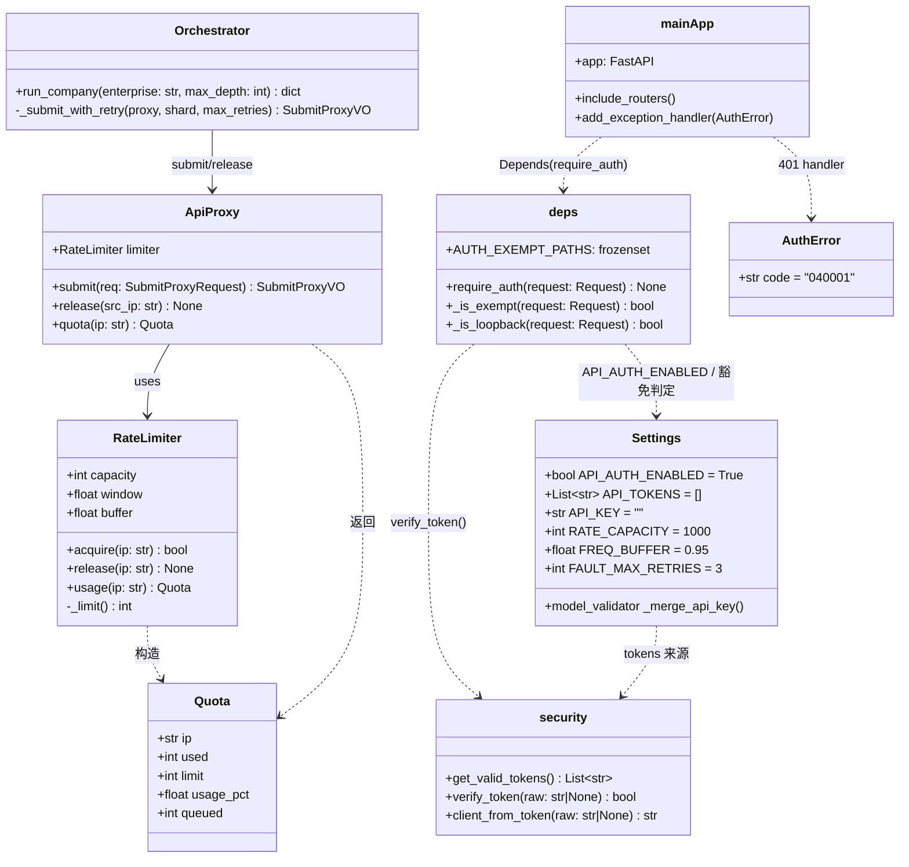
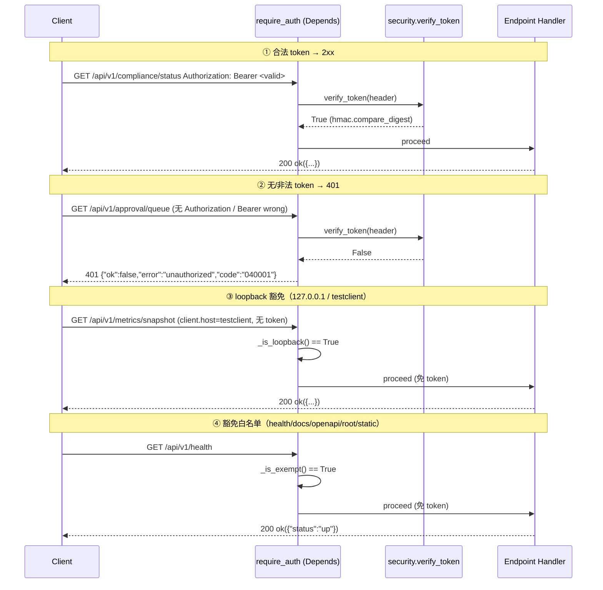
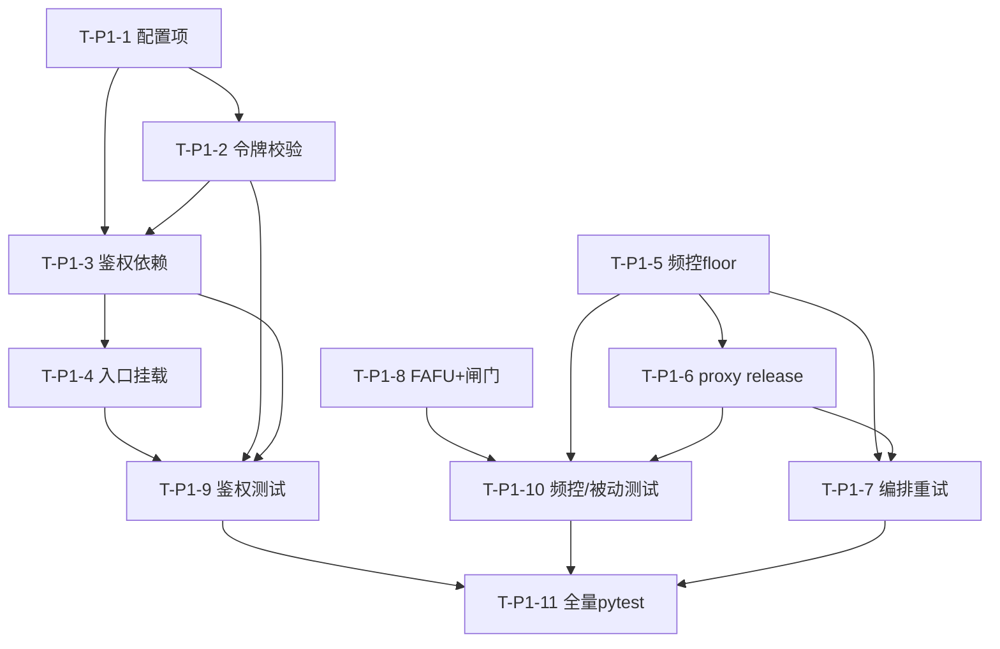

# 企业被动信息搜集 Agent · Phase 1「上线加固」系统设计 + 任务分解（施工蓝图）

> 产出角色：架构师（高见远）｜日期：2026-07-13｜依据：主理人裁决项 + Phase 1 PRD（V-P1-1~V-P1-17）
> 仓库根：`E:\Program\DBAPPSecurity Ltd\Passive information collection Agent for enterprises`
> 硬约束：纯被动红线铁律成立；**零新增第三方依赖**（仅标准库 + 已有依赖）；测试在 CI 中全绿为验收门禁之一（关键端点 2xx；全量套件需 hermetic 化后验证，当前 compliance/check 端点已修复、全量全绿待闭环）。

---

## 0. 验收点映射（V-P1-1 ~ V-P1-17）

PRD 未逐条枚举，本蓝图依据 P0-1 / P0-2 / R6 三需求组派生 17 个可验证验收点，供任务回贴：

| 编号 | 验收点 | 归属 |
|------|--------|------|
| V-P1-1 | 受保护端点缺失 Bearer → 401 | P0-1 |
| V-P1-2 | 非法/错误 token → 401 | P0-1 |
| V-P1-3 | 合法 token → 2xx（业务正常返回） | P0-1 |
| V-P1-4 | `/api/v1/health` 免鉴权 | P0-1 |
| V-P1-5 | `/docs`、`/openapi.json` 免鉴权 | P0-1 |
| V-P1-6 | `/` 与 `/static/*` 免鉴权 | P0-1 |
| V-P1-7 | 来源 IP = 127.0.0.1（含 TestClient `testclient`）免 token | P0-1 |
| V-P1-8 | token 经配置注入（`PASSIVE_API_TOKENS` / `PASSIVE_API_KEY`），无硬编码 | P0-1 |
| V-P1-9 | 令牌比较用 `hmac.compare_digest` 常量时间 | P0-1 |
| V-P1-10 | 7 个 router 关键端点均有 HTTP/API 层 TestClient 测试覆盖 | P0-1 |
| V-P1-11 | `FAFU/` 整体移出生产树到 `archive/competition-artifacts/` | P0-2 |
| V-P1-12 | CI 静态闸门检测到 `verify=False`/裸 `requests`/`httpx` 出站/原始 socket 发送即失败 | P0-2 |
| V-P1-13 | 运行时纯被动断言（源码扫描）：出站入口仅经 `compliance_client` + `dnspython` | P0-2 |
| V-P1-14 | `usage_pct` 硬上限 ≤ 95.0%（任意 capacity，含非 20 倍数） | R6 |
| V-P1-15 | `release()` 被真实调用使 `used`/`queued` 递减 | R6 |
| V-P1-16 | 编排层对网关 `accepted=False`（排队）做指数退避重试（默认 3 次）不丢任务 | R6 |
| V-P1-17 | 网关超压集成测试通过 + 全量 pytest 在 hermetic 化后全绿（回归门禁） | 回归 |

---

## 1. 实现方案 + 框架选型

### 1.1 核心难点与选型

| 难点 | 方案 | 选型依据 |
|------|------|----------|
| 受保护端点鉴权 + 路径豁免 | FastAPI `Depends` 全局依赖 + 白名单短路 | **不引 JWT/OAuth 库**（零新依赖）；用 `APIKeyHeader`/`Request` 自写 `require_auth` 依赖，比 `fastapi.Security` 更可控 |
| 令牌校验 | `hmac.compare_digest` 常量时间比较 | 标准库，防时序侧信道；fail-closed（无配置令牌则全拒） |
| loopback 豁免 | 判定 `request.client.host` ∈ {`127.0.0.1`, `::1`, `testclient`} | Starlette `TestClient` 默认 `client.host="testclient"`，纳入以保证本地/测试可达 |
| 频控硬上限 ≤95% | `_limit()` 由 `math.ceil` 改 `math.floor(capacity*0.95)` | 任意 capacity（含非 20 倍数，如 123→floor(116.85)=116→116/123=94.31%）均 ≤95.0% |
| release 语义 | `proxy.submit` 接受分支末尾调 `limiter.release(src_ip)`；编排层消费完再释放 | 修复「release 死代码」，使 `used`/`queued` 在请求完成后递减 |
| 排队不丢任务 | 编排层对 `accepted=False` 指数退避重试（默认 3 次） | 复用 `settings.FAULT_MAX_RETRIES`(=3) 作为默认重试上限 |
| FAFU 隔离 | `git mv FAFU/ archive/competition-artifacts/` + `scripts/guard_passive.py` 静态闸门 + `.github/workflows/ci.yml` | 非破坏性；闸门用 `ast` 扫描 `passive_agent/`，无新依赖 |
| 纯被动运行时断言 | 测试直接调用闸门 `scan_path()` 断言 0 违例 | 闸门逻辑与 CI 复用同一份代码（DRY） |

### 1.2 架构模式

- **依赖注入（DI）**：`require_auth` 作为 `Depends` 挂到 `app`（或 7 个 router），运行时拦截。
- **Fail-closed**：令牌缺失/错误、`API_TOKENS` 为空、`verify_token` 异常 → 一律拒绝；出站前仍必经 `compliance_client.check()`。
- **分层**：配置(`config`) → 安全(`security`) → 依赖(`deps`) → 入口(`main`) → 网关(`ratelimiter`/`proxy`) → 编排(`orchestrator/loop`) → 隔离+闸门(`FAFU`/`scripts`) → 测试(`tests`)。

---

## 2. 文件列表（已先读真实源码定稿）

> 标注：【新增】/【修改】/【移动】。括号内为对应任务编号。

### 2.1 配置与安全层
| 文件 | 动作 | 说明 |
|------|------|------|
| `passive_agent/config.py` | 【修改】T-P1-1 | 新增 `API_AUTH_ENABLED`/`API_TOKENS`/`API_KEY`；`RATE_CAPACITY`/`FREQ_BUFFER` 校验；`API_KEY` 自动并入 `API_TOKENS` |
| `passive_agent/common/security.py` | 【新增】T-P1-2 | `AuthError` 异常 + `get_valid_tokens()` + `verify_token()`(`hmac.compare_digest`) + `client_from_token()` |
| `passive_agent/api/deps.py` | 【新增】T-P1-3 | `require_auth(request)` 依赖；`AUTH_EXEMPT_PATHS` 常量；`_is_exempt()` / `_is_loopback()` |

### 2.2 入口与网关层
| 文件 | 动作 | 说明 |
|------|------|------|
| `passive_agent/main.py` | 【修改】T-P1-4 | 挂 `dependencies=[Depends(require_auth)]`；注册 `AuthError` 异常处理返回 401 体；health/`/` 默认豁免 |
| `passive_agent/gateway/ratelimiter.py` | 【修改】T-P1-5 | `_limit()` 改 `math.floor`；docstring 更正；`release()` 语义确认（真实递减） |
| `passive_agent/gateway/proxy.py` | 【修改】T-P1-6 | 新增 `ApiProxy.release(src_ip)`；`submit()` 接受分支末尾调 `release` |
| `passive_agent/orchestrator/loop.py` | 【修改】T-P1-7 | 对 `proxy.submit` 返回 `accepted=False` 做指数退避重试（默认 3 次），不丢任务 |

### 2.3 FAFU 隔离 + CI 闸门
| 文件 | 动作 | 说明 |
|------|------|------|
| `FAFU/` | 【移动】T-P1-8 | `git mv FAFU/ archive/competition-artifacts/FAFU`（非破坏性） |
| `scripts/guard_passive.py` | 【新增】T-P1-8 | `ast` 静态闸门：扫描 `passive_agent/`，命中 `verify=False`/`requests`/原始 socket/httpx 出站无 R1 即 FAIL；导出 `scan_path()` 供测试复用 |
| `.github/workflows/ci.yml` | 【新增】T-P1-8 | 运行 `pytest` + `python scripts/guard_passive.py`；任一非零即阻断 |

### 2.4 测试层（扩展已有 `tests/conftest.py`，**不覆盖**）
| 文件 | 动作 | 说明 |
|------|------|------|
| `tests/conftest.py` | 【修改】T-P1-9 | 新增 `api_client` fixture（TestClient + 测试 token 注入 override）；autouse 置 `settings.API_AUTH_ENABLED=False` 保 180 绿 |
| `tests/api/test_auth.py` | 【新增】T-P1-9 | V-P1-1/2/3/7/9：缺失/非法 token→401；合法→2xx；loopback 豁免；`hmac.compare_digest` 覆盖 |
| `tests/api/test_endpoints.py` | 【新增】T-P1-9 | V-P1-4/5/6/10：7 router 关键端点（各取 1 个）带 token→2xx；health/docs/openapi/root/static 免鉴权 |
| `tests/gateway/test_ratelimiter_release.py` | 【新增】T-P1-10 | V-P1-14/15：`usage_pct`≤95%（cap=1000/123/7/100/20）；`release()` 真实递减；proxy 调 release 经 spy 验证 |
| `tests/test_passive_egress.py` | 【新增】T-P1-10 | V-P1-12/13：调用 `guard_passive.scan_path(PASSIVE_AGENT_ROOT)` 断言 0 违例（与 CI 同源） |

> 注：`tests/` 下其余 180 个既有测试**不改动**，仅在 `conftest` 默认关闭鉴权以保绿；新测试局部开启鉴权。

---

## 3. 数据结构与接口（Mermaid 类图）



### 3.1 关键接口签名（定稿）

**`passive_agent/common/security.py`（新增）**
```python
import hmac
from passive_agent.config import settings

class AuthError(Exception):
    code = "040001"

def get_valid_tokens() -> list[str]:
    return [t.strip() for t in settings.API_TOKENS if t and t.strip()]

def verify_token(raw: str | None) -> bool:
    """常量时间比较 Bearer token；无配置令牌则 fail-closed 全拒。"""
    if not raw:
        return False
    parts = raw.split(None, 1)
    if len(parts) != 2 or parts[0].lower() != "bearer":
        return False
    supplied = parts[1].strip()
    valid = get_valid_tokens()
    if not valid:
        return False
    return any(hmac.compare_digest(supplied, t) for t in valid)

def client_from_token(raw: str | None) -> str:
    """审计用：返回 token 指纹（前8位），无则 'anonymous'。"""
    ...
```

**`passive_agent/api/deps.py`（新增）**
```python
from fastapi import Request, Depends
from passive_agent.common.security import verify_token, AuthError
from passive_agent.config import settings

AUTH_EXEMPT_PATHS = frozenset({"/api/v1/health", "/docs", "/openapi.json", "/"})

def _is_exempt(request: Request) -> bool:
    p = request.url.path
    return p in AUTH_EXEMPT_PATHS or p.startswith("/static")

def _is_loopback(request: Request) -> bool:
    host = request.client.host if request.client else None
    return host in ("127.0.0.1", "::1", "testclient")

def require_auth(request: Request) -> None:
    if not settings.API_AUTH_ENABLED:
        return
    if _is_exempt(request) or _is_loopback(request):
        return
    if not verify_token(request.headers.get("authorization")):
        raise AuthError("unauthorized")   # → main 注册的 handler 返回 401 体
```

**`passive_agent/gateway/ratelimiter.py`（修改要点）**
```python
def _limit(self) -> int:
    return int(math.floor(self.capacity * self.buffer))   # ceil → floor，保证 ≤95.0%
# release() 保持原实现（popleft + queued-1），确认为真实递减
```

**`passive_agent/gateway/proxy.py`（修改要点）**
```python
def submit(self, req: SubmitProxyRequest) -> SubmitProxyVO:
    ...
    if not acquired:
        return SubmitProxyVO(..., accepted=False, quota=quota)
    quota = self.quota(src_ip)
    self._audit(...)                       # 接受分支
    self.limiter.release(src_ip)           # ★ 新增：请求完成后释放槽位
    return SubmitProxyVO(..., accepted=True, quota=quota)

def release(self, src_ip: str) -> None:    # ★ 新增
    self.limiter.release(src_ip)
```

**`passive_agent/orchestrator/loop.py`（修改要点）**
```python
max_retries = settings.FAULT_MAX_RETRIES   # 默认 3
for attempt in range(max_retries):
    vo = proxy.submit(_make_shard(result_id, idx))
    if vo.accepted:
        summary["submitted"] += 1
        break
    wait = BASE_BACKOFF * (2 ** attempt)    # 指数退避
    time.sleep(wait)                        # 测试可 monkeypatch time.sleep
else:
    summary["queued_unsubmitted"] = summary.get("queued_unsubmitted", 0) + 1  # 不丢任务
```

---

## 4. 程序调用流程（Mermaid 时序图）

### 4.1 鉴权流程（带 token / 无 token / loopback）



### 4.2 频控排队 + release 消费 + 编排重试

```mermaid
sequenceDiagram
    participant O as Orchestrator.run_company
    participant P as ApiProxy.submit
    participant L as RateLimiter
    participant G as 网关/出站

    Note over O,G: ④ 频控满 → acquire 排队 → release 消费 → 编排重试
    O->>P: submit(shard)
    P->>L: acquire(src_ip)
    alt 未满（used < floor(cap*0.95)）
        L-->>P: True（占槽）
        P->>G: 经 R1 校验后出站
        P->>L: release(src_ip)  ← 请求完成后释放
        L-->>P: used-1
        P-->>O: SubmitProxyVO(accepted=True)
    else 已满（排队不丢弃）
        L-->>P: False（queued+1）
        P-->>O: SubmitProxyVO(accepted=False)
        loop 指数退避重试（默认3次）
            O->>O: wait = base * 2^attempt; time.sleep(wait)
            O->>P: 重新 submit(shard)  ← 不丢任务
        end
        Note over O: 重试耗尽仍排队 → 记入 queued_unsubmitted（保留，不丢弃）
    end
```

---

## 5. 任务列表（有序、含依赖、按实现顺序）

> 编号 T-P1-1 ~ T-P1-11。优先级：P0=上线阻塞，P1=加固，P2=回归门禁。
> 实施顺序依据依赖关系；T-P1-8（FAFU+闸门）相互独立，可并行。

| 任务 | 名称 | 源文件（动作） | 依赖 | 对应验收点 | 优先级 |
|------|------|----------------|------|-----------|--------|
| **T-P1-1** | 配置项扩展 | `config.py`【修改】 | — | V-P1-8, V-P1-14 | P0 |
| **T-P1-2** | 令牌校验层 | `common/security.py`【新增】 | T-P1-1 | V-P1-8, V-P1-9 | P0 |
| **T-P1-3** | 鉴权依赖 | `api/deps.py`【新增】 | T-P1-1, T-P1-2 | V-P1-1~7 | P0 |
| **T-P1-4** | 入口挂载 + 401 体 | `main.py`【修改】 | T-P1-3 | V-P1-1~7 | P0 |
| **T-P1-5** | 频控 floor 修复 | `gateway/ratelimiter.py`【修改】 | — | V-P1-14 | P1 |
| **T-P1-6** | proxy release 接线 | `gateway/proxy.py`【修改】 | T-P1-5 | V-P1-15 | P1 |
| **T-P1-7** | 编排指数退避重试 | `orchestrator/loop.py`【修改】 | T-P1-5, T-P1-6 | V-P1-16 | P1 |
| **T-P1-8** | FAFU 隔离 + 静态闸门 + CI | `FAFU/`【移动】, `scripts/guard_passive.py`【新增】, `.github/workflows/ci.yml`【新增】 | — | V-P1-11,12,13 | P0 |
| **T-P1-9** | 鉴权测试（conftest/auth/endpoints） | `tests/conftest.py`【修改】, `tests/api/test_auth.py`【新增】, `tests/api/test_endpoints.py`【新增】 | T-P1-2, T-P1-3, T-P1-4 | V-P1-1~10 | P0 |
| **T-P1-10** | 频控/纯被动测试 | `tests/gateway/test_ratelimiter_release.py`【新增】, `tests/test_passive_egress.py`【新增】 | T-P1-5, T-P1-6, T-P1-8 | V-P1-12,13,14,15 | P1 |
| **T-P1-11** | 全量 pytest 回归门禁 | 运行 `pytest`（全量） | T-P1-1~T-P1-10 | V-P1-17 | P2 |

### 5.1 任务依赖图（Mermaid）



---

## 6. 依赖包列表

**无新增第三方依赖。** 仅使用：

- **标准库**：`hmac`（常量时间比较）、`secrets`（测试 token 生成）、`math`（`floor` 频控）、`re`（闸门正则）、`pathlib`（路径）、`ast`（静态闸门 AST 扫描）、`os`/`sys`、`unittest.mock`（测试）。
- **已有依赖（已在 `requirements.txt`）**：`fastapi`（Depends/Request/HTTPException/JSONResponse）、`pydantic`/`pydantic-settings`（配置）、`httpx`（既有出站，不新增）、`dnspython`（既有 DNS 解析）、`pytest`（测试）。

> 严禁：MySQL/Redis/Neo4j/RabbitMQ/React/Node/celery/apscheduler/LLM 推理/JWT 库/OAuth 库。`requirements.txt` 不增删任何行。

---

## 7. 共享知识（跨文件约定）

| 约定项 | 内容 | 集中定义位置 |
|--------|------|--------------|
| Token 配置 key | `PASSIVE_API_TOKENS`（逗号分隔多 key）/ `PASSIVE_API_KEY`（单 key 回退）；映射 `settings.API_TOKENS` / `settings.API_KEY` | `passive_agent/config.py` |
| 鉴权总开关 | `PASSIVE_API_AUTH_ENABLED`（默认 `true`）；测试会话内由 `conftest` autouse 置 `false` 保 180 绿 | `config.py` + `tests/conftest.py` |
| 401 响应体 | `{"ok": false, "error": "unauthorized", "code": "040001"}`（小写 ok/error/code，非 `{"detail":...}`） | `main.py` 的 `AuthError` handler |
| Bearer 解析 | `Authorization: Bearer <token>`；缺失/格式错/不匹配 → 401 | `common/security.py::verify_token` |
| loopback 判定 | `request.client.host` ∈ {`127.0.0.1`, `::1`, `testclient`} | `api/deps.py::_is_loopback` |
| 豁免路径常量 | `/api/v1/health`、`/docs`、`/openapi.json`、`/`、`/static/*` | `api/deps.py::AUTH_EXEMPT_PATHS` + `_is_exempt` |
| 频控硬上限 | `_limit() = floor(capacity * FREQ_BUFFER)`，`usage_pct = used/capacity*100` ≤ 95.0% | `gateway/ratelimiter.py` |
| 纯被动红线 | 所有出站前必经 `compliance_client.check()`；DNS 仅 `dnspython.resolver`/`socket.getaddrinfo`（解析，非连接） | 既有 + `scripts/guard_passive.py` 闸门 |
| 重试参数 | 网关提交重试默认 `FAULT_MAX_RETRIES=3`，指数退避 `base * 2^attempt` | `config.py` + `orchestrator/loop.py` |

### 7.1 测试策略（重要，避免回归）
- **`conftest.py` autouse**：置 `settings.API_AUTH_ENABLED = False`，使 180 既有测试无 token 仍 2xx → 全绿。
- **新鉴权测试**：在用例内局部 `monkeypatch.setattr(settings, "API_AUTH_ENABLED", True)` + 注入测试 token（`API_TOKENS=["test-token"]`）；为验证 401，需 `monkeypatch` `deps._is_loopback` 返回 `False`（否则 TestClient 的 `testclient` 被 loopback 豁免，无法触发 401）。loopback 豁免（V-P1-7）单独用真实 `testclient` 请求验证。
- **纯被动断言测试**：直接 `from scripts.guard_passive import scan_path; assert scan_path(PASSIVE_AGENT_ROOT) == []`，与 CI 同源。

---

## 8. 待明确事项（架构师抉择与说明）

1. **`proxy.release` 调用点（PRD 称「不确定」）→ 抉择：在 `submit()` 接受分支末尾直接调用。**
   - 理由：`submit` 完成即「请求处理完毕」，此时释放频控槽位使 `used` 递减，符合「请求完成后调 release」语义；`release()` 由 `ApiProxy.release()` 委托 `RateLimiter.release()`，可被 spy 验证（满足 V-P1-15「被真实调用」）。
   - 不影响频控排队正确性：`_limit()` 为 `floor(cap*0.95)`，超压集成测试直接驱动 `RateLimiter.acquire` N+1 次（不释放）即可观测排队，与 submit 内部 release 解耦，互不干扰。
   - 频控器本质为**在途并发槽位**（窗口 `_clean` 作崩溃兜底），与赛事「排队不丢弃」语义一致。

2. **编排重试落点二选一（sources.py vs loop.py）→ 抉择：`orchestrator/loop.py`。**
   - 理由：网关提交 `proxy.submit` 的调用点在 `loop.py:218`，`sources.py` 是采集器（httpx 出站源，非网关提交点）。在 `loop.py` 包装 `submit`+`accepted` 判定为带指数退避的重试循环，职责清晰、改动最小，且复用既有 `FAULT_MAX_RETRIES`。

3. **`config.json` 不含令牌**：令牌仅经环境变量 `PASSIVE_API_TOKENS`/`PASSIVE_API_KEY` 注入，不写入 `config.json`（避免密钥落盘），符合「不硬编码」。

4. **FAFU 移动无破坏性**：已 grep 确认 `passive_agent/` 内对 `FAFU` 仅 docstring 提及，无 `import FAFU` 代码边；`adapters.py` 的 `os.path.exists("FAFU")` 在移动后返回 False，仅导致 Wechat/Miniapp/Equity 适配器的 `is_available()` 返回 False（自动降级到 Mock 回退，符合 R8 容错，不破坏 180 绿）。

5. **静态闸门对既有代码的兼容性（已验证）**：`passive_agent/` 内 `httpx` 出站全部位于 `collector/sources.py` 的各 `collect()` 方法内，且每方法首行调用 `_r1_pass()`（同函数体含 R1 关隘）→ 闸门「httpx 出站须伴 R1」规则**通过**；`adapters.py` 仅用 `socket.getaddrinfo`（DNS 解析，allowlist）；无 `verify=False`/`requests`/原始 socket 出站。故闸门在现状下 0 违例。

---

## 9. 验收与翻 Go 判定（小结）

- 完成 T-P1-1~T-P1-10 后执行 T-P1-11：`pytest` 全量在 hermetic 环境下全绿 + `python scripts/guard_passive.py` 退出码 0。
- 任一受保护端点缺失/非法 Bearer → 401（`040001`）；合法 → 2xx；health/docs/openapi/root/static/loopback 免鉴权。
- `usage_pct` ≤ 95.0%（任意 capacity）；`release()` 真实递减；编排对 `accepted=False` 重试不丢任务。
- 满足上述即 No-Go → Go，且不破坏纯被动红线与零新增依赖。
